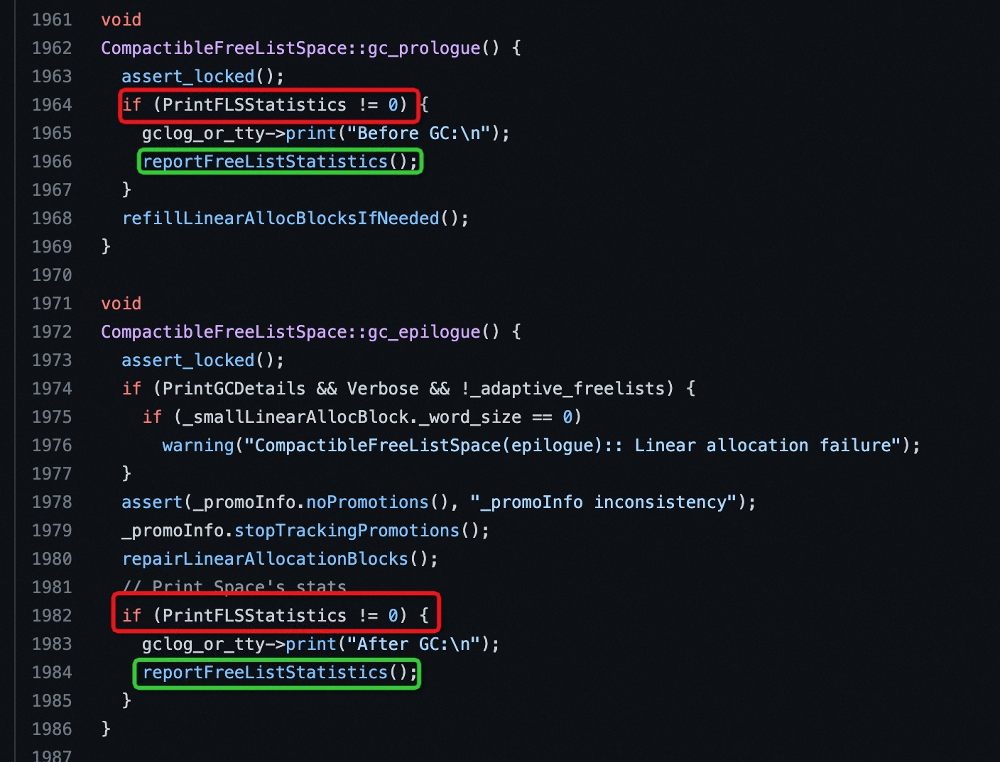
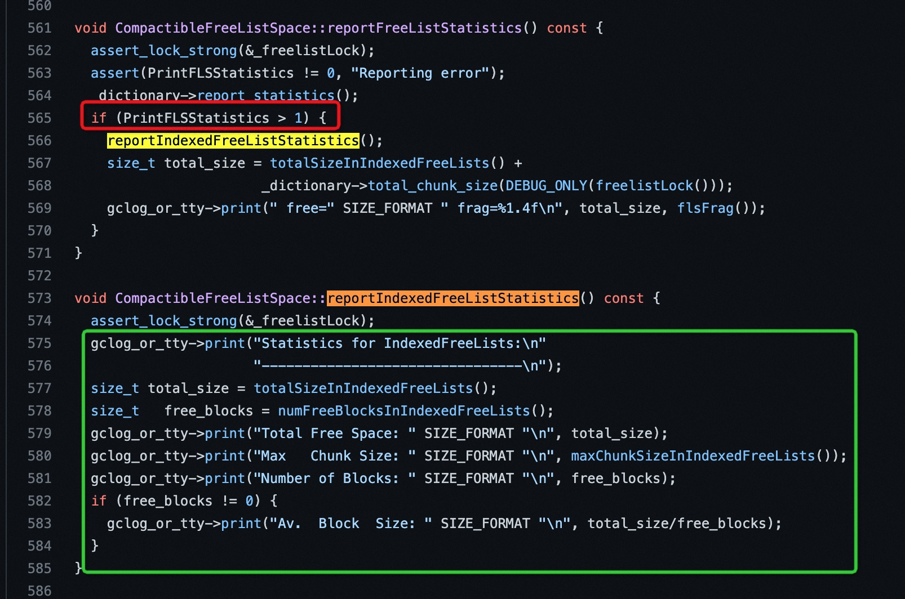
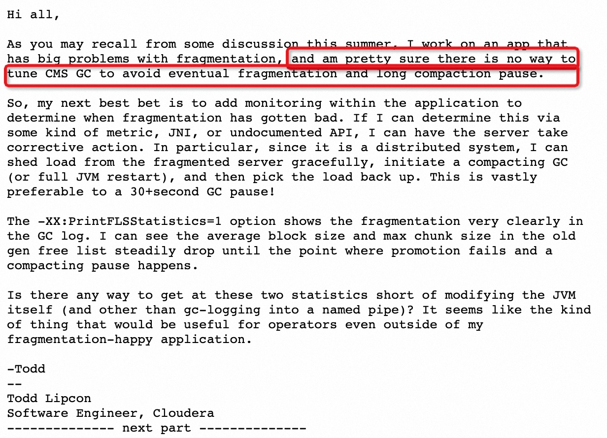
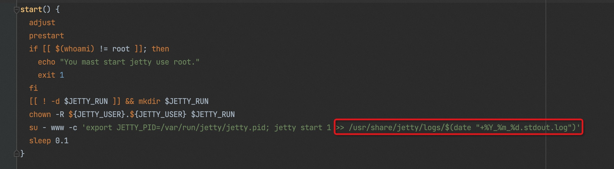
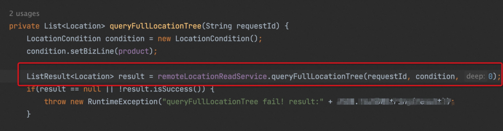

# 【案例】发现 CMS GC 有点傻 —— 应用A Full GC 问题排查

> 作者：李成武（佐井）    
> 创作日期：2022-11-03  
> 专栏地址：[【稳定大于一切】](https://github.com/StabilityMan/StabilityGuide) 

## 背景
今年5月底开始，应用A机器陆续开始出现单机 Full GC，经过连续几天的排查也没有找到根因，临时解决办法是把 4c8g 的机器升配到 4c16g，缓解内存压力。

9月份开始，16g 的机器偶尔还是出现单机 Full GC，由于 16g 内存的机器整体性能还可以，一般单机 Full GC 一次后机器就恢复正常，很难再抓到现场。但是单机抖动对业务的影响还是非常大，需要彻底解决。

## 问题排查思路
在5月份的时候，我们那个 4c8g 的机器挺不过 Full GC 压力直接被打死了，我们拿到了不少当时的 dump，但是通过分析也没有找到内存泄漏的点。而且9月份开始的 Full GC 几秒钟后就恢复了，很难抓取现场。所以换个思路：

1. 在 Full GC 发生的前后分析下堆的使用情况，看看内存到底是怎么被填满的，是逐渐填满的还是突然填满的。
2. 怀疑在 Full GC 前有大对象内存分配，在还没来得及执行 CMS GC 的时候把堆撑爆了，触发了 Full GC，要尝试把大对象分配找出来。

## 先看看GC前后内存统计
### 背景知识：PrintFLSStatistics
#### -XX:PrintFLSStatistics=n

PrintFLSStatistics是用来统计内存分配情况和碎片统计的信息的，网上关于 PrintFLSStatistics 介绍比较少，相关细节需要看下源码，我们用的是 JDK8，可以看这个源码：
[shenandoah-jdk8u/compactibleFreeListSpace.cpp at master · openjdk/shenandoah-jdk8u](https://github.com/openjdk/shenandoah-jdk8u/blob/master/hotspot/src/share/vm/gc_implementation/concurrentMarkSweep/compactibleFreeListSpace.cpp)



源码显示当设置 PrintFLSStatistics > 0 的时候，会在 GC 的开始(prologue)和结束(epilogue)打印 FreeList 统计信息，FreeList 是空闲内存的索引，堆内存分配的时候需要通过 FreeList 查询合适的空间。由于 FreeList 里面查找的空闲块大小很难与申请的大小一致，申请后剩余的内存还会还回到 FreeList，这个过程会导致 FreeList 的空间不断别切割成更片段，造成内存不连续而无法使用，内存碎片就是这么产生的。

* 当 PrintFLSStatistics > 0 时，首先打印的是 BinaryTreeDictionary 信息，这个信息就是可用的连续内存。
* 当 PrintFLSStatistics > 1 时，会打印 IndexedFreeLists 信息，这里面包含FreeList所有的碎片信息。



### 应用A单机gc日志还原
下面我们看下应用A xx.xx.243.44 这个机器在 Full GC 时候的统计日志。

我们先看 GC 开始前（Before GC）：

```
2022-10-13T10:13:15.350+0800: 1358193.250: [GC (Allocation Failure) Before GC:
Statistics for BinaryTreeDictionary:
------------------------------------
Total Free Space: 16005
Max   Chunk Size: 16005
Number of Blocks: 1
Av.  Block  Size: 16005
Tree      Height: 1
Statistics for IndexedFreeLists:
--------------------------------
Total Free Space: 165963191
Max   Chunk Size: 254
Number of Blocks: 32379033
Av.  Block  Size: 5
 free=165979196 frag=1.0000
```
 
第一行 Allocation Failure 表示没有更多的空闲内存分配了（主意这里需要的是连续的空间），我们可以看到在IndexedFreeLists 统计下面的信息，剩余空间 Total Free Space: 165963191 = 165963191 * 8 / 1024 / 1024 / 1024 = 1.24GB，frag=1.0000 表示这个 1.24GB 空间 100% 的碎片率，最大的连续空间才 Max Chunk Size: 254 = 254 * 8 = 2k，平均空间大小 Av. Block Size: 5 = 5 * 8 = 40bit，真是碎的一地鸡毛啊。
再看上面日志的 BinaryTreeDictionary，在 Full GC 前 Total Free Space: 16005 = 16005 * 8 / 1024 = 125k，也就说只要分配比125k大，内存就爆了。BinaryTreeDictionary （我们简单理解是多个大块的连续内存）是随着内存的分配不断减少的，Number of Blocks 是连续空间块的个数，也一样是随着内存分配不断减少。下图是在 Full GC 前几次BinaryTreeDictionary 统计信息，总大小和可用块数都在不断减少。


我们知道碎片信息在 CMS GC 是无法避免的，只能通过 Full GC回收。
[Monitoring CMS free list BinaryTreeDictionary statistics](https://mail.openjdk.org/pipermail/hotspot-gc-use/2010-December/000760.html)



我们看下Full GC后（After GC）的内存统计情况：

```
CMS: Large block 0x00000006bddd5a90
: 4994842K->1529558K(6291456K), 6.2918770 secs] 8195071K->1529558K(9961472K), [Metaspace: 437386K->436770K(1476608K)]After GC:
Statistics for BinaryTreeDictionary:
------------------------------------
Total Free Space: 609506478
Max   Chunk Size: 609506478
Number of Blocks: 1
Av.  Block  Size: 609506478
Tree      Height: 1
Statistics for IndexedFreeLists:
--------------------------------
Total Free Space: 0
Max   Chunk Size: 0
Number of Blocks: 0
 free=609506478 frag=0.0000
, 7.2442236 secs] [Times: user=7.42 sys=0.00, real=7.25 secs]
```
Full GC 重建了世界的秩序，Total Free Space: 609506478，Number of Blocks: 1 表示整个空闲堆被整理成了1块连续的空间，大小=609506478 * 8 / 1024 / 1024 / 1024 = 4.5GB

IndexedFreeLists 显示，碎片全被干掉了，frag=0.0000，世界清静了，同时整个 GC 耗时 7.25 secs。对于 10G 的大堆，7秒的 Full GC 时间也没什么好惊讶的。

### 应用Afull gc原因
好了，现在我们通过上面日志分析，解释下应用A Full GC 的原因，先贴上应用A的内存和 GC 参数：

```
-server -Xmx10g -Xms10g -Xmn4g -Xss512k -XX:MetaspaceSize=512M  
-XX:CMSInitiatingOccupancyFraction=80
-XX:+UseParNewGC -XX:+UseConcMarkSweepGC
```

整个堆10G，new generation=4g，old generation=6g，CMSInitiatingOccupancyFraction=80 当老年代使用超过80%的时候还是CMS，就是说，剩余空间小于 6g * (1-80%) = 1.2G的时候才会触发 CMS GC，不幸的是通过我们上面的分析：
剩余空间 Total Free Space: 165963191 = 165963191 * 8 / 1024 / 1024 / 1024 = 1.24GB
明明1.24GB都是碎片，还认为有剩余的空间不进行 CMS GC，由于最后一次内存申请超过125k，雪崩了触发了STW的 Full GC（Allocation Failure），你说这算法是不是很傻？

总结一下：

> 应用A Full GC 的原因是碎片太大，超过了 OldGen * (1-CMSInitiatingOccupancyFraction)，这个算法傻的地方是没有看内存的碎片率


所以这里两个Action：

1. CMSInitiatingOccupancyFraction=70，可以缓解。
2. 另外，在 G1 中是可以通过 Minor GC 消除碎片的，JVM 团队同学推荐用 JDK11 的 G1，优化的比较成熟。

## 看看大对象分配
虽然通过上面的分析，即使没有大对象分配，也证明了会导致 Full GC。不过为了放心，索性把大对象分配的猜想也验证一下。

### 背景知识：打印大对象内存分配堆栈
#### -XX:ArrayAllocationWarningSize=20480k

ArrayAllocationWarningSize参数是阿里ajdk特有的参数，在 Dragonwell 8.1.1 后的版本支持。

> 增加了参数**ArrayAllocationWarningSize**，默认值为512M。当分配的对象大小超过该值的时候，标准输出里会显示分配的堆栈。该参数可以通过jinfo动态修改

这里需要注意一下，ArrayAllocationWarningSize 的信息只会打印到标准输出里，所以在我们线上应用需要修改下启动脚本，把 Jetty 或 Tomcat 的标准输出重定向到一个文件，不然数据就丢失了，比如以 Jetty 为例：



### 应用A 实验数据
实验机器：应用A xx.xx.243.44

最近正好封网没有发布，经过5天的测试，在机器上发现的唯一大对象来自com.aliyun.rc.service.cache.ProductLocationWatcher.queryFullLocationTree(ProductLocationWatcher.java:176)，分配了30MB。详细日志如下：

```
==WARNING==  allocating large array--thread_id[0x00007fd907e8e000]--thread_name[ProductLocationWatcher-1666232342702]--array_size[30669952 byt
es]--array_length[15334967 elememts]
os_prio=0 tid=0x00007fd907e8e000 nid=0x1fbe7 runnable
  at com.alibaba.fastjson.serializer.SerializeWriter.expandCapacity(SerializeWriter.java:306)
  at com.alibaba.fastjson.serializer.SerializeWriter.writeLong(SerializeWriter.java:757)
  at com.alibaba.fastjson.serializer.DateCodec.write(DateCodec.java:228)
  at com.alibaba.fastjson.serializer.JSONSerializer.writeWithFieldName(JSONSerializer.java:333)
  at com.alibaba.fastjson.serializer.ASMSerializer_11_LocationAttribute.writeNormal(Unknown Source)
  at com.alibaba.fastjson.serializer.ASMSerializer_11_LocationAttribute.write(Unknown Source)
  at com.alibaba.fastjson.serializer.CollectionCodec.write(CollectionCodec.java:101)
  at com.alibaba.fastjson.serializer.JSONSerializer.writeWithFieldName(JSONSerializer.java:333)
  at com.alibaba.fastjson.serializer.ASMSerializer_10_Location.writeNormal(Unknown Source)
  at com.alibaba.fastjson.serializer.ASMSerializer_10_Location.write(Unknown Source)
  at com.alibaba.fastjson.serializer.JSONSerializer.writeWithFieldName(JSONSerializer.java:333)
  at com.alibaba.fastjson.serializer.JSONSerializer.writeWithFieldName(JSONSerializer.java:311)
  at com.alibaba.fastjson.serializer.ASMSerializer_9_ListResult.writeNormal(Unknown Source)
  at com.alibaba.fastjson.serializer.ASMSerializer_9_ListResult.write(Unknown Source)
  at com.alibaba.fastjson.serializer.JSONSerializer.writeWithFieldName(JSONSerializer.java:333)
  at com.alibaba.fastjson.serializer.ASMSerializer_7_RpcLogExt.writeNormal(Unknown Source)
  at com.alibaba.fastjson.serializer.ASMSerializer_7_RpcLogExt.write(Unknown Source)
  at com.alibaba.fastjson.serializer.JSONSerializer.write(JSONSerializer.java:285)
  at com.alibaba.fastjson.JSON.toJSONString(JSON.java:758)
  at com.alibaba.fastjson.JSON.toJSONString(JSON.java:692)
  at com.aliyun.ecs.common.framework.trace.AbstractRpcLogEntryPointExt.toFullJsonString(AbstractRpcLogEntryPointExt.java:119)
  at com.aliyun.ecs.common.framework.trace.AbstractRpcLogEntryPointExt.processAndSaveRpcLog(AbstractRpcLogEntryPointExt.java:95)
  at com.aliyun.ecs.common.framework.trace.CommonRpcLogFilter.invoke(CommonRpcLogFilter.java:135)
  at com.alibaba.dubbo.rpc.protocol.ProtocolFilterWrapper$1.invoke(ProtocolFilterWrapper.java:91)
  at com.aliyun.ecs.common.framework.sentinel.filter.CustomizeSentinelDubboConsumerFilter.invoke(CustomizeSentinelDubboConsumerFilter.ja
va:50)
  at com.alibaba.dubbo.rpc.protocol.ProtocolFilterWrapper$1.invoke(ProtocolFilterWrapper.java:91)
  at com.alibaba.dubbo.rpc.protocol.dubbo.filter.FutureFilter.invoke(FutureFilter.java:53)
  at com.alibaba.dubbo.rpc.protocol.ProtocolFilterWrapper$1.invoke(ProtocolFilterWrapper.java:91)
  at com.alibaba.dubbo.monitor.support.MonitorFilter.invoke(MonitorFilter.java:75)
  at com.alibaba.dubbo.rpc.protocol.ProtocolFilterWrapper$1.invoke(ProtocolFilterWrapper.java:91)
  at com.alibaba.csp.sentinel.adapter.dubbo.DubboAppContextFilter.invoke(DubboAppContextFilter.java:41)
  at com.alibaba.dubbo.rpc.protocol.ProtocolFilterWrapper$1.invoke(ProtocolFilterWrapper.java:91)
  at com.alibaba.dubbo.rpc.filter.ConsumerContextFilter.invoke(ConsumerContextFilter.java:48)
  at com.alibaba.dubbo.rpc.protocol.ProtocolFilterWrapper$1.invoke(ProtocolFilterWrapper.java:91)
  at com.alibaba.dubbo.rpc.listener.ListenerInvokerWrapper.invoke(ListenerInvokerWrapper.java:74)
  at com.alibaba.dubbo.rpc.protocol.InvokerWrapper.invoke(InvokerWrapper.java:53)
  at com.alibaba.dubbo.rpc.cluster.support.FailoverClusterInvoker.doInvoke(FailoverClusterInvoker.java:77)
  at com.alibaba.dubbo.rpc.cluster.support.AbstractClusterInvoker.invoke(AbstractClusterInvoker.java:226)
  at com.alibaba.dubbo.rpc.cluster.support.wrapper.MockClusterInvoker.invoke(MockClusterInvoker.java:72)
  at com.alibaba.dubbo.rpc.proxy.InvokerInvocationHandler.invoke(InvokerInvocationHandler.java:52)
  at com.alibaba.dubbo.common.bytecode.proxy0.queryFullLocationTree(proxy0.java)
  at com.aliyun.rc.service.cache.xxx.queryFullLocationTree(ProductLocationWatcher.java:176)
  at com.aliyun.rc.service.cache.xxx.refresh(ProductLocationWatcher.java:107)
  at com.aliyun.rc.service.cache.xxx.run(ProductLocationWatcher.java:59)
  at java.lang.Thread.run(Thread.java:858)
```



再也没有其他大对象分配了。

所以后面的Action：

1. 这个ArrayAllocationWarningSize=20480k 参数常态化部署到所有机器上。
2. 针对应用的标准输出的大对象进行监控和报警。

最后，也证明了最近的 Full GC 不是大对象引起的，至此，问题基本结案了。

## 加入我们
【稳定大于一切】打造国内稳定性领域知识库，**让无法解决的问题少一点点，让世界的确定性多一点点。**

- GitHub 专栏地址：[https://github.com/StabilityMan/StabilityGuide](https://github.com/StabilityMan/StabilityGuide)
- 钉钉交流群号：30000312
- 如果阅读本文有所收获，欢迎分享给身边的朋友，期待更多同学的加入！