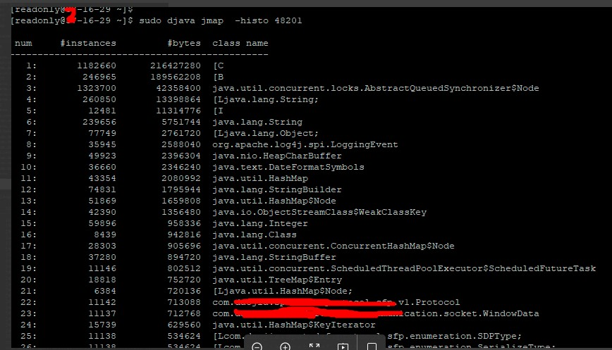
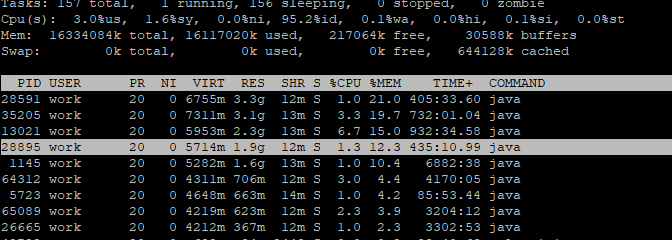

# 【案例】记一次线上内存报警排查过程

> 作者：樊春帅（神帅）  
> 创作日期：2019-08-14  
> 专栏地址：[【稳定大于一切】](https://github.com/StabilityMan/StabilityGuide)  
> PDF 格式：[【案例】记一次线上内存报警排查过程](https://github.com/StabilityMan/StabilityGuide/blob/master/docs/case/pdf/【案例】记一次线上内存报警排查过程.pdf)

今天风和日丽，刚到公司，看看博客，微信&钉钉消息。突然发现报警群里有很多报警说 xx.xx.16.28 机器的内存不够，报警信息如下：

> [故障]: 集团线上-xx中心-xx部-研发部-HR和工作台  
告警地址: x.x.16.28  
监控取值: 869.46 MB  
告警等级: Warning  
告警信息: x.x.16.28 内存剩余小于 900M  
告警时间: 2019-10-31 09:50:23  
持续时间:1h 0m  

开始时间大概是从昨天晚上11点多开始的，而且持续到今天上午10点多，事出有因必有妖，下面看一下排查思路和排查过程。

#### 1. 查一下 xx.xx.16.28 的内存使用情况
 

#### 2. 排查最近是否有新上线服务，导致内存紧张
通过 `rpcservice list` 与 `ps -ef | tomcat` 两个命令发现业务服务有 7 个，进程存活时间较长，不太可能有新服务上线，同时根据另一台 xx.xx.16.29 机器的服务部署情况也验证了没有新上线服务。 

#### 3. 排查是否有 Java 服务在持续 FGC
使用 top 命令查一下，发现 9 个 java 服务，7 个业务服务，2 个日志进程服务。使用 `jstat -gcutil pid 2000` 命令一一排查，发现 GC 情况正常，没有服务有持续的 YGC 或 FGC 情况存在。

#### 4. 排查异常占用内存的 Java 服务
由于有 7 个业务服务，直觉告诉我 dwf 服务应该比 RPC 服务占用的内存少，这一步走错了两个方向，浪费了一些时间。
 
1. 以为 Web 服务占用内存较大，比 RPC 服务还高，但是发现不是
2. 以为其中一个日志进程服务（flume）占用内存较大，发现另一台 xx.xx.16.29 的日志进程服务占用的内存跟出问题的这一台机器是一样的

#### 5. top 命令对比 xx.xx.16.28/xx.xx.16.29 两台服务器
发现其中肯定有同一个 Java 进程占用的内存比另一个 Java 进程占用的内存高。如下图所示：

#### 6. 排查内存占用
由于之前排查过程中跟踪过出问题的这一台的服务情况，但是肉眼没有看出来，通过内存占用对比（top命令 ，然后 `shift + M`）对比占用内存最高的几个进程，现在很明显两台机器中有一个服务肯定有问题。

#### 7. 通过对比可以发现有个服务是有问题的

#### 8. 结合之前已经截图的现场可以发现
xx.xx.16.28 的 corehr_job 服务占用内存是 12.3%，xx.xx.16.29 的 corehr_job 服务占用内存是 6.3%，很明显的，到这里我们已经揪出有问题的服务了。下面继续追查为啥不一样，先透个底，有预感觉得是由于 corehr_job 中的一些定时任务执行之后没有释放内存导致的。看一下这个服务的堆内存占用内存比例大小，如下图：

#### 9. 现在要看看这两个机器的同一个服务堆内存到底有什么对象

很明显我们可以看到 xx.xx.16.28 中的这个有问题的服务堆内存占用的对象比另一个正常的多，由于很小心的保留了现场我们可以分析一下，为啥有占用呢？
由于老年代占用 76%，没有达到FGC的阈值，导致大量对象在年轻代，老年代驻留，下面尝试一下触发 FGC。

#### 10. 使用命令触发FGC
`sudo djava jmap -histo:live 28895` 执行这个命令可能引发一次 FGC，然后释放内存，执行完之后确实触发了一次FGC。

#### 11. 再次进行 top (shift+m)
发现内存占用依然没有解决，也就是说虽然触发了FGC，但是应用程序已经申请的内存是不会释放的，笑哭~

分析到此结束，根据现场保留，排查数据和线索可以有以下应对方案和措施：

1. 已知引起原因，目前已重启该问题服务，内存紧张报警解除。
2. 提工单进行服务器升配（不止升级有问题的这一台，还有另一台），机智~
3. 排查获取大数据量的 job，增加对象回收的逻辑比如用完之后 clear()，设置为 null 之类的。

这里引申出几个问题：

1. java 应用程序申请的内存触发FGC之后会返回给操作系统吗？
2. 使用CMS垃圾回收算法的情况下触发FGC的条件是什么？
3. 有什么方法可以让应用触发FGC之后将内存归还给操作系统？

此外，根据涯海的总结我们可以得出出现此类问题的一些原因。针对这个案例，一个长时间运行的 Java 程序，如果在没有变更的情况下出现系统内存不足。通常可以分为以下几种情况：

1. 如果是突然不足，一般是请求了一个超大的对象（数组）。
2. 预期外的持续流量脉冲。
3. 如果是内存余量缓慢减少，通过是内存泄漏（大量引用对象未释放），可以重点检查下数据库连接/文件资源/本地缓存等资源的释放情况。

参考：[https://www.cnblogs.com/seifon/p/11228224.html](https://www.cnblogs.com/seifon/p/11228224.html)

## 加入我们
【稳定大于一切】打造国内稳定性领域知识库，**让无法解决的问题少一点点，让世界的确定性多一点点**。

* [GitHub 地址](https://github.com/StabilityMan/StabilityGuide)
* 钉钉群号：
	* 30000312（2群，推荐）
	* 23179349（1群，已满）
* 如果阅读本文有所收获，欢迎分享给身边的朋友，期待更多同学的加入！

