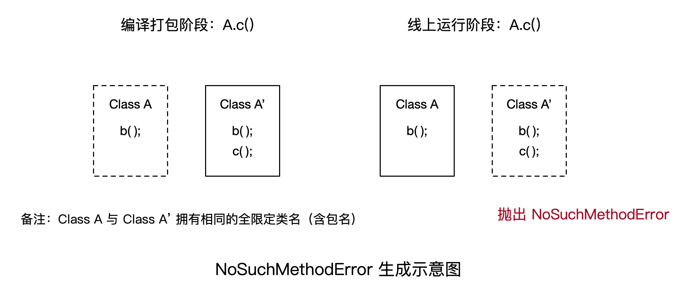
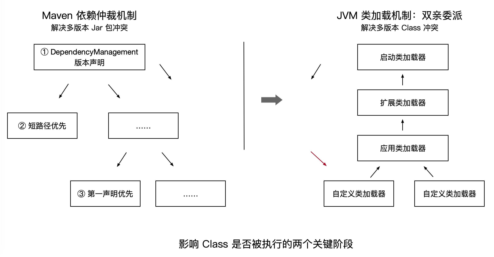
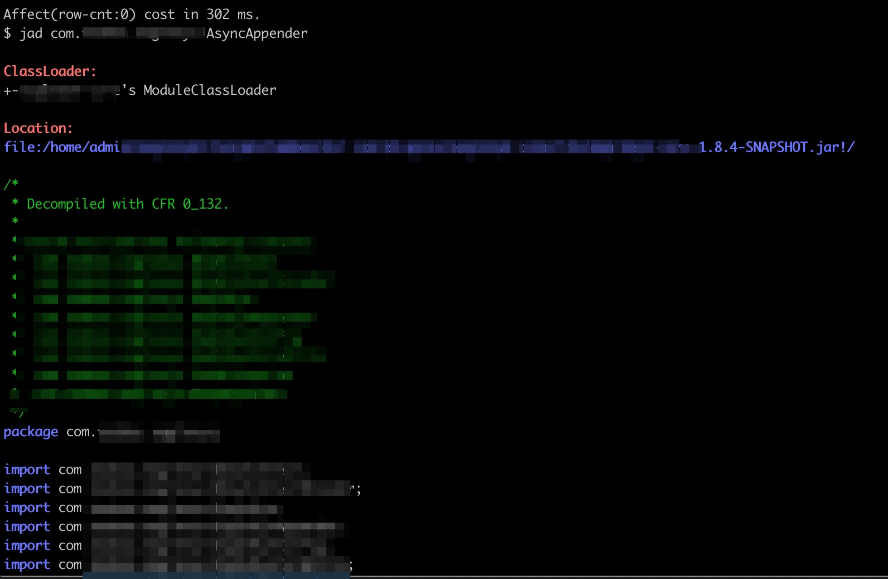

# 系统稳定性——NoSuchMethodError 常见原因及解决方法

> 作者：夏明（涯海）  
> 创作日期：2019-08-06  
> 专栏地址：[【稳定大于一切】](https://github.com/StabilityMan/StabilityGuide)  
> PDF 格式：[系统稳定性——NoSuchMethodError 常见原因及解决方法](https://github.com/StabilityMan/StabilityGuide/blob/master/docs/diagnosis/jvm/exception/pdf/系统稳定性——NoSuchMethodError常见原因及解决方法.pdf)

当应用程序试图调用类（静态或实例）的指定方法，而该类已不再具有该方法的定义时，就会抛出 `java.lang.NoSuchMethodError` 错误。简单地说，就是同一个 Class 有多个版本的实现，并且在运行时调用了缺少方法的那个版本。本文总结了 NoSuchMethodError 常见原因及其解决方法，如有遗漏或错误，欢迎补充指正。


## 目录
- [运行时抛出 NoSuchMethodError 的根本原因是什么？](#运行时抛出-nosuchmethoderror-的根本原因是什么)
- [为什么同一个 Class 会出现多个版本？](#为什么同一个-class-会出现多个版本)
- [哪个版本的 Class 最终会被执行？](#哪个版本的-class-最终会被执行)
- [如何解决 NoSuchMethodError 错误？](#如何解决-nosuchmethoderror-错误)
- [其他 Jar 包冲突问题](#其他-jar-包冲突问题)
- [推荐工具&产品](#推荐工具产品)
- [参考文章](#参考文章)
- [加入我们](#加入我们)


## 运行时抛出 NoSuchMethodError 的根本原因是什么？
在实际生产系统中，我们主要关注运行时抛出的 `NoSuchMethodError` 错误，该错误轻则导致程序异常终止，严重时甚至会产生不可预知的程序结果，比如支付服务执行异常，实际支付已完成，却向用户返回支付失败。

运行时抛出 `NoSuchMethodError` 错误的根本原因就是： **应用程序直接或间接依赖了同一个类的多个版本，并且在运行时执行了缺少方法的版本。** 如下图所示：



因此，核心问题就转化为： **同一类为什么会有多个版本？哪个版本的类最终会被执行？**

## 为什么同一个 Class 会出现多个版本？
导致 Java Class 出现多版本的原因，可以归纳为以下几类：

* **JDK 版本不一致。** 常见于编译打包环境使用高版本 JDK 开发与打包，而实际运行环境的 JDK 版本较低。例如，本地项目环境 JDK 版本为 1.7，调用 `Character.isAlphabetic()` 方法判断当前字符是否为字母；而线上环境 JDK 版本为 1.6，在运行期间就会抛出 `NoSuchMethodError` 错误。
* **SNAPSHOT 版本不一致。** 常见于本地更新 SNAPSHOT 版本后，没有执行 `mvn clean deploy` 部署，导致线上环境运行时仍然引用了旧版本的 SNAPSHOT 包。
* **Maven 依赖生命周期为 provided。** 常见于本地依赖的某组件生命周期为 `provided`，所声明版本仅用于本地编译打包，而线上运行时会通过其他依赖关系加载 Jar 包。
* **同一个 Jar 包出现了多个版本。** 常见于 Maven 依赖未显式指定版本号，导致间接依赖版本冲突，很容易引入低版本的 Jar 包。
* **同一个 Class 出现在不同的 Jar 包中。** 该问题常见于代码拷贝场景，比如基于开源版本定制了一些功能，使用了新的 Maven 坐标打包发布，此时 Maven 仲裁机制失效（非常隐蔽，难以排查）。由于 JVM 类加载器对于同一个类只会加载一次，最终加载的类实现受到 Jar 包依赖的路径、类声明的先后顺序或文件加载顺序等因素的影响，很可能出现不同机器加载的类实现不一致。


## 哪个版本的 Class 最终会被执行？
影响 Class 最终是否被执行的关键因素有两个：Maven 依赖仲裁机制和 JVM 类加载机制，如下图所示：




**首先，[Maven 依赖仲裁机制](https://maven.apache.org/guides/introduction/introduction-to-dependency-mechanism.html) 决定了打包的优先级，** 仲裁优先级“从高到低”如下所述：

1. 优先按照依赖管理 [dependencyManagement] 元素中指定的版本进行仲裁；
2. 若无版本声明，则按照 “短路径优先” 原则（Maven2.0）进行仲裁，即选择依赖树中路径最短的版本；
3. 若路径长度一致，则按照 “第一声明优先” 原则进行仲裁，即选择 POM 中最先声明的版本。

合理使用 Maven 依赖仲裁机制可以便捷的管理 Jar 包版本，而不合理的使用将导致多版本 Jar 冲突。

**其次，[JVM 类加载机制](https://www.baeldung.com/java-classloaders) 决定了 Class 被加载到 JVM 的优先级，** 如果同一个类出现在多个 Jar 包中，那么在 **双亲委派类加载机制** 下，加载该 Jar 包的类加载器层级越高，该 Jar 包越先被加载，它所包含的 Class 越先被执行，如上图所示：

1. 启动类加载器（Bootstrap ClassLoader）优先级最高，主要加载 JVM 运行时核心类，如 `java.util`、`java.io`等，这些类主要位于 `$JAVA_HOME/lib/rt.jar` 文件中。
2. 扩展类加载器（Extention ClassLoader）优先级次之，主要加载 JVM 扩展类，如 `swing 组件`、`xml 解析器`等，这些类主要位于 `$JAVA_HOME/lib/ext/` 目录下的 Jar 包中。
3. 应用类加载器（Application ClassLoader），又称系统类加载器，优先级再次之，它会加载 Classpath 环境变量里定义的路径中的 Jar 包和目录，通常我们自己编写的代码或依赖的第三方 Jar 包都是由它来加载。


除了上述两种原因外，在同一个 ClassLoader 下，如果存在一个 Class 出现在不同的 Jar 包中，那么文件系统的文件加载顺序也可能会影响最终的加载结果。因此，应该尽量保证开发/测试/生产系统环境一致性。


## 如何解决 NoSuchMethodError 错误？
虽然抛出 `NoSuchMethodError` 错误的原因多种多样，但本质上是由于编译时类路径与运行时类路径不一致。因此，通用的定位思路可以归纳为以下 3 步：

1. 定位异常 Class 的全限定类名与调用方，通常可以在应用日志抛出的异常堆栈中获取。如下图所示：

	```
	Exception in thread "main" java.lang.NoSuchMethodError: com.xxx.AsyncAppender.append(Ljava/lang/String;)Ljava/lang/String;
		at com.xxx.ProvokeNoSuchMethodError.main(ProvokeNoSuchMethodError:7)
		at ……
	```

2. 定位异常 Class 的来源，可以通过 [Arthas](https://github.com/alibaba/arthas) 等在线诊断工具反编译，如 `jad com.xxx.AsyncAppender`，获取该类运行时的源码、ClassLoader、Jar 包位置等信息。

	

	如果应用程序启动失败，或者无法进行在线诊断，可以考虑添加 JVM 启动参数 `-verbose:class` 或 `-XX:+TraceClassLoading`，在日志中将输出每个类的加载信息，比如来自哪个 Jar 包。

3. 根据 ClassLoader 和 Jar 包全路径名等信息，判断是类加载、Maven 仲裁或其他原因，并对应的加以解决。

	如果是同一个 Jar 包的多版本问题，可以在 Maven `<dependencyManagement>` 标签中指定实际需要的版本，或者移除间接依赖中的低版本（**提示:** 执行 `mvn dependency:tree` 命令，可以查看 Maven 依赖拓扑关系）。
	
	如果是同一个 Class 出现在不同的 Jar 包问题，若可以排除，就用 `<excludes>` 排除该依赖；如不能排除，则考虑升级或替换为其他 Jar 包，或者考虑使用 ClassLoader 隔离技术，可参考 [《如果jar包冲突不可避免，如何实现jar包隔离？》](http://www.shop988.com/blog/%E5%A6%82%E4%BD%95%E5%AE%9E%E7%8E%B0jar%E5%8C%85%E9%9A%94%E7%A6%BB.html)。

## 其他 Jar 包冲突问题
本文介绍的 Jar 包冲突解决方法，除了解决 `java.lang.NoSuchMethodError` 以外，对其他相似问题也具备一定的参考价值。

例如 `java.lang.ClassNotFoundException`，即加载不到指定类，通常是 Maven 仲裁选错了版本，如本地开发阶段调用了 1.2.0 版本，而打包时采用了 1.0.0 版本的 Jar 包。同理，`java.lang.NoClassDefFoundError` 和 `java.lang.LinkageError` 也可以基于上述思路进行排查。

此外，如果类和方法名都保持不变，但是内部实现有变化，在多版本冲突场景下，不会抛出异常，**但程序行为跟预期不一致，** 此时，也可以基于上述思路进行排查诊断。


## 推荐工具&产品
* [ARMS —— 阿里云 APM 产品，支持 NoSuchMethodError 异常关键字告警](https://help.aliyun.com/document_detail/42781.html)
* [Arthas —— Java 在线诊断工具](https://github.com/alibaba/arthas)


## 参考文章
* [重新看待Jar包冲突问题及解决方案](http://www.yangbing.club/2017/07/15/solution-for-jar-conflicts/)
* [3 Steps to Fix NoSuchMethodErrors and NoSuchMethodExceptions](https://reflectoring.io/nosuchmethod/)

## 加入我们
【稳定大于一切】打造国内稳定性领域知识库，**让无法解决的问题少一点点，让世界的确定性多一点点**。

* [GitHub 地址](https://github.com/StabilityMan/StabilityGuide)
* 钉钉群号：
	* 30000312（2群，推荐）
	* 23179349（1群，已满）
* 如果阅读本文有所收获，欢迎分享给身边的朋友，期待更多同学的加入！