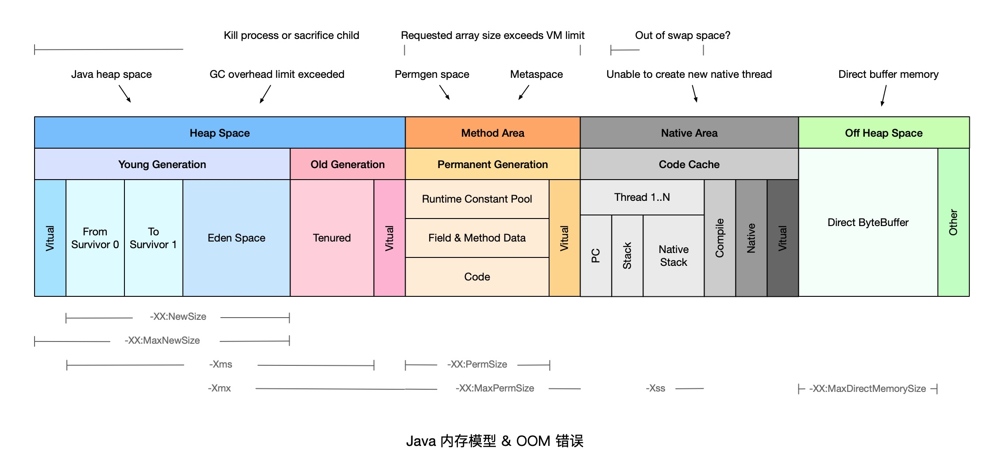
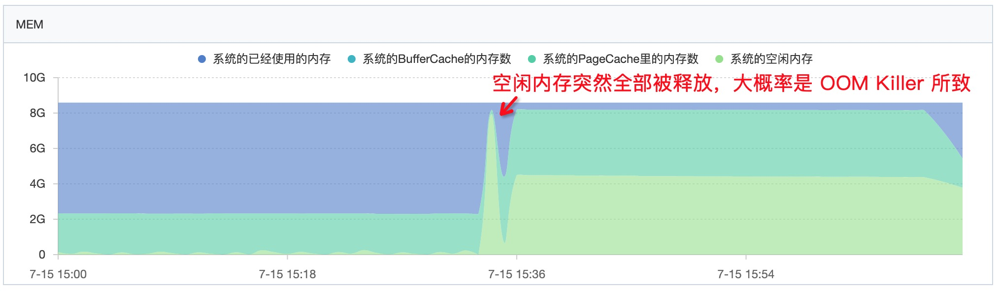

# 系统稳定性——OutOfMemoryError 常见原因及解决方法

> 作者：夏明（涯海）   
> 创作日期：2019-07-15  
> 专栏地址：[【稳定大于一切】](https://github.com/StabilityMan/StabilityGuide)   
> PDF 格式：[系统稳定性——OutOfMemoryError常见原因及解决方法](https://github.com/StabilityMan/StabilityGuide/blob/master/docs/diagnosis/jvm/exception/pdf/系统稳定性——OutOfMemoryError常见原因及解决方法.pdf)


当 JVM 内存严重不足时，就会抛出 java.lang.OutOfMemoryError 错误。本文总结了常见的 OOM 原因及其解决方法，如下图所示。如有遗漏或错误，欢迎补充指正。



如果对 JVM 内存模型和垃圾回收机制不熟悉，推荐阅读 [《咱们从头到尾说一次 Java 垃圾回收》](../gc/咱们从头到尾说一次垃圾回收.md)。

## 目录

- [Java heap space](#1-java-heap-space)
- [GC overhead limit exceeded](#2-gc-overhead-limit-exceeded)
- [Permgen space](#3-permgen-space)
- [Metaspace](#4-metaspace)
- [Unable to create new native thread](#5-unable-to-create-new-native-thread)
- [Out of swap space？](#6-out-of-swap-space？)
- [Kill process or sacrifice child](#7-kill-process-or-sacrifice-child)
- [Requested array size exceeds VM limit](#8-requested-array-size-exceeds-vm-limit)
- [Direct buffer memory](#9-direct-buffer-memory)
- [推荐工具&产品](#推荐工具产品)
- [参考文章](#参考文章)
- [加入我们](#加入我们)


## 1. Java heap space
当堆内存（Heap Space）没有足够空间存放新创建的对象时，就会抛出 `java.lang.OutOfMemoryError: Java heap space` 错误（根据实际生产经验，可以对程序日志中的 OutOfMemoryError 配置关键字告警，一经发现，立即处理）。

### 原因分析
`Java heap space` 错误产生的常见原因可以分为以下几类：

* 请求创建一个超大对象，通常是一个大数组。
* 超出预期的访问量/数据量，通常是上游系统请求流量飙升，常见于各类促销/秒杀活动，可以结合业务流量指标排查是否有尖状峰值。
* 过度使用终结器（Finalizer），该对象没有立即被 GC。
* 内存泄漏（Memory Leak），大量对象引用没有释放，JVM 无法对其自动回收，常见于使用了 File 等资源没有回收。

### 解决方案
针对大部分情况，通常只需要通过 `-Xmx` 参数调高 JVM 堆内存空间即可。如果仍然没有解决，可以参考以下情况做进一步处理：

* 如果是超大对象，可以检查其合理性，比如是否一次性查询了数据库全部结果，而没有做结果数限制。
* 如果是业务峰值压力，可以考虑添加机器资源，或者做限流降级。
* 如果是内存泄漏，需要找到持有的对象，修改代码设计，比如关闭没有释放的连接。


## 2. GC overhead limit exceeded
当 Java 进程花费 98% 以上的时间执行 GC，但只恢复了不到 2% 的内存，且该动作连续重复了 5 次，就会抛出 `java.lang.OutOfMemoryError:GC overhead limit exceeded` 错误。简单地说，就是应用程序已经基本耗尽了所有可用内存， GC 也无法回收。

此类问题的原因与解决方案跟 `Java heap space` 非常类似，可以参考上文。


## 3. Permgen space
该错误表示永久代（Permanent Generation）已用满，通常是因为加载的 class 数目太多或体积太大。

### 原因分析
永久代存储对象主要包括以下几类：
	
* 加载/缓存到内存中的 class 定义，包括类的名称，字段，方法和字节码；
* 常量池；
* 对象数组/类型数组所关联的 class；
* JIT 编译器优化后的 class 信息。

PermGen 的使用量与加载到内存的 class 的数量/大小正相关。

### 解决方案
根据 Permgen space 报错的时机，可以采用不同的解决方案，如下所示：

* 程序启动报错，修改 `-XX:MaxPermSize` 启动参数，调大永久代空间。
* 应用重新部署时报错，很可能是没有应用没有重启，导致加载了多份 class 信息，只需重启 JVM 即可解决。
* 运行时报错，应用程序可能会动态创建大量 class，而这些 class 的生命周期很短暂，但是 JVM 默认不会卸载 class，可以设置 `-XX:+CMSClassUnloadingEnabled` 和 `-XX:+UseConcMarkSweepGC` 这两个参数允许 JVM 卸载 class。

如果上述方法无法解决，可以通过 jmap 命令 dump 内存对象 `jmap -dump:format=b,file=dump.hprof <process-id>` ，然后利用 [Eclipse MAT](https://www.eclipse.org/mat/) 功能逐一分析开销最大的 classloader 和重复 class。


## 4. Metaspace
JDK 1.8 使用 Metaspace 替换了永久代（Permanent Generation），该错误表示 Metaspace 已被用满，通常是因为加载的 class 数目太多或体积太大。

此类问题的原因与解决方法跟 `Permgen space` 非常类似，可以参考上文。需要特别注意的是调整 Metaspace 空间大小的启动参数为 `-XX:MaxMetaspaceSize`。


## 5. Unable to create new native thread
每个 Java 线程都需要占用一定的内存空间，当 JVM 向底层操作系统请求创建一个新的 native 线程时，如果没有足够的资源分配就会报此类错误。

### 原因分析
JVM 向 OS 请求创建 native 线程失败，就会抛出 `Unable to create new native thread`，常见的原因包括以下几类：

* 线程数超过操作系统最大线程数 ulimit 限制。
* 线程数超过 kernel.pid_max（只能重启）。
* native 内存不足。

该问题发生的常见过程主要包括以下几步：

1. JVM 内部的应用程序请求创建一个新的 Java 线程；
2. JVM native 方法代理了该次请求，并向操作系统请求创建一个 native 线程；
3. 操作系统尝试创建一个新的 native 线程，并为其分配内存；
4. 如果操作系统的虚拟内存已耗尽，或是受到 32 位进程的地址空间限制，操作系统就会拒绝本次 native 内存分配；
5. JVM 将抛出 `java.lang.OutOfMemoryError: Unable to create new native thread` 错误。

### 解决方案

* 升级配置，为机器提供更多的内存；
* 降低 Java Heap Space 大小；
* 修复应用程序的线程泄漏问题；
* 限制线程池大小；
* 使用 -Xss 参数减少线程栈的大小；
* 调高 OS 层面的线程最大数：执行 `ulimia -a` 查看最大线程数限制，使用 `ulimit -u xxx` 调整最大线程数限制。

```
ulimit -a
.... 省略部分内容 .....
max user processes              (-u) 16384
```


## 6. Out of swap space？
该错误表示所有可用的虚拟内存已被耗尽。虚拟内存（Virtual Memory）由物理内存（Physical Memory）和交换空间（Swap Space）两部分组成。当运行时程序请求的虚拟内存溢出时就会报 `Out of swap space?` 错误。

### 原因分析
该错误出现的常见原因包括以下几类：

* 地址空间不足；
* 物理内存已耗光；
* 应用程序的本地内存泄漏（native leak），例如不断申请本地内存，却不释放。
* 执行 `jmap -histo:live <pid>` 命令，强制执行 Full GC；如果几次执行后内存明显下降，则基本确认为 Direct ByteBuffer 问题。

### 解决方案
根据错误原因可以采取如下解决方案：

* 升级地址空间为 64 bit；
* 使用 [Arthas](https://github.com/alibaba/arthas) 检查是否为 Inflater/Deflater 解压缩问题，如果是，则显式调用 end 方法。
* Direct ByteBuffer 问题可以通过启动参数 `-XX:MaxDirectMemorySize` 调低阈值。
* 升级服务器配置/隔离部署，避免争用。


## 7. Kill process or sacrifice child
有一种内核作业（Kernel Job）名为 Out of Memory Killer，它会在可用内存极低的情况下“杀死”（kill）某些进程。OOM Killer 会对所有进程进行打分，然后将评分较高的进程“杀死”，具体的评分规则可以参考 [Surviving the Linux OOM Killer](https://dev.to/rrampage/surviving-the-linux-oom-killer-2ki9)。

不同于其他的 OOM 错误，`Kill process or sacrifice child` 错误不是由 JVM 层面触发的，而是由操作系统层面触发的。当系统空闲内存突然大幅被释放，有较大概率触发了 OOM Killer 杀掉了某些进程。



### 原因分析
默认情况下，Linux 内核允许进程申请的内存总量大于系统可用内存，通过这种“错峰复用”的方式可以更有效的利用系统资源。

然而，这种方式也会无可避免地带来一定的“超卖”风险。例如某些进程持续占用系统内存，然后导致其他进程没有可用内存。此时，系统将自动激活 OOM Killer，寻找评分高的进程，并将其“杀死”，释放内存资源。


### 解决方案

* 升级服务器配置/隔离部署，避免争用。
* [OOM Killer 调优](https://access.redhat.com/documentation/en-us/red_hat_enterprise_linux/6/html/performance_tuning_guide/s-memory-captun)。


## 8. Requested array size exceeds VM limit
JVM 限制了数组的最大长度，该错误表示程序请求创建的数组超过最大长度限制。

JVM 在为数组分配内存前，会检查要分配的数据结构在系统中是否可寻址，通常为 `Integer.MAX_VALUE - 2`。

此类问题比较罕见，通常需要检查代码，确认业务是否需要创建如此大的数组，是否可以拆分为多个块，分批执行。


## 9. Direct buffer memory
Java 允许应用程序通过 Direct ByteBuffer 直接访问堆外内存，许多高性能程序通过 Direct ByteBuffer 结合内存映射文件（Memory Mapped File）实现高速 IO。

### 原因分析
Direct ByteBuffer 的默认大小为 64 MB，一旦使用超出限制，就会抛出 `Direct buffer memory` 错误。


### 解决方案

* Java 只能通过 ByteBuffer.allocateDirect 方法使用 Direct ByteBuffer，因此，可以通过 [Arthas](https://github.com/alibaba/arthas) 等在线诊断工具拦截该方法进行排查。
* 检查是否直接或间接使用了 NIO，如 netty，jetty 等。
* 通过启动参数 `-XX:MaxDirectMemorySize` 调整 Direct ByteBuffer 的上限值。
* 检查 JVM 参数是否有 `-XX:+DisableExplicitGC` 选项，如果有就去掉，因为该参数会使 `System.gc()` 失效。
* 检查堆外内存使用代码，确认是否存在内存泄漏；或者通过反射调用 `sun.misc.Cleaner` 的 `clean()` 方法来主动释放被 Direct ByteBuffer 持有的内存空间。
* 内存容量确实不足，升级配置。


## 推荐工具&产品
* [Eclipse Memory Analyzer —— JVM 内存分析工具](https://www.eclipse.org/mat/)
* [ARMS —— 阿里云 APM 产品，支持 OOM 异常关键字告警](https://help.aliyun.com/document_detail/42781.html)
* [Arthas —— Java 在线诊断工具](https://github.com/alibaba/arthas)


## 参考文章
* [Plumbr OutOfMemoryError（推荐，含代码示例）](https://plumbr.io/outofmemoryerror)
* [GCeasy OutOfMemoryError](https://tier1app.files.wordpress.com/2014/12/outofmemoryerror2.pdf)
* [JVM 内存结构](https://www.cnblogs.com/ityouknow/p/5610232.html)


## 加入我们
【稳定大于一切】打造国内稳定性领域知识库，**让无法解决的问题少一点点，让世界的确定性多一点点**。

* [GitHub 地址](https://github.com/StabilityMan/StabilityGuide)
* 钉钉群号：
	* 30000312（2群，推荐）
	* 23179349（1群，已满）
* 如果阅读本文有所收获，欢迎分享给身边的朋友，期待更多同学的加入！