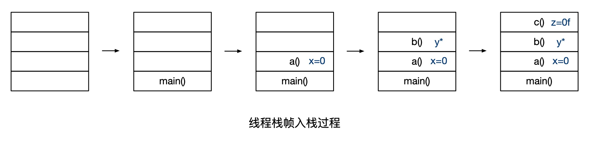
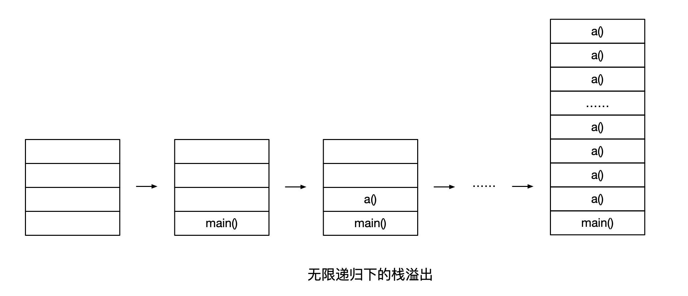

# 系统稳定性——StackOverFlowError 常见原因及解决方法

> 作者：夏明（涯海）    
> 创作日期：2019-07-26  
> 专栏地址：[【稳定大于一切】](https://github.com/StabilityMan/StabilityGuide)   
> PDF 格式：[系统稳定性——StackOverFlowError常见原因及解决方法](https://github.com/StabilityMan/StabilityGuide/blob/master/docs/diagnosis/jvm/exception/pdf/系统稳定性——StackOverFlowError常见原因及解决方法.pdf)


每一个 JVM 线程都拥有一个私有的 JVM 线程栈，用于存放当前线程的 JVM 栈帧（包括被调用函数的参数、局部变量和返回地址等）。如果某个线程的线程栈空间被耗尽，没有足够资源分配给新创建的栈帧，就会抛出 `java.lang.StackOverflowError` 错误。本文总结了 StackOverflowError 常见原因及其解决方法，如有遗漏或错误，欢迎补充指正。

## 目录
- [线程栈是如何运行的？](#线程栈是如何运行的)
- [StackOverFlowError 是如何产生的？](#stackoverflowerror-是如何产生的)
- [如何解决 StackOverFlowError？](#如何解决-stackoverflowerror)
- [推荐工具&产品](#推荐工具产品)
- [参考文章](#参考文章)
- [加入我们](#加入我们)


## 线程栈是如何运行的？
首先给出一个简单的程序调用代码示例，如下所示：

```java
public class SimpleExample {
      public static void main(String args[]) {
            a();
      }
      public static void a() {
            int x = 0;
            b();
      }
      public static void b() {
            Car y = new Car();
            c();
      }
      public static void c() {
            float z = 0f;
      }
}

```

当 `main()` 方法被调用后，执行线程按照代码执行顺序，将它正在执行的方法、基本数据类型、对象指针和返回值包装在栈帧中，逐一压入其私有的调用栈，整体执行过程如下图所示：



1. 首先，程序启动后，`main()` 方法入栈。
2. 然后，`a()` 方法入栈，变量 `x` 被声明为 `int` 类型，初始化赋值为 `0`。注意，无论是 `x` 还是 `0` 都被包含在栈帧中。
3. 接着，`b()` 方法入栈，创建了一个 `Car` 对象，并被赋给变量 `y`。请注意，实际的 `Car` 对象是在 Java 堆内存中创建的，而不是线程栈中，只有 `Car` 对象的引用以及变量 `y` 被包含在栈帧里。
4. 最后，`c()` 方法入栈，变量 `z` 被声明为 `float` 类型，初始化赋值为 `0f`。同理，`z` 还是 `0f` 都被包含在栈帧里。

当方法执行完成后，所有的线程栈帧将按照后进先出的顺序逐一出栈，直至栈空为止。

## StackOverFlowError 是如何产生的？

如上所述，JVM 线程栈存储了方法的执行过程、基本数据类型、局部变量、对象指针和返回值等信息，这些都需要消耗内存。一旦线程栈的大小增长超过了允许的内存限制，就会抛出 `java.lang.StackOverflowError` 错误。

下面这段代码通过无限递归调用最终引发了 `java.lang.StackOverflowError` 错误。

```java
public class StackOverflowErrorExample {
      public static void main(String args[]) {
            a();
      }
      public static void a() {
            a();
      }
}

```

在这种情况下，`a()` 方法将无限入栈，直至栈溢出，耗尽线程栈空间，如下图所示。

```
Exception in thread "main" java.lang.StackOverflowError
	at StackOverflowErrorExample.a(StackOverflowErrorExample.java:10)
	at StackOverflowErrorExample.a(StackOverflowErrorExample.java:10)
	at StackOverflowErrorExample.a(StackOverflowErrorExample.java:10)
	at StackOverflowErrorExample.a(StackOverflowErrorExample.java:10)
	at StackOverflowErrorExample.a(StackOverflowErrorExample.java:10)
	at StackOverflowErrorExample.a(StackOverflowErrorExample.java:10)
	at StackOverflowErrorExample.a(StackOverflowErrorExample.java:10)
	at StackOverflowErrorExample.a(StackOverflowErrorExample.java:10)
	at StackOverflowErrorExample.a(StackOverflowErrorExample.java:10)
```



## 如何解决 StackOverFlowError？
引发 `StackOverFlowError` 的常见原因有以下几种：

* 无限递归循环调用（最常见）。
* 执行了大量方法，导致线程栈空间耗尽。
* 方法内声明了海量的局部变量。
* native 代码有栈上分配的逻辑，并且要求的内存还不小，比如 `java.net.SocketInputStream.read0` 会在栈上要求分配一个 64KB 的缓存（64位 Linux）。


除了程序抛出 `StackOverflowError` 错误以外，还有两种定位栈溢出的方法：

* 进程突然消失，但是留下了 crash 日志，可以检查 crash 日志里当前线程的 stack 范围，以及 RSP 寄存器的值。如果 RSP 寄存器的值超出这个 stack 范围，那就说明是栈溢出了。
* 如果没有 crash 日志，那只能通过 coredump 进行分析。在进程运行前，先执行 `ulimit -c unlimited`，当进程挂掉之后，会产生一个 core.[pid] 的文件，然后再通过 `jstack $JAVA_HOME/bin/java core.[pid]` 来看输出的栈。如果正常输出了，那就可以看是否存在很长的调用栈的线程，当然还有可能没有正常输出的，因为 jstack 的这条从 core 文件抓栈的命令其实是基于 Serviceability Agent 实现的，而 SA 在某些版本里有 Bug。


常见的解决方法包括以下几种：

* **修复引发无限递归调用的异常代码，** 通过程序抛出的异常堆栈，找出不断重复的代码行，按图索骥，修复无限递归 Bug。
* 排查是否存在类之间的循环依赖。
* 排查是否存在在一个类中对当前类进行实例化，并作为该类的实例变量。
* **通过 JVM 启动参数 `-Xss` 增加线程栈内存空间，** 某些正常使用场景需要执行大量方法或包含大量局部变量，这时可以适当地提高线程栈空间限制，例如通过配置 `-Xss2m` 将线程栈空间调整为 2 mb。

线程栈的默认大小依赖于操作系统、JVM 版本和供应商，常见的默认配置如下表所示：

|JVM 版本|线程栈默认大小|
|-------|------------|
|Sparc 32-bit JVM|512 kb|
|Sparc 64-bit JVM|1024 kb|
|x86 Solaris/Linux 32-bit JVM|320 kb|
|x86 Solaris/Linux 64-bit JVM|1024 kb|
|Windows 32-bit JVM|320 kb|
|Windows 64-bit JVM|1024 kb|


**提示：** 实际生产系统中，可以对程序日志中的 StackOverFlowError 配置关键字告警，一经发现，立即处理。


## 推荐工具&产品
* [ARMS —— 阿里云 APM 产品，支持 StackOverFlowError 异常关键字告警](https://help.aliyun.com/document_detail/42781.html)


## 参考文章
* [StackOverFlow Error: Causes and Solutions](https://dzone.com/articles/stackoverflowerror-causes-amp-solutions)
* [The Structure of the Java Virtual Machine](https://docs.oracle.com/javase/specs/jvms/se7/html/jvms-2.html#jvms-2.5.2)
* [The StackOverflowError in Java](https://www.baeldung.com/java-stack-overflow-error)
* [JVM源码分析之栈溢出完全解读](http://lovestblog.cn/blog/2016/04/19/stack-over-flow/)


## 加入我们
【稳定大于一切】打造国内稳定性领域知识库，**让无法解决的问题少一点点，让世界的确定性多一点点**。

* [GitHub 地址](https://github.com/StabilityMan/StabilityGuide)
* 钉钉群号：
	* 30000312（2群，推荐）
	* 23179349（1群，已满）
* 如果阅读本文有所收获，欢迎分享给身边的朋友，期待更多同学的加入！