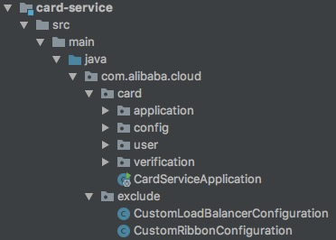

# Spring Boot 常见错误及解决方法

> 作者：方剑（洛夜）     
> 创作日期：2019-10-28  
> 专栏地址：[【稳定大于一切】](https://github.com/StabilityMan/StabilityGuide)  
> PDF 格式：[Spring Boot 常见错误及解决方法](https://github.com/StabilityMan/StabilityGuide/blob/master/docs/diagnosis/plugin/microservice/pdf/SpringBoot常见错误及解决方法.pdf)

Spring Boot 作为 Java 生态中最流行的开发框架，意味着被数以万计的开发者所使用。下面根据我们自身遇到的问题，加上用户提供的一些反馈，来大致梳理下 Spring Boot 的常见错误及解决方法。

## 目录
- [找不到配置？配置不对？配置被覆盖?](#找不到配置配置不对配置被覆盖)
- [Jar 包启动不了](#jar-包启动不了)
- [自动化配置类没有被加载](#自动化配置类没有被加载)
- [定义的 Component 没有被扫描到](#定义的-component-没有被扫描到)
- [Actuator Endpoint 访问不了](#actuator-endpoint-访问不了)
- [推荐项目](#推荐项目)
- [加入我们](#加入我们)


## 找不到配置？配置不对？配置被覆盖?

Spring Boot 配置加载过程解析:

- Spring Boot 配置的加载有着约定俗成的步骤: 从 resources 目录下加载 application.properties/application.yml; 再根据里面的  `spring.profiles.active` 来加载不同 profile 的配置文件 application-dev.properties/application-dev.yml (比如加载 profile 为 dev 的配置文件)
- Spring Boot 所有的配置来源会被构造成 PropertySource，比如 -D 参数, -- 参数, 系统参数, 配置文件配置等等。这些 PropertySource 最终会被添加到 List 中，获取配置的时候会遍历这个 List，直到第一次获取对应 key 的配置，所以会存在优先级的问题。具体配置的优先级参考: [https://stackoverflow.com/a/45822571](https://stackoverflow.com/a/45822571)

配置覆盖案例:

Nacos 服务注册的 IP 可以通过 `spring.cloud.nacos.discovery.ip` 设置，当我们打成 JAR 包之后，如需修改注册 IP，可以通过 `-Dspring.cloud.nacos.discovery.ip=xxx`(-D 参数配置的优先级比配置文件要高)。

配置问题排查:

进入 http://host:port/actuator/env 这个 endpoint 查看具体的配置项属于哪个 PropertySource


## Jar 包启动不了

执行 Spring Boot 构建的 jar 包后，返回 "my.jar中没有主清单属性" 错误。

错误分析: Spring Boot 的正常 jar 包运行方是通过 spring-boot-loader 这个模块里的 JarLauncher 完成的，该类内部提供了一套运行的规范。

解决方案: 在 pom 里加上 spring-boot-maven-plugin 的 maven 插件配置(该插件会在 jar 里加入 spring-boot-loader 的代码，并在 MANIFEST.MF 中的 Main-Class 里写入 JarLauncher):

```xml
<plugin>
	<groupId>org.springframework.boot</groupId>
	<artifactId>spring-boot-maven-plugin</artifactId>
</plugin>
```

## 自动化配置类没有被加载

条件注解是 Spring Boot 的核心特性之一，第三方的 starter 或我们自定义的 starter 内部都会加载一些 AutoConfiguration，有时候会存在一些 AutoConfiguration 没有被加载的情况。导致出现 NoSuchBeanDefinitionException, UnsatisfiedDependencyException 等异常

排查步骤(三种方式):

1. 把 spring 的日志级别调到 debug 级别: `logging.level.org.springframework: debug`
2. 从 ApplicationContext 中获取 `ConditionEvaluationReport`，得到内部的 `ConditionEvaluationReport.ConditionAndOutcomes` 类中的输出信息
3. 进入 http://host:port/actuator/conditions 这个 endpoint 查看条件注解的 match 情况

这是日志打印的不满足条件的 AutoConfiguratoin:

```bash
Unconditional classes:
----------------------

    org.springframework.boot.autoconfigure.context.ConfigurationPropertiesAutoConfiguration

    org.springframework.cloud.client.ReactiveCommonsClientAutoConfiguration

    org.springframework.boot.actuate.autoconfigure.info.InfoContributorAutoConfiguration

    org.springframework.boot.autoconfigure.context.PropertyPlaceholderAutoConfiguration

    org.springframework.cloud.client.discovery.simple.SimpleDiscoveryClientAutoConfiguration

    org.springframework.cloud.client.CommonsClientAutoConfiguration

    org.springframework.cloud.commons.httpclient.HttpClientConfiguration

    org.springframework.boot.actuate.autoconfigure.endpoint.EndpointAutoConfiguration

    org.springframework.cloud.loadbalancer.config.BlockingLoadBalancerClientAutoConfiguration
```

## 定义的 Component 没有被扫描到

@SpringBootApplication 注解内部也会使用 [@ComponentScan ](/ComponentScan ) 注解用于扫描 Component。默认情况下会扫描@SpringBootApplication 注解修饰的入口类的包以及它下面的子包中所有的 Component。 

这是推荐的包结构中项目的结构:



exclude 包下的类不会被扫描到，card 包下的类会被扫描到。

## Actuator Endpoint 访问不了

访问 Actuator，出现 404 错误。

解决方案: 

1. Spring Boot 2.x 版本对 Actuator 做了大量的修改，其中访问的路径从 http://host:port/endpointid 变成了 http://host:port/actuator/endpointid 。 确保访问的路径正确
2. Endpoint 有 Security 要求，在配置里加上 `management.endpoints.web.exposure.include=*` 即可


## 推荐项目
* [Spring Cloud Alibaba 开源项目地址](https://github.com/alibaba/spring-cloud-alibaba)


## 加入我们
【稳定大于一切】打造国内稳定性领域知识库，**让无法解决的问题少一点点，让世界的确定性多一点点**。

* [GitHub 地址](https://github.com/StabilityMan/StabilityGuide)
* 钉钉群号：
	* 30000312（2群，推荐）
	* 23179349（1群，已满）
* 如果阅读本文有所收获，欢迎分享给身边的朋友，期待更多同学的加入！
