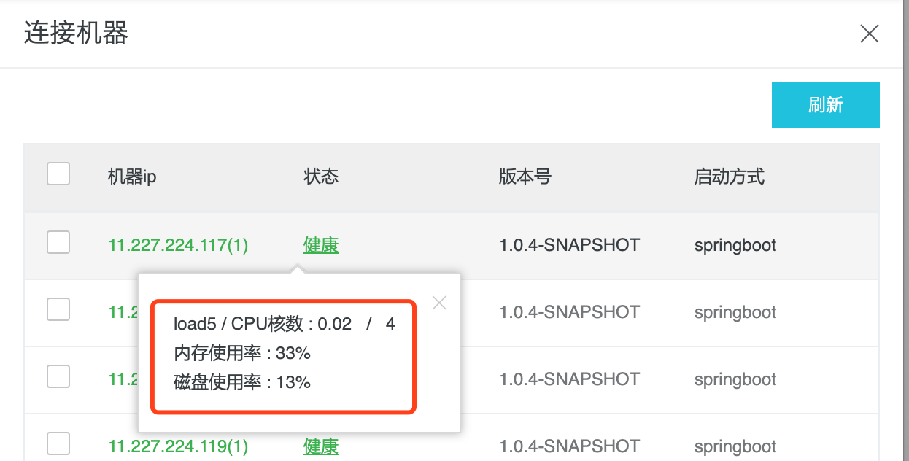
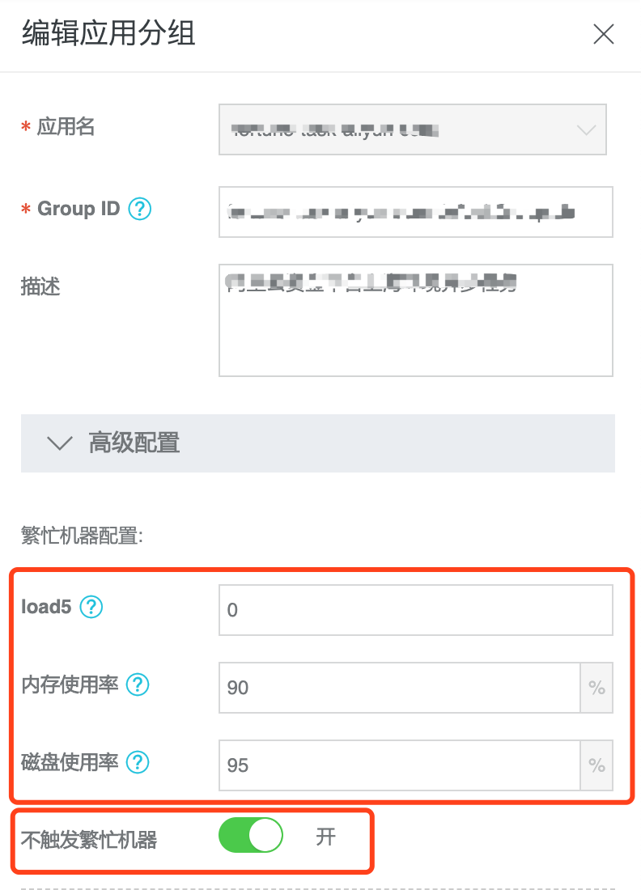
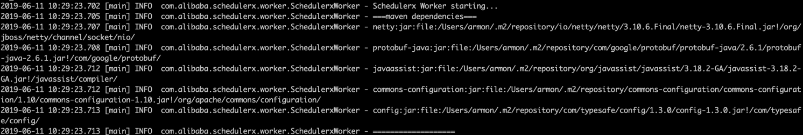
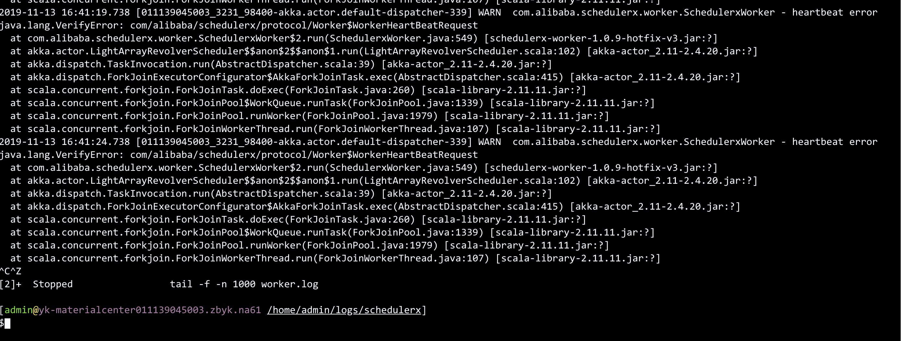
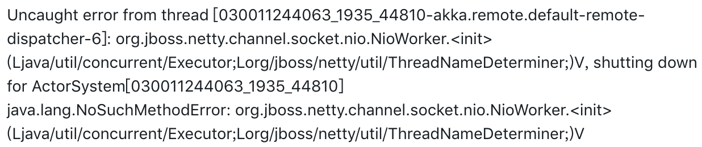
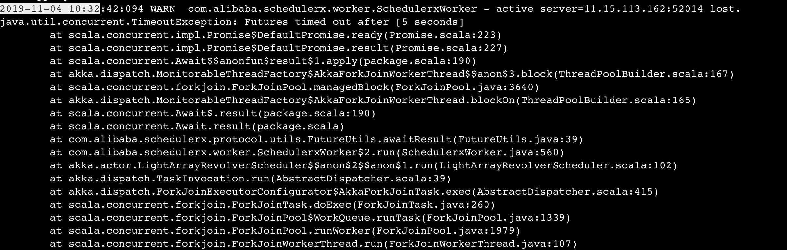
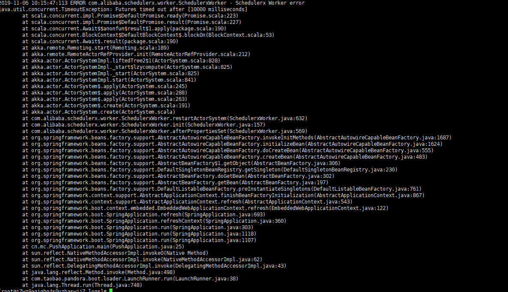
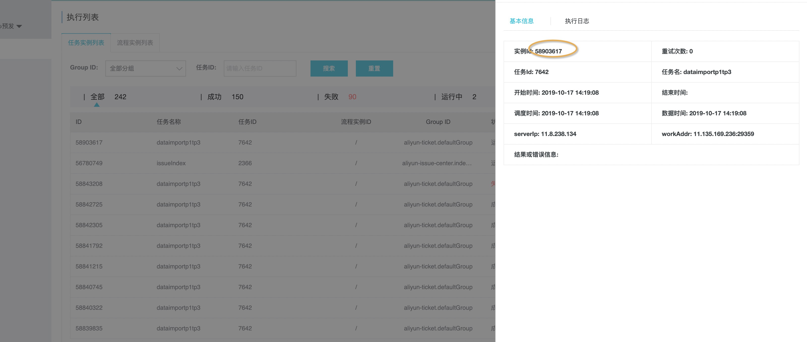
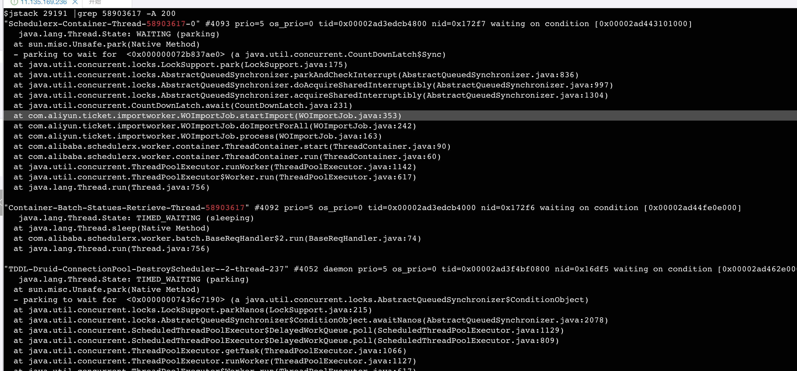

# SchedulerX 常见问题及解决方法

> 作者：黄晓萌（学仁）    
> 创作日期：2019-11-14  
> 专栏地址：[【稳定大于一切】](https://github.com/StabilityMan/StabilityGuide)  
> PDF 格式：[SchedulerX 常见问题及解决方法](https://github.com/StabilityMan/StabilityGuide/blob/master/docs/diagnosis/plugin/scheduling/pdf/SchedulerX常见问题及解决方法.pdf)

## 目录
- [机器繁忙](#机器繁忙)
- [暂无可用的机器（no worker available）](#暂无可用的机器no-worker-available)
- [Jar 包冲突](#jar-包冲突)
- [Spring 应用找不到 Bean](#spring-应用找不到-bean)
- [tablestore protobuf-2.4.1 和 SchedulerX 不兼容](#tablestore-protobuf-241-和-schedulerx-不兼容)
- [任务运行中卡住](#任务运行中卡住)
- [推荐项目](#推荐项目)
- [加入我们](#加入我们)

## 机器繁忙
应用管理，连接机器，如果机器是红色的【繁忙】，说明机器繁忙了，可以点击繁忙/健康，看到当前机器的水位。

如果机器繁忙了，默认是无法触发任务的，想要触发任务，有如下解决方案：

1. 根据机器水位进行处理，比如磁盘超过 90%，就清理磁盘。如果 Load 或者 CPU 高，最好排查出是哪里比较耗 CPU，在业务层面解决，如果解决不了最好升级到高配的机器。
2. 如果只是测试，机器繁忙也想继续触发，可以在应用管理 -> 高级配置下，调整响应的阈值，或者关闭【不触发繁忙机器】的开关，如下图

## 暂无可用的机器（no worker available）
首先排除不是机器繁忙造成的，那么就是接入失败了。登陆自己的机器，找到 SchedulerX 的日志，

1. 日志路径在 `${user.home}/logs/schedulerx/worker.log`
	* 如果进程是通过 root 启动的，目录为 /root/logs/schedulerx/worker.log
	* 如果进程是通过 admin 账户启动的，目录为/home/admin/scheduelrx/worker.log
2. 如果日志报 `groupId is not existed`，说明是配置问题，在 worker.log 里搜索 `Schedulerx WorkerConfig`，可以看到当前的配置，然后和控制台确认下，注意 namespace 要填 SchedulerX 控制台 -> 命令空间 -> 命名空间 Id。
3. 如果日志报了其他异常，基本是 Jar 包冲突引起的，可以看下 Jar 包冲突章节。

## Jar 包冲突
可以在 worker.log 里搜一下 `maven dependencies`，可以看到每个 Jar 的版本和路径，帮助快速定位和解决 Jar 包冲突

请对照 SchedulerX 使用的 Jar 包，把自己低版本的排掉。

| Jar 包 | 版本 |
| --- | --- |
| guava | 20.0 |
| com.typesafe.config | 1.3 |
| protobuf-java | 2.6.1 |
| io.netty | 3.10.6.Final |
| javassist | 3.21.0-GA |
| hessian | 4.0.51 |
| commons-configuration | 1.10 |
| commons-validator | 1.4.0 |
| akka | 2.4.20 |
| scala | 2.11 |

下面放一些常见的 Jar 包冲突

1. protobuf冲突
    
2. netty冲突
    
3. netty或者protobuf冲突
    
    

## Spring 应用找不到 Bean

1. 应用管理链接机器看启动方式，确保是 Spring 或者 SpringBoot。
2. JobProcessor 要注入为 Bean，比如加 @Component 注解。
3. 排查 pom 依赖如果依赖 spring-boot-devtools 请排除掉。
4. JobProcessor 和 process 方法不要加事务注解。

## tablestore protobuf-2.4.1 和 SchedulerX 不兼容
[https://help.aliyun.com/knowledge_detail/58568.html](https://help.aliyun.com/knowledge_detail/58568.html)

## 任务运行中卡住
schedulerx-worker 执行每个 Processor 的时候会把任务实例 Id 放到线程名中，方便查看线程栈。这里以分布式任务某个子任务卡住为例，单机执行/广播执行类似。

1. 首先控制台执行列表查看卡住的任务实例的详情，获取实例id
    
2. 登入卡住的机器，查看线程栈，执行 `jstack [pid] | grep [实例id] -A 20`，如下图所示，发现是业务自己卡住了。
    

## 推荐产品
* [分布式任务调度 SchedulerX](https://help.aliyun.com/document_detail/125501.html)

## 加入我们
【稳定大于一切】打造国内稳定性领域知识库，**让无法解决的问题少一点点，让世界的确定性多一点点**。

* [GitHub 地址](https://github.com/StabilityMan/StabilityGuide)
* 钉钉群号：
	* 30000312（2群，推荐）
	* 23179349（1群，已满）
* 如果阅读本文有所收获，欢迎分享给身边的朋友，期待更多同学的加入！