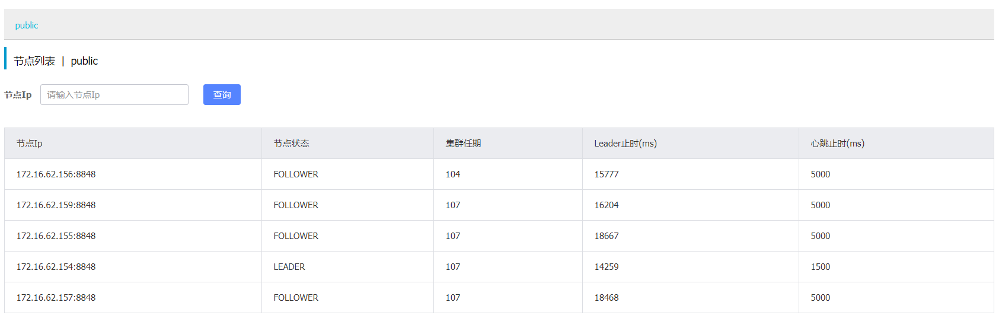

# Nacos 常见问题及解决方法

> 作者：朱鹏飞（敦谷）  
> 创作日期：2019-09-07  
> 专栏地址：[【稳定大于一切】](https://github.com/StabilityMan/StabilityGuide)  
> PDF 格式：[Nacos常见问题及解决方法](https://github.com/StabilityMan/StabilityGuide/blob/master/docs/diagnosis/plugin/slb/pdf/Nacos常见问题及解决方法.pdf)


## 目录
- [如何依赖最新的Nacos客户端？](#如何依赖最新的nacos客户端)
- [客户端CPU高，或者内存耗尽的问题](#客户端cpu高或者内存耗尽的问题)
- [日志打印频繁的问题](#日志打印频繁的问题)
- [集群管理页面，Raft Term 显示不一致问题](#集群管理页面raft-term-显示不一致问题)
- [加入我们](#加入我们)

[Nacos](https://nacos.io/zh-cn/index.html) 开源至今已有一年，在这一年里，得到了很多用户的支持和反馈。在与社区的交流中，我们发现有一些问题出现的频率比较高，为了能够让用户更快的解决问题，我们总结了这篇常见问题及解决方法，这篇文章后续也会合并到 Nacos 官网的 [FAQ](https://nacos.io/zh-cn/docs/faq.html) 里。

### 如何依赖最新的 Nacos 客户端？
很多用户都是通过 Spring Cloud Alibaba 或者 Dubbo 依赖的 Nacos 客户端，那么 Spring Cloud Alibaba 和 Dubbo 中依赖的 Nacos 客户端版本，往往会落后于 Nacos 最新发布的版本。在一些情况下，用户需要强制将 Nacos 客户端升级到最新，此时却往往不知道该升级哪个依赖，这里将 Spring Cloud Alibaba 和 Dubbo 的依赖升级说明如下：

#### Spring Cloud Alibaba
用户通常是配置以下Maven依赖来使用的 Nacos：

```xml
<!--Nacos Discovery-->
<dependency>
     <groupId>com.alibaba.cloud</groupId>
     <artifactId>spring-cloud-starter-alibaba-nacos-discovery</artifactId>
     <version>[latest version]</version>
 </dependency>

<!--Nacos Config-->
<dependency>
     <groupId>com.alibaba.cloud</groupId>
     <artifactId>spring-cloud-starter-alibaba-nacos-config</artifactId>
     <version>[latest version]</version>
 </dependency>
```

这两个 JAR 包实际上又依赖了以下的 JAR 包：

```xml
<dependency>
  <groupId>com.alibaba.nacos</groupId>
  <artifactId>nacos-client</artifactId>
  <version>[a particular version]</version>
</dependency>
```

如果 nacos-client 升级了，对应的 spring-cloud 客户端版本不一定也同步升级，这个时候可以采用如下的方式强制升级 nacos-client（以 nacos-discovery 为例）：

```xml
<dependency>
     <groupId>com.alibaba.cloud</groupId>
     <artifactId>spring-cloud-starter-alibaba-nacos-discovery</artifactId>
     <version>[latest version]</version>
     <excludes>
          <exclude>
                 <groupId>com.alibaba.nacos</groupId>
                 <artifactId>nacos-client</artifactId>
          </exclude>
     </excludes>
 </dependency>

<dependency>
  <groupId>com.alibaba.nacos</groupId>
  <artifactId>nacos-client</artifactId>
  <version>[latest version]</version>
</dependency>
```

#### Dubbo
Dubbo 也是类似的道理，用户通常引入的是以下的依赖：

```xml
<dependency>
    <groupId>com.alibaba</groupId>
    <artifactId>dubbo-registry-nacos</artifactId>
    <version>[latest version]</version>
</dependency>   
    
<!-- Dubbo dependency -->
<dependency>
    <groupId>com.alibaba</groupId>
    <artifactId>dubbo</artifactId>
    <version>[latest version]</version>
</dependency>
```

需要升级Nacos客户端时，只需要如下修改依赖：

```xml
 <dependency>
  <groupId>com.alibaba.nacos</groupId>
  <artifactId>nacos-client</artifactId>
  <version>[latest version]</version>
</dependency>
```

### 客户端 CPU 高，或者内存耗尽的问题
问题的现象是依赖 Nacos 客户端的应用，在运行一段时间后出现 CPU 占用率高，内存占用高甚至内存溢出的现象，可以参考 Issue：[https://github.com/alibaba/nacos/issues/1605](https://github.com/alibaba/nacos/issues/1605)。

这种情况首先要做的是分析 CPU 高或者内存占用高的原因，常用的命令有 `top、jstack、jmap、jhat` 等。其中一种情况是 Nacos 客户端实例在 Spring Cloud Alibaba 服务框架中被反复构造了多次，可以参考 Issue：[https://github.com/alibaba/spring-cloud-alibaba/issues/859](https://github.com/alibaba/spring-cloud-alibaba/issues/859)。这个问题已经得到了修复，预期会在下个 Spring Cloud Alibaba 版本中发布。

### 日志打印频繁的问题
在老的 Nacos 版本中，往往会有大量的无效日志打印，这些日志的打印会迅速占用完用户的磁盘空间，同时也让有效日志难以查找。目前社区反馈的日志频繁打印主要有以下几种情况：

1. access 日志大量打印，相关 Issue 有：[https://github.com/alibaba/nacos/issues/1510](https://github.com/alibaba/nacos/issues/1510)。主要表现是 `{nacos.home}/logs/access_log.2019-xx-xx.log` 类似格式文件名的日志大量打印，而且还不能自动清理和滚动。这个日志是 Spring Boot 提供的 Tomcat 访问日志打印，Spring Boot 在关于该日志的选项中，没有最大保留天数或者日志大小控制的选项。因此这个日志的清理必须由应用新建 Crontab 任务来完成，或者通过以下命令关闭日志的输出（在生产环境我们还是建议开启该日志，以便能够有第一现场的访问记录）：

	```
	server.tomcat.accesslog.enabled=false
	```

2. 服务端业务日志大量打印且无法动态调整日志级别。这个问题在 `1.1.3` 已经得到优化，可以通过 API 的方式来进行日志级别的调整，调整日志级别的方式如下：

	```
	# 调整naming模块的naming-raft.log的级别为error:
	curl -X PUT '$nacos_server:8848/nacos/v1/ns/operator/log?logName=naming-raft&logLevel=error'
	# 调整config模块的config-dump.log的级别为warn:
	curl -X PUT '$nacos_server:8848/nacos/v1/cs/ops/log?logName=config-dump&logLevel=warn'
	```

3. 客户端日志大量打印，主要有心跳日志、轮询日志等。这个问题已经在 1.1.3 解决，请升级到 1.1.3 版本。

### 集群管理页面，Raft Term 显示不一致问题
在 Nacos 1.0.1 版本中，Nacos 控制台支持了显示当前的集群各个机器的状态信息。这个功能受到比较多用户的关注，其中一个被反馈的问题是列表中每个节点的集群任期不一样。如下图所示（图片信息来自 Issue：[https://github.com/alibaba/nacos/issues/1786](https://github.com/alibaba/nacos/issues/1786)）：



对于这个任期不一致的问题，原因主要是因为获取这个信息的逻辑有一些问题，没有从对应的节点上获取集群任期。这个问题会在下一个 Nacos 版本中修复。目前一个手动检查集群任期的办法是在每个节点上执行以下命令：

```
curl '127.0.0.1:8848/nacos/v1/ns/raft/state'
```

然后在返回信息中查找本节点的集群任期。因为每个节点返回的集群任期中，只有当前节点的信息是准确的，返回的其他节点的信息都是不准确的。


## 加入我们
【稳定大于一切】打造国内稳定性领域知识库，**让无法解决的问题少一点点，让世界的确定性多一点点**。

* [GitHub 地址](https://github.com/StabilityMan/StabilityGuide)
* 钉钉群号：
	* 30000312（2群，推荐）
	* 23179349（1群，已满）
* 如果阅读本文有所收获，欢迎分享给身边的朋友，期待更多同学的加入！