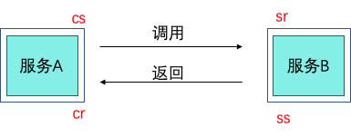
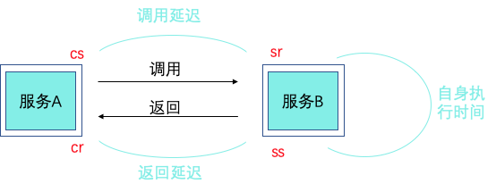

# 系统黄金指标之延迟(Latency)指标的故障诊断

> 作者：徐彤（绍宽）  
> 创作日期：2019-09-02  
> 专栏地址：[【稳定大于一切】](https://github.com/StabilityMan/StabilityGuide)  
> PDF 格式：[系统黄金指标之延迟(Latency)指标的故障诊断](https://github.com/StabilityMan/StabilityGuide/blob/master/docs/diagnosis/rootcause/pdf/系统黄金指标之延迟(Latency)指标的故障诊断.pdf)

## 前言

被运维或者稳定性负责的同学奉为"圣经"的Google的《Google SRE Books》一书中提出了系统监控的四个黄金指标

* Latency：延时
* Traffic：流量
* Saturation：饱和度
* Errors：错误数或错误率

这个四个黄金指标在在任何系统中都是很好的性能状态指标，他们之所以被称为”黄金“指标，很大一个因素是因为他们反映了终端用户的感知。但是光有监控还是不够的，开源的商业的有很多监控工具，我们可以很方便的搭建一套监控系统，很多维护人员喜欢满满当当配上所有能监控的指标，显得有"安全感"，相信我，这样的配置方式，恐怕只会适得其反。

那如何配置一个好的监控系统呢？换句话讲，**当我们在看一个监控系统的时候，我们在看什么？**要回答这个问题，我们的应当有个理念的转变，不是为了监控而监控，每当我们配置一个指标的时候，我们要问自己一个问题，**当这个指标出现问题的时候，意味着什么，后续的动作是什么**？今天，我们这个系列就会着重聊一聊当系统延迟(Latency)指标出现异常的时候，我们应该怎么办？

## 先从 Latency 指标定义说起

* 延迟（Latency）：延迟是发送请求和接收响应所需的时间。

定义不长，但是里面的门道却不少，一个典型的服务发送请求到接收响应经过四个事件：

* Client Sent 简称 cs，客户端发起调用请求到服务端。
* Server Received 简称 sr，指服务端接收到了客户端的调用请求。
* Server Sent 简称 ss，指服务端完成了处理，准备将信息返给客户端。
* Client Received 简称 cr，指客户端接收到了服务端的返回信息。

假如在这四个事件发生时记录下时间戳，就可以计算出耗时，比如 sr 减去 cs 就是调用时的网络延迟，ss 减去 sr 就是服务执行时间，cr 减去 ss 就是服务响应的延迟，cr 减 cs 就是整个服务调用执行的时间。

通常只记录 cr 减 cs 也就是整个服务调用执行的时间，这个也是更加直观的表现出对终端用户体验的影响，对于问题的发现足够了，但是对于当 Latency 出现波动的时候，需要进行快速故障定位的时候，更多的时间记录点会帮助大家快速定界问题。

## Latency 问题诊断套路

当我们的系统出现了耗时比较高的时候，我们应该如何去诊断问题呢？其实是一个故障定界 -> 故障定位的过程。

故障定界的套路：1、先看依赖有没有问题

很多时候我们定位问题的时候先登录到某台机器上看日志，这样容易“一叶障目”，我们通常的定位思路是先看依赖中间件等有没有出现问题。常见的问题有由于数据库连接池满、缓存击穿等导致的问题。或者依赖的服务端有没有问题。可以通过上面的 **ss-sr=服务执行时间** 来判断是不是对端服务有没有问题。

BTW: 我们实际在写代码时，尽量需要避免这种依赖方出现问题从而会导致自己应用出现问题的情况，这类问题往往排查路径比较深，耗时耗力。因此在我们需要调用第三方的代码时合理设置了超时时间和容错处理

2、再看自己有没有问题

看自己的时候，需要有一个判断是群障到单障的思维迭代过程，有两种思路： 1、查看耗时分布，有的企业在做 Tracing 系统时会存储每一个调用链路的详细信息（如果调用请求比较大，可以效仿鹰眼的做法，平时是采样的信息，对于错慢等调用临时动态全采样），有了这份信息，可以 group 出问题时间点的耗时分布在哪些机器、哪些服务上，快速帮自己判断是否是单点/单服务问题。

当前，如果没有调用链路信息也没关系，可以采集每台机器上的 Nginx 日志里面的耗时时间、请求 qps、错误码返回等信息，无论哪种方式，最终 Latency 的问题大都能归到一下三个问题分类中：

* **少量机器问题**：是在某几台机器上不同服务都出现Latency高的问题。
* **单服务问题**：同一个服务的Latency在多个机器上出现问题。
* **群障问题**：网络故障、调度系统出现问题、宿主机内核等问题(该问题不在本次讨论范围，一般企业的大规模故障都有更多更直接的指标来标识)

3、如果是少量机器出现问题，这个就到了维护人员最熟悉的登录机器，查看相关日志的套路了。可以结合一些系统性的指标CPU、Load信息等帮助自己进一步判断问题所在。本专栏里面有很多介绍这个文章，比如:

[So Hot？快给 CPU 降降温！](https://github.com/StabilityMan/StabilityGuide/blob/master/docs/diagnosis/system/cpu/SoHot%EF%BC%9F%E5%BF%AB%E7%BB%99CPU%E9%99%8D%E9%99%8D%E6%B8%A9.md)

[系统稳定性——OutOfMemoryError 常见原因及解决方法](https://github.com/StabilityMan/StabilityGuide/blob/master/docs/diagnosis/jvm/exception/%E7%B3%BB%E7%BB%9F%E7%A8%B3%E5%AE%9A%E6%80%A7%E2%80%94%E2%80%94OutOfMemoryError%E5%B8%B8%E8%A7%81%E5%8E%9F%E5%9B%A0%E5%8F%8A%E8%A7%A3%E5%86%B3%E6%96%B9%E6%B3%95.md)

4、如果是单服务的问题，这个时候就需要结合请求参数、异常日志、调用链路综合判断了。我们也正在和 [dragonwell8](https://github.com/alibaba/dragonwell8) 团队进行合作，在 JDK 
层面结合 Tracing 系统，知道每一次请求的占用内存大小，耗时请求长的关键帧保存等动作.

当然：本着专业的产品做专业的事情的原则，还是推荐大家使用成熟的 APM 产品，比如阿里云的 ARMS，可以自动帮助大家分析 Latency 突增时，自动分析依赖，自动保留问题现场：[ARMS主动诊断](https://help.aliyun.com/document_detail/121540.html)。

## 结语
一个 Latency 耗时的监控，里面的门道就有这么多，只有按照上述的思路去梳理各个监控指标的真正的含义和后续的Action，我们的监控系统才能真正的为我所用。

## 加入我们
【稳定大于一切】打造国内稳定性领域知识库，**让无法解决的问题少一点点，让世界的确定性多一点点**。

* [GitHub 地址](https://github.com/StabilityMan/StabilityGuide)
* 钉钉群号：
	* 30000312（2群，推荐）
	* 23179349（1群，已满）
* 如果阅读本文有所收获，欢迎分享给身边的朋友，期待更多同学的加入！