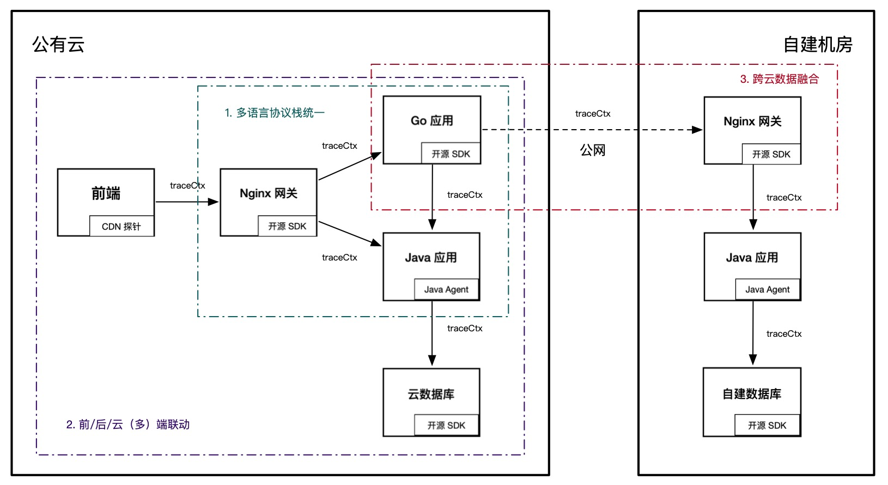
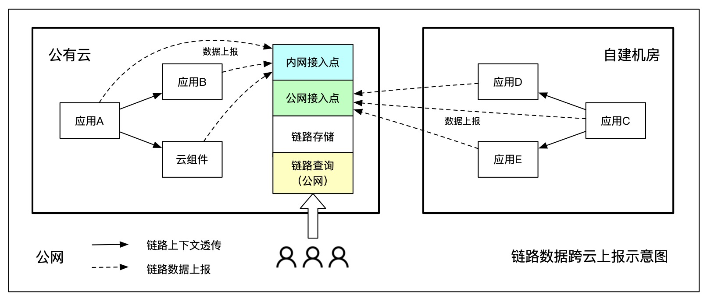
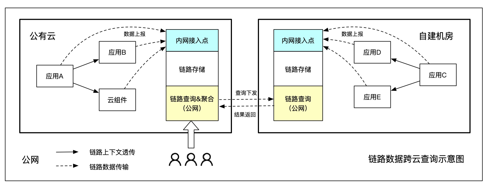
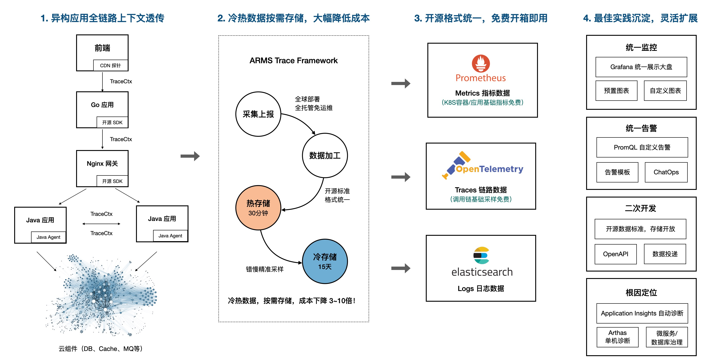
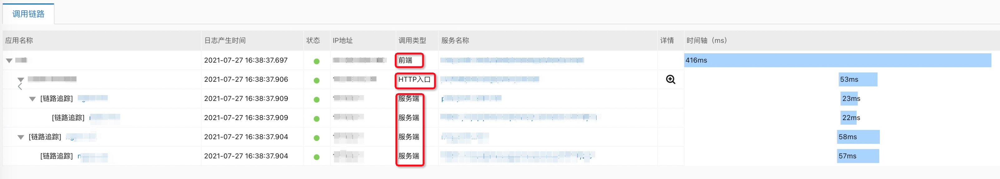

# 前后端、多语言、跨云部署，全链路追踪到底有多难？

> 作者：夏明（涯海）    
> 创作日期：2021-09-23  
> 专栏地址：[【稳定大于一切】](https://github.com/StabilityMan/StabilityGuide)    
> PDF 格式：[前后端、多语言、跨云部署，全链路追踪到底有多难？](https://github.com/StabilityMan/StabilityGuide/blob/master/docs/diagnosis/tracing/pdf/前后端、多语言、跨云部署，全链路追踪到底有多难？.pdf)

## 全链路追踪的价值

**链路追踪的价值在于“关联”，终端用户、后端应用、云端组件（数据库、消息等）共同构成了链路追踪的轨迹拓扑大图。** 这张拓扑覆盖的范围越广，链路追踪能够发挥的价值就越大。而全链路追踪就是覆盖全部关联 IT 系统，能够完整记录用户行为在系统间调用路径与状态的最佳实践方案。

完整的全链路追踪可以为业务带来**三大核心价值：端到端问题诊断，系统间依赖梳理，自定义标记透传。**

- **端到端问题诊断：** VIP 客户下单失败，内测用户请求超时，许多终端用户的体验问题，追根溯源就是由于后端应用或云端组件异常导致的。而全链路追踪是解决端到端问题最有效的手段，没有之一。
- **系统间依赖梳理：** 新业务上线，老业务裁撤，机房搬迁/架构升级，IT 系统间的依赖关系错综复杂，已经超出了人工梳理的能力范畴，基于全链路追踪的拓扑发现，使得上述场景决策更加敏捷、可信。
- **自定义标记透传：** 全链路压测，用户级灰度，订单追溯，流量隔离。基于自定义标记的分级处理&数据关联，已经衍生出了一个繁荣的全链路生态。然而，一旦发生数据断链、标记丢失，也将引发不可预知的逻辑灾难。

## 全链路追踪的挑战与方案
全链路追踪的价值与覆盖的范围成正比，它的挑战也同样如此。为了最大程度地确保链路完整性，无论是前端应用还是云端组件，无论是 Java 语言还是 Go 语言，无论是公有云还是自建机房，都需要遵循同一套链路规范，并实现数据互联互通。**多语言协议栈统一、前/后/云（多）端联动、跨云数据融合是实现全链路追踪的三大挑战**，如下图所示：



### 多语言协议栈统一
在云原生时代，多语言应用架构越来越普遍，利用不同语言特性，实现最佳的性能和研发体验成为一种趋势。但是，不同语言的成熟度差异，使得全链路追踪无法做到完全的能力一致。目前业界的主流做法是，**先保证远程调用协议层格式统一，多语言应用内部自行实现调用拦截与上下文透传**，这样可以确保基础的链路数据完整。

但是，绝大部分线上问题无法仅通过链路追踪的基础能力就能够有效定位并解决，线上系统的复杂性决定了一款优秀的 Trace 产品必须提供更加全面、有效的数据诊断能力，比如代码级诊断、内存分析、线程池分析、无损统计等等。充分利用不同语言提供的诊断接口，最大化的释放多语言产品能力是 Trace 能够不断向前发展的基础。

- 透传协议标准化：全链路所有应用需要遵循同一套协议透传标准，保证链路上下文在不同语言应用间能够完整透传，不会出现断链或上下文缺失的问题。目前主流的开源透传协议包括 Jaeger、SkyWalking、ZipKin 等。
- 最大化释放多语言产品能力：链路追踪除了最基础的调用链功能外，逐步衍生出了应用/服务监控，方法栈追踪，性能剖析等高阶能力。但是不同语言的成熟度导致产品能力差异较大，比如 Java 探针可以基于 JVMTI 实现很多高阶的边缘侧诊断。**优秀的全链路追踪方案会最大化的释放每种语言的差异化技术红利，而不是一味的追求趋同平庸。** 感兴趣的同学可以阅读之前这篇文章[《开源自建/托管与商业化自研 Trace，如何选择》](https://github.com/StabilityMan/StabilityGuide/blob/master/docs/diagnosis/tracing/%E5%BC%80%E6%BA%90%E8%87%AA%E5%BB%BA_%E6%89%98%E7%AE%A1%E4%B8%8E%E5%95%86%E4%B8%9A%E5%8C%96%E8%87%AA%E7%A0%94Trace%EF%BC%8C%E5%A6%82%E4%BD%95%E9%80%89%E6%8B%A9%EF%BC%9F.md)。

### 前后云（多）端联动
目前开源的链路追踪实现主要集中于后端业务应用层，在用户终端和云端组件（如云数据库）侧缺乏有效的埋点手段。主要原因是后两者通常由云服务商或三方厂商提供服务，依赖于厂商对于开源的兼容适配性是否友好。而业务方很难直接介入开发。

​上述情况的直接影响是前端页面响应慢，很难直接定位到后端哪个应用或服务导致的，无法明确给出确定性的根因。同理，云端组件的异常也难以直接与业务应用异常划等号，特别是多个应用共享同一个数据库实例等场景下，需要更加迂回的手段进行验证，排查效率十分低下。

为了解决此类问题，首先需要**云服务商更好的支持开源链路标准，添加核心方法埋点，并支持开源协议栈透传与数据回流**（如阿里云 ARMS 前端监控支持 Jaeger 协议透传与方法栈追踪）。

其次，由于不同系统可能因为归属等问题，无法完成全链路协议栈统一，为了实现多端联动，需要由 Trace 系统提供异构协议栈的打通方案。
​
#### 异构协议栈打通
为了实现异构协议栈（Jaeger、SkyWalking、Zipkin）的打通，Trace 系统需要支持两项能力：一是**协议栈转换与动态配置**，比如前端向下透传了 Jaeger 协议，新接入的下游外部系统使用的则是 ZipKin B3 协议。在两者之间的 Node.js 应用可以接收 Jaeger 协议并向下透传 ZipKin 协议，保证全链路标记透传完整性。二是**服务端数据格式转换**，可以将上报的不同数据格式转换成统一格式进行存储，或者在查询侧进行兼容。前者维护成本相对较小，后者兼容性成本更高，但相对更灵活。

### 跨云数据融合
很多大型企业，出于稳定性或数据安全等因素考虑，选择了多云部署，比如国内系统部署在阿里云，海外系统部署在 AWS 云，涉及企业内部敏感数据的系统部署在自建机房等。多云部署已经成为了一种典型的云上部署架构，但是不同环境的网络隔离，以及基础设施的差异性，也为运维人员带来了巨大的挑战。

由于云环境间仅能通过公网通信，为了实现多云部署架构下的链路完整性，可以采用链路数据跨云上报、跨云查询等方式。无论哪种方式，目标都是实现多云数据统一可见，通过完整链路数据快速定位或分析问题。
​
#### 跨云上报
链路数据跨云上报的实现难度相对较低，便于维护管理，是目前云厂商采用的主流做法，比如阿里云 ARMS 就是通过跨云数据上报实现的多云数据融合。

跨云上报的优点是部署成本低，一套服务端便于维护；缺点是跨云传输会占用公网带宽，公网流量费用和稳定性是重要限制条件。跨云上报比较适合一主多从架构，绝大部分节点部署在一个云环境内，其他云/自建机房仅占少量业务流量，比如某企业 toC 业务部署在阿x云，企业内部应用部署在自建机房，就比较适合跨云上报的方式，如下图所示。



#### 跨云查询
跨云查询是指原始链路数据保存在当前云网络内，将一次用户查询分别下发，再将查询结果聚合进行统一处理，减少公网传输成本。

跨云查询的优点就是跨网传输数据量小，特别是链路数据的实际查询量通常不到原始数据量的万分之一，可以极大地节省公网带宽。缺点是需要部署多个数据处理终端，不支持分位数、全局 TopN 等复杂计算。比较适合多主架构，简单的链路拼接、max/min/avg 统计都可以支持。

跨云查询实现有两种模式，一种是在云网络内部搭建一套集中式的数据处理终端，并通过内网专线打通用户网络，可以同时处理多个用户的数据；另一种是为每个用户单独搭建一套 VPC 内的数据处理终端。前者维护成本低，容量弹性更大；后者数据隔离性更好。



#### 其他方式
除了上述两种方案，在实际应用中还可以采用混合模式或仅透传模式。

混合模式是指将统计数据通过公网统一上报，进行集中处理（数据量小，精度要求高），而链路数据采用跨云查询方式进行检索（数据量大，查询频率低）。

仅透传模式是指每个云环境之间仅保证链路上下文能够完整透传，链路数据的存储与查询独立实现。这种模式的好处就是实现成本极低，每朵云之间仅需要遵循同一套透传协议，具体的实现方案可以完全独立。通过同一个 TraceId 或应用名进行人工串联，比较适合存量系统的快速融合，改造成本最小。

## 全链路追踪接入实践
前文详细介绍了全链路追踪在各种场景下面临的挑战与应对方案，接下来以阿里云 ARMS 为例，介绍一下如何**从 0 到 1 构建一套贯穿前端、网关、服务端、容器和云组件的完整可观测系统。**



- **Header 透传格式：** 统一采用 Jaeger 格式，Key 为 uber-trace-id， Value 为 {trace-id}:{span-id}:{parent-span-id}:{flags} 。
- **前端接入：** 可以采用 CDN（Script 注入）或 NPM 两种低代码接入方式，支持 Web/H5、Weex 和各类小程序场景。
- **后端接入：**
   - **Java 应用推荐优先使用 ARMS Agent**，无侵入式埋点无需代码改造，支持边缘诊断、无损统计、精准采样等高阶功能。用户自定义方法可以通过 OpenTelemetry SDK 主动埋点。
   - **非 Java 应用推荐通过 Jaeger 接入，并将数据上报至 ARMS Endpoint，** ARMS 会兼容多语言应用间的链路透传与展示。

阿里云 ARMS  目前的全链路追踪方案是基于 Jaeger 协议，正在开发 SkyWalking 协议，以便支持 SkyWalking 自建用户的无损迁移。前端、Java 应用与非 Java 应用全链路追踪的调用链效果如下图所示：



### 前端接入实践
ARMS 前端监控支持 Web/H5、Weex、支付宝和微信小程序等，本文以 Web 应用通过 CDN 方式接入 ARMS 前端监控为例，简要说明接入流程，详细接入指南参考 [ARMS 前端监控官网文档](https://help.aliyun.com/document_detail/106086.html)。

1. 登录 [ARMS 控制台](https://arms.console.aliyun.com/)，在左侧导航栏中单击**接入中心**，点击选择前端 Web/H5 接入。
1. 输入应用名称，点击创建；勾选**SDK扩展配置项**区域需要的选项，快捷生成待插入页面的BI探针代码。
1. 选择异步加载，复制下面代码并粘贴至页面HTML中<body>元素内部的第一行，然后重启应用。

```
<script>
!(function(c,b,d,a){c[a]||(c[a]={});c[a].config={pid:"xxx",imgUrl:"https://arms-retcode.aliyuncs.com/r.png?", 
enableLinkTrace: true, linkType: 'tracing'};
with(b)with(body)with(insertBefore(createElement("script"),firstChild))setAttribute("crossorigin","",src=d)
})(window,document,"https://retcode.alicdn.com/retcode/bl.js","__bl");
</script>
```

为了实现前后端链路打通，上述探针代码中必须包含以下两个参数：

1. enableLinkTrace:true  // 表示开启前端链路追踪功能
1. linkType: 'tracing'   // 表示生成 Jaeger 协议格式的链路数据，Hearder 允许 uber-trace-id 透传


另外，如果 API 与当前应用非同源，还需要添加 **enableApiCors: true**   这个参数，并且后端服务器也需要支持跨域请求及自定义header 值，详情参考 [前后端链路关联文档](https://help.aliyun.com/document_detail/91409.html#title-6rx-0lb-p1o)。如需验证前后端链路追踪配置是否生效，可以打开控制台查看对应 API 请求的 Request Headers 中是否有 uber-trace-id 这个标识。
​

### Java 应用接入实践
Java 应用推荐接入 ARMS JavaAgent，无侵入式探针开箱即用，无需修改业务代码，详细接入指南参考 [ARMS 应用监控官网文档](https://help.aliyun.com/document_detail/97924.html)。

1. 登录 [ARMS 控制台](https://arms.console.aliyun.com/)，在左侧导航栏中单击**接入中心**，点击选择后端 Java 接入。
1. 根据需要选择手动安装、脚本安装和容器服务安装任意方式。
1. 根据操作指南确保探针下载并解压至本地，正确配置 appName、LicenseKey 和 javaagent 启动参数后，重启应用。

### 非 Java 应用接入实践
非 Java 应用可以通过开源 SDK（比如 Jaeger）将数据上报至 ARMS 接入点，详细接入指南参考 [ARMS 应用监控官网文档](https://help.aliyun.com/document_detail/118912.html)。

1. 登录 [ARMS 控制台](https://arms.console.aliyun.com/)，在左侧导航栏中单击**接入中心**，点击选择后端 Go/C++/.NET/Node.js 等接入方式。
1. 根据操作指南替换接入点 <endpoint>，配置完成后重启应用。


## 全链路追踪只是开始，不是结束
从 2010 年谷歌发表 Dapper 论文开始，链路追踪已经发展了十多年。但是关于链路追踪的书籍或深度文章一直都比较少，大部分博客只是简单介绍一些开源的概念或 QuickStart，一个大型企业如何建设一套真正可用、好用、易用的链路追踪系统，需要填那些坑，避哪些雷，很难找到比较系统、全面的答案。

全链路追踪接入只是 Tracing 的起点，选择适合自身业务架构的方案，可以避免一些弯路。但链路追踪不仅仅只是看看调用链和服务监控，如何向上赋能业务，衍生至业务可观测领域辅助业务决策？如何向下与基础设施可观测联动，提前发现资源类风险？后面还有很多的工作要做，期待更多同学一起加入分享。


## 推荐产品
- 阿里云 ARMS Trace —— 2021 年 Gartner APM 魔力象限中国唯一入选云厂商([https://help.aliyun.com/document_detail/42781.html)](https://help.aliyun.com/document_detail/42781.html))


## 推荐社区
【稳定大于一切】打造国内稳定性领域知识库，**让无法解决的问题少一点点，让世界的确定性多一点点。**

- GitHub 专栏地址 ([https://github.com/StabilityMan/StabilityGuide)](https://github.com/StabilityMan/StabilityGuide))
- 钉钉交流群号：30000312
- 如果阅读本文有所收获，欢迎分享给身边的朋友，期待更多同学的加入！
