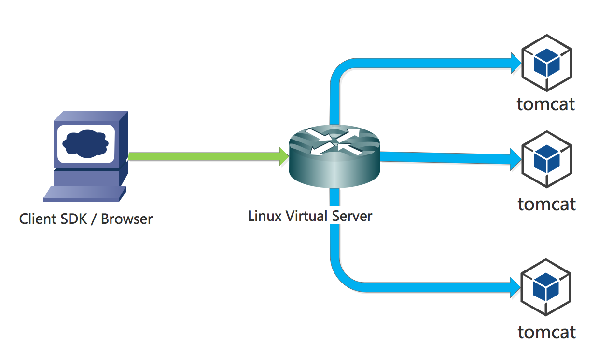
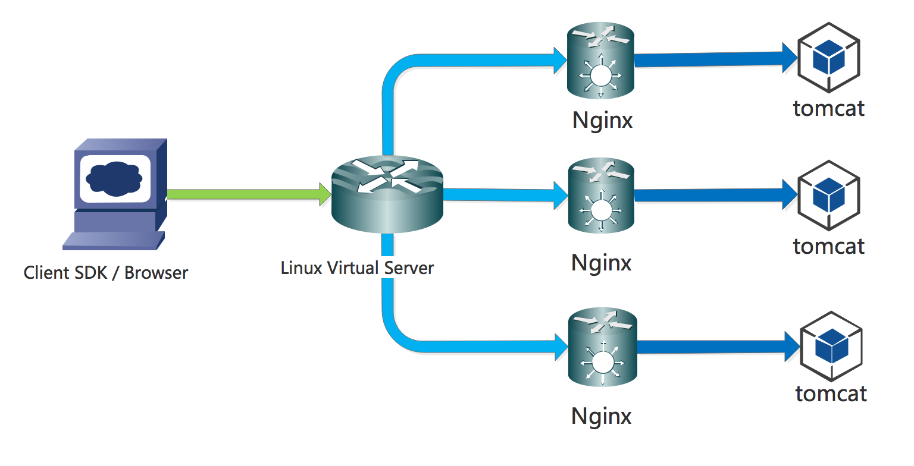
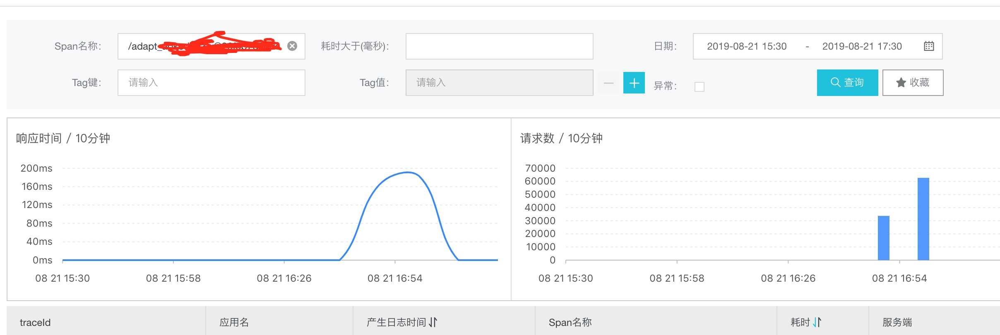
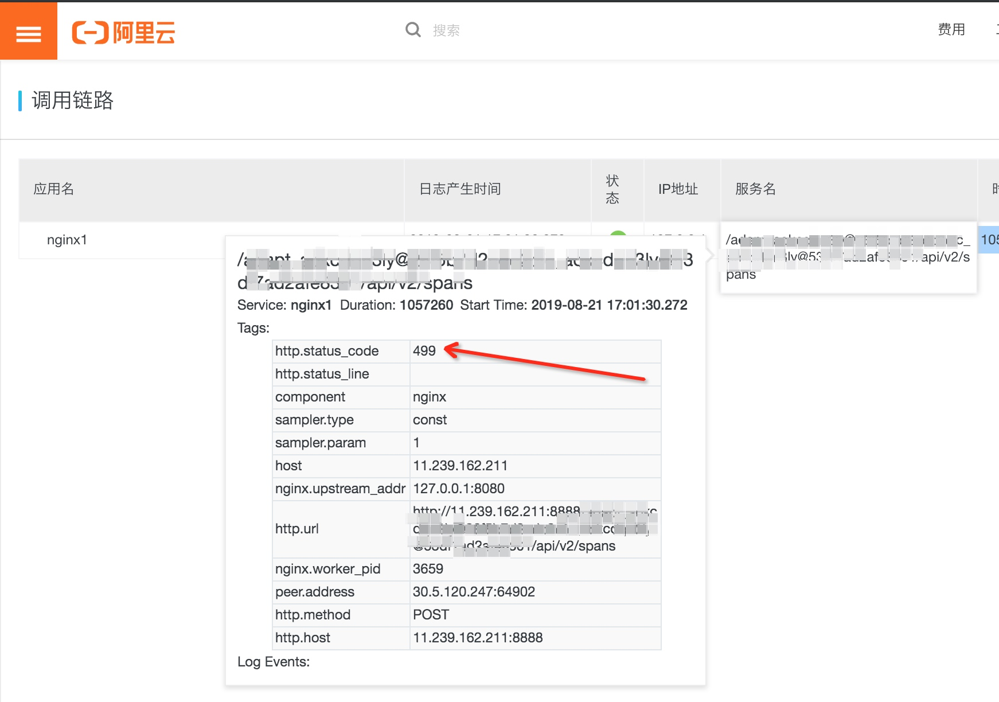
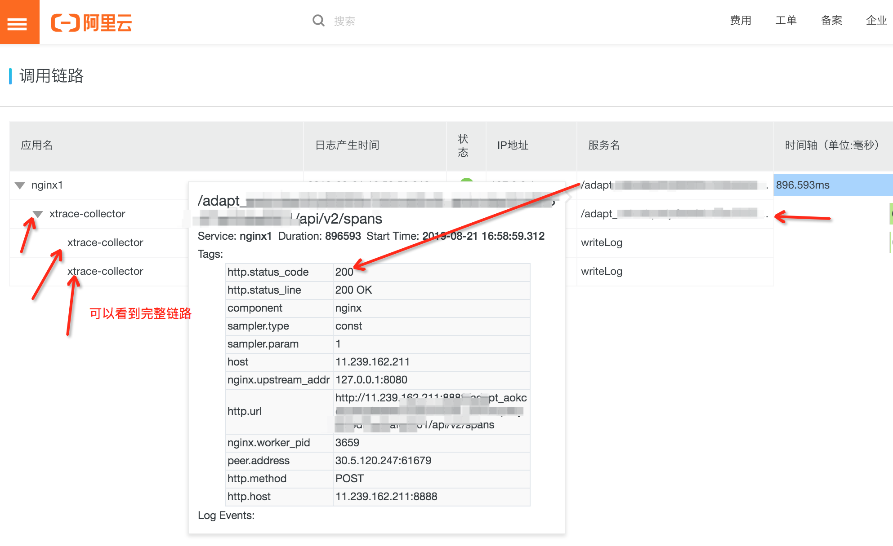
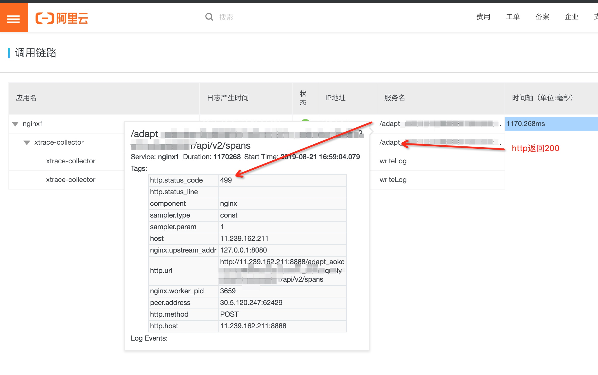
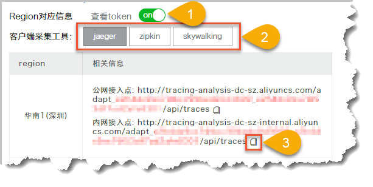

# 如何检测 Web 服务请求丢失问题

> 作者：徐建伟（竹影）  
> 创作日期：2019-08-22  
> 专栏地址：[【稳定大于一切】](https://github.com/StabilityMan/StabilityGuide)   
> PDF 格式：[如何检测Web服务请求丢失问题](https://github.com/StabilityMan/StabilityGuide/blob/master/docs/diagnosis/tracing/pdf/如何检测Web服务请求丢失问题.pdf)

## 目录
- [问题描述](#问题描述)
- [环境准备和问题复现](#环境准备和问题复现)
- [排查过程](#排查过程)
- [总结](#总结)
- [推荐产品 Tracing Analysis](#推荐产品-tracing-analysis)
- [推荐链接](#推荐链接)
- [加入我们](#加入我们)

## 问题描述
最近偶尔有用户反馈某些 HTTP 接口出现超时问题，而web服务端的Trace 监控没有出现http返回值为503等异常情况。出现这种情况一般是web容器出现问题，客户端连接不上来。本文将主要介绍如何去监控这类问题。
   
我们是用典型的 Web 服务架构，应用通过域名访问到我们的 LVS（Linux Virtual Server）机器，LVS 后面对应了多台 Web 服务器。
   

考虑到无法对 LVS 进行跟踪，而 Web 服务器（Tomcat 上出现堆积，无法评估影响范围）。考虑再三后，我们准备在Tomcat 和 LVS 上加一个 Nginx，用于追踪用户访问的真实情况。Nginx 是一款自由、开源的高性能 HTTP 服务器。 通过 Nginx 代码，我们可以掌握第一手的用户访问的真实情况，本来是打算通过 Nginx 的 Access 日志来做统计， 后来参考 [阿里云链路追踪的文档](https://help.aliyun.com/document_detail/126251.html)，用链路追踪可以把 HTTP 的埋点和 Tomcat 连起来看，可以更详情地发现问题。

## 环境准备和问题复现

* 编译安装 Nginx 和 Jaeger Agent，具体的安装过程可以参考 [阿里云链路追踪文档](https://help.aliyun.com/document_detail/126251.html)。

* 测试环境：需要重现超时问题，写了一个小程序，开启 200 个线程，每个线程连续向服务发送 500 个请求。 总共提交 100000 个请求。

## 排查过程
排查的主题思路， 对比Web 服务端数据 和Nginx 服务端的链路统计数据，如果两种的请求数不一致，那可以确定有请求丢失。 再根据链路上的详情数据来确定丢失请求的原因。

### 1. Web 服务端数据统计
发送请求后，发现web服务端一共处理98717个请求，比客户端少了1283个请求。

### 2. Nginx 服务端统计
查看 Nginx 的请求，一共有 100000 个请求，说明 Nginx 收到了全部请求，但是进入到 Web 服务上处理的只有 98717 个请求（通过 javax.servlet.Filter 埋点来监控）。

### 3. 问题分析
检查 Nginx 服务，发现 Nginx 的有些请求的 HTTP 的返回码 499。如下图所示：

对比正常的 HTTP 链路，发现 Nginx 的请求的 HTTP 的返回码 499，只有一个 Span 就返回了，而 HTTP 返回码为 200 的，可以看到完整的调用链路(链路上除了 Nginx 的 Span，还有 Web服务的 Span），如下图展示：

我们可以这样来解释这个问题，客户端流量进入 Web 服务器，如果 Web 服务器处理不过来（超出可承受的最大流量或者 Web 服务器本身可能出现 FullGC，OOM，死锁，线程池慢问题）， 那客户端设置超时的请求将会出现 499，未进入 javax.servlet.Filter 处理，Web 服务端看不到任何访问记录。

那是不是可以认为出现 HTTP 返回值为 499 的请求都是服务端处理失败的请求？
  
### 4. 进一步排查
我们捞取下 Nginx 上返回 499 的请求，总共 2719条，大于 Web 服务丢失的 1283 个请求。 这个数据对不上，是什么原因呢？ 我们在仔细查看了下数据，有 Nginx 返回 499 的请求，但是 Web 服务返回了 200。这些请求进入 Web 服务处理程序，但是 Web 服务还没返回就超时了。如果没有 Tracing 把上下文链接起来，我们很难通过 Nginx 日志或者 Web 服务日志来解释这个问题（一个请求，Nginx 返回 499，而 Web 服务返回 200），如下图所示：

  
把 Nginx 和 Web 容器服务（Tomcat）的链路打通，我们可以查看 HTTP 请求每个环节的状态，很方便地定位问题。

## 总结
针对这种 Web 服务无响应的问题，可以通过加一层代理（Nginx代码），很好的排查问题。同时也很好统计 Web 服务器造成多少请求失败，影响多少用户。对故障定级，影响面可以进行准确的评估。

## 推荐产品 [Tracing Analysis](https://cn.aliyun.com/product/xtrace?spm=5176.10695662.1363645.1.372d49b00YZ583)
1. 登录[链路追踪控制台](https://tracing-analysis.console.aliyun.com/#/overview)，在概览页面上打开 查看 Token 开关。
2. 单击需要使用的链路数据采集客户端（Jaeger 或 Zipkin）按钮。
3. 在下方表格中相应地域的 相关信息 Trace 列中，单击接入点信息末尾的复制按钮。

提示： 如果应用部署于阿里云生产环境，则选择内网接入点，否则选择公网接入点。对于 Zipkin，一般情况下请使用 v2 版接入点，v1 版接入点仅限对 Zipkin 十分了解的高阶用户使用。

## 推荐链接
* [使用 Jaeger 或 Zipkin 对 Nginx 进行链路追踪](https://help.aliyun.com/document_detail/126251.html)
* [通过 Jaeger 追踪 Java 应用链路数据](https://help.aliyun.com/document_detail/90501.html)
* [nginx-opentracing 项目](https://github.com/opentracing-contrib/nginx-opentracing?spm=a2c4g.11186623.2.19.24dd2b5dL3OtQr)
* [jaeger-client-cpp 项目](https://github.com/jaegertracing/jaeger-client-cpp?spm=a2c4g.11186623.2.20.24dd2b5dL3OtQr)
* [zipkin-cpp-opentracing](https://github.com/rnburn/zipkin-cpp-opentracing?spm=a2c4g.11186623.2.21.24dd2b5dL3OtQr)

## 加入我们
【稳定大于一切】打造国内稳定性领域知识库，**让无法解决的问题少一点点，让世界的确定性多一点点**。

* [GitHub 地址](https://github.com/StabilityMan/StabilityGuide)
* 钉钉群号：
	* 30000312（2群，推荐）
	* 23179349（1群，已满）
* 如果阅读本文有所收获，欢迎分享给身边的朋友，期待更多同学的加入！
