# 开源自建/托管与商业化自研 Trace，如何选择？

> 作者：夏明（涯海）    
> 创作日期：2021-08-18  
> 专栏地址：[【稳定大于一切】](https://github.com/StabilityMan/StabilityGuide)  
> PDF 格式：[开源自建/托管与商业化自研 Trace，如何选择？](https://github.com/StabilityMan/StabilityGuide/blob/master/docs/diagnosis/tracing/pdf/开源自建_托管与商业化自研Trace，如何选择？.pdf)

随着微服务架构的兴起，服务端的调用依赖愈加复杂，为了快速定位异常组件与性能瓶颈，接入分布式链路追踪 Trace 已经成为 IT 运维领域的共识。但是，**开源自建、开源托管或商业化自研 Trace 产品之间到底有哪些差异，我该如何选择？** 这是许多用户在调研 Trace 方案时都会遇到的疑问，也是最容易混淆的误区。
​

为了搞清楚这个问题，我们需要从两方面入手，**一是梳理线上应用的核心风险与典型场景。二是对比开源自建、托管与商业化自研三种 Trace 方案的能力差异**。所谓“知己知彼，百战不殆”，只有结合自身实际情况，才能选择出最适合的方案。
​

## “两类风险”与“十大典型问题”
**线上应用风险主要分为“错”、“慢”两大类**。其中 **“错”的原因通常是程序运行不符合预期**， 比如 JVM 加载了错误版本的类实例，代码进入异常分支，环境配置错误等。而 **“慢”的原因通常是资源不足**，比如突发流量导致 CPU 打满，微服务或数据库线程池被耗尽，内存泄漏导致持续 FGC 等等。
​

无论是“错”问题，还是“慢”问题。从用户的角度，都是希望能够快速定位根因，及时止损，并消除隐患。但是，根据作者五年多的 Trace 开发、运维与双十一大促备战经验来看，**绝大部分线上问题是无法仅通过链路追踪的基础能力就能够有效定位并解决的。** 线上系统的复杂性决定了一款优秀的 Trace 产品必须提供更加全面、有效的数据诊断能力，比如代码级诊断、内存分析、线程池分析等；同时，为了提高 Trace 组件的易用性和稳定性，还需要提供动态采样、无损统计、接口名称自动收敛等能力。这也是为什么业界主流 Trace 产品都在逐步向 APM、应用可观测领域升级。为了方便理解，本文仍然以 Trace 来统一表述应用层的可观测能力。
​

综上所述，线上应用为了保障最终的业务稳定性，在做链路追踪方案选型时，除了 Trace 通用基础能力外（如调用链、服务监控、链路拓扑），还可以参考下面列举的“十大典型问题”（以 Java 应用为例），综合对比开源自建、开源托管与商业化自研 Trace 产品的差异化表现。

#### 1.【代码级自动诊断】接口偶发性超时，调用链只能看到超时接口名称，看不到内部方法，无法定位根因，也难以复现，怎么办？
负责稳定性的同学应该对这种场景不陌生：系统在夜间或整点大促时会出现偶发性的接口超时，等到发现问题再去排查时，已经丢失了异常现场，并且难以复现，无法通过手动 jstack 来诊断。 而目前开源的链路追踪实现一般只能通过调用链看到超时的接口，具体是什么原因，哪段代码导致的异常始终无法定位，最后只能不了了之。上述场景重复上演直至酿成故障，最终蒙受巨大的业务损失。
​

为了解决上述问题，需要一种精准、轻量级的慢调用自动监听功能，**无需事先埋点，就能够真实还原代码执行的第一现场，自动记录慢调用的完整方法栈。** 如下图所示，当接口调用超过一定阈值（比如2秒），会启动对该次慢请求所在线程的监听，直至该次请求在第 15秒结束后立即停止监听，精准保留该次请求生命周期内所在线程的快照集，并还原完整的方法栈及耗时。
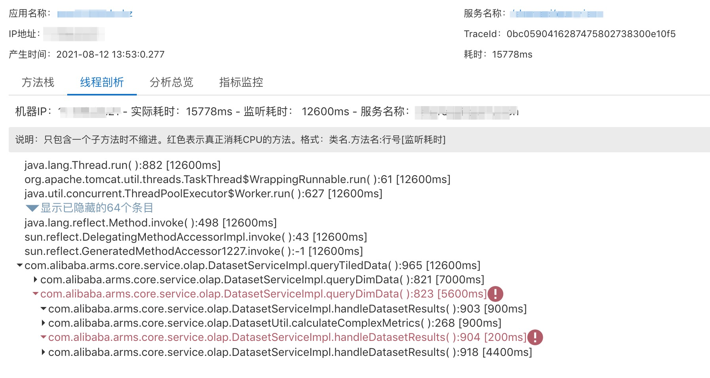
#### 2.【池化监控】微服务/数据库线程池经常被打满，导致服务超时，排查起来非常困难，如何解决？
微服务/数据库线程池满导致业务请求超时，这类问题每天都在频繁发生。具备丰富诊断经验的同学，会有意识的查看对应的组件日志，比如 Dubbo 在线程池满的情况下会输出相关的异常记录。但是，如果组件没有输出线程池信息，或者运维同学排查经验不够丰富，这类问题就会变得非常棘手。目前，开源版本 Trace 一般只提供 JVM 概览监控，无法具体查看每个线程池的状态，更无法判断线程池是否耗尽。
​

**而商业化自研 Trace 提供的池化监控可以直接看到指定线程池的最大线程数、当前线程数、活跃线程数等**，线程池耗尽或高水位风险一览无余。此外，还可以设置线程池使用百分比告警，比如设置 Tomcat 线程池当前线程数超过最大线程数 80% 就提前短信通知，达到 100% 时电话告警。 
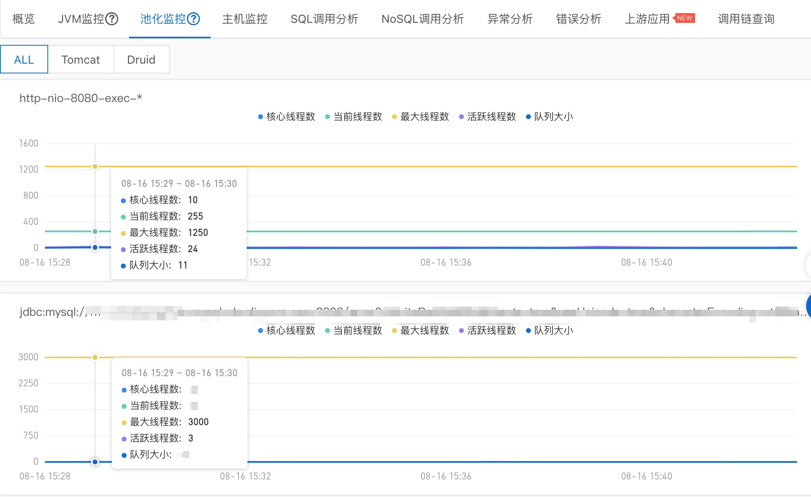

#### 3.【线程分析】大促压测/发布变更后，发现 CPU 水位非常高，如何分析应用性能瓶颈点，针对性优化？
我们在做大促压测，或者大版本变更（包含很多代码逻辑）时，会遇到 CPU 水位突然变得很高，但是又无法清晰的定位是哪一段代码导致的，只能不停的做 jstack，肉眼比对线程状态变化，然后根据经验不断进行优化尝试，最终消耗了大量的精力，效果却一般般。
​

那么有没有快速分析应用性能瓶颈的方法呢？答案必须是有，而且不止一种。最常见的就是手动触发一次持续一段时间（比如 5min） ThreadDump，然后分析这段时间内的线程开销与方法栈快照。**手动触发 ThreadDump 的缺陷就是性能开销比较大，无法常态化运行，不能自动保留已发生的现场快照**。比如压测期间 CPU 高，等到压测结束复盘时，现场已经不在了，手动 ThreadDump 已经来不及了。
​

第二种就是**提供常态化线程分析功能，能够自动记录每类线程池的状态、数量、CPU 耗时和内部方法栈**。在任意时间段内，点击按 CPU 耗时排序，就可以定位 CPU 开销最大的线程类别，然后点击方法栈，可以看到具体的代码卡点，如下图所示**有大量 BLOCKED 状态的方法卡在数据库连接获取，可以通过调大数据库连接池来优化。**

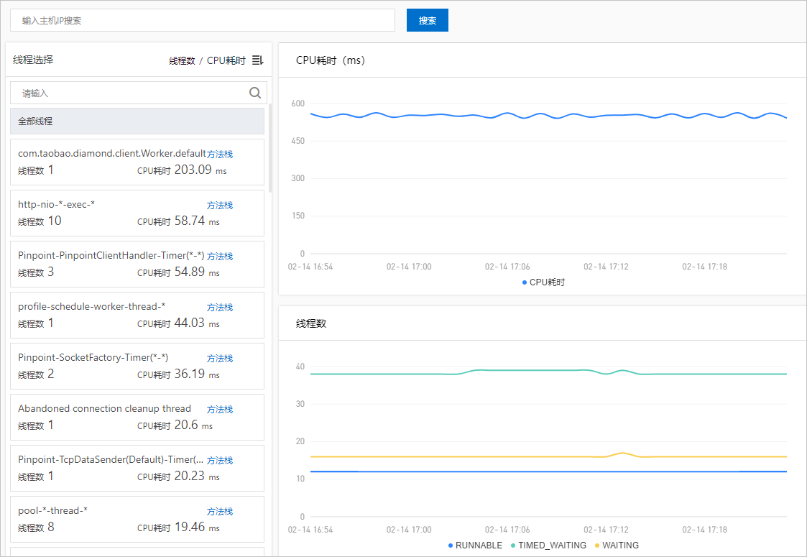
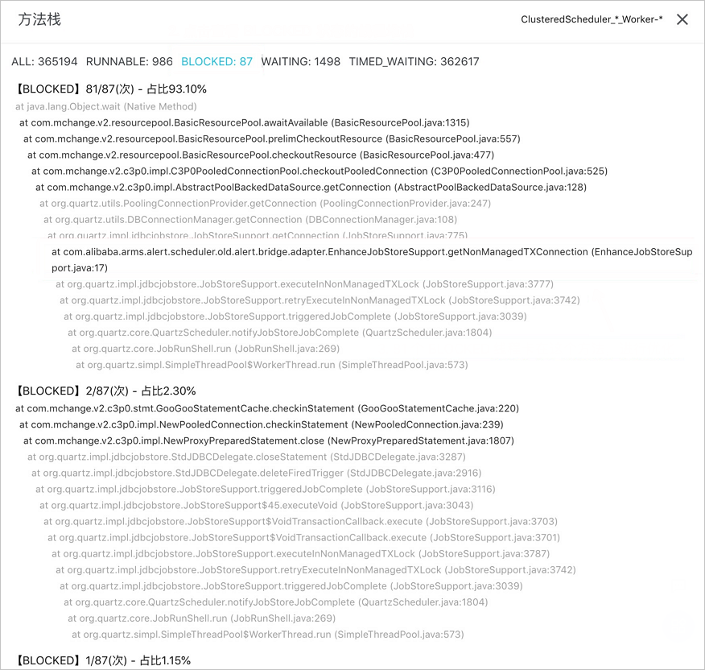

#### 4.【异常诊断】执行发布/配置变更后，接口大量报错，但无法第一时间定位原因，造成业务故障？
影响线上稳定性的最大“元凶”就是变更，无论是应用发布变更，还是动态配置变更，都可能引起程序运行出现异常。那么，如何快速判断变更风险，第一时间发现问题，及时止损呢？
​

在这里，分享一个阿里内部发布系统的异常发布拦截实践，其中最重要的监测指标之一，就是 Java Exception/Error 的异常数比对。无论是 NPE（NullPointException），还是 OOM（OutOfMemoryError），基于全部/特定异常数的监控与告警，可以快速发现线上异常，特别是变更时间线前后要尤为注意。
​

独立的异常分析诊断页面，可以查看**每一类异常的变化趋势与堆栈详情，还可以进一步查看关联的接口分布**，如下图所示。

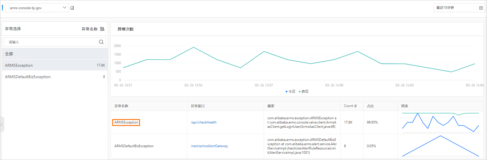
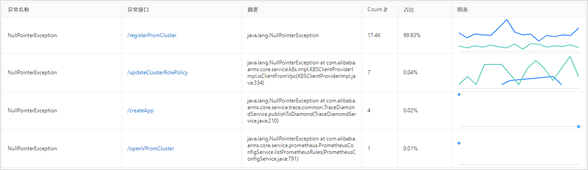

#### 5.【内存诊断】应用频繁 FGC，怀疑有内存泄漏，但无法定位异常对象，怎么办？
FullGC 绝对是 Java 应用最常见问题之一，对象创建过快、内存泄漏等各种原因都会导致 FGC。而排查 FGC 最有效的手段就是执行堆内存 HeapDump。各种对象的内存占用一目了然，清晰可见。
​

白屏化的内存快照功能，**可以指定机器执行一键 HeapDump 与分析，大幅提升内存问题的排查效率**，还支持内存泄漏场景下自动 Dump 保存异常快照现场，如下图所示：

#### 6.【在线调试】同一份代码，线上运行态与本地调试行为不一致，该如何排查？
本地调试通过的代码，一发到生产环境就各种报错，到底哪里出了问题？相信开发同学都经历过这样的噩梦。而导致这种问题的原因有很多，比如 Maven 依赖多版本冲突，不同环境动态配置参数不一致，不同环境依赖组件差异等等。
​

为了解决线上运行代码不符合预期的问题，我们需要一款在线调试诊断工具，能够**实时查看当前程序运行态的源代码、出入参、执行方法栈与耗时、静态对象或动态实例的值**等等，让在线调试就像本地调试一样方便，如下图所示：

#### 7.【全链路追踪】用户反馈网站打开非常慢，如何实现 Web 端到服务端的全链路调用轨迹追踪？
前后端全链路打通的关键在于遵循同一套透传协议标准，目前开源仅支持后端应用接入，缺少前端埋点（如 Web/H5、小程序等）。前后端全链路追踪方案如下图所示：

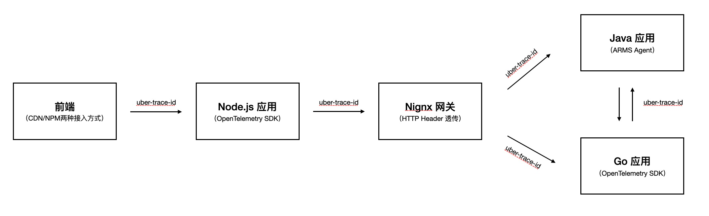

- **Header 透传格式：** 统一采用 Jaeger 格式，Key 为 uber-trace-id， Value 为 {trace-id}:{span-id}:{parent-span-id}:{flags} 。
- **前端接入：** 可以采用 CDN（Script 注入）或 NPM 两种低代码接入方式，支持 Web/H5、Weex 和各类小程序场景。
- **后端接入：**
   - **Java 应用推荐优先使用 ARMS Agent**，无侵入式埋点无需代码改造，支持边缘诊断、无损统计、精准采样等高阶功能。用户自定义方法可以通过 OpenTelemetry SDK 主动埋点。
   - **非 Java 应用推荐通过 Jaeger 接入，并将数据上报至 ARMS Endpoint，** ARMS 会完美兼容多语言应用间的链路透传与展示。

阿里云 ARMS  目前的全链路追踪方案是基于 Jaeger 协议，正在开发 SkyWalking 协议，以便支持 SkyWalking 自建用户的无损迁移。前端、Java 应用与非 Java 应用全链路追踪的调用链效果如下图所示：

#### 8.【无损统计】调用链日志成本太高，开启客户端采样后，监控图表就不准了，如何解决？
调用链日志是与流量是正相关的，To C 类业务的流量非常大，调用链全量上报与存储的成本会非常高，但是如果开启客户端采样后，又会面临统计指标不准确的问题，比如采样率设置为 1%，一万次请求仅会记录其中一百条，根据这一百条日志聚合出来的统计数据会导致严重的样本倾斜问题，无法精确反映实际服务流量或耗时。
​

为了解决上述问题，我们需要支持在**客户端 Agent 进行无损统计**，同一个指标在一段时间内（通常为15秒）不论请求多少次，都只会上报一条数据。这样统计指标的结果就始终是精准的，不会受到调用链采样率的影响。用户可以放心的调整采样率，调用链成本最多可降低 90% 以上。**流量和集群规模越大的用户，成本优化效果越显著。**

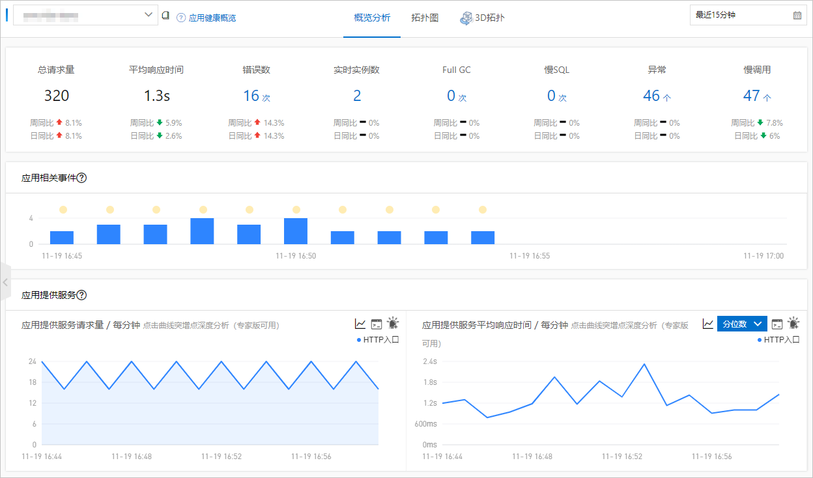

#### 9.【接口名称自动收敛】RESTFul 接口由于时间戳、UID等参数导致 URL 名称发散，监控图表都是无意义的断点，如何解决？
当接口名称中存在时间戳、UID等可变参数时，会导致同一类接口的名称各不相同，且出现次数极少，不具备监控价值，并对存储/计算造成热点，影响集群稳定性。此时，我们就需要对发散的接口进行分类聚合，以提高数据分析价值和集群稳定性。
​

此时，我们需要提供一种**针对接口名称的自动收敛算法，可以主动识别可变参数，将同一类接口进行聚合，观察类别变化趋势**，更符合用户监控诉求；同时避免了接口发散导致的数据热点问题，提升了整体的稳定性与性能。如下图所示：/safe/getXXXInfo/xxxx  都会被归为一类，否则每一条请求都是一张只有一个数据点的图表，用户可读性会变的很差。

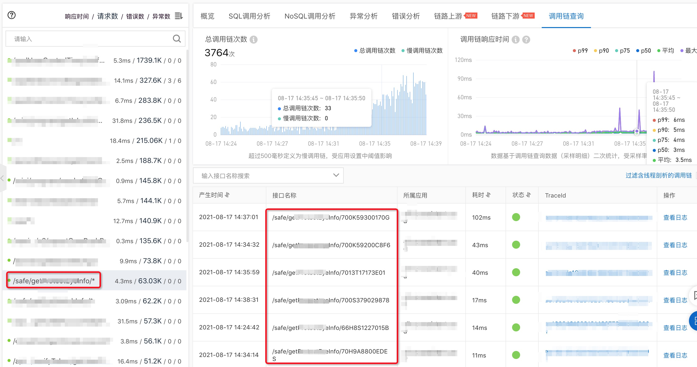

#### 10.【动态配置下发】线上突发流量导致资源不足，需要立即对非核心功能进行降级，如何在不重启应用的情况下实现动态降级或调优？
意外总是突如其来的，流量突发、外部攻击、机房故障都可能会导致系统资源不足，为了保住最重要的核心业务不受影响，我们往往需要在不重启应用的场景下，动态降级一些非核心功能释放资源，比如调低客户端调用链采样率，关闭一些性能开销较大的诊断模块等。与此相反，有些时候我们需要动态开启一些高开销的深度诊断功能，以分析当下的异常现场，比如内存 Dump。
​

无论是动态降级还是动态开启，都需要在不重启应用的前提下进行动态配置下推。而开源 Trace 通常不具备这样的能力，需要自行搭建元数据配置中心并进行相应的代码改造。而商业化 Trace **不仅支持动态配置下推，还可以细化到每个应用独立配置**，比如应用 A 存在偶发性慢调用，可以开启自动慢调用诊断开关进行监听；而应用 B 耗时对 CPU 开销比较敏感，可以关闭此开关；两个应用各取所需，互不影响。

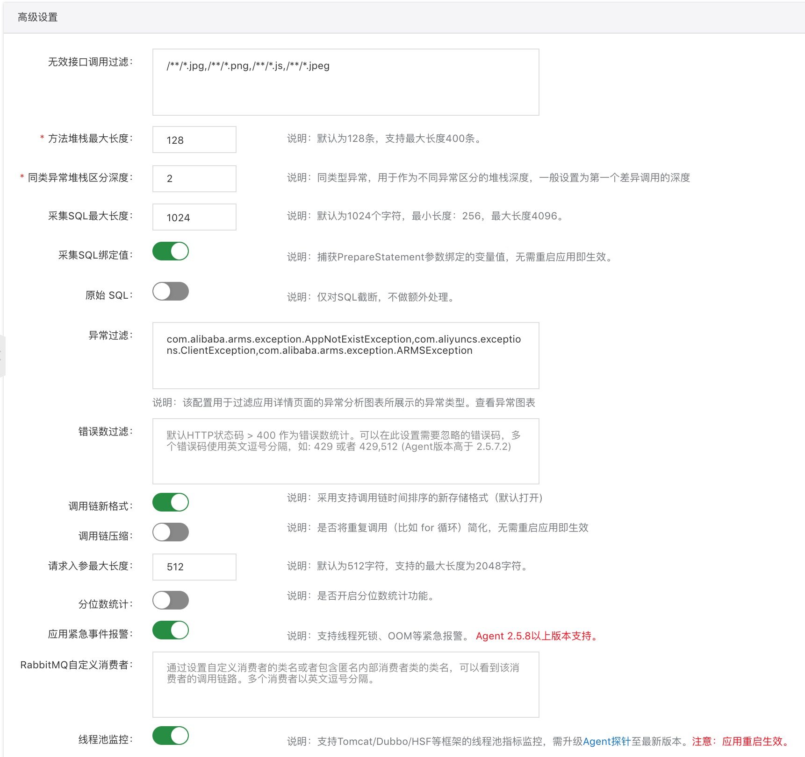

## 开源自建 vs. 开源托管 vs. 商业化自研

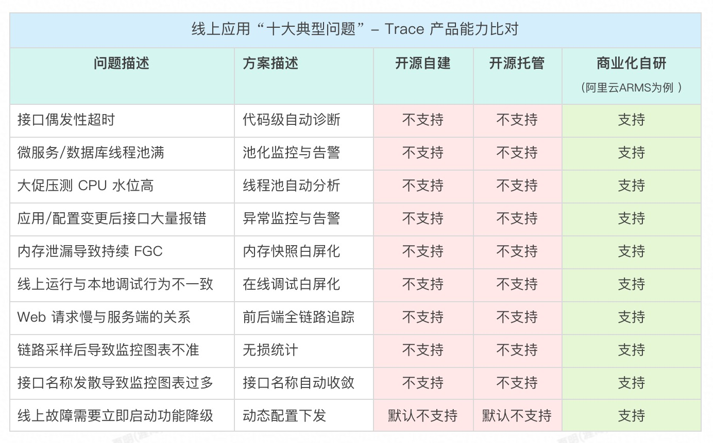

上面列举的生产环境“十大典型问题”都是目前开源自建或托管 Trace 产品暂未解决的。其实开源方案有很多优秀的特性，比如广泛的组件支持，多语言方案统一，灵活的数据/页面定制化等等。但是，**开源不是灵丹妙药，生产环境也不是试验田**。涉及线上稳定性这条生命线，我们必须谨慎评估，深入调研不同方案的优劣，不能仅停留在通用基础能力的比对，这会为后面的应用推广带来巨大的隐患。
​

限于篇幅限制，本文仅通过 10个典型问题场景分析了开源自建/托管方案的不足，强调 **Trace 并不简单，忽视了这一点，商业化自研产品踩过的坑，你可能会被迫重新体验**。这就好比做互联网电商，不是在网上开个店铺就结束了，产品打磨、流量拓展、用户转化、口碑运营等等一系列复杂的环节隐藏在背后，贸然进入可能会赔的很惨。
​

那么开源自建/托管具备哪些优势？它们与商业化自研 Trace 产品在产品功能、资源/人力成本、二次开发、多云部署、稳定性、易用性等全方位的对比分析，就留待下一篇《开源自建、开源托管与商业化自研 Trace 产品全方位分析》，敬请关注。
​

## 推荐产品
* [阿里云 ARMS —— 2021 年 Gartner APM 魔力象限中国唯一入选云厂商](https://help.aliyun.com/document_detail/42781.html)

## 加入我们
【稳定大于一切】打造国内稳定性领域知识库，**让无法解决的问题少一点点，让世界的确定性多一点点**。

* [GitHub 地址](https://github.com/StabilityMan/StabilityGuide)
* 钉钉群号：23179349
* 如果阅读本文有所收获，欢迎分享给身边的朋友，期待更多同学的加入！

