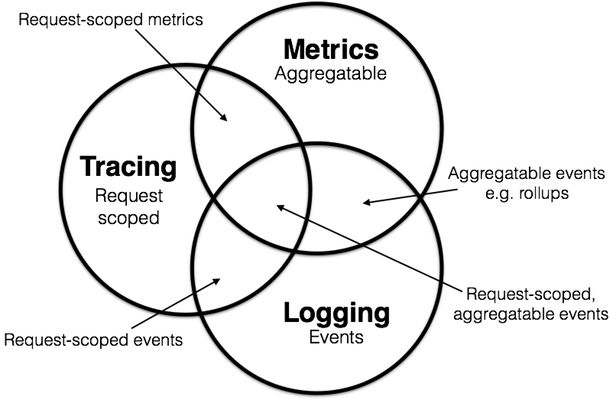
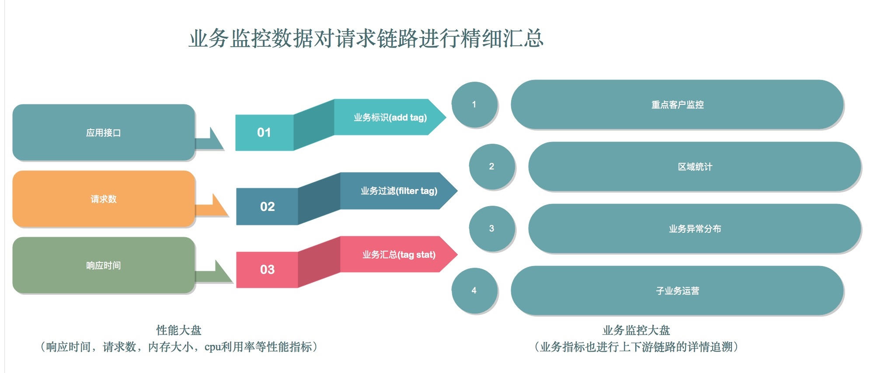
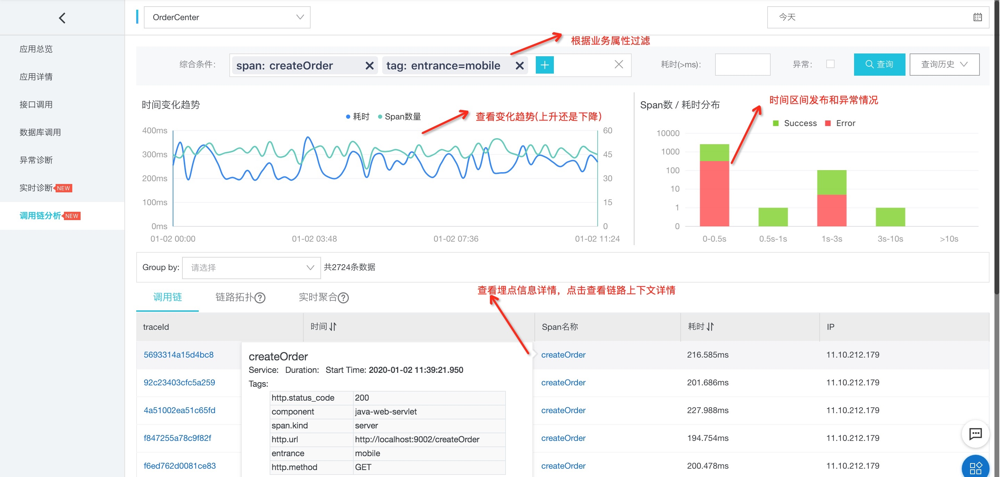
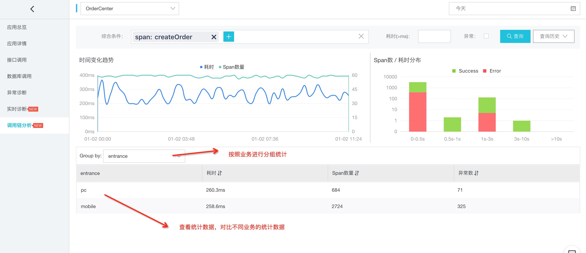
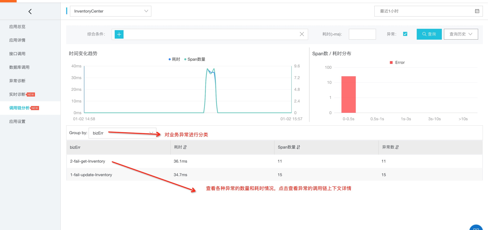
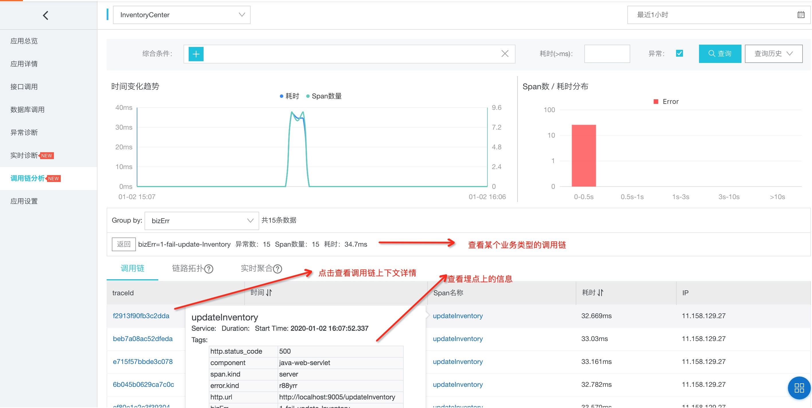

# 让可观察性带上导航，快速发现和定位业务问题：OpenTracing 上写入业务信息

> 作者：徐建伟（竹影）    
> 创作日期：2020-01-02  
> 专栏地址：[【稳定大于一切】](https://github.com/StabilityMan/StabilityGuide)  
> PDF 格式：[让可观察性带上导航，快速发现和定位业务问题：OpenTracing 上写入业务信息](https://github.com/StabilityMan/StabilityGuide/blob/master/docs/diagnosis/tracing/pdf/让可观察性带上导航，快速发现和定位业务问题：OpenTracing上写入业务信息.pdf)

## 引言

在可观察性领域，[Metrics，Tracing 和 Logging](http://peter.bourgon.org/blog/2017/02/21/metrics-tracing-and-logging.html?spm=a2c63.p38356.879954.8.32bf71fe7wRiQK) 的介绍由来已久。三种之间的边界越来越模糊。 OpenTracing 中已经支持 LogEvent，OpenTelemetry 已经把 OpenMetric 和 OpenTracing 整合到一块。今天我们要介绍的链路追踪的业务分析功能，通过对链路数据进行聚合统计，可以查看各种业务报表。




## 目录
- [为什么需要业务分析关联链路数据](#为什么需要业务分析关联链路数据)
- [业务分析概述](#业务分析概述)
- [业务分析的实现方式](#业务分析的实现方式)
- [对链路数据进行业务分析](#对链路数据进行业务分析)
- [业务分析的一些使用场景案例](#业务分析的一些使用场景案例)
- [业务大盘](#业务大盘)
- [和传统的统计不同点](#和传统的统计不同点)
- [总结](#总结)
- [推荐项目](#推荐项目)
- [加入我们](#加入我们)


## 为什么需要业务分析关联链路数据
精细化分析，全链路数据，快速发现和定位问题。  

在传统的 APM 分析中，主要是关注各种接口的响应时间，对业务不够贴切，这样会带来一些问题：

* 发现问题

	同一个接口被很多业务方调用，某一个重要业务调用出了问题，由于这个业务占比不高，无法通过平均数或者 p90 分析出来。 例如创建订单中重要客户，这些客户订单占比不高，但是重要性比较高，需要重点分析和监控。
   
* 排查定位问题
   
  某些用户反馈下单或者付款出现问题，但是这种情况只存在少量用户，重现比较困难。如果把用户的异常和链路关联起来，分析异常用户的链路数据，比如出入参数，用户属性等，可以发现一些线索。 例如查看用户id对应的失败订单，分析订单上链路，发现失败订单的来源都是某个旧版的客户端调用。

## 业务分析概述
在介绍业务分析功能之前，先简单提两个问题，大家发散思考下怎么解决这两个问题。

1. 某个应用的对外接口流量突增，是不是由于某个用户或者地域流量暴涨？
2. 应用出现比较多空指针异常，这些异常对业务有多大的影响？

通用的监控系统主要是对操作系统，分布式调用，数据库组件进行监控。如果对业务监控，那就需要开发同学对调用链埋点添加业务属性（用 tag 来记录各种业务属性）。通过对 tag 标签进行过滤和统计聚合，达到业务分析和监控的效果。



## 业务分析的实现方式
业务分析是在链路上标注一些业务数据，以下我们用 Jaeger 和 Skywalking 为例子讲解业务埋点。

### Jaeger 中添加 Tag 信息

以 Java 语言为例，

```
// 获取业务中的用户Id
String userId = ****;
Tracer tracer = GlobalTracer.get();
if (tracer != null && tracer.activeSpan() != null) {
  // 将 UserId以 Tag 的形式存放到链路中
  tracer.activeSpan().setTag("userId", userId);
}
```

### Skywalking 中添加 Tag 信息

* 不插入代码的方式

https://github.com/apache/skywalking/blob/master/docs/en/setup/service-agent/java-agent/Customize-enhance-trace.md

```
<class class_name="test.apache.skywalking.testcase.customize.service.TestService2">
     <method method="staticMethod(java.lang.String,int.class)" operation_name="/is_2_static_method" static="true">
          <tag key="tag_2_1">arg[0]</tag>
          <log key="log_1_1">arg[1]</log>
     </method>
</class>
```

* 用 OpenTracing 插入代码方式

```
// global tracer object
private static Tracer tracer = new SkywalkingTracer();
...
 if (tracer != null && tracer.activeSpan() != null) {
      tracer.activeSpan().setTag("userId", yourUserId);
  }
```

* Java 代码方式

```java
ActiveSpan.tag("userId", yourUserId);
```

* Java 注解方式

```java
@Tag(key = "userId", value = "arg[0]")
@Tag(key = "requestId", value = "arg[1]")
public someMethod(final String userId, final String requestId) {
    // ...
}
```


## 对链路数据进行业务分析
Tag 信息就好比给图书打上编号分类信息，让我们可以在图书馆海量的图书中找到我们需要图书。 通过 Tag 来进行分类、查找、统计，可以快速找到我们需要的数据。

* 业务标签的过滤

	可以通过筛选 Tag 进行过滤，寻找所需要的链路。 如下图，查看手机端下单的请求的变化趋势，详情等。

    

* 业务标签的聚合

	指定 Tag 进行聚合，分析 Tag 聚合的统计。 如下图 查看每个入口（PC 和 Mobile）的请求数，响应时间，异常查询。 可以识别是不同业务的对比情况。

    


## 业务分析的一些使用场景案例
Tag 功能主要是业务开发同学用来进行业务监控的， 通过在链路上写入 Tag，可以把业务和链路打通，从而很好的发现，定位，跟踪问题。  

我们接下来做一些业务场景举例

* 业务异常分析

	生成订单时，会调用优惠，库存，物流，商品等系统接口。这些接口都有可能会返回异常，有些异常有些比较重要，有些只是用于展示。我们怎么快速识别当前应用的异常严重程度呢？可以通过加tag的方式来实现。 我们对异常进行分 1～5 级，1 级表示非常严重。  
	
	那我们每次调用远程接口完成后，对返回的异常添加 Tag，例如调用优惠时返回系统异常加 Tag：
` tracer.activeSpan().setTag("bizErr", “1-PromotionSysExcep”); ` ，调用库存返回库存不足，可以添加`tracer.activeSpan().setTag("bizErr", “5-InventoryNotEmpty”);`

  那么通过 Tag `bizErr` 进行聚合，对数量进行排序下，如果 `1-**` 开头的比较多，那表示当前系统比较严重，需要紧急处理。 查看这些异常链路的请求参数或者返回值，我们可以快速定位问题。
  
   
   


* 用户分析

	将 UserId 用 Tag 方式写入到 Span 中，可以统计到没有用户的数据，例如访问量，响应时间。 我们之前遇到一个问题，Web 的流量突然变大，响应比较慢。从监控来看流量比较大，但为什么流量会比较大呢，通过 UserId 分组统计后，发现某个用户的流量暴涨，导致整个后台响应比较慢，对这个用户进行限流后，web流量和相应时间恢复正常。
  
    

## 业务大盘
中台系统中各个业务的创建订单大盘。  

在中台应用中，各个业务使用同一个交易系统，通过订单中的一个业务类型字段来区分不同的业务。通过在链路上的标签，可以查看到不同业务线的下单成功和失败曲线。比如大盘上可以展示天猫，聚划算，盒马生鲜等业务的订单情况。一旦有异常就可以分析链路的明细信息来查找原因。

## 和传统的统计不同点
传统的 ELK 方式，用户通过插入代码，将业务的属性都打到日志里面。通过数据聚合，可以生成各种 Metrics，添加告警等。这样做监控是合适的，但是需要更深层次的挖掘问题的话，还需要和链路打通。将监控的内容上下游的信息都串起来，可以更方便的定位问题。  

比如：更新库存失败，发现异常都是上游某个业务的某台机器上，而这条机器是灰度机器，使用了非稳定版本的。

## 总结
业务排查的问题方式有很多种，调用链和业务信息打通已经是一种行之有效的方法。通过在调用链写入业务信息，将会给调用链配上显微镜，快速发现隐藏在链路数据中的各种问题。而业务数据关联调用链，也给业务排查插上翅膀，从链路的上下文信息中快速找到线索。


## 推荐链接
* [链路追踪 TracingAnalysis](https://help.aliyun.com/product/90275.html)


## 加入我们
【稳定大于一切】打造国内稳定性领域知识库，**让无法解决的问题少一点点，让世界的确定性多一点点**。

* [GitHub 地址](https://github.com/StabilityMan/StabilityGuide)
* 钉钉群号：
	* 30000312（2群，推荐）
	* 23179349（1群，已满）
* 如果阅读本文有所收获，欢迎分享给身边的朋友，期待更多同学的加入！
