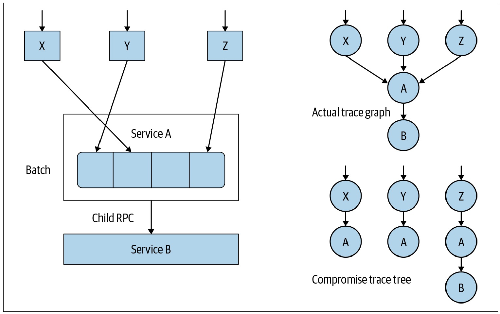
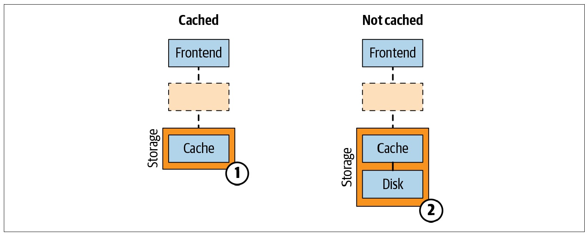
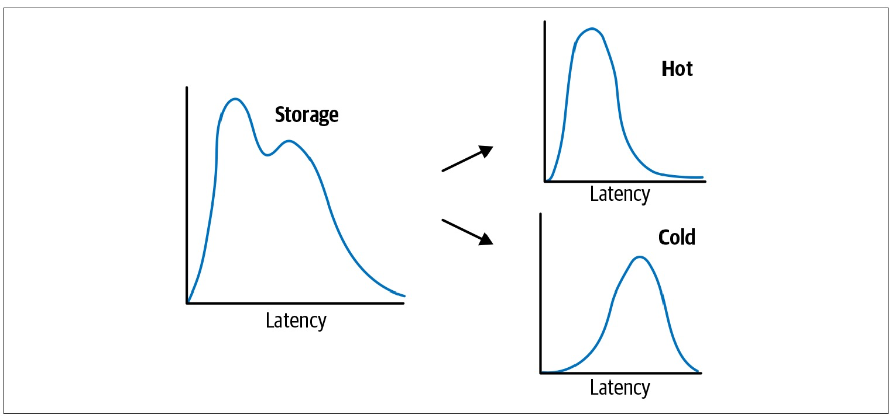

# 链路追踪（Tracing）其实很简单——分布式链路追踪的挑战与限制

> 作者：夏明（涯海）    
> 创作日期：2022-07-14  
> 专栏地址：[【稳定大于一切】](https://github.com/StabilityMan/StabilityGuide)  

作为一门新兴技术，分布式链路追踪的技术演进史并不算长，仅有十数年。目前，它仍处于不断被探索、快速迭代的周期。为了更好的了解与应用分布式链路追踪技术，我们来看下它目前面临的几项关键挑战与限制。

## 关键挑战与应对
分布式链路追踪技术从诞生到大规模应用，中间经历了一段较长的蛰伏期，直到近几年才逐渐被大家广泛接受和认可。影响其快速推广的关键挑战包括如下几点：

* **前期建设成本高：** 无论是在不同组件接口上进行插桩埋点，还是保证链路上下文能够正确传播，亦或是搭建一套稳定可靠的链路数据后端处理系统，都不是一件易事，需要投入大量的研发人力。
* **数据处理成本高：** 由于链路数据与请求流量成正比，每一次请求都会记录相应的链路日志，当系统流量爆炸式增长，相应的链路数据生成、采集、处理、存储、查询的成本也会急剧上升，带来巨大的 IT 资源开销。
* **价值没有得到普遍认可：** 基础的链路数据仅仅表达了接口间的调用依赖，没有释放足够的业务价值，难以得到领导和同事们的全力支持。
* **链路标准不统一：** 分布式链路追踪发展前期没有统一的业界标准，各家厂商百花齐放，虽然一定程度上促进 Tracing 技术的多元化探索，但也为链路融合、迁移和推广带来了巨大的挑战。

当然，挑战同样也是机遇，为了应对上述问题，分布式链路追踪近几年实现了如下技术突破：

* **无侵入探针 + 一体化解决方案：** 类似 JavaAgent 的探针插桩技术，实现了0代码入侵，0改造成本的链路自动埋点，而类似 SkyWalking 的开源实现还提供了端到端的一体化解决方案，从链路数据生成到最后的可视化，中小企业可以快速搭建并享受到分布式链路追踪技术的价值，大幅降低了 Tracing 的前期建设成本和接入门槛。
* **链路采样 + 边缘计算：** 链路采样策略，例如固定比例采样、限流采样、错慢全采、自定义标签采样等，可以大幅降低链路数据的传输、处理、存储成本；结合用户网络内的指标聚合，长文本编码/压缩等边缘计算技术，可以合理控制分布式链路追踪的数据成本，保障链路系统持续健康运转。
* **关联分析 + 立体化可观测：** 单条链路的价值难以凸显，但是基于成千上万条链路的聚合/关联分析却能快速定位，导致系统异常的关键因素，比如版本、地域、用户类型等。同时，结合业务、容器、基础设施等其他层面的可观测数据，建立一套端到端、立体化的可观测体系，能够更加有效地释放分布式链路追踪的技术价值。
* **开源标准趋向统一：** 自从 2019 年 OpenTelemetry 开源立项，得到了两大主流开源实现 OpenTracing 和 OpenCensus 的大力支持，开启了可观测性的新时代。虽然，目前 OpenTelemetry 仅在 Tracing 领域拥有比较完善的技术标准，Metrics 和 Logging 仍在探索阶段，但是可观测性“三驾马车”融合一统的趋势已经势不可挡。未来基于统一完善的可观测数据标准，分布式链路追踪的“确定性关联”将得到更加广泛的应用。

## 现阶段能力限制
分布式链路追踪现有的模型设计与实现，可以有效满足许多经典场景的分布式诊断诉求。但是，仍然有大量场景超出了现阶段分布式链路追踪的能力范畴，需要我们去探索更好的方案。

### 树形 YES！图形 NO！
本章第2小节介绍了分布式链路追踪是通过 ParentSpanId 和 SpanId 来标识依赖关系，从而准确还原链路层级与顺序。但是，每个 Span 有且仅有一个 ParentSpanId，这就限制了所有链路形态只能是单个父节点的树形结构，而不能是多个父节点的图形结构。

某些系统为了提供重复调用的效率，会将多次 RPC 调用打包成一次 RPC 调用合并发送，这种入度大于1的图形结构，就无法通过调用链真实还原调用状态，而是会被拆成多条调用链，如下图所示：

### 人工插桩 YES！智能插桩 NO！
无论是 SDK 或是 Agent 模式，目前工业界的链路插桩主要是依赖人工发现插桩点并实现插桩过程，很难通过算法自适应的实现插桩点的智能发现。然而，学术界在这方面已经进行了一些有意思的探索，虽然在性能开销、安全等方面还不够成熟，但是值得关注。

2019 年波士顿大学发表了一篇研究智能插桩的文章，他们实现的 Pythia 原型系统针对性能退化问题，可以自动发现更有价值的内部插桩点。例如，我们在请求一个存储系统时，可能会直接命中缓存快速返回结果，也可能未命中缓存导致加载磁盘花费了较多时间。我们仅在 RPC 层面进行插桩，只能看到请求耗时高低起伏，呈现一种双峰式的分布，但无法确认根因是什么。Pythia 通过比对分析不同的链路数据，会自动发现影响性能的潜在插桩点，比如慢请求可能会额外调用一次 fetchFromDisk 方法，从而更清晰的解释影响请求耗时的根因，如下图所示。

分布式链路追踪的能力限制远不止以上两种场景，在离线分析、机器学习等多个领域也等待我们去探索攻克。我们既要充分发挥现有的分布式链路追踪技术价值，解决当下的企业运维困难；同时也要把视野放宽，在未来更多的领域中去拓展分布式链路追踪的边界。

## 推荐阅读
《链路追踪（Tracing）其实很简单》系列文章

- 1 什么是分布式链路追踪
	- [1.1 分布式链路追踪的起源](./链路追踪其实很简单——分布式链路追踪的起源.md)
	- [1.2 分布式链路追踪的诞生](./链路追踪其实很简单——分布式链路追踪的诞生.md)
	- [1.3 分布式链路追踪的应用与兴起](./链路追踪其实很简单——分布式链路追踪的应用与兴起.md)
	- [1.4 分布式链路追踪的挑战与限制](./链路追踪其实很简单——分布式链路追踪的挑战与限制.md)
- 2 分布式链路追踪的基础用法
	- [2.1 请求轨迹回溯](./链路追踪其实很简单——请求轨迹回溯.md)
	- [2.2 多维链路筛选](./链路追踪其实很简单——多维链路筛选.md)
	- [2.3 链路实时分析、监控与告警](./链路追踪其实很简单——链路实时分析_监控与告警.md)
	- [2.4 链路拓扑](./链路追踪其实很简单——链路拓扑.md)
- 3 分布式链路追踪的进阶指南
	- [3.1 链路功能进阶指南](./链路追踪其实很简单——链路功能进阶指南.md)
	- [3.2 链路成本进阶指南](./链路追踪其实很简单——链路成本进阶指南.md)

## 推荐产品
- [阿里云 ARMS 可观测](https://help.aliyun.com/product/34364.html)
- [阿里云链路追踪](https://help.aliyun.com/document_detail/196681.html)

## 推荐社区
【稳定大于一切】打造国内稳定性领域知识库，**让无法解决的问题少一点点，让世界的确定性多一点点。**

- GitHub 专栏地址：[https://github.com/StabilityMan/StabilityGuide](https://github.com/StabilityMan/StabilityGuide)
- 微信公众号：万物可观测
- 钉钉交流群号：30000312
- 如果阅读本文有所收获，欢迎分享给身边的朋友，期待更多同学的加入！

