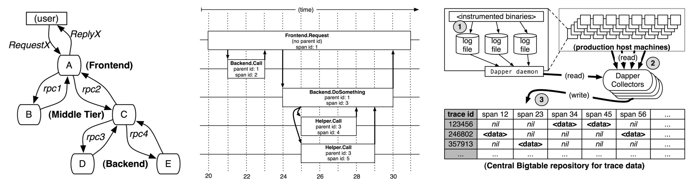
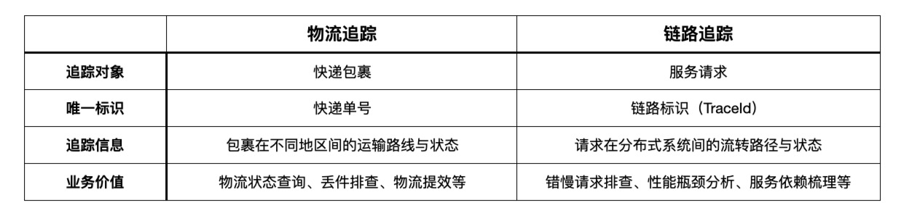
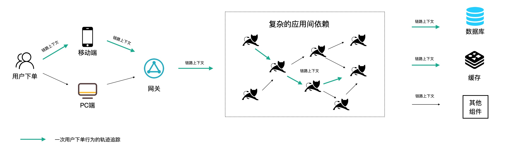
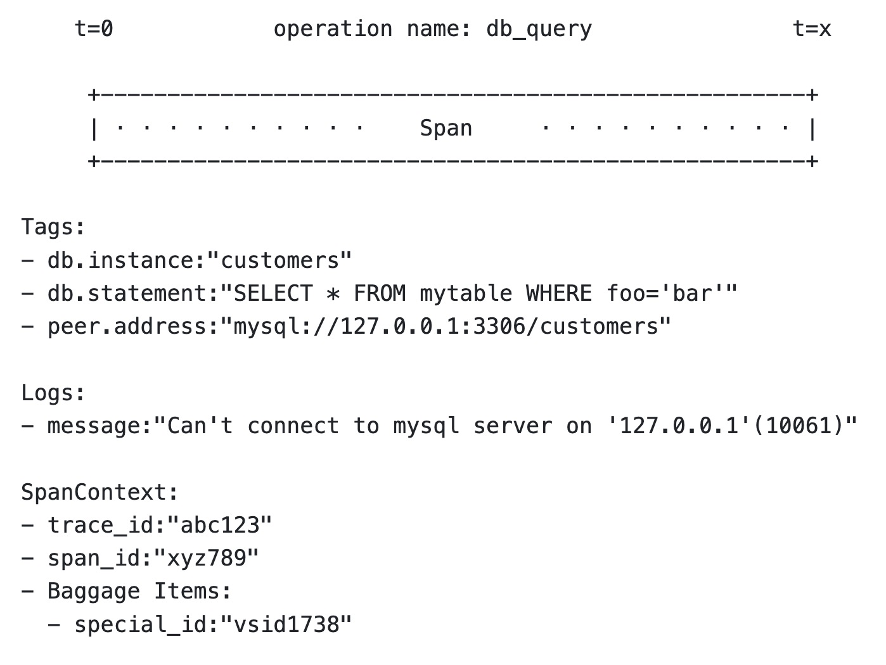

# 链路追踪（Tracing）其实很简单——分布式链路追踪的诞生

> 作者：夏明（涯海）    
> 创作日期：2022-07-14  
> 专栏地址：[【稳定大于一切】](https://github.com/StabilityMan/StabilityGuide)  

为了应对分布式环境下的不一致、模糊性等问题，人们试图通过请求粒度的轨迹追踪与数据透传，实现节点间的确定性关联，分布式链路追踪技术也由此诞生。

## 里程碑事件：Google Dapper
分布式链路追踪诞生的标志性事件就是 Google Dapper 论文的发表。2010年4月，Benjamin H. Sigelman 等人在 Google Technical Report 上发表了《Dapper, a Large-Scale Distributed Systems Tracing Infrastructure》，揭开了分布式链路追踪的技术大幕，开启了一段全新的技术浪潮。

Dapper 首先明确了分布式链路追踪的两个目标：任意部署和持续监测。进而给出了三个具体的设计准则：

* **低开销：** 确保核心系统不会因为额外的性能开销拒绝使用。
* **应用级透明：** 对应用开发透明，无需开发人员的协助，降低接入门槛，提高迭代效率。
* **可扩展：** 在未来相当长一段时间内，随着业务的高速发展，仍然可以有效运转。

下面几张图展示了 Dapper 对链路透传、调用链结构和数据采集流程的描述，我们将在后续章节详细展开介绍，对 Dapper 感兴趣的同学建议直接阅读原作。

Dapper 论文有两个重要的意义，一是详细阐述了分布式链路追踪的设计理念，为后来的实现者提供了重要的理论指导；二是通过 Dapper 在 Google 生产环境的大规模落地实践，证明了分布式链路追踪技术的企业级价值，为分布式链路追踪的推广作出了不可磨灭的贡献。

##  基本原理
分布式链路追踪并不是无中生有、凭空诞生的新概念，而是轨迹追踪在 IT 领域的又一次成功运用。轨迹追踪的理念早已被广泛应用于社会生活的方方面面，比如物流订单追踪。

一个快递包裹会在发件站点被赋予一个快递单号，沿途的中转节点会记录该快递到达的时间等信息，而用户通过快递单号就可以查询自己的包裹途径了哪些站点，耗时多久，是否存在滞留或丢件的情况。下表对比了物流追踪与链路追踪的关联与差异性。

分布式链路追踪的基本原理就是在分布式应用的接口方法上设置一些观察点（类似快递中转站记录点），然后在入口节点给每个请求分配一个全局唯一的标识 TraceId（类似快递单号），当请求流经这些观察点时就会记录一行对应的链路日志（包含链路唯一标识，接口名称，时间戳，主机信息等）。最后通过 TraceId 将一次请求的所有链路日志进行组装，就可以还原出该次请求的链路轨迹，如下图所示。

分布式链路追踪实现请求回溯的关键点有两个：一是低成本、高质量的观察点设置，也就是链路插桩，确保我们追踪的信息足够丰富，能够快速定位异常根因；二是保证链路上下文在不同环境下都能够完整透传，避免出现上下文丢失导致的断链现象。关于链路插桩和上下文透传的具体内容我们将在实战篇进行详细介绍。

下面，我们来看一个高速公路的例子，进一步加深对链路追踪实现原理的认识。

### 一辆汽车飞驰在高速公路上
小明、小红、小玉计划在“五一”期间去自驾游，他们的旅游路线各不相同。如果我们想追踪他们的行程轨迹与时间该如何实现？

可能你会建议在每辆车上安装一个追踪器，确实，这是一种行之有效的方法。但是，当出行车辆扩展到全国数以十亿计的规模，安装追踪器的成本就会很高。此时，让我们换个角度思考一下，高速公路的路线是固定的，每隔一段距离就会有一个收费站，如果我们在每个收费站上安装监控，记录车辆在每个收费站的轨迹与时间，就可以很经济的实现车辆轨迹与行驶时间的追踪。最终，我们得到了如下所示的行程记录：

|游客|行程路线|行驶距离|行驶时间|
|---|---|----|----|
|小明|北京 -> 石家庄 -> 郑州 -> 西安|1140 公里|13 小时 34 分钟|
|小红|北京 -> 天津 -> 济南 -> 南京 -> 杭州|1280 公里|14 小时 33 分钟|
|小玉|北京 -> 天津 -> 济南 -> 南京 -> 上海|1234 公里|13 小时 53 分钟|

如果我们将每个游客替换为服务请求，收费站替换为服务接口，那我们就可以得到每次请求在分布式系统中的调用轨迹与状态，这就是分布式链路追踪的含义。

## 基础术语
虽然分布式链路追踪的实现方式多种多样，不同开源或商业化产品都有自己的数据模型和定义。但是仍然有一些基础术语在业界具备广泛的共识，以 OpenTracing 为例。

### Trace
一条 Trace 代表一次入口请求在 IT 系统内的完整调用轨迹及其关联数据集合。其中，全局唯一的链路标识 TraceId，是最具代表的一个属性。通过 TraceId 我们才能将同一个请求分散在不同节点的链路数据准确的关联起来，实现请求粒度的“确定性关联”价值。这也是 Trace 区别于 Metrics、Log 其他两类可观测技术的关键属性。

#### Span
光有 TraceId 还不够，请求在每一跳的接口方法上执行了什么动作，耗时多久，执行状态是成功还是失败？承载这些信息的基础对象就是 Span。通常一个完整的 Span 具有如下属性：

* Operation Name：描述了当前接口的行为语义，比如 /api/createOrder 代表执行了一次创建订单的动作。
* SpanId/ParentSpanId：接口调用的层级标识，用于还原 Trace 内部的层次调用关系。
* Start/FinishTime：接口调用的开始和结束时间，二者相减就是该次调用的耗时。
* StatusCode：响应状态，标识当次调用是成功或失败。
* Tags & Events：调用附加信息，详见下面的描述。

### Tags
SpanName 的描述通常是高度抽象的，仅仅回答这个接口是做什么的。如果需要进一步记录请求的行为特征，可以使用 Tags 来扩展语义。Tags 是一组由 {Key:Value} 组成的键值对集合，描述这一次接口调用的具体属性，比如将 UserType 添加到 Tags 中，就可以观察某一类用户（比如 VIP 用户）的链路行为状态。如果将设备类型加到 Tags 中，可以对比不同设备的性能差异。

由于 Tags 只支持结构化的 KV 键值对，因此，它可以作为标签添加到聚合后的链路指标中，有效提升监控告警的数据精度。更准确的回答异常或性能问题发生的原因，比如集中在某个地域、设备或版本。

### Logs
Tags 会随着链路上下文自动向下游透传，如果希望记录一些不需要透传的事件信息，可以使用 Logs 字段。每个 Span 都可以进行多次 Logs 操作，但每个 Logs 对象都需要带有一个时间戳，Logs 的内容可以是非结构化的复杂对象。

为了节省成本，一般不会对 Logs 字段建立索引，也不支持 Logs 的查询或统计，仅仅作为附加信息关联在调用链上，用于单请求诊断。

下图展示了一个 OpenTracing 的 Span 示例，不同开源实现的链路模型我们将在后续章节再展开介绍。

## 推荐阅读
《链路追踪（Tracing）其实很简单》系列文章

- 1 什么是分布式链路追踪
	- [1.1 分布式链路追踪的起源](./链路追踪其实很简单——分布式链路追踪的起源.md)
	- [1.2 分布式链路追踪的诞生](./链路追踪其实很简单——分布式链路追踪的诞生.md)
	- [1.3 分布式链路追踪的应用与兴起](./链路追踪其实很简单——分布式链路追踪的应用与兴起.md)
	- [1.4 分布式链路追踪的挑战与限制](./链路追踪其实很简单——分布式链路追踪的挑战与限制.md)
- 2 分布式链路追踪的基础用法
	- [2.1 请求轨迹回溯](./链路追踪其实很简单——请求轨迹回溯.md)
	- [2.2 多维链路筛选](./链路追踪其实很简单——多维链路筛选.md)
	- [2.3 链路实时分析、监控与告警](./链路追踪其实很简单——链路实时分析_监控与告警.md)
	- [2.4 链路拓扑](./链路追踪其实很简单——链路拓扑.md)
- 3 分布式链路追踪的进阶指南
	- [3.1 链路功能进阶指南](./链路追踪其实很简单——链路功能进阶指南.md)
	- [3.2 链路成本进阶指南](./链路追踪其实很简单——链路成本进阶指南.md)

## 推荐产品
- [阿里云 ARMS 可观测](https://help.aliyun.com/product/34364.html)
- [阿里云链路追踪](https://help.aliyun.com/document_detail/196681.html)

## 推荐社区
【稳定大于一切】打造国内稳定性领域知识库，**让无法解决的问题少一点点，让世界的确定性多一点点。**

- GitHub 专栏地址：[https://github.com/StabilityMan/StabilityGuide](https://github.com/StabilityMan/StabilityGuide)
- 微信公众号：万物可观测
- 钉钉交流群号：30000312
- 如果阅读本文有所收获，欢迎分享给身边的朋友，期待更多同学的加入！

