# 链路追踪（Tracing）其实很简单——链路功能进阶指南

> 作者：夏明（涯海）    
> 创作日期：2022-10-24  
> 专栏地址：[【稳定大于一切】](https://github.com/StabilityMan/StabilityGuide)  

经过前面两章的学习，小玉已经熟练掌握分布式链路追踪的基础用法，比如回溯链路请求轨迹，定位耗时瓶颈点；配置核心接口黄金三指标告警，第一时间发现流量异常；大促前梳理应用上下游关键依赖，联系相关方协同备战等等。随着深入使用链路追踪技术，小玉在问题发现与诊断方面的能力大幅提升，她负责的订单中心应用稳定性也明显好转，得到了上级主管的多次褒奖。

不过，小玉并没有洋洋得意，因为她发现了许多新的棘手问题：比如接口偶发性超时，调用链只能看到超时接口名称，看不到内部方法，无法定位根因，也难以复现，怎么办？比如接口调用成功，但是业务状态异常，导致结果不符合预期，如何排查？比如大促压测时或发布变更后，发现 CPU 水位非常高，如何分析应用性能瓶颈点，针对性优化？比如同一份代码，本地调试都正常，但是发布到线上环境就报错，如何定位代码行为不一致的原因？诸如此类的难题，困扰着小玉，它们好像不属于链路追踪的范畴，却又与链路追踪有着千丝万缕的联系，让小玉不知该如何下手。

小明听了小玉的烦恼，不仅莞尔一笑，说到：链路追踪是可观测不可分割的一部分，我们不应该人为的划分边界，而是要打破数据孤岛，紧密结合其他可观测技术，以提高系统稳定性为目标，最大化的发挥链路追踪的关联价值。

本小节通过对经典案例的解读，大家将掌握链路追踪与其他可观测技术结合应用的窍门，打破对链路追踪固有的认知，深入理解链路追踪在可观测领域的关联价值。

## 【应用日志关联】一次订单支付失败行为的全息排查
* 【问题描述】某天，小玉收到了来自前线小二反馈的客户投诉，订单支付一直失败，客户情绪非常焦躁，需要尽快给予回复，投诉工单记录了支付失败的订单号 213589741238xxxx。
* 【难点分析】订单支付接口依赖了多个下游服务，接口调用本身是成功的，但是业务报错导致支付失败。而且只有订单中心的应用日志记录了订单号，下游应用日志没有订单号信息，无法直接通过订单号进行全应用扫描。
* 【解决思路】小明建议小玉利用链路追踪的上下游追溯能力进行信息串联。
	1. 首先，通过失败订单号检索订单中心的应用日志，并找到日志中关联的 TraceId。
	2. 其次，通过 TraceId 查询全链路调用轨迹，找到当次请求依赖的上下游调用。
	3. 最后，通过查询上下游应用跟当次请求相关的应用日志，定位到订单支付失败的原因，原来是优惠券失效导致的。

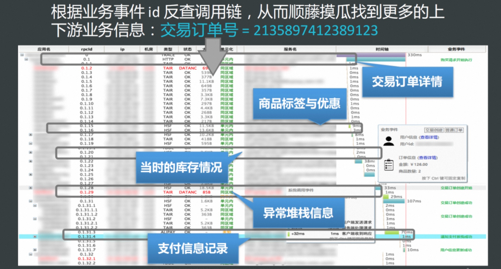

* 【延伸思考】通过上述案例，可以发现全息排查的前提是实现 TraceId 与应用日志的双向绑定，目前业界的主流做法是将 TraceId 添加到应用日志中实现关联。在第 2 章的链路多维筛选小节中，我们介绍了两种在日志输出中添加 TraceId 的方式：基于 SDK 手动埋点与基于日志模板自动埋点，感兴趣的同学可以详细阅读相关章节的介绍。
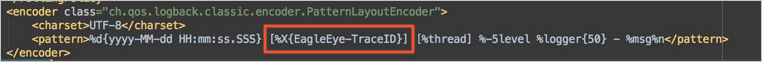

## 【慢调用方法栈自动剖析】偶发性慢调用，如何定位导致问题的那一行代码？
* 【问题描述】负责稳定性的同学对这种场景应该不陌生：系统在夜间或整点促销时会出现偶发性的接口超时，等到发现问题再去排查时，已经丢失了异常现场，并且难以复现，最后只能不了了之。上述场景重复上演直至酿成故障，最终蒙受巨大的业务损失。
* 【难点分析】开源的链路追踪实现通常只能记录超时的接口，无法细化到具体的方法栈，开发同学不知道该如何修复。而偶发性异常没有规律，又难以复现，很难通过手动 jstack 或者 Arthas 等在线诊断工具去精准定位根因。
* 【解决思路】为链路追踪埋点添加回调函数，自动记录慢请求的本地方法栈，真实还原代码执行的第一现场。如下图所示，当接口调用超过一定阈值（比如2秒），会启动对该次慢请求所在线程的监听，直至该次请求结束后立即停止监听，精准保留该次请求生命周期内所在线程的快照集，并还原完整的方法栈及耗时，最终定位耗时主要消耗在请求数据库连接 getConnection 方法上，通过增加数据库连接数可以解决响应慢的问题。

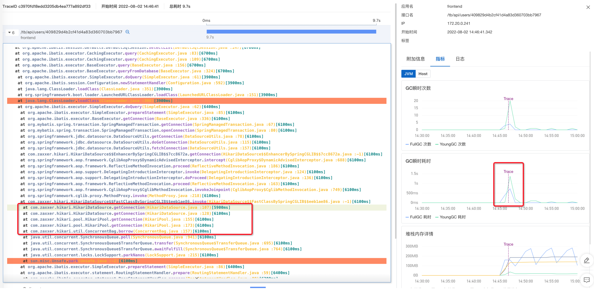

* 【延伸思考】目前主流的开源链路实现并不支持慢调用方法栈自动剖析，只有少数商业化产品（如阿里云 ARMS）支持了该特性。为了能够获取完整的方法栈信息，传统的链路插桩（Instrument）并不适合获取方法栈监听，只能利用采样法（Sampling）进行堆栈聚合，但是全局采样的高开销很难实现常态化自动监听，必须结合链路追踪埋点，精准定位慢调用所在线程与生命周期，低成本实现精准、轻量级的采样监听。

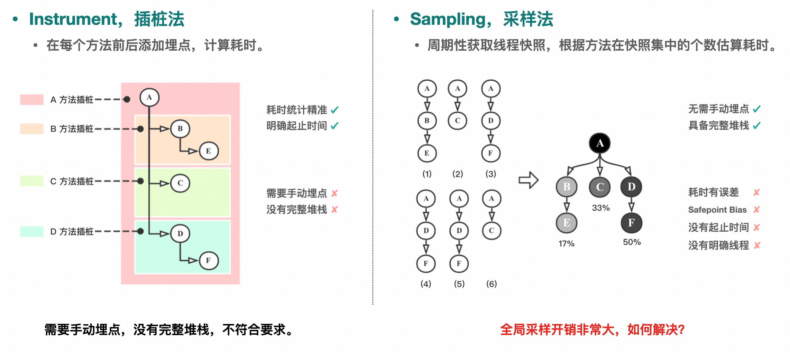

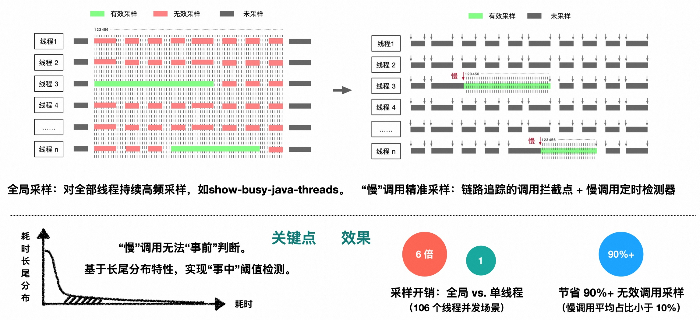

## 【CPU 利用率高“三步排查法”】大促前夕压测发现 CPU 水位非常高，如何分析应用性能瓶颈点，针对性优化？
* 【问题描述】双十一大促前夕，部门组织了核心应用全链路压测，然而小玉负责的订单中心在第一波压测流量脉冲下 CPU 利用率瞬间飙升到 90% 以上，接口调用大量超时，成为了全链路性能瓶颈，导致压测活动草草结束，主管责令她在一周内限期完成优化。
* 【难点分析】CPU 利用率高可能是单纯的机器资源不足，也可能是不合理的代码导致的。基础的 CPU 监控只能反映问题，无法定位根因，缺乏资源到代码的映射关系，导致很多同学无法简单直接的进行代码优化，只能盲目扩容。
* 【解决思路】以 Java 应用为例，我们可以利用工具一步步定位导致 CPU 利用率高的异常代码片段，主要分为以下三步：
	1. 首先，查看 CPU 基础监控，确定流量洪峰与 CPU 利用率飙升曲线在时间上是否吻合，CPU 利用率上涨的主要原因是否为用户态 CPU 上涨，排除宿主机“超卖”，磁盘故障等硬件因素的干扰。
	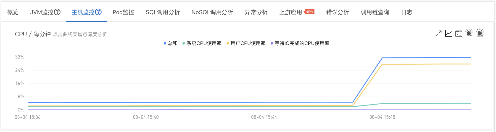
	2. 其次，查看线程分析监控，判断是哪一类线程（池）消耗的 CPU 最多，以及此类线程的 CPU 耗时曲线是否与 CPU 利用率曲线吻合，初步定位异常线程类别。
	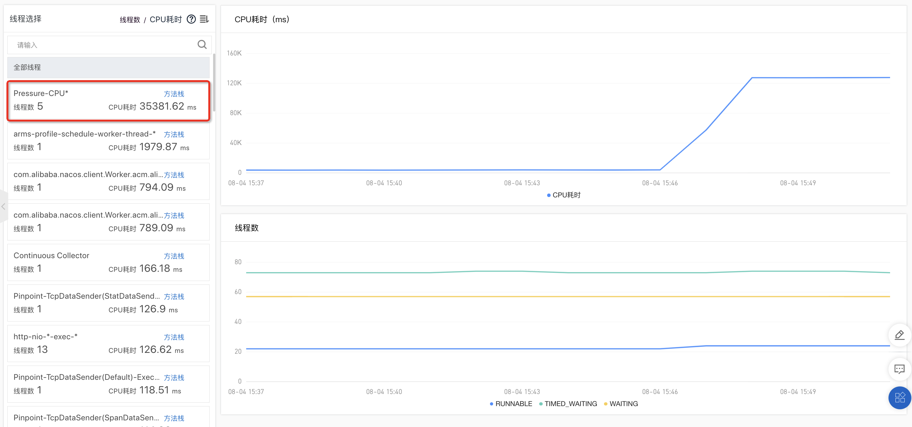
	3. 最后，通过 CPU 诊断工具，分析异常时段内的 CPU 火焰图，确定 CPU 占比最高的方法调用栈，进行针对性的优化。如下图所示，消耗 CPU 99.7% 占比的方法是 CPUPressure.runBusiness() 方法。
	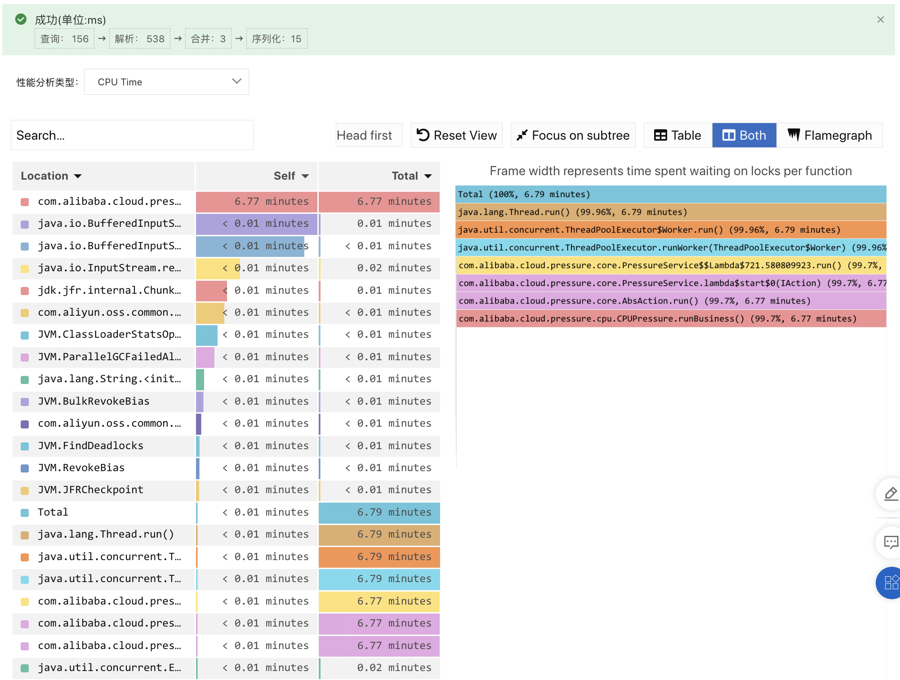
* 【延伸思考】
	* CPU 分析的难点是缺乏有效的工具，能够给出资源到代码之间的映射关系，直接定位异常代码片段，指导研发同学进行优化。此外，诊断行为相对于问题发生往往是滞后的，工具必须具备常态化运行，自动保留异常现场的能力。如何平衡现场快照的信息度与工具自身的资源开销，非常考验产品设计与技术实现能力，许多商业化产品在这一点上存在着不小的差距。  
   * 如果某个核心方法的代码逻辑变更频繁，容易造成性能退化，还可以为其添加链路埋点，进行常态化的监听。更进一步，还可以将该方法关联的 CPU 开销展示在调用链上，提高诊断的效率，如下图所示。
   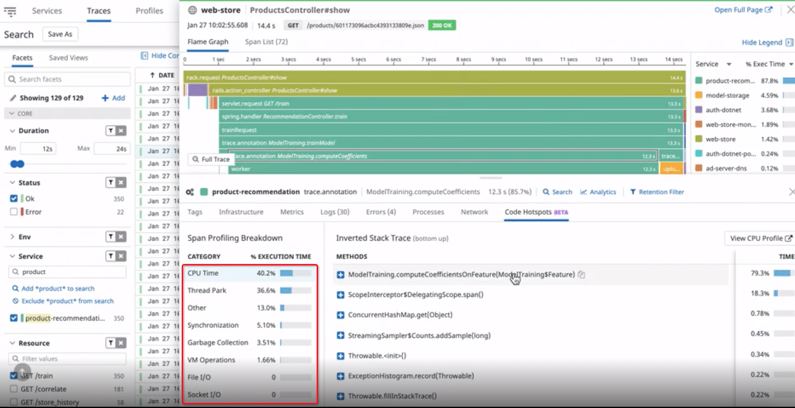

## 【内存异常“三步排查法”】应用频繁 FGC 或是内存崩溃，如何定位根因，保障服务可用性？
* 【问题描述】FullGC 绝对是 Java 应用最常见问题之一，对象创建过快、大对象分配、内存泄漏等各种原因都会导致 FGC。比 FGC 更严重的是内存崩溃，比如不合理的使用堆外内存 DirectBufferMemory，可能导致 OOM（OutOfMemoryError），JVM 崩溃，服务不可用等严重后果。
* 【难点分析】导致内存异常的原因千奇百怪，最有效的方式就是记录内存异常的现场快照。但是内存快照的记录成本非常高，很难常态化自动保存。等到真正出问题的时候又可能来不及记录了，这就导致内存诊断变得非常困难。
* 【解决思路】以 Java 应用为例，结合工具由易到难逐步定位内存异常原因，主要分为以下三步：
	1. 首先，查看 JVM 监控，分析新生代、老年代、Metaspace、DirectBuffer 等内存变化，初步定界内存异常的类型，以及确认是否存在内存泄露现象。
	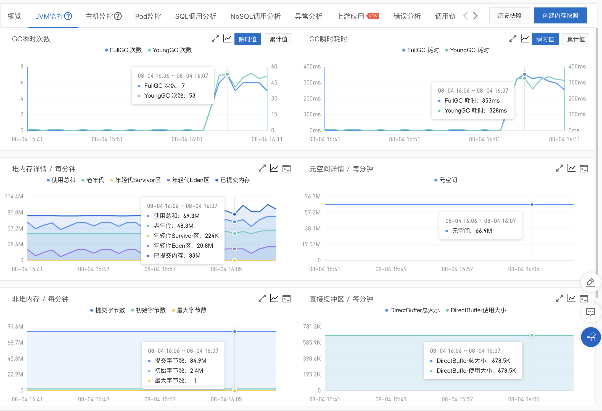
	2. 其次，通过轻量化内存诊断，分析异常时段的内存对象分配火焰图，定位分配内存最多的方法，进行重点分析。如下图所示，99.92% 的内存是通过 AllocMemoryAction.runBusiness() 方法申请的。
	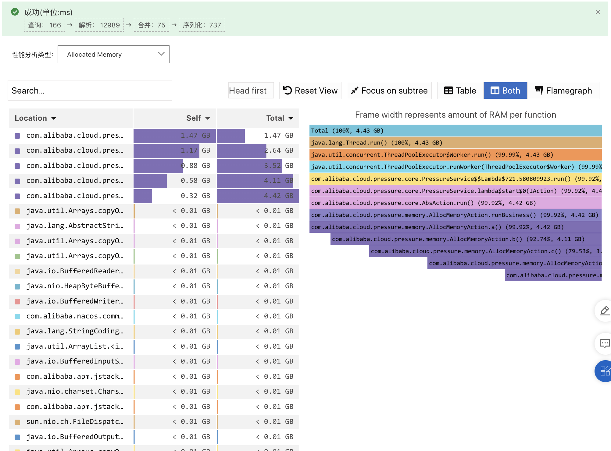
	3. 但是，分配内存多，并不代表常驻内存多，大部分对象可能通过 YGC 就释放掉了。因此，针对一些疑难杂症，还需要使用 HeapDump 来进行最终定位。
	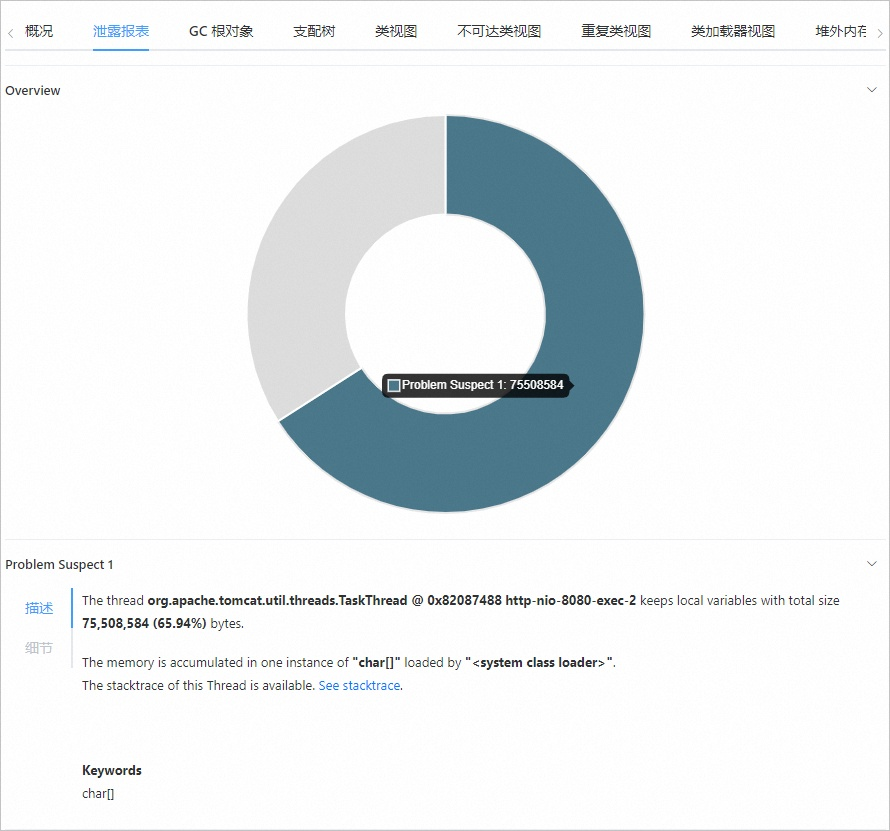
* 【延伸思考】轻量化内存诊断是介于 JVM 监控与 HeapDump 之间的折中方法，可以常态化记录内存申请信息，在大部分场景可以有效工作。与 CPU 诊断类似，如果某个核心方法频繁申请内存，可以考虑对其添加链路埋点，并关联内存申请与 GC 等信息，提高调用链信息集成度与诊断效率。

## 【白屏化在线诊断】程序运行不符合预期，本地调试成功的代码，发布到线上就报错，怎么办？
* 【问题描述】本地调试通过的代码，一旦发布到线上环境就各种报错，到底哪里出了问题？相信开发同学都经历过这样的噩梦。导致这种问题的原因有很多，比如 Maven 依赖多版本冲突，不同环境动态配置参数不一致，不同环境依赖组件差异，本地无法模拟线上环境真实流量参数或压力等等。
* 【难点分析】本地、日常、预发、生产，不同环境之间总存在着这样或那样的一些差异，导致同一份代码表现出不同的行为或异常，必须在当前环境进行诊断定位。传统的远程 debug 模式操作复杂，安全风险高。而类似 Arthas 这种单机诊断工具需要黑屏登录，命令行交互，使用起来也比较麻烦。
* 【解决思路】在 APM 探针中内置在线诊断模块，通过控制台进行白屏化交互，按照诊断场景进行命令封装，进一步简化操作成本。比如通过调用链找到异常调用的全路径类名与方法后，对该方法执行源码解析、出入参拦截等经典诊断命令，实时查看当前程序运行态的源代码、出入参、执行方法栈与耗时、静态对象或动态实例的值等等，让在线调试就像本地调试一样方便，一键定位错慢根因。
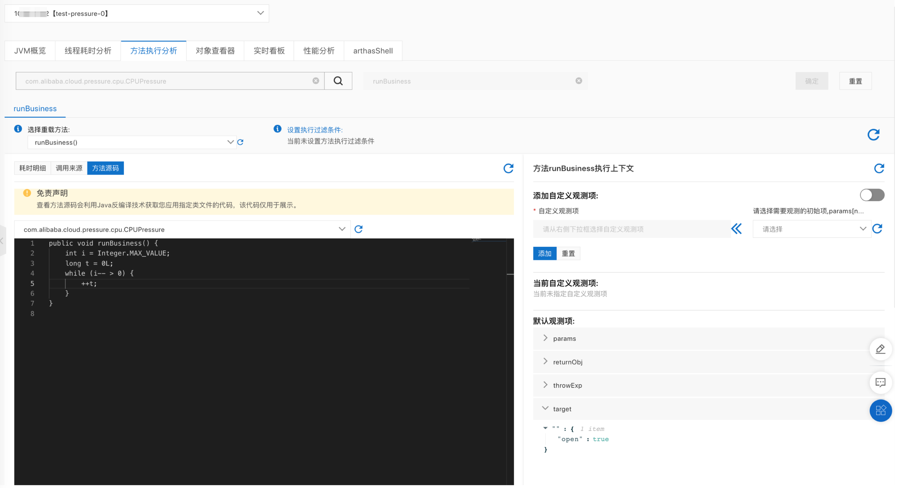
* 【延伸思考】白屏化只是在线诊断的第一步优化，如何进一步降低诊断开销与风险，从单机诊断升级为集群诊断，从主动式诊断升级为自动触发式诊断，从特定语言（如Java）向全语言覆盖，需要更多新技术与产品的迭代。

## 【探索式链路分析与监控】1秒战役，如何常态化治理入口请求慢响应问题？
* 【问题描述】入口请求的响应时延直接影响着终端用户的体验，根据 Google 的统计，时延每增加 500 毫秒就会导致 20% 的访问量流失，而 Amazon 也有类似的发现，每增加 100 毫秒的时延就会导致 1% 的销售额下降。因此，很多企业 IT 服务都会制定严格的入口服务响应时延 SLA，尽可能保证终端用户的访问能够得到快速响应。但是，影响时延的因素有很多，流量不均、单机故障、程序异常、依赖组件瓶颈等都会显著影响入口请求的时延，如何低成本的进行常态化治理呢？
* 【难点分析】不同企业、不同类型的服务对时延的要求不尽相同，影响时延的维度特征也比较发散，很难通过开源或商业化产品内置的基础监控实现慢请求的筛选与分析。基于明细数据的分析虽然比较灵活，但是全量检索的成本比较高，当分析规则较多时，不适用于常态化的监控与告警，无法主动通知时延退化风险。
* 【解决思路】我们需要将链路分析与监控的能力进行结合，既能灵活满足用户自定义的查询分析诉求，还能将用户的分析规则进行固化，生成自定义链路指标，实现常态化的监控与告警。
	* 首先，我们通过 TraceExplorer 对链路明细数据进行在线筛选与分析，可以根据业务需要灵活设置各种条件，比如查看特定入口应用大于 3 秒的慢请求分布在哪些接口，如下图所示。
	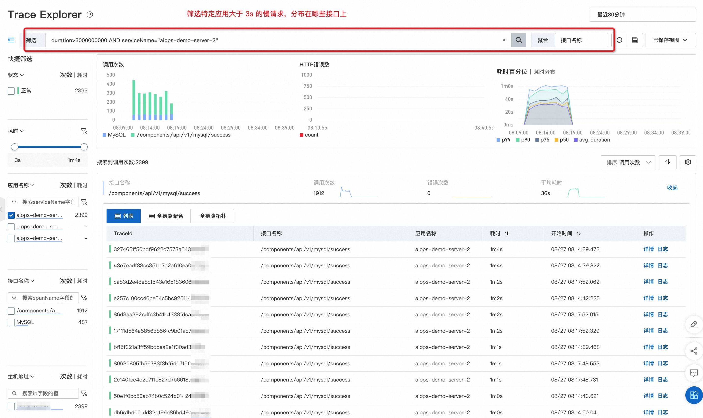
	* 其次，保存刚刚设置的查询分析规则，便于后续一键快速分析。不过这一步还是基于链路明细数据，分析成本比较高，并且结果的准确性强依赖链路数据采样率，不适合常态化监控与告警。
	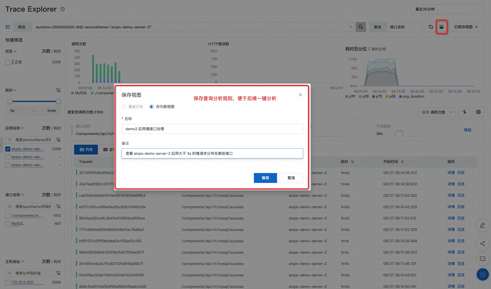
	* 最后，为了实现低成本的常态化监控与告警，还可以将查询分析规则下推，在数据处理端生成新的自定义链路指标（预聚合）。
	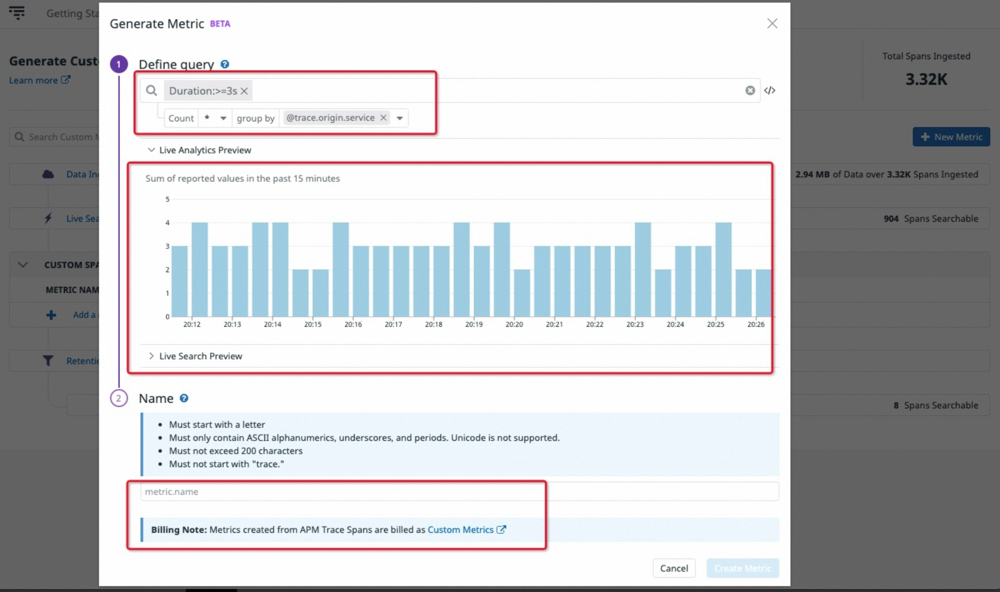
* 【延伸思考】在实际生产环境中，服务通常是标准化的，但业务却需要分类分级。同样的订单服务，我们需要按照类目、渠道、用户等维度进行分类统计，实现精细化运营。比如，对于线下零售渠道而言，每一笔订单、每一个 POS 机的稳定性都可能会触发舆情，线下渠道的 SLA 要求要远高于线上渠道。那么，我们如何在通用的电商服务体系中，精准的监控线下零售链路的流量状态和服务质量呢？   
   答案就在链路数据的自定义标签 Attributes 中，比如，我们在入口服务针对线下订单打上一个 {"attributes.channel": "offline"} 的标签，然后再针对不同门店、用户客群和商品类目分别打标。最后，通过对 attributes.channel = offline 进行过滤，再对不同的业务标签进行 group by 分组统计调用次数、耗时或错误率等指标，就可以快速的分析出每一类业务场景的流量趋势与服务质量。

## 【智能根因定位】如何让新手具备“专家级”诊断能力，快速定位经典问题根因？
* 【问题描述】**线上应用风险主要分为“错”、“慢”两大类。其中“错”的原因通常是程序运行不符合预期，** 比如 JVM 加载了错误版本的类实例，代码进入异常分支，环境配置错误等。**而“慢”的原因通常是资源不足，** 比如突发流量导致 CPU 打满，微服务或数据库线程池被耗尽，内存泄漏导致持续 FGC 等等。无论是“错”问题，还是“慢”问题。从用户的角度，都是希望能够快速定位根因，及时止损，并消除隐患。但是，绝大部分线上问题无法仅通过链路追踪的基础能力就能有效定位并解决，需要结合资源监控、代码诊断等多方面能力，对排查人员的经验和能力要求非常高，如何让更多同学快速具备“专家级”诊断能力呢？
* 【难点分析】一个错误的运维动作可能引发大范围的可用性故障，线上环境的低容错性与高时效性特征，对于根因定位的精度与速度要求很高。因此，很多基于概率的机器学习算法并不适用于运维领域。此外，一个具有丰富经验和能力的诊断专家需要大量的时间沉淀与案例“喂养”，在互联网快速迭代的背景下，只有少部分公司能够培养出此类稀缺人才，无法快速批量复制。
* 【解决思路】线上应用风险是有一定的迹象可循的，针对常见经典问题，我们可以基于领域专家经验结合比较成熟的算法，实现经典问题的自动根因定位或定界，提高诊断效率，降低诊断门槛。比如我们首先通过时序异常检测算法，识别到 A应用下单接口耗时突增，检查 A 应用自身资源并没有发现瓶颈，然后检查下单接口依赖服务，发现下游接口耗时突增，逐级追溯后最终定位到 C 应用有 2 台机器 CPU 利用率过高，达到 95%+，对 C 应用进行紧急扩容后恢复。
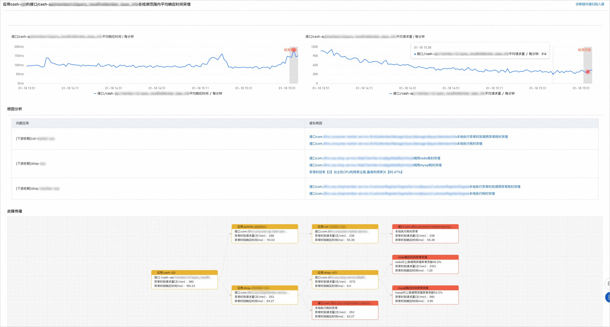
* 【延伸思考】针对运维领域的经典问题根因定位，在现阶段更适合采用以专家经验为主，算法为辅的手段，本质上是人工检查流程的自动化沉淀，还远未达到智能化的程度，也不该盲目追求“高大上”的算法，而应以实用为主，优先解决数据完整度与丰富度。

## 小结
链路追踪（Trace）最大的价值在于“关联”，无论是从数据层面关联应用日志（Logs）、关键事件（Events）、性能指标（Metrics）或诊断工具（Profiling），还是从系统层面关联用户终端、网关、应用、中间件、容器与基础设施，链路追踪最大的价值不在于自身，而在于关联性的场景化呈现，让我们一起来继续挖掘更多更有价值、也更有意思的用法吧！

## 推荐阅读
《链路追踪（Tracing）其实很简单》系列文章

- 1 什么是分布式链路追踪
	- [1.1 分布式链路追踪的起源](./链路追踪其实很简单——分布式链路追踪的起源.md)
	- [1.2 分布式链路追踪的诞生](./链路追踪其实很简单——分布式链路追踪的诞生.md)
	- [1.3 分布式链路追踪的应用与兴起](./链路追踪其实很简单——分布式链路追踪的应用与兴起.md)
	- [1.4 分布式链路追踪的挑战与限制](./链路追踪其实很简单——分布式链路追踪的挑战与限制.md)
- 2 分布式链路追踪的基础用法
	- [2.1 请求轨迹回溯](./链路追踪其实很简单——请求轨迹回溯.md)
	- [2.2 多维链路筛选](./链路追踪其实很简单——多维链路筛选.md)
	- [2.3 链路实时分析、监控与告警](./链路追踪其实很简单——链路实时分析_监控与告警.md)
	- [2.4 链路拓扑](./链路追踪其实很简单——链路拓扑.md)
- 3 分布式链路追踪的进阶指南
	- [3.1 链路功能进阶指南](./链路追踪其实很简单——链路功能进阶指南.md)
	- [3.2 链路成本进阶指南](./链路追踪其实很简单——链路成本进阶指南.md)

## 推荐产品
- [阿里云 ARMS 可观测](https://help.aliyun.com/product/34364.html)
- [阿里云链路追踪](https://help.aliyun.com/document_detail/196681.html)

## 推荐社区
【稳定大于一切】打造国内稳定性领域知识库，**让无法解决的问题少一点点，让世界的确定性多一点点。**

- GitHub 专栏地址：[https://github.com/StabilityMan/StabilityGuide](https://github.com/StabilityMan/StabilityGuide)
- 微信公众号：万物可观测
- 钉钉交流群号：30000312
- 如果阅读本文有所收获，欢迎分享给身边的朋友，期待更多同学的加入！

