# 链路追踪（Tracing）其实很简单——链路实时分析、监控与告警

> 作者：夏明（涯海）    
> 创作日期：2022-07-17  
> 专栏地址：[【稳定大于一切】](https://github.com/StabilityMan/StabilityGuide)  

前面两小节我们介绍了单链路的筛选与轨迹回溯，是从单次请求的视角来分析问题，类似查询某个快递订单的物流轨迹。但是，单次请求无法直观的反映应用或接口的整体服务状态，经常会由于网络抖动、宿主机 GC 等原因出现偶发性、不可控的随机离群点。当一个问题发生时，应用 Owner 或稳定性负责人需要首先判断问题的实际影响面，从而决定下一步的应急处理动作。因此，我们需要综合一段时间内的所有链路进行统计分析，这就好比我们评估某个物流中转站点的效率是否合理，不能只看某一个订单，而是要看一段时间内所有订单的平均中转时间与出错率。

统计分析是我们观察、应用分布式链路追踪技术的重要手段。我们既可以根据不同场景要求进行实时的后聚合分析，也可以将常用的分析语句固化成规则生成预聚合指标，实现常态化监控与告警。相对于链路多维筛选，统计分析需要明确分析对象与聚合维度。其中，分析对象决定了我们对哪些指标进行聚合操作，比如请求量、耗时或错误率。而聚合维度决定了我们对哪些特征进行统计对比，比如不同应用、接口、IP、用户类型的统计量对比。接下来，我们先了解下分析对象和聚合维度的具体概念，再介绍实时分析与监控告警的具体用法。

## 分析对象
分析对象，又称为度量值（Measure），决定了我们对哪些指标进行聚合操作。常见的度量值包括“黄金三指标”——请求量、错误和耗时。除此之外，消息延迟、缓存命中率或自定义度量值也是高频应用的分析对象，我们来逐一了解下。

### 请求量
请求量可以说是我们最熟悉的度量值之一。这个接口被调用了多少次？这一分钟的请求量与上一分钟相比有什么变化，与前一天相比有什么变化？这些问题都是我们在日常运维过程中最熟悉的对话。

请求量通常按照一个固定的时间间隔进行统计，比如按秒统计的请求量通常称之为 QPS（Queries Per Second），有些场景也会称之为 TPS（Transactions Per Second）。两者有一些细微差别，但含义基本相同，经常被混用。我们可以使用 QPS 来衡量系统的单位时间吞吐能力，用以指导系统资源的分配调度；或者观测用户行为的变化，判断系统是否出现异常。

如下图所示，创建订单接口每天上午10点和12点的请求量都会有一个周期性的突增，这种情况大概率是整点促销活动的正常表现，我们在做资源容量评估时需要参考整点的峰值请求量，而不是系统平均请求量，否则每当流量突增时系统可用性就可能大幅下降，影响用户体验。

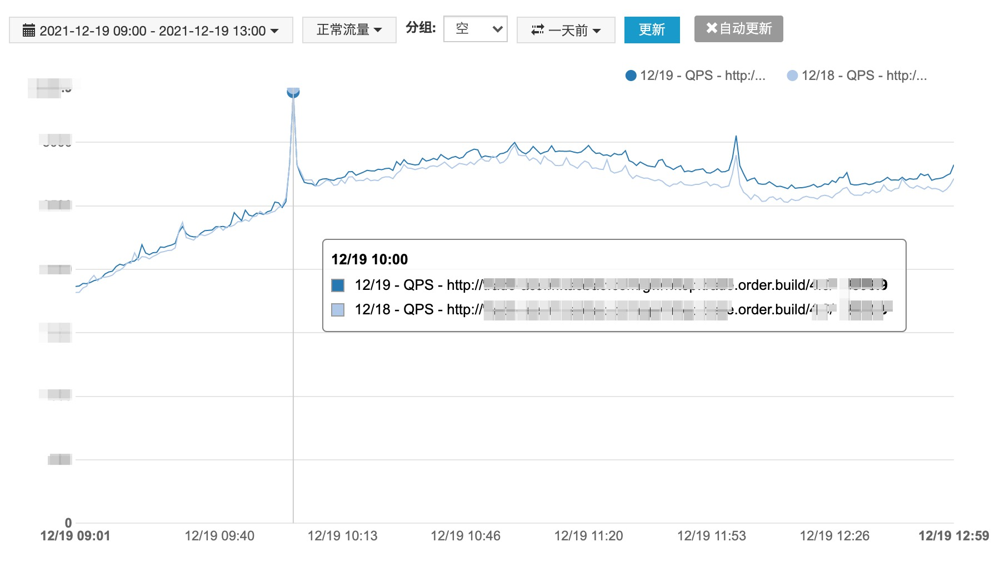

下面第二张图的创建订单接口在10月8号凌晨00:39分有一个非常明显的下跌，并且前一天的曲线是比较平滑的，这种现象大概率是接口异常导致的，已经影响了用户的下单体验，需要深入排查定位原因。

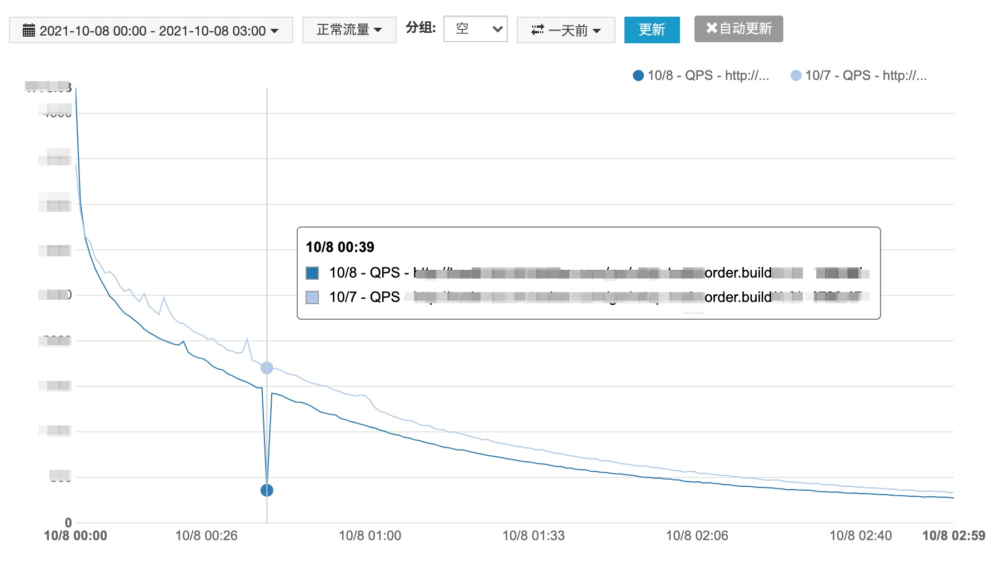

请求 QPS 的变化趋势反映了系统吞吐能力的变化，是请求量最常用的一种方式。但在某些离线计算场景，对短时间内的吞吐变化不敏感，更需要一个比较大的时间间隔内的吞吐总量统计，比如一天或一周的请求处理总量。以便灵活分配离线计算资源。

### 错误
每一次链路请求都会对应着一个状态：成功，或失败。一次失败的请求通常称之为错误请求。单条错误请求可能由于各种各样的偶发性原因不予关注。但是当错误数累积到一定程度，超过一定阈值时，就必须要进行处理，否则会引发大面积的系统故障。

错误指标除了像请求量一样，分为错误 QPS 和错误总量之外，还有一种比较特殊的统计方式，就是错误率。**错误率是指在单位时间间隔内错误数占请求总数的比例。** 比如 A接口一分钟内被调用了 10000次，其中有 120次是错误调用，那么 A接口这一分钟的错误比率就是 120 / 10000 = 0.012，也就是 1.2%。

错误率是衡量系统健康程度的关键指标，针对它的健康阈值设置不会受请求量的周期性变化影响。比如下单接口的请求量在白天达到峰值的 10000 QPS，在夜间的谷值只有 100 QPS，全天的请求量变化范围在 100 ~ 10000 QPS 之间。相应的错误量变化范围在 0.2 ~ 20 QPS 之间，而错误率基本固定在 0.2% 左右。无论是使用固定阈值或同环比的方式，错误数都很难精确反映系统实际的健康程度，而错误率使用起来就简单、有效的多。比如设置错误率超过 1% 时就发送告警短信，超过 5% 就电话通知稳定性负责人立即排查。

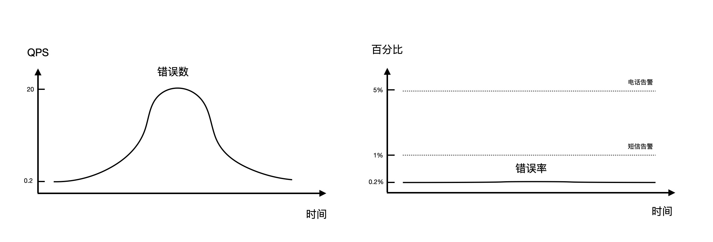

### 耗时
耗时也是我们非常熟悉的度量值之一，简单地说就是这次请求的处理花费了多长时间。但是不同于请求量。对耗时次数或总量的统计不具备实用价值，最常用的耗时统计方式是平均耗时。比如 10000次调用的耗时可能各不相同，将这些耗时相加再除以 10000 就得到了单次请求的平均耗时，它可以直观的反应当前系统的响应速度或用户体验。

不过，平均耗时有一个致命的缺陷，就是容易被异常请求的离散值干扰，比如 100次请求里有 99 次请求耗时都是 10ms，但是有一次异常请求的耗时长达1分钟，最终平均下来的耗时就变成 （60000 + 10*99）/100 = 609.9ms。这显然无法反应系统的真实表现。因此，除了平均耗时，我们还经常使用耗时分位数和耗时分桶这两种统计方式来表达系统的响应情况。

#### 耗时分位数
分位数，也叫做分位点，是指将一个随机变量的概率分布范围划分为几个等份的数值点，例如中位数（即二分位数）可以将样本数据分为两个部分，一部分的数值都大于中位数，另一部分都小于中位数。相对于平均值，中位数可以有效的排除样本值的随机扰动。

举个例子，你们公司每个同事的薪资收入可能各不相同，如果财务负责人要统计公司的中间薪资水平有两种方式，一种就是把所有人的薪资加在一起再除以人数，这样就得到了平均薪资；还有一种是将薪资从高到低排序，选取排在中间的那个人的薪资作为参考值，也就是薪资中位数。这两种做法的效果对比如下图所示：

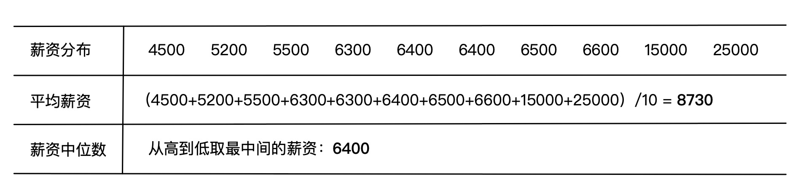

分位数被广泛应用于日常生活的各个领域，比如教育领域的成绩排布就大量使用了分位数的概念，大家最熟悉的应该就是高考录取分数线。假如某大学在A省招收 100人，而该省有 1万人报考该大学，那么该大学的录取分数线就是所有报考学生成绩的 99 分位数，也就是排名前 1% 的同学可以被录取。无论该省的高考试题是偏难还是偏简单，都能准确录取到预定的招生人数。

将分位数应用在 IT 领域的耗时指标上，可以准确的反映接口服务的响应速度，比如 99分位数可以反映耗时最高的前 1% 接口请求的处理时间。对于这部分请求来说服务的响应速度可能已经达到了一个无法忍受的程度，例如30秒钟。相对于平均耗时，耗时 99分位数额外反映了 3个重要的信息：

1. 有 1% 的服务请求可能正在忍受一个超长的响应速度，而它影响到的用户是远大于 1% 的比例。因为一次终端用户请求会直接或间接的调用多个节点服务，只要任意一次变慢，就会拖慢整体的终端体验。另外，一个用户可能会执行多次操作，只要有一次操作变慢，就会影响整体的产品体验。
2. 耗时 99 分位数是对应用性能瓶颈的提前预警。当 99 分位数超出可用性阈值时，反映了系统服务能力已经达到了某种瓶颈，如果不加处理，当流量继续增长时，超时请求影响的用户比例将会不断扩大。虽然你现在处理的只是这 1% 的慢请求，但实际上是提前优化了未来 5%、10%，甚至更高比例的慢请求。
3. 什么样的用户请求更可能触发 99 分位数的异常？根据经验表明，往往是那些数据体量大，查询条件复杂的“高端”用户更容易触发慢查询。同时，这部分用户通常是影响产品营收和口碑的高价值用户，绝不能置若罔闻，而要优先响应解决。

除了 99分位数，常用的耗时分位数还包括 99.9、95、90、50分位数，可以根据应用接口的重要性和服务质量承诺（SLA）选择适当的分位数进行监控和预警。当一条时间序列上的分位数连在一起就形成了一条“分位线”，可用于观察耗时是否存在异常的变化趋势，如下图所示：

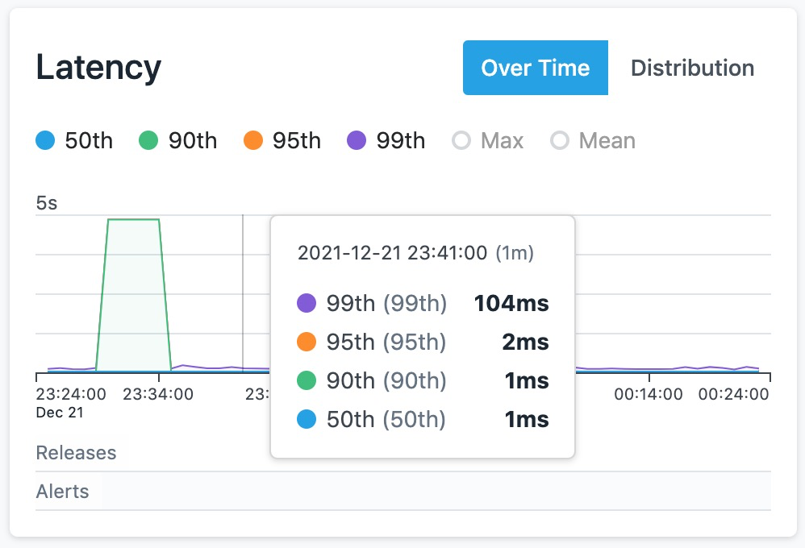

#### 耗时直方图
耗时分位数和平均值将接口响应速度抽象成了有限的几个数值，比较适合监控和告警。但是，如果要做深度的分析，识别所有请求的耗时分布情况，那就没有比直方图更适合的统计方式了。

直方图大家可能不是很熟悉，平时接触的也比较少。它的横坐标代表请求耗时，纵坐标代表请求次数，并且横/纵坐标值通常都是非等分的，因为耗时与次数的分布通常是不均衡的，使用非等分坐标轴更容易观测重要且低频的慢请求分布，而等分坐标轴很容易将低频值忽略掉。如下图所示，我们可以直观的发现不同耗时范围内的请求次数分布：耗时在 100ms 左右的请求次数最多，超过了 10000 次；耗时在 5-10s 范围内次数也不少，接近 1000 次，而超过 30s 以上的请求也有接近 10次。

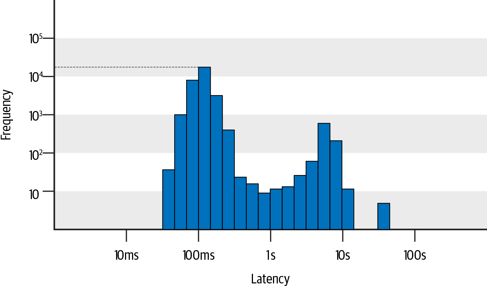

直方图可以与分位数结合使用，每一个耗时分位数都会落在直方图具体的某个区间内，如下图所示 P99 分位数落在了 3s 的区间。这样，我们不仅能够快速发现最慢的 1% 请求耗时阈值是3s，还能进一步区分这 1% 最慢的请求在 3-5s，5-7s，7-10s，10s 以上的具体分布数量。同样的 P99 分位数（3s），慢请求全部集中在 3-5s 区间，和全部集中在 10s 以上区间所反映的问题严重程度，以及问题背后的原因可能是完全不同的。

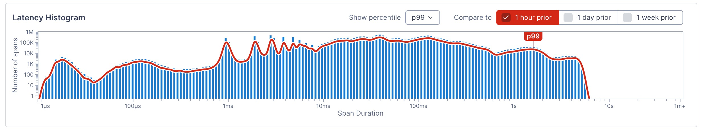

通过对比不同时段的直方图分布，我们可以精准发现每一个耗时区间的变化情况。如果你的业务是面向终端用户，每一个长尾请求都代表着一次糟糕的用户体验，那你应该重点关注耗时区间最高的那部分变化，比如 P99 分位数所在的区间；如果你的系统是负责图形图像处理，更加看重单位时间内的吞吐率，不那么在意长尾耗时，那你应该优先关注大部分请求的耗时变化，比如 P90 或 P50 所在区间的分布变化。

直方图能够为我们分析耗时问题提供更丰富的细节，在后续章节的实践案例中我们将做进一步的介绍。

### 其他度量值
请求量、错误和耗时又被称为“黄金三指标”，可以应用于绝大部分类型的链路请求，如 HTTP，RPC，DB等。除此之外，一些特殊的请求类型，具备独特的场景特性，需要一些新的度量值来表达其语义，例如缓存命中率、消息时延、任务调度时延等。这一类度量值的通用性不高，但是可以恰当地描述所属类型的关键特征。下面我们以缓存命中率为例，了解下它的典型用法。

#### 缓存命中率
小玉负责的订单中心会调用存储在 Redis 缓存中的商品详情，只有查询缓存未命中时才会去请求数据库。有一个问题一直苦恼着小玉，就是每次促销活动刚开始的时候就会出现访问量激增又下降再缓慢回升，伴随耗时大幅抖动的现象，而缓存和数据库的请求量也会相对应的抖动变化，如下图所示：


我们可以看到缓存请求量的变化是与创建订单接口大致相同的，而数据库的请求量有一个比较大幅的增长。可以初步判断是由于促销活动初期出现了大量缓存未命中，从而调用数据库导致的创建订单接口耗时异常，因为查询数据库的耗时开销要远大于缓存。那么，缓存未命中的原因又是什么呢？主要有两种常见原因，一种是查询了大量冷数据导致的缓存命中率下降，另一种是查询量激增导致缓存连接被打满，超过其服务提供能力。两种原因的具体表现可以结合缓存命中率指标进一步区分，如下图所示。

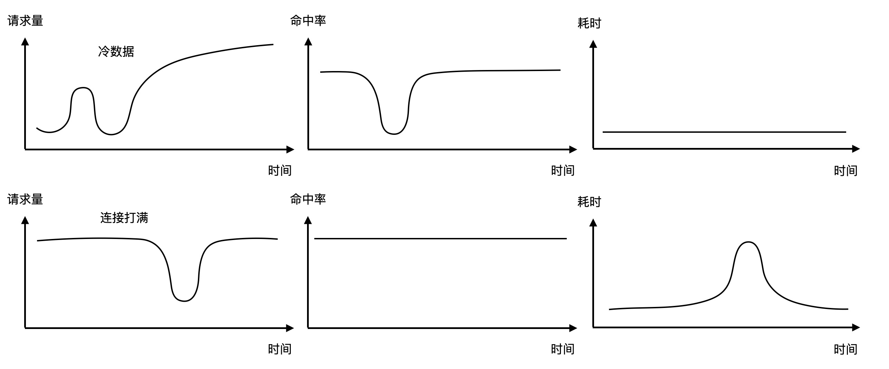

为了减少冷数据对促销活动体验的影响，可以提前进行缓存预热提高命中率；而连接打满的问题可以提前调整客户端或服务端的缓存连接池最大连接数限制，或者提前扩容。缓存命中率下降的严重后果会导致大量请求击穿数据库，最终导致整体服务不可用。因此，在生产环境中建议对缓存命中率设置告警，提前发现风险。

### 自定义度量值
除了分布式链路追踪框架默认生成的通用度量值外，我们还可以将自定义度量值添加到 Attributes 对象中，再对其执行统计、分析和告警等操作。这些自定义度量值可以很好的拓展分布式链路追踪在业务域的应用。比如，我们将每笔订单的金额添加至 Attributes 中，类似 `attributes.price = 129.0` 。接下来，按照接口维度聚合订单金额，就可以看到不同接口的关联收入，并给出相应的漏斗分析图。帮助业务同学分析哪一步行为影响了用户的最终支付，造成了潜在的营收损失，如下图所示。

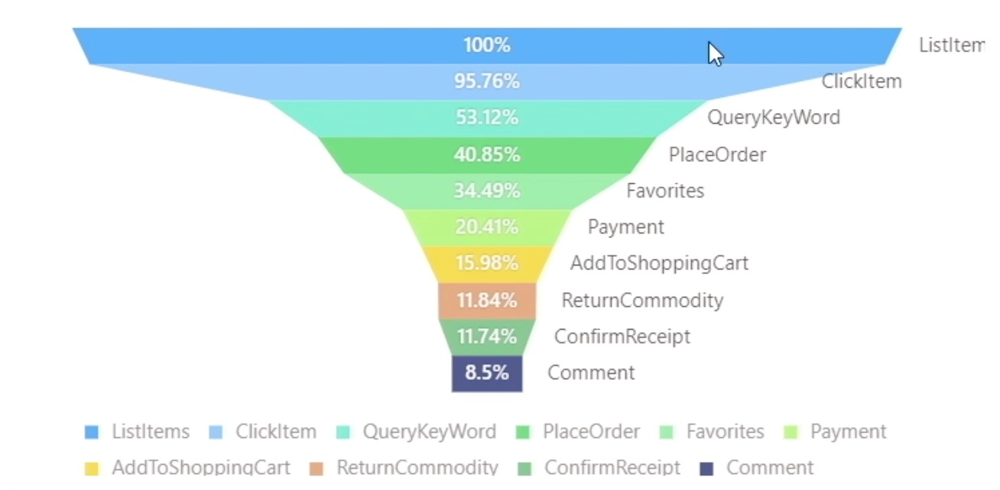


## 聚合维度
分析对象决定了我们要对哪些指标进行操作，而聚合维度决定了对该指标从多少个切面进行统计分析。通过对不同切面进行展开和对比，我们能够发现这些指标值为什么会发生这样或那样的一些变化。例如某个接口一段时间内的平均耗时为 3s，但是分布在两个不同的版本，其中 v1 版本的平均耗时只有 1s，而 v2 版本的平均耗时却高达 5s。此时，我们可以将问题明确的聚焦在 v2 版本上，观察 v2 版本相对于 v1 版本有哪些不同，进而定位耗时高的原因，如下图所示。

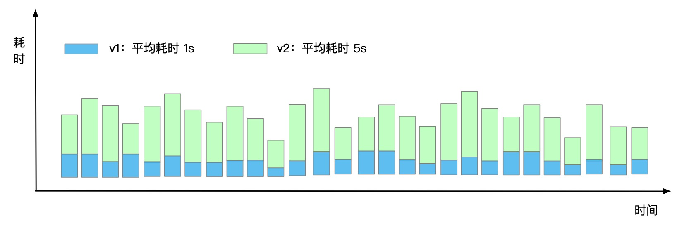

如果说分析对象回答了“是什么”的问题，那么聚合维度就回答了“为什么”的问题。选择一个恰当的聚合维度进行展开，可以帮忙我们有效的分析异常发生的特征分布，例如版本、IP、用户类型、流量类型等等。如果单个维度不足以定位问题，就需要进行多个维度的聚合分析，比如查看特定应用特定版本在不同用户类型的接口耗时变化。

与分析对象类似，常用的聚合维度可以分为链路框架自动生成的基础特征维度，以及用户自定义标签维度这两类，如下所示：

* **链路基础特征聚合：** 在链路特征筛选的章节我们介绍过链路基础特征主要是指调用链本身所具备的一些基础信息，比如接口名称，所属应用，节点IP、请求状态等等。无论是何种编程语言、何种埋点框架，这些基础特征都是由链路埋点框架自行生成的，也是最常用的聚合分析维度。目前主流的 Tracing 或 APM 产品都会提供预置的应用服务维度聚合指标，例如 Jaeger、Zipkin、Skywalking 等开源实现还会提供对应的监控大盘。
* **用户自定义标签聚合：** 除了链路基础特征以外，用户如果想要扩展业务属性，就可以通过链路 SDK 向 Attributes 里添加自定义标签，例如流量类型、用户类型、业务领域、商品类目、销售渠道等等。自定义标签提供了一种从业务视角分析流量问题的手段，灵活的运用自定义标签可以更好的发挥分布式链路追踪的数据价值。不过，由于自定义标签具有一定的埋点改造和运维成本，目前在生产环境还没有被大规模应用起来，需要 Tracing 产品提供更加灵活、成本更低的打标方案，例如白屏化动态打标，我们在后续章节再进行详细介绍。

### 基础特征与自定义标签结合使用
小玉作为订单中心的应用负责人，对于核心接口的版本更新一直非常谨慎，按照惯例，她会先在预发环境进行灰度用户引流，对比新老版本的差异，确认无误后再发布至生产环境。此时，小玉会同时对应用、接口、环境、IP等多个基础特征进行聚合，再结合自定义的版本标签对比流量状态变化，如下图所示，v1.1 新版本的接口耗时大幅上升，错误率也远高于 v1.0 版本，应该立即停止发布，回滚版本，避免影响线上用户体验。

在这个案例中，由于 v1.1 版本的灰度流量要远小于 v1.0 版本，如果没有按照版本维度进行聚合比对，新版本的异常问题就会被整体流量平均稀释掉，难以被提前发现。只能等到发布比例增加到足够大的程度，对线上用户造成更加严重的影响后，才可能被定位。

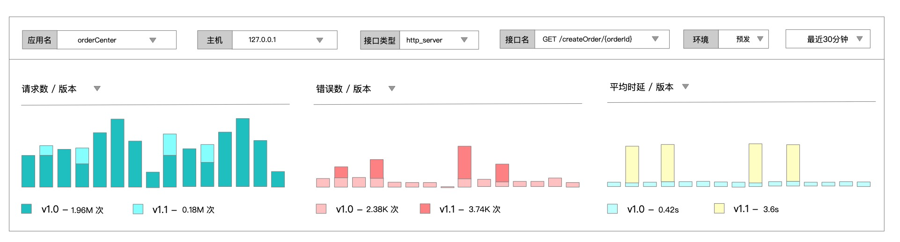


### 注意事项
不是所有的聚合维度都是有意义的，一个有效的聚合维度必须具备一个前提，就是它的值分布在有限的、肉眼可观测的数据集，而不能无限发散。比如一个日活上亿的 APP 应用，不应该直接将访问用户的 UserId 作为聚合维度，因为聚合后的上亿条曲线完全无法观测，不具备监控和告警价值。相对应的，我们可以选择用户类型作为聚合维度，区分游客、普通会员、白金会员、钻石会员等不同用户类型的访问情况。

还有一种情况是，聚合维度部分发散，比如 URL 里面有部分字段包含了时间戳，UID 等变量信息。此时，我们需要对 URL 做模糊化处理，通过收敛算法将不断变化的字段收敛成星号 *，保留不变的协议、域名、路径等，收敛前后的效果如下图所示。

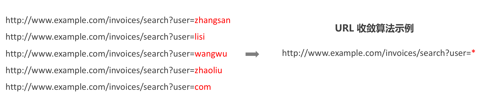


## 链路实时分析
随着时间的流逝，马上要临近双11啦，为了保障大促洪峰流量下的系统可用性，小玉的部门发起了全面治理慢调用接口的活动。小玉接到通知后，有一些发愁，虽然她已经熟练掌握了调用链的筛选与查询，但是微服务调用接口有这么多，一条条的查询调用链，每个接口全都治理一遍的成本属实有点高，即使她疯狂加班也不一定能按时完成。此时，小明建议她优先分析与治理慢调用出现次数最多的 Top10 核心接口。那么，如何快速识别出 Top10 的慢接口有哪些呢？这就是我们本小节将要介绍的链路实时分析功能。

**链路实时分析，是基于给定的调用链明细数据样本集（通常是全量数据），自由组合筛选条件与聚合规则，得出分析对象统计维度的分布结果。** 相比于链路筛选，实时分析需要指定分析对象和聚合维度，对满足筛选条件的结果集执行二次聚合（GROUP BY）操作。比如对订单中心应用耗时大于 3s 的慢请求按照接口名称维度，对请求总次数进行聚合与排序，就可以得到订单中心 Top10 接口的慢调用次数分布结果，如下所示。

```
duration>3s AND serviceName="orderCenter" | SELECT SUM(request_count) AS total_count,
 spanName GROUP BY spanName ORDER BY total_count DESC LIMIT 10
```
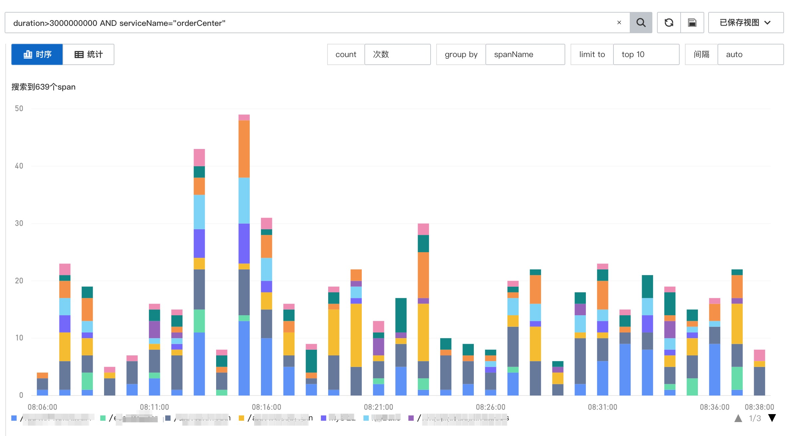

链路实时分析可以从统计分布的视角给出问题的影响面，结合自定义标签与度量值，灵活的满足各类业务分析需求。比如大于3秒的下单请求有多少次，占总请求的比例是多少？下单失败的请求集中在哪些渠道或品类？由于下单失败导致的潜在营收损失数额有多大？

灵活性是链路实时分析的最大优势，但缺点也很明显，主要有以下三点：


1. 基于明细数据的实时分析结果会受到调用链采样率的影响，一旦开启了调用链采样，基于非全量数据的实时分析结果就会产生偏差，出现样本倾斜情况，影响用户判断，分析价值会大打折扣。
2. 基于明细数据的查询分析成本较高，每次需要扫描大量原始数据，当调用链数据量较大时，分析速度会比较慢，不适合做常态化、高频次的监控与告警。
3. 实时分析需要用户给定查询与聚合条件，不支持开箱即用，使用和学习成本较高。

链路实时分析适用于个性化、低频的查询场景，而面向经典、高频查询场景，链路监控无疑是更合适的选择。

## 链路监控
为了弥补链路实时分析采样不精确、查询速度慢、使用成本高等问题，聪明的程序员想到了一个好办法，就是对链路明细数据提前进行预处理，在链路采样发生前将其预聚合成监控指标。比如上文中提到的大于 3s 的慢请求接口分布，如果在端侧提前将满足条件的 Span 记录进行预聚合，即使单位时间内满足该条件的 Span 只有1个，由于监控指标不受采样率影响，仍然可以精准记录该 Span 的调用情况；如果单位时间内同一个接口大于 3s 的 Span 非常多，比如大于 1万次，最终转化的监控指标也只有一条，后续的数据处理与存储成本将大幅下降，查询速度也会显著提升。

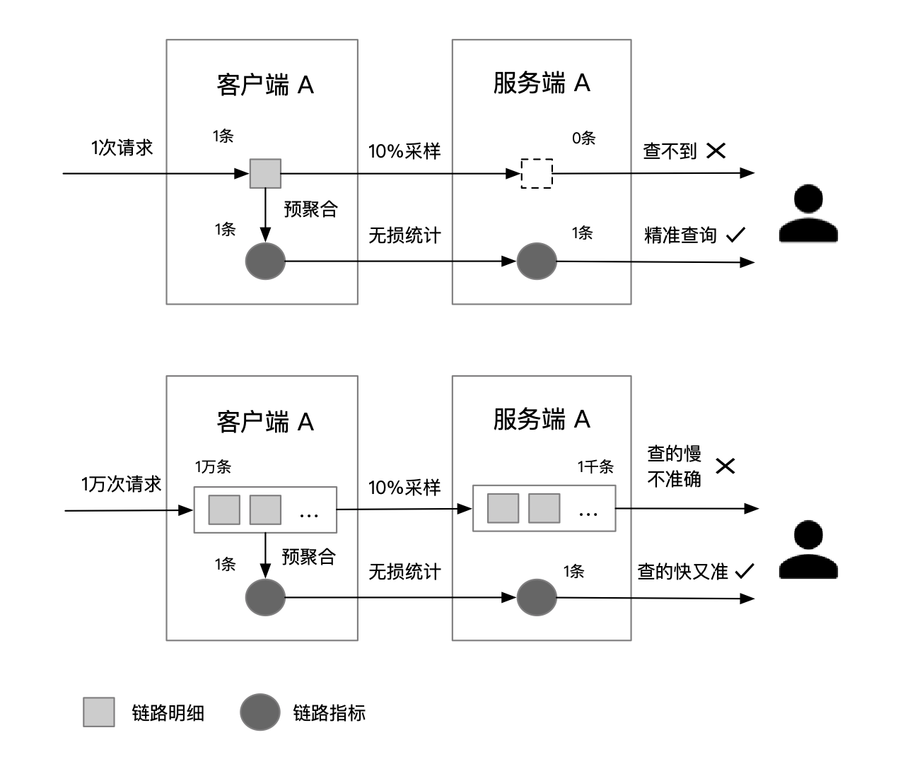

### 经典指标 vs 自定义指标
为了进一步降低用户的使用成本，大部分链路追踪开源实现或商业化产品都会面向经典查询提供开箱即用的链路指标与大盘。比较典型的包括应用流量总览，HTTP 状态码统计，数据库 SQL 统计等。

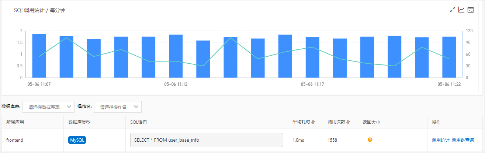

开箱即用的经典链路指标与大盘，可以满足大部分用户的通用查询需求，但是无法满足不同用户的差异化查询诉求。那么该如何平衡易用性与灵活性的天秤，低成本的释放链路数据的完整价值呢？

一种比较有效的方法就是自定义指标。比如慢 SQL 治理是一种生产系统面临的经典难题，但是不同业务类型对“慢”的定义不同，金融类系统容忍度比较低，可能大于 0.5s 就算慢。而提供文件下载服务的系统容忍度比较高，可能大于 10s 才算慢。为了平衡不同用户的差异化诉求，为每个用户生成专属的慢SQL自定义指标是个不错的选择。

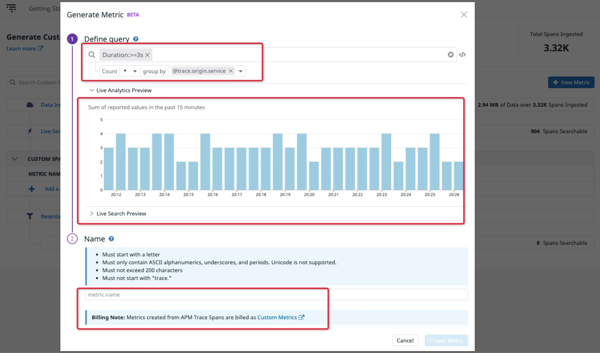

### 影响应用健康的关键链路监控有哪些?
小玉作为订单中心的 Owner，需要全力保障订单服务的稳定运行，为了实时监控应用服务的健康状态，及时处理线上风险，小玉该掌握哪些关键的链路监控大盘呢？

* **对外提供的关键接口的 RED 黄金三指标：** 作为应用 Owner，最优先要关注的就是对外提供的服务是否正常，只要对外提供的服务保持在健康水位之内，其他的指标波动不会即刻产生太大的业务影响。因此，梳理订单中心对外服务的关键接口列表，掌握它们在不同时段的流量、耗时与错误率变化特征，是小玉保障应用健康的“重中之重”。
* **SQL 响应耗时：** 慢 SQL 是影响服务健康的“致命杀手”。据不完全统计，线上系统 40% 响应慢引发的故障的罪魁祸首都是慢 SQL。因此，小玉应该重点关注 SQL 响应耗时，无论是连接慢、执行慢还是结果处理慢，都应及时跟进、尽快恢复。
* **缓存命中率：** 缓存命中率是一个影响应用健康的间接指标或预警指标，一旦缓存命中率大幅下跌，通常会伴随着数据库查询次数快速上升，压力过载，最终导致服务不可用等问题。影响缓存命中率的常见因素包括冷数据查询，缓存热点，请求量突增等，小玉应该针对性给予处理。

除了上述关键链路监控外，为了更好的保障应用健康，小玉还应关注连接池负载、FGC、CPU、内存、磁盘空间使用率、网络重传率等其他非链路数据的监控。这些内容我们将在第4章《如何保障系统可用性》再进行详述。

### 链路监控的限制
上文介绍了链路监控具备统计精度高、查询速度快、使用成本低等优势，那这种优势的代价又是什么，它还存在哪些方面的限制？接下来，让我们来了解下链路监控在数据与使用这两方面的主要限制：

* **预聚合精度：** 首先，链路监控的信息密度直接受预聚合维度的数量影响。预聚合维度数量越多，指标包含的信息就越具体，但是当预聚合维度达到最大时，指标的数量几乎等同于链路明细数据，已经失去了预聚合的意义。如果预聚合维度数量比较少，比如只有应用和接口，没有 IP，那我们就无法通过指标判断异常发生在哪些 IP，缺失了关键信息。因此，如何合理控制预聚合的维度组合，保留关键信息，是链路监控非常重要的探索性课题。
* **先验性知识：** 预聚合监控相比对后聚合实时分析，一个很重要的特点就是需要输入先验性知识，即对哪些数据在哪些维度上进行统计。这些先验性知识可以是系统内置的，也可以由用户提前输入。但是，一旦流量已经发生，就错过了预聚合的时机。预聚合规则只能作用于对未发生的链路数据，指标的生成相对于预聚合规则生效具有一定的滞后性。
* **被动式响应：** 监控这种使用方式本身受人为因素影响，需要人来“看”监控。在生产环境的实际应用中，这里就会引发两个问题，一是用户什么时候来看监控，二是用户怎么知道要看哪些监控指标？如果系统没有问题，那么用户是不需要看监控的，如果系统出了问题，用户如何第一时间知道，并且快速定位异常的监控指标？监控自身无法突破被动式响应的限制，我们可以带着这些问题来看下一小节将要介绍的链路告警功能。


## 链路告警
为了突破监控被动式响应的限制，聪明的程序员又开始琢磨，可不可以写一段程序，由它来代替人们对所有的监控指标进行周期性扫描，一旦发现某项监控指标符合了预先设定的异常特征（比如超过某个固定阈值，或环比下跌 30%），就通过短信/电话/邮件等方式主动通知用户进行处理，这就是告警。

链路告警相对于其他告警，在实现原理上并没有本质的区别，但在使用上却有不同的侧重与分工。由于链路数据描述了用户行为转化为系统请求后，在分布式系统中的流转与状态。因此，链路告警可以作为业务告警与系统告警的一个联结，起到承上启下的作用。

比如，某电商系统的交易金额突然下跌了 30%，此时，地址修改接口的错误率超过 95%，相关应用的机器也出现磁盘空间不足告警。这时，我们就可以比较清晰的判断出是由于机器磁盘空间不足，导致地址修改接口不可用，进而导致交易额下跌的业务资损。如果缺失了中间的链路告警，我们就很难明确根因，无法快速做出清理磁盘或精准扩容等故障恢复手段。

### 经典链路告警规则
与上一小节的关键链路监控类似，经典链路告警规则包括核心接口的黄金三指标告警：流量下跌、响应变慢、错误率上升。此外，异常调用次数增多、慢 SQL 与缓存命中率下跌也是比较重要的链路告警规则，可以默认启用。

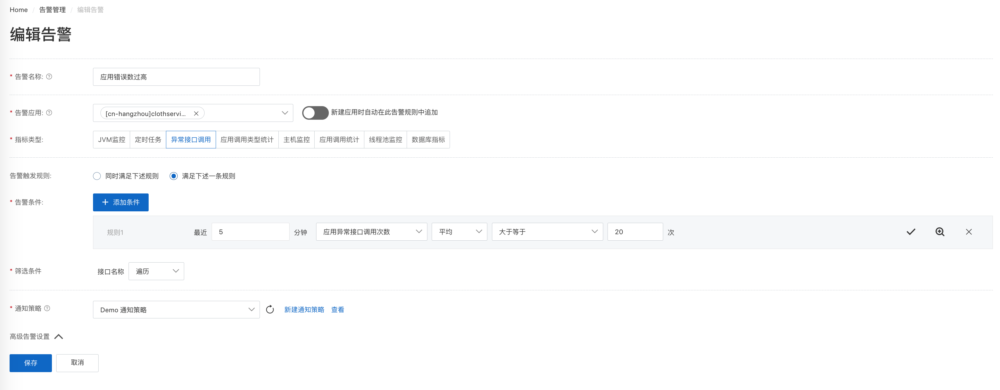
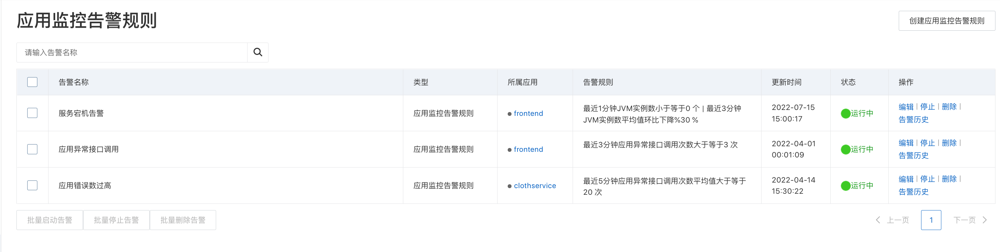

### 如何避免链路告警风暴
链路告警相比于其他类型的告警，具有一个很重要但也很容易引发问题的维度：接口名称。由于告警的有效性主要是基于统计数据的趋势变化进行判断，一旦数据呈现出明显的离散现象，就很容易造成误告警。比如某个接口的流量很小，偶尔发生一次错误调用，就很容易触发错误率超过 50% 的告警通知；再比如某个 URL 或 SQL 接口名称中包含了一个时间戳变量，导致接口极度发散，无法反映出该类接口的实际分布特征，很容易引发链路告警风暴。

因此，为了避免由接口名称引发的误告警或更为严重的告警风暴，我们可以采取以下措施：

1. 对接口名称进行模板化处理，比如抹去 URL 中不断变化的 Parameters 部分，只保留相对静态的 Path 部分。针对 SQL，只保留模板语句，不记录实际的执行语句，将 SQL 中的参数用 ？ 代替。
2. 通过自动收敛算法对接口名称进行收敛处理，尽可能避免变量导致的接口发散。
3. 设置告警规则时附加一个调用次数限制，比如过滤掉每分钟调用次数小于 10 次的接口，减少小流量接口引发的误告警。
4. 只面向核心接口设置接口粒度的告警规则，非核心接口不单独设置告警规则，只看组件类型整体的变化情况。

当然，除了接口名称以外，实例 IP 或其他自定义维度也可能导致链路告警风暴，可以通过告警抑制等手段临时屏蔽，再参考接口名称的治理手段进行告警规则优化。


## 小结
本小节详细介绍了统计分析的两个关键概念：分析对象与聚合维度，以及它们在链路实时分析、监控、告警三种不同场景下的用法与区别。三种场景的优劣势互有补充，层层递进，不仅帮助我们有效的解决了链路问题的定界，也为其他数据类型的统计分析应用提供了理论参考。因此，我们有必要汇总一下三种不同场景的特征对比表格，如下所示。

|特征对比|链路实时分析|链路监控|链路告警|
|------|----------|-------|-------|
|信息丰富度|高|低|低|
|数据准确度|低|高|高|
|查询速度|慢|快|快|
|聚合方式|后聚合|预聚合|预聚合|
|响应方式|被动式|被动式|主动式|
|使用成本|高|低|中|


## 推荐阅读
《链路追踪（Tracing）其实很简单》系列文章

- 1 什么是分布式链路追踪
	- [1.1 分布式链路追踪的起源](./链路追踪其实很简单——分布式链路追踪的起源.md)
	- [1.2 分布式链路追踪的诞生](./链路追踪其实很简单——分布式链路追踪的诞生.md)
	- [1.3 分布式链路追踪的应用与兴起](./链路追踪其实很简单——分布式链路追踪的应用与兴起.md)
	- [1.4 分布式链路追踪的挑战与限制](./链路追踪其实很简单——分布式链路追踪的挑战与限制.md)
- 2 分布式链路追踪的基础用法
	- [2.1 请求轨迹回溯](./链路追踪其实很简单——请求轨迹回溯.md)
	- [2.2 多维链路筛选](./链路追踪其实很简单——多维链路筛选.md)
	- [2.3 链路实时分析、监控与告警](./链路追踪其实很简单——链路实时分析_监控与告警.md)
	- [2.4 链路拓扑](./链路追踪其实很简单——链路拓扑.md)
- 3 分布式链路追踪的进阶指南
	- [3.1 链路功能进阶指南](./链路追踪其实很简单——链路功能进阶指南.md)
	- [3.2 链路成本进阶指南](./链路追踪其实很简单——链路成本进阶指南.md)


## 推荐产品
- [阿里云 ARMS 可观测](https://help.aliyun.com/product/34364.html)
- [阿里云链路追踪](https://help.aliyun.com/document_detail/196681.html)


## 推荐社区
【稳定大于一切】打造国内稳定性领域知识库，**让无法解决的问题少一点点，让世界的确定性多一点点。**

- GitHub 专栏地址：[https://github.com/StabilityMan/StabilityGuide](https://github.com/StabilityMan/StabilityGuide)
- 微信公众号：万物可观测
- 钉钉交流群号：30000312
- 如果阅读本文有所收获，欢迎分享给身边的朋友，期待更多同学的加入！

