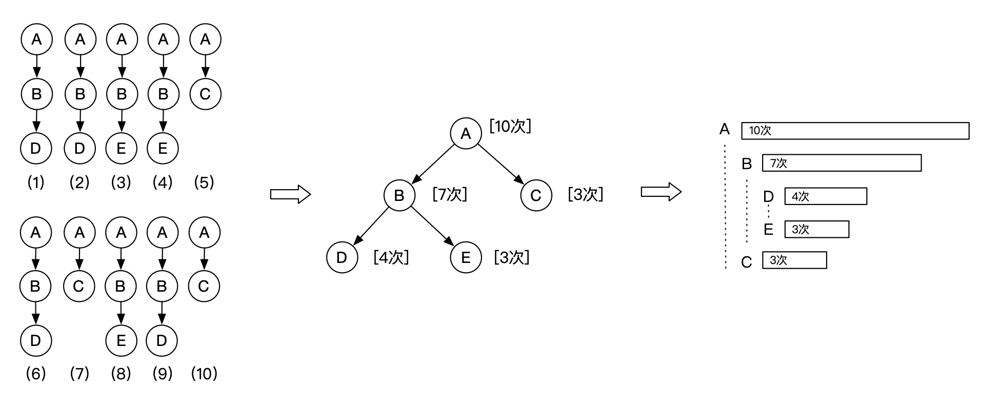
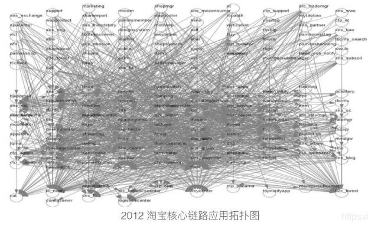
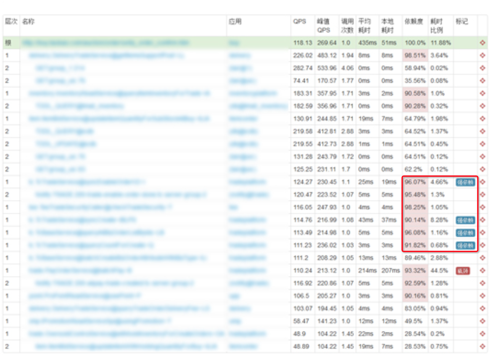
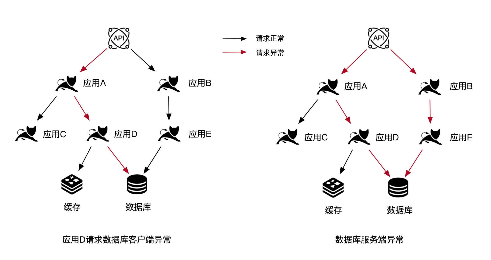
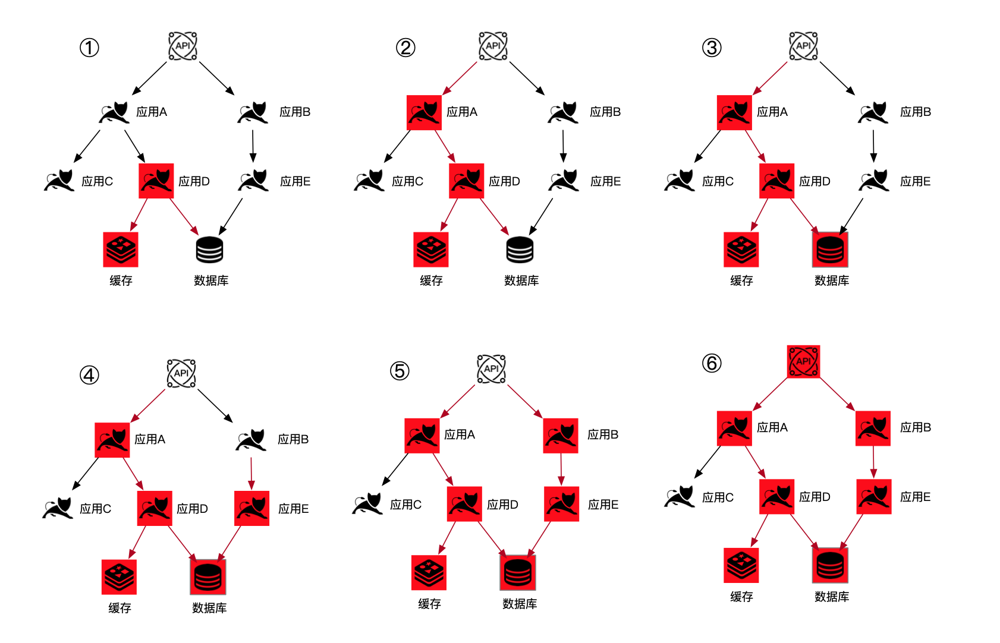
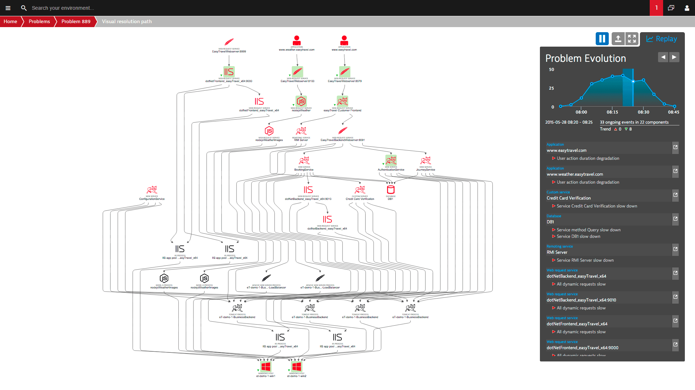
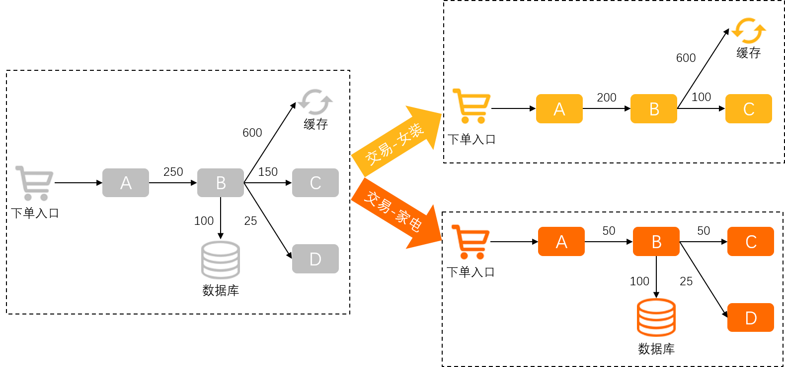
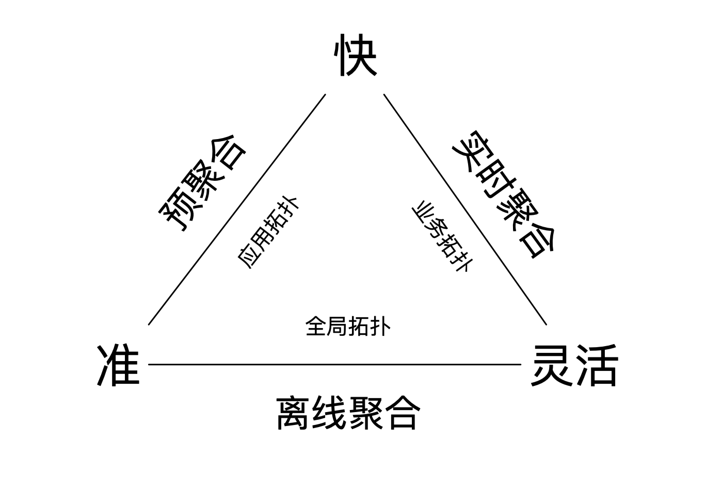
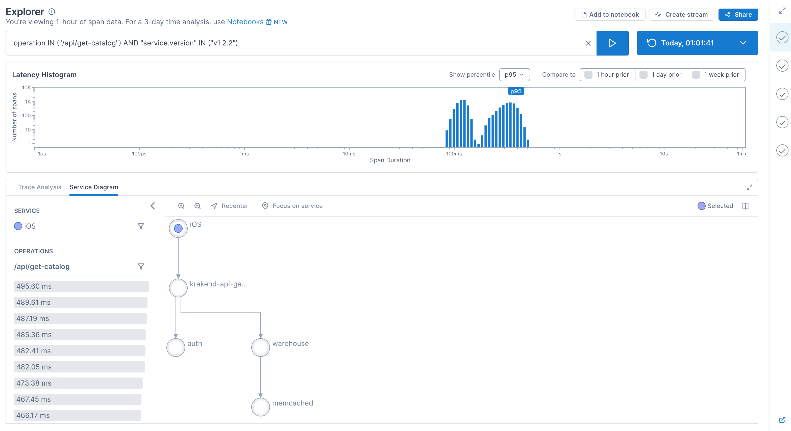
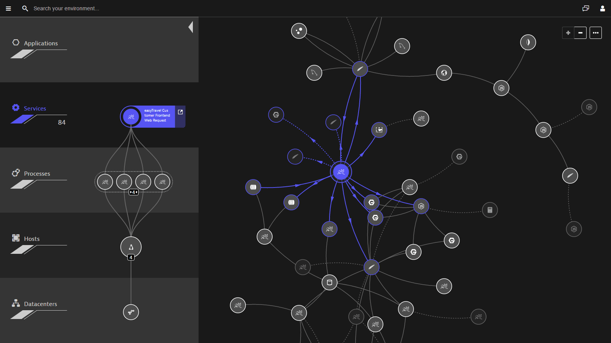

# 链路追踪（Tracing）其实很简单——链路拓扑

> 作者：夏明（涯海）    
> 创作日期：2022-07-26  
> 专栏地址：[【稳定大于一切】](https://github.com/StabilityMan/StabilityGuide)  

最近一年，小玉所在的业务部门发起了轰轰烈烈的微服务化运动，大量业务中台应用被拆分成更细粒度的微服务应用。为了迎接即将到来的双十一大促重保活动，小玉的主管让她在一周内梳理出订单中心的全局关键上下游依赖，提前拉通各方对齐重保方案。这个任务可愁坏了小玉，平时她只与直接上下游业务方打交道，现在要梳理出订单中心完整的依赖路径，头发愁掉了一大把仍然不知道该如何下手。无奈之下，小玉再次求助于万能的小明。

针对小玉的问题，小明提出了一个想法，首先调用链可以追踪一次请求的完整调用路径，但是单条调用链无法反映出所有的调用分支，也无法通过流量大小体现出依赖的强弱，而逐条分析调用链的成本又太高。那么，是否可以通过程序将一批具有相同特征（比如经过某个应用，或者调用了某个接口）的调用链聚合成一棵树，通过分析这棵树的形态与流量，就可以快速梳理出关键节点与依赖路径，而这就是链路拓扑功能的雏形。

如上图所示，入口应用 A 依赖了多个不同深度的下游应用，并且每次调用的路径并不相同。为了梳理出应用 A 的完整调用依赖，可以将多条调用链聚合成一棵树，从根节点到叶子节点的每条路径都代表着一种流量流转路径，而节点的状态反映了流量的特征，比如次数、耗时、错误率等。**通过调用链聚合，综合分析端到端流量路径与状态的方法就是链路拓扑。** 链路拓扑与调用链的关系就好比样本集与离散样本点，前者反映了整体的分布情况，可以有效避免单个样本随机性对评估结果的影响。

## 链路拓扑的经典应用场景

链路拓扑最核心的价值，就是通过分析节点间依赖路径与状态，提供强弱依赖梳理、瓶颈点分析、影响面分析、故障传播链分析等能力，下面我们来深入了解下这些经典用法。

### 强弱依赖梳理
链路拓扑最典型、最被人熟知的应用场景就是依赖梳理，特别是在一个大型分布式系统中，数以万计的应用间依赖关系复杂到令运维同学怀疑人生。下图展示了 2012 年的淘宝核心链路应用拓扑，密密麻麻如蛛网般的依赖关系已经远远超出了人工梳理的范畴，而这种情况在微服务迅猛发展的当下并不少见。

在复杂业务环境中，不仅需要梳理出依赖关系图，还需要识别哪些是影响核心业务的强依赖，哪些是“无伤大雅”的弱依赖。针对强依赖要投入更多的人力与资源，建立更加完善的保障体系，比如电话告警，联合压测等。针对弱依赖，可以考虑是否能够移除，或者建立次一级的保障措施。

区分强弱依赖的方式主要有以下几种：

1. **根据流量大小进行区分。** 这是一种简单粗暴的区分方式，大于一定流量阈值或比例的就识别为强依赖，否则视为弱依赖。这种判断方式的好处是简单清晰，可以由链路追踪平台自动识别，无需人力干预。缺点是不够准确，一些特殊的关键依赖虽然流量不大，但是却会直接影响业务的稳定性。
2. **根据同步/异步调用类型进行区分。** 这种区分方式的好处也是简单、易操作，减少了异步非阻塞（如消息）调用的干扰。缺点是在同步调用为主的业务中筛选效果不佳，而在异步调用为主的业务（红包、热点推送）可能造成误判。
3. **人工标注。** 鉴于业务的差异性，由业务 Owner 对自身依赖的直接下游的强弱性进行人工标注识别，可靠性会更高。但是这种方式对于人员经验和时间成本要求很高，并且无法自适应业务的变化。
4. **半人工标注。** 首先由链路追踪平台根据流量大小、同步/异步进行初步的强弱依赖识别，再通过有经验的同学进行人工标注修正。这样既节省了人力成本，也能有限度的自适应未来的业务变化。

强弱依赖梳理是相对低频的工作，通常发生在在大促或重保活动准备阶段、新应用上线或老应用下线、上云搬站等场景。比如阿里在每年双十一大促前，都会梳理核心业务的强弱依赖，并与往年进行对比，以便更好的进行针对性保障。

### 瓶颈点/影响面分析
链路拓扑在问题诊断领域最常见的用法就是瓶颈点分析与影响面分析。前者是从当前节点向下游寻找导致问题发生的原因，主要用于问题定位；而后者是从问题节点向上游分析被影响的范围，主要用于业务风险定级。

接下来，我们通过一个数据库异常的案例，对比下这两种用法与视角的区别，如下图所示。

* 某天上午，应用 A 的管理员收到用户反馈服务响应超时，通过查看链路拓扑状态，发现 A 应用依赖的 D 应用接口变慢，而 D 应用调用数据库接口也出现异常。因此，小 A 通知小 D 即刻排查数据库连接等状态，尽快恢复可用性。这就是一个瓶颈点分析的过程。
* 由于小 D 业务不熟练，半小时过去了还没有完成有效的恢复动作，并且触发了数据库服务端异常。负责 DB 运维的同学收到数据库服务端告警后，通过链路拓扑向上回溯业务影响面，发现直接依赖的 D、E 两个应用均出现了大量慢 SQL，并导致间接依赖的应用 A、B 出现不同程度的服务响应超时。果断执行了数据库扩容，最终恢复了全部应用的正常访问。这就是通过影响面分析，辅助运维决策的过程。

瓶颈点与影响面分析主要是基于一段时间内的静态拓扑数据，并没有体现时间变化对拓扑节点状态的影响，无法回溯故障传播的过程。如上图右侧所示，如果只看这一张拓扑，我们难以判断出导致数据库服务端异常的应用到底是 D 还是 E。那么，是否能够动态回放链路拓扑的变化，更直观的分析问题源与传播趋势？答案无疑是肯定的，请看下文介绍。

### 故障传播链分析

抛开时间的维度，问题源与影响面的边界并不是很清晰。一个被影响方可能会成为新的问题源，引发更大的故障。因此，为了能够更加真实的还原故障演变过程，我们需要观察并对比一组时间线连续的静态链路拓扑快照集，通过不同快照之间节点状态的变化还原故障传播链。这就好比通过监控视频还原凶案发生过程，要比单独的一张照片更加可靠。

以上一小节的数据库故障为例，一开始应用 D 由于请求缓存未命中，从而大量请求数据库导致慢 SQL，进而影响上游应用也出现响应超时。随着情况继续恶化，数据库服务端也开始过载，进而影响了应用 E 的正常调用。最后，应用 A、B 均出现大量响应超时，API 网关由于连接不足开始拒绝访问，引发更大面积的服务不可用。

在真实生产环境中，拓扑依赖与故障传播的过程可能会更加复杂，为了简化分析过程，可以根据一定规则将节点状态提取为各类异常事件，观察不同时刻的异常事件数量也可以辅助判断故障发生、传播与恢复的过程，如下图所示。

## 链路拓扑聚合维度
链路拓扑的聚合维度决定着拓扑节点的类型，面向不同的用户角色，提供了差异化的分析视角。在实际应用中，最典型的三种链路拓扑聚合维度分别是应用、接口与自定义维度，分别对应着应用拓扑、接口拓扑和业务拓扑。

* **应用拓扑，** 顾名思义就是根据应用名称进行链路聚合，反映了应用间的依赖关系与总体流量状态。由于数据聚合粒度较粗，局部异常会被平均值掩盖，不适合精细化的问题诊断，更适合全局依赖梳理与重大故障定界，用户角色偏向于 PE 运维或 SRE 稳定性负责人。
* **接口拓扑，** 是在服务接口这一维度进行的链路聚合，相比于应用拓扑更贴近研发视角，因为日常迭代的对象通常是某个具体的服务接口，无论是新接口上线、老接口下线或核心接口重保，接口粒度的链路拓扑更符合研发测试流程与职责划分习惯。应用与接口都是链路追踪领域的基础对象，对应的拓扑可以由链路追踪平台自动生成，无需过多的人工干预，使用起来较为方便。
* **业务拓扑，** 是根据自定义维度聚合生成的偏业务视角的链路拓扑，通常比接口维度要更深一级，比如某个下单接口可以根据商品类目维度进一步细分为女装或家电，如下图所示。业务拓扑一般无法由链路追踪平台自动生成，需要用户结合业务特性定制聚合规则。此外，自定义维度的来源比较广泛，可以是手动添加的 Attributes 自定义标签，也可以是 HTTP 请求出入参，或者是所在机器的环境标签。在这方面，开源社区缺乏相应的标准，而各大厂商的商业化实现差异也比较大。

综上所述，不同聚合维度生成的链路拓扑具备不同功能定位与特性，如下表所示：

|链路拓扑|聚合维度|用户角色偏向|功能定位|数据粒度|使用成本|
|------|-------|-------|-------|------|-------|
|应用拓扑|应用名称|PE、SRE|全局故障定界|粗|低|
|接口拓扑|服务接口|应用研发|服务问题定位|中|低|
|业务拓扑|自定义维度，如商品类目|业务研发|业务问题定位|细|高|

## 链路拓扑生成方式
为了最大程度的保留链路数据的端到端关联信息，链路拓扑通常是基于调用链明细数据直接聚合生成，而不是基于指标数据的二次聚合。细心的读者可能会发现这里隐藏着一个颇具挑战的技术难题，就是如何平衡海量链路数据聚合的实时性、准确性与灵活性。理想情况下，我们希望基于符合条件的全量调用链明细数据快速生成最真实的链路拓扑，实现“又快又准又灵活”。但在实际应用中，鱼与熊掌不可兼得，我们只能在“快”、“准”、“灵活”之间进行抉择，也因此衍生出了不同的链路拓扑生成流派。

### 实时聚合
实时聚合是根据用户指定查询条件，动态筛选调用链并生成拓扑图的一种方式。这种方式的好处是实时性较高，使用非常灵活，可以指定任意条件，比如查看大于 3S 的调用链生成的拓扑，或者仅包含异常调用的拓扑。缺点是当满足条件的调用链明细数据量超过一定阈值后，可能会打爆实时聚合计算节点，因此，通过会设定一个聚合条数上限，比如5千条，牺牲一定的数据精确度，换来极高的灵活度与实时性。

### 离线聚合
离线聚合是根据一组事先定义好的聚合规则，周期性生成拓扑数据的一种方式。例如不包含任何筛选条件的应用、接口这种基础拓扑数据就可以通过离线聚合生成。这种聚合方式的好处是可以利用离线计算的水平扩展性，支撑海量链路数据的聚合计算，生成结果会更加准确。缺点是实时性较差，聚合规则变更到新拓扑生成的周期较长。离线聚合通常用于全局拓扑数据的精确计算。

### 预聚合
预聚合是一种理论上可行的拓扑生成方式，它的思路是从入口节点开始，不断向下透传全链路的完整调用路径信息，并在端侧生成相应的预聚合指标。不考虑透传信息的长度限制与端侧预聚合开销，这种方式的好处就是节省了在服务端将明细数据转化为拓扑数据的过程，实现又快又准的目标。但是缺陷就是不支持自定义规则，否则透传与预聚合的开销会直线上升，影响业务进程的性能与稳定性。预聚合的原理示意图如下所示。

## 3D 拓扑
流量与资源是一对“好兄弟”，二者密切相关。流量影响着资源分配，而资源反过来又约束着流量状态。大部分流量异常归根结底是资源配额不足或分配不合理导致的，比如峰值流量瞬间耗尽资源，或者流量不均导致的“热点”等。我们在定位流量异常根因的过程中，往往需要结合相对应的资源状态进行分析；反过来，当一个资源节点出现异常时，我们也希望知道它会影响其上运行的哪些流量？因此，在代表流量的链路拓扑上，关联相对应的资源数据，形成更加完整的 3D 拓扑，貌似是个不错的选择。

如下图所示，3D 拓扑不仅包含 PaaS 层的应用、接口流量节点状态与依赖，还可以下钻查看相对应的 IaaS 层进程、实例等资源状态。3D 拓扑为流量与资源建立了一个连接，帮助我们更直观的定位资源瓶颈引发的流量异常问题。

3D 拓扑以一种巧妙的方式传递了更多的信息，但是它也有一个非常致命的缺陷，就是信息密度过于集中。在复杂拓扑环境下，表现可能还不如 2D 拓扑来的直观，大大降低了它的实用价值。如下图所示，当实例规模达到数百，接口数量达到上千时，3D 拓扑交互上的复杂性显著降低了诊断排查的效率，更多用于大屏展示。

为了降低 3D 拓扑的交互成本，一种可能的思路是结合智能诊断技术，自动突出异常链路，精准收敛展示数据范围。不过，这对于技术与产品的要求较高，实用性还有待大量真实生产环境的检验。

## 推荐阅读
《链路追踪（Tracing）其实很简单》系列文章

- 1 什么是分布式链路追踪
	- [1.1 分布式链路追踪的起源](./链路追踪其实很简单——分布式链路追踪的起源.md)
	- [1.2 分布式链路追踪的诞生](./链路追踪其实很简单——分布式链路追踪的诞生.md)
	- [1.3 分布式链路追踪的应用与兴起](./链路追踪其实很简单——分布式链路追踪的应用与兴起.md)
	- [1.4 分布式链路追踪的挑战与限制](./链路追踪其实很简单——分布式链路追踪的挑战与限制.md)
- 2 分布式链路追踪的基础用法
	- [2.1 请求轨迹回溯](./链路追踪其实很简单——请求轨迹回溯.md)
	- [2.2 多维链路筛选](./链路追踪其实很简单——多维链路筛选.md)
	- [2.3 链路实时分析、监控与告警](./链路追踪其实很简单——链路实时分析_监控与告警.md)
	- [2.4 链路拓扑](./链路追踪其实很简单——链路拓扑.md)
- 3 分布式链路追踪的进阶指南
	- [3.1 链路功能进阶指南](./链路追踪其实很简单——链路功能进阶指南.md)
	- [3.2 链路成本进阶指南](./链路追踪其实很简单——链路成本进阶指南.md)

## 推荐产品
- [阿里云 ARMS 可观测](https://help.aliyun.com/product/34364.html)
- [阿里云链路追踪](https://help.aliyun.com/document_detail/196681.html)

## 推荐社区
【稳定大于一切】打造国内稳定性领域知识库，**让无法解决的问题少一点点，让世界的确定性多一点点。**

- GitHub 专栏地址：[https://github.com/StabilityMan/StabilityGuide](https://github.com/StabilityMan/StabilityGuide)
- 微信公众号：万物可观测
- 钉钉交流群号：30000312
- 如果阅读本文有所收获，欢迎分享给身边的朋友，期待更多同学的加入！

