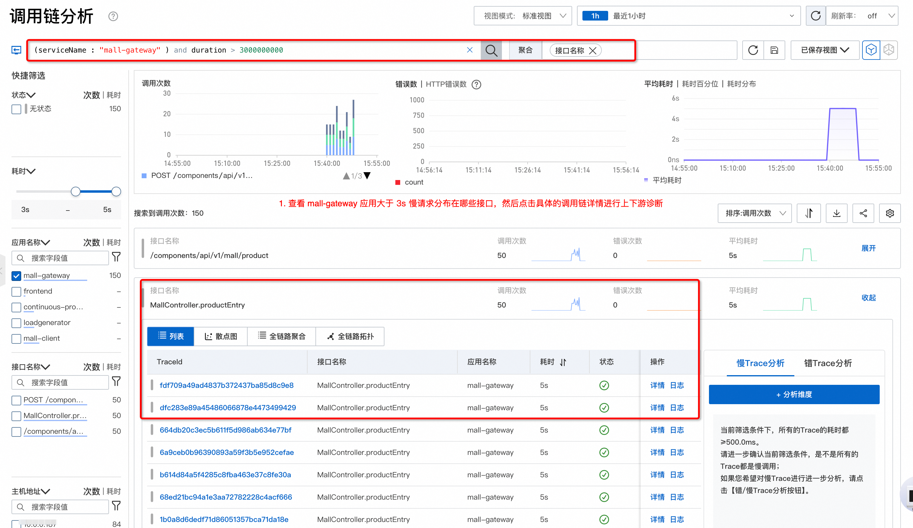
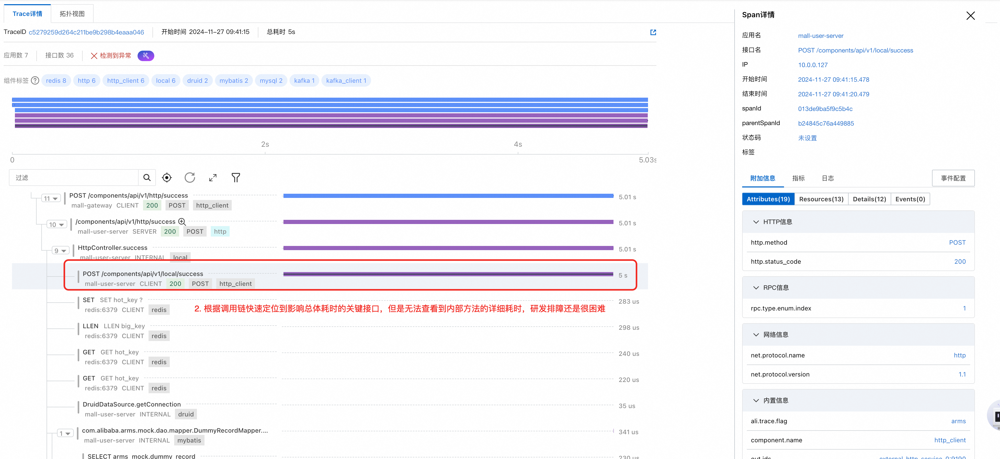
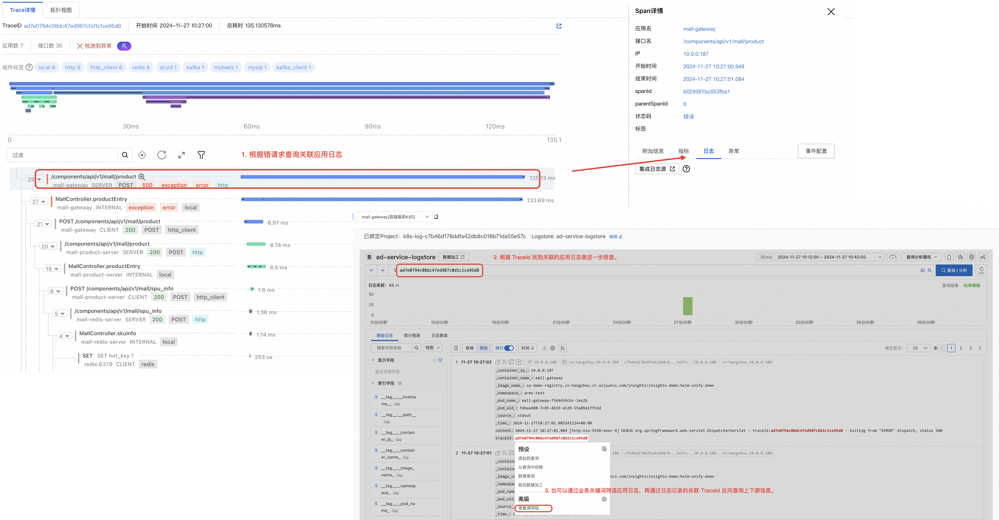
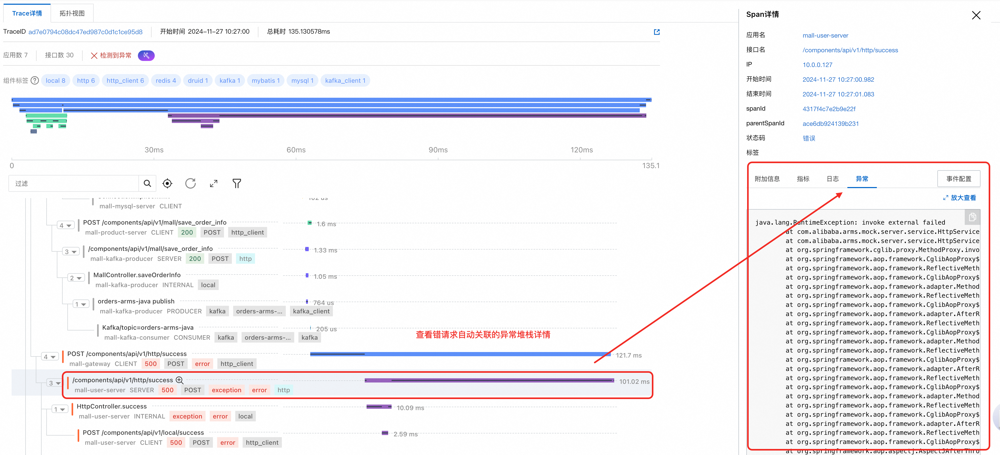
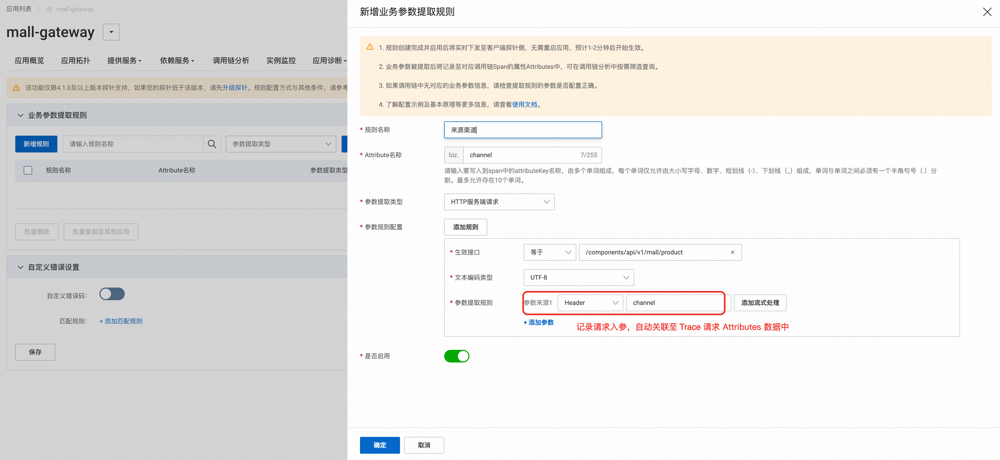
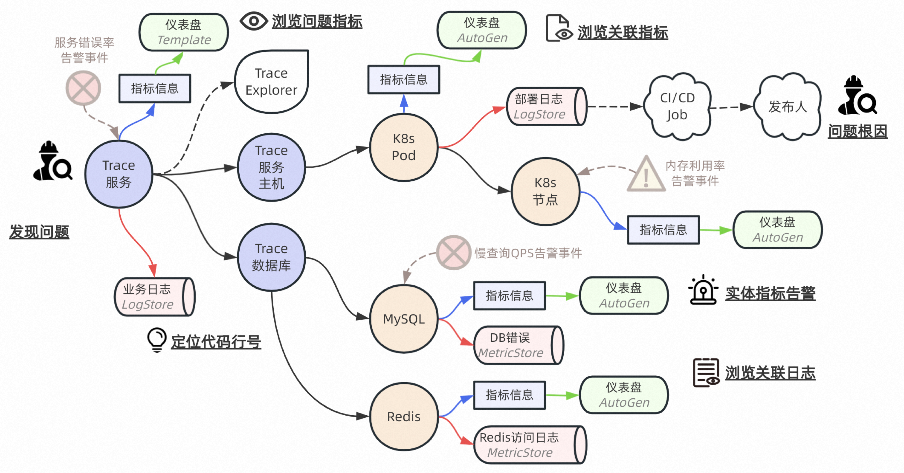
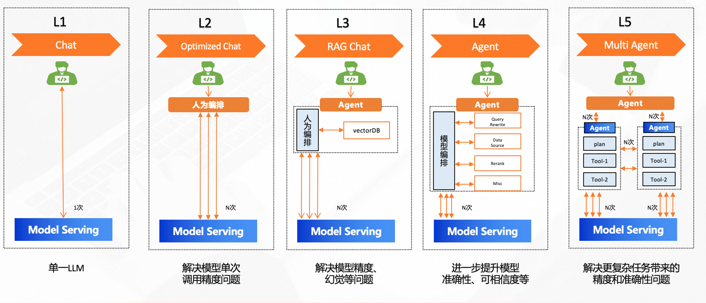

# 链路追踪（Tracing）其实很简单——链路诊断1分钟定位错慢根因

> 作者：夏明（涯海）    
> 创作日期：2024-12-16  
> 专栏地址：[【稳定大于一切】](https://github.com/StabilityMan/StabilityGuide) 

线上应用风险主要分为“错”、“慢”两大类。其中“错”的原因通常是程序运行不符合预期，比如 JVM 加载了错误版本的类实例，代码运行进入异常分支，环境配置错误等。而“慢”的原因通常是资源不足，比如突发流量导致 CPU 飙升，数据库大查询导致连接池打满，内存泄漏导致持续 FGC 等等。

无论是“错”问题，还是“慢”问题。从研发运维视角，都希望能够快速止损、定位根因、消除隐患。然而，面对复杂的应用间依赖，如何抽丝剥茧快速定位异常节点，深入分析异常背后的根本原因，并在极短的时间完成定位与恢复动作，每一步都面临巨大的技术挑战。

根据近十年 APM 领域产品研发与客户支持经验，总结了一套行之有效的错慢请求根因诊断方案，主要包括以下几点：

1.  **根据 Trace 链路及关联数据定位错慢请求异常对象**：链路追踪可以跟踪一次请求在分布式系统中的流转路径与状态，同时将这次请求发生过程中的日志、方法栈、出入参、异常堆栈等数据精准关联，实现异常代码行级定位。比如用户在APP下单超时，通过前后端链路追踪结合方法栈，最终定位到A应用B接口C方法耗时超过3s，影响了终端客户体验。

2.  **根据异常对象关联的实体数据分析真实根因**：代码执行报错或缓慢只是问题表象，导致变化发生的原因可能是一次未经灰度验证的应用发布，或是底层基础设施故障，亦或是业务流量突增导致共享资源不足。这些信息与异常对象存在着直接或间接的关联关系，需要构建更广泛的跨域实体关联才能完成深层次定位。比如A应用正常访问数据库B突然出现许多慢SQL，通过数据库客户端与服务端实体关联，就能快速定位到数据库服务端连接池打满（受到C应用大查询影响）。

3.  **高质量数据+领域知识+大模型算法实现智能根因诊断**：线上系统的复杂性，决定了根因诊断会涉及海量实体的多模态数据综合分析，对于数据丰富度、质量、排查经验与时效性均有极高的要求。构建统一可观测平台实现端到端全栈数据采集，遵循一套语义构建统一实体关系模型，再结合LLM大模型编排与领域知识库，最终实现面向错慢诊断等经典运维场景的自动化归因。

## 基于链路及关联数据定位错慢请求异常对象

基于 TraceId 可以实现请求粒度的轨迹回溯与数据关联。但是，错慢请求的诊断流程略有不同：慢请求诊断的关键点在于找到真正耗时的代码行。而错请求则分为服务报错与业务报错两类，前者依赖异常堆栈，后者需要结合业务日志与方法入参进行辅助判断。

### 慢请求诊断：链路+方法栈

慢请求诊断的难点在于，如何找到影响总体耗时的关键路径，并细化到方法粒度（代码行）指导研发排障。传统的链路追踪技术都是通过插桩法实现通用接口埋点，无法抓取完整的本地方法栈。因此，一线开发人员经常遇到定位到慢接口，但是不知道内部方法耗时，难以优化代码解决隐患。

例如阿里云 ARMS 提供的持续剖析-代码热点功能，可以常态化自动抓取慢请求的完整本地方法栈，实现行级代码定位，大幅提升慢请求定位效率，如下所示。

1.  根据应用、接口、耗时等参数筛选出满足条件的调用链。查看慢请求分布特征，比如是否集中在某一台机器（疑似单机故障），再展开分析具体的调用链详情。  
	

2.  根据调用链瀑布图定位到影响总体耗时的关键服务接口，完成问题初步定界。  
	

3.  根据代码热点记录的当次慢请求关联的完整本地方法栈，直接定位业务异常代码行，指导研发同学优化代码。

通过以上步骤，我们实现了基于链路与关联数据（方法栈）定位慢请求异常代码行的过程。研发同学拿到慢方法的具体代码行及上下游调用关系，就可以通过优化代码逻辑解决慢请求问题。

### 错请求诊断：链路+日志+异常堆栈/请求参数

错请求可以分为请求报错与业务报错两类。前者属于程序运行不符合预期，比如 HTTP 5XX 错误抛出 RuntimeException。而后者则是业务逻辑不符合预期，比如用户下单使用优惠券失败，原因可能是优惠券已失效，但是服务调用是正常的。针对不同类型的错误，排查流程略有差异，但关键操作包括以下几类：

1.  链路与日志双向关联跳转：排查系统报错时，可以从微服务调用视角找到错误调用链，再查看关联的应用日志。而排查业务报错时，可以先检索应用日志里的业务关键词，再通过日志关联的TraceId 反向查询上下游信息。  
	

2.  链路关联异常堆栈：以 Java 应用为例，系统报错通常会抛出特定异常（包含详细的错误原因与调用堆栈），通过 TraceId 准确关联当次请求的异常堆栈，可以加速研发排障效率。  
	

3.  链路关联请求出入参数：不同的请求入参可能会影响程序执行分支，比如不同渠道优惠策略有差异。因此，在排查一些疑难问题时，还需要结合当次请求的方法入参进行判断。而出参由于数据量不可控（比如一次数据库大查询返回几万行数据），通常只记录 ResponseSize 而不是完整结果。  
	

通过链路与日志、异常堆栈、请求参数等信息的关联，我们可以精准识别每一次请求关联的异常信息，有效提升错请求诊断效率。

## 构建统一实体关系模型分析异常对象真实根因

通过链路及其关联数据，我们可以快速定位错慢请求的异常对象，但是导致问题发生的真实根因，往往更加复杂，不局限于应用进程内。为了快速止血或彻底根治，我们需要采集更大范围的观测数据，并通过统一实体模型构建异常对象与根因之间的联系。

最简单最常见的实体关联，就是在相同时间范围内，同一台主机实例的数据关联。比如 A 应用部署的某台物理机出现硬件故障，故障期间没有及时切流导致路由到该机器的所有流量全部超时报错，最终导致业务受损。以 Java 应用为例，ARMS 提供了丰富的主机监控数据用以诊断单机问题，包括主机/Pod系统指标、JVM GC/堆内存、线程池/连接池等。

更广义的实体关联，还包括移动终端、网关、数据库、K8S 工作负载、CI/CD 任务甚至是 Git 代码提交人。这些跨域实体及其关系最终构建了一张覆盖端到端全栈 IT 软硬件设施的数据观测网络。任意实体的变化会导致上下游关联实体的联动反应，例如 A 同学执行了一次数据库 B 实例的索引变更，导致 C 应用出现大量慢 SQL，进而影响 D 终端用户下单失败。通过构建统一实体关系模型，可以打通跨域数据连接壁垒，提升根因诊断效率，并为智能诊断打下坚实的基础，如下图所示。

## 高质量数据+领域知识+大模型算法=智能根因诊断

智能根因诊断不是一个新的概念，学术和工业界都有大量的探索与成果，但只要技术还在不断迭代，线上系统还存在稳定性风险，智能根因诊断就是一个历久弥新的课题，需要不断进行突破。

那么相比以往，当下的技术或环境发生了哪些显著变化，可以进行哪些新的尝试和探索？

1.  更大范围更高质量的数据采集：随着可观测技术迭代与开源标准的的统一，我们可以采集到更加丰富的全栈观测数据（比如车机终端、4层网络、系统内核等），以OpenTelemetry 为代表的可观测数据标准逐步被更多开发者和厂家接受，数据孤岛效被逐步破除（比如基于 W3C 标准实现端到端全链路追踪）。巧妇难为无米之炊，高质量数据就好似新鲜的食材，是做成智能根因诊断这道美味佳肴的基础。

2.  大语言模型带来的算法革新：传统的基于规则的根因诊断，难以泛化到通用场景，比如慢SQL语法优化。基于概率统计的算法则具有较大的不确定性与算力瓶颈。基于 LLM Multi-Agent 有希望取得更好的智能诊断效果，首先利用大模型可以提升人机交互体验与通用领域问题解答，结合 RAG 运维领域知识库可以解决模型精度或幻觉问题，通过 Workflow 模型编排可以实现整体任务的拆解、剪枝与执行。

目前阿里云 ARMS 已经基于 LLM 大模型实现了单链路智能诊断，综合调用链、方法栈、异常堆栈、SQL、指标等多模态数据，结合链路诊断领域专家经验，有效识别单次请求的错慢根因，并给出相应的优化建议。

如下图所示，该次请求报错的根因是 service-coupon-apm3 应用 /coupon/coupon/member/list 接口内部的 queryMemberCoupons 方法执行了数据库查询，该 SQL 的 WHERE 子句使用了空集合（）作为IN操作符，最终导致语法报错。

通过 Copilot 可以有效提升错慢请求根因诊断效率，降低用户诊断门槛。后续会应用到监控告警根因诊断与影响面分析等更多场景。诚然，Copilot 目前仍面临模型调用耗时长，诊断结论输出不够稳定等诸多问题。但是，随着更多数据、知识和算法的迭代，基于大模型的根因诊断无疑开辟了一条新的智能化之路。

## 推荐阅读
《链路追踪（Tracing）其实很简单》系列文章

- 1 什么是分布式链路追踪
	- [1.1 分布式链路追踪的起源](./链路追踪其实很简单——分布式链路追踪的起源.md)
	- [1.2 分布式链路追踪的诞生](./链路追踪其实很简单——分布式链路追踪的诞生.md)
	- [1.3 分布式链路追踪的应用与兴起](./链路追踪其实很简单——分布式链路追踪的应用与兴起.md)
	- [1.4 分布式链路追踪的挑战与限制](./链路追踪其实很简单——分布式链路追踪的挑战与限制.md)
- 2 分布式链路追踪基础用法
	- [2.1 请求轨迹回溯](./链路追踪其实很简单——请求轨迹回溯.md)
	- [2.2 多维链路筛选](./链路追踪其实很简单——多维链路筛选.md)
	- [2.3 链路实时分析、监控与告警](./链路追踪其实很简单——链路实时分析_监控与告警.md)
	- [2.4 链路拓扑](./链路追踪其实很简单——链路拓扑.md)
- 3 分布式链路追踪进阶指南
	- [3.1 链路功能进阶指南](./链路追踪其实很简单——链路功能进阶指南.md)
	- [3.2 链路成本进阶指南](./链路追踪其实很简单——链路成本进阶指南.md)
- 4 分布式链路追踪最佳实践
    - [4.1 链路诊断1分钟定位错慢根因](./链路追踪其实很简单——链路诊断1分钟定位错慢根因.md) 

## 推荐产品
- [阿里云 ARMS 可观测](https://help.aliyun.com/product/34364.html)
- [阿里云链路追踪](https://help.aliyun.com/document_detail/196681.html)

## 推荐社区
【稳定大于一切】打造国内稳定性领域知识库，**让无法解决的问题少一点点，让世界的确定性多一点点。**

- GitHub 专栏地址：[https://github.com/StabilityMan/StabilityGuide](https://github.com/StabilityMan/StabilityGuide)
- 微信公众号：万物可观测
- 钉钉交流群号：30000312
- 如果阅读本文有所收获，欢迎分享给身边的朋友，期待更多同学的加入！

