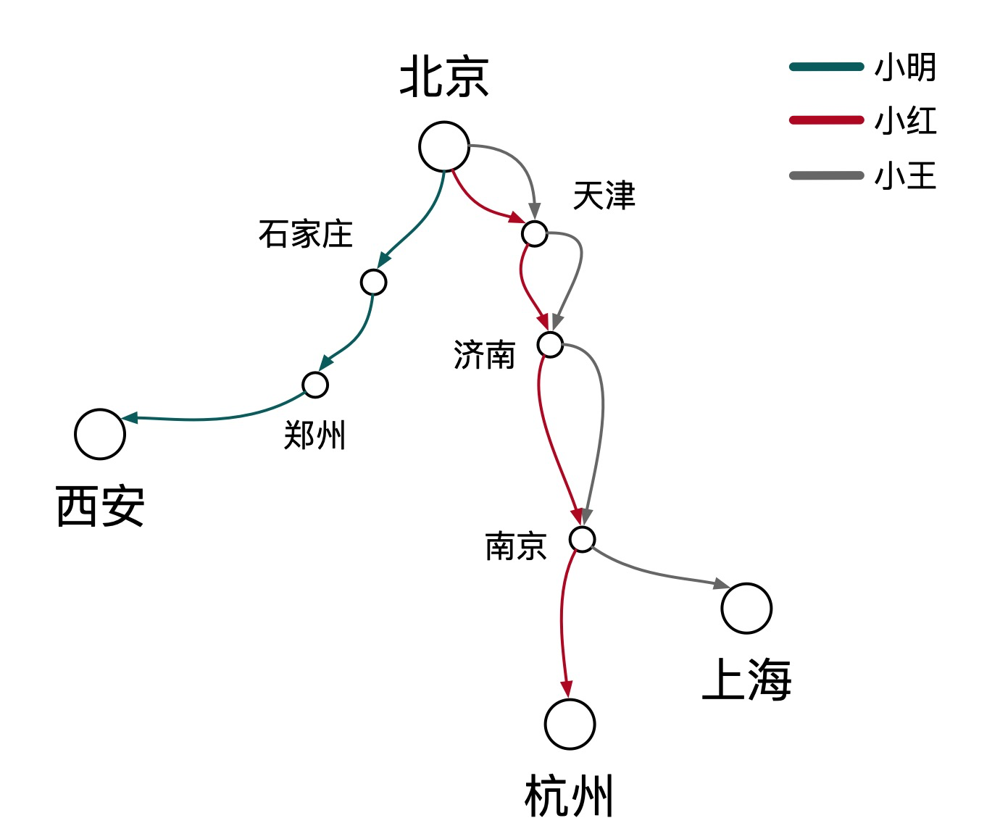
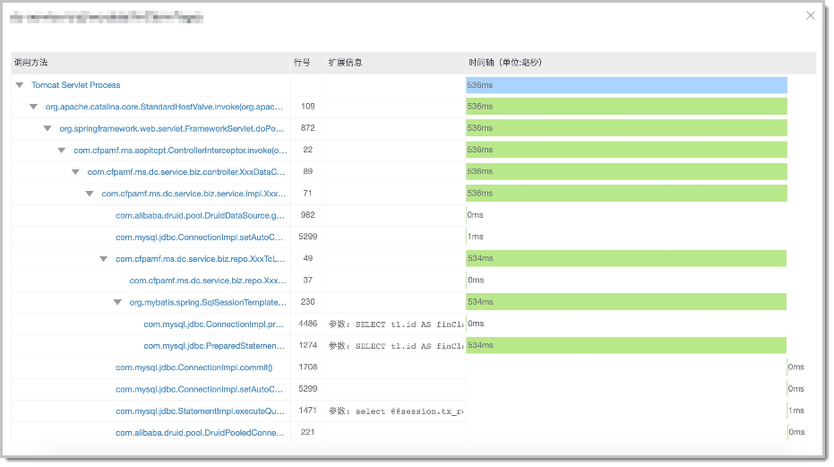
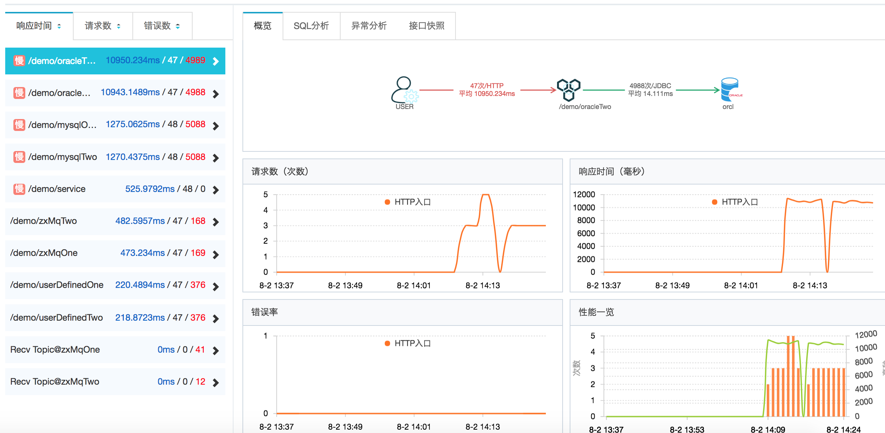
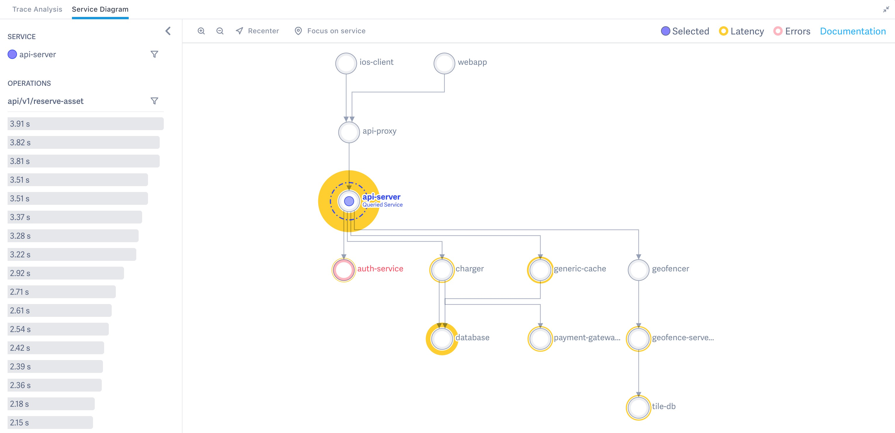

# 链路追踪（Tracing）其实很简单——初识

> 作者：夏明（涯海）    
> 创作日期：2019-09-19  
> 专栏地址：[【稳定大于一切】](https://github.com/StabilityMan/StabilityGuide)  
> PDF 格式：[链路追踪（Tracing）其实很简单——初识](https://github.com/StabilityMan/StabilityGuide/blob/master/docs/diagnosis/tracing/pdf/链路追踪（Tracing）其实很简单——初识.pdf)

狭义上的链路追踪（Tracing），是指跟踪请求在分布式系统中的流转路径与状态，协助开发运维人员进行故障诊断、容量预估、性能瓶颈分析与调用链路梳理等工作。技术实现上包含了数据埋点、采集、存储、分析、可视化等环节，形成了一套完整的技术体系。

而更广义的链路追踪，则涵盖了由数据透传能力衍生出的生态系统，比如全链路压测、场景链路、业务全息排查等。我们可以为调用链路赋予业务语义，也可以将一次调用生命周期内的所有数据进行关联整合，而不再局限于链路数据本身。

由此可见，链路追踪的应用场景广阔，潜力巨大，它的核心属性就是“关联”。然而，链路追踪（Tracing）相对于统计指标（Metrics）和应用日志（Logging）更难理解，不容易运用，更难用好。因此，本文旨在通过生动形象的案例，一层层地揭开链路追踪的神秘面纱，对它的本质与应用拥有整体的理解与把握。下面，先让我们来看一个高速公路的例子。

## 目录
- [一辆汽车飞驰在高速公路上](#一辆汽车飞驰在高速公路上)
- [游客、收费站和交通局](#游客收费站和交通局)
- [初窥门径](#初窥门径)
- [推荐产品](#推荐产品)
- [加入我们](#加入我们)

## 一辆汽车飞驰在高速公路上
小明、小红、小玉计划在“五一”期间去自驾游，他们旅游路线各不相同。如果我们想追踪他们的行程轨迹与时间该如何实现？

可能你会建议在每辆车上安装一个追踪器，确实，这是一种行之有效的方法。但是，当出行车辆扩展到全国数以十亿计的规模，安装追踪器的成本就会很高。此时，让我们换个角度思考一下，高速公路的路线是固定的，每隔一段距离就会一个收费站，如果我们在每个收费站上安装监控，记录车辆在每个收费站的轨迹与时间，就可以很经济的实现车辆轨迹与行驶时间的追踪。最终，我们得到了如下所示的行程记录：

|游客|行程路线|行驶距离|行驶时间|
|---|---|----|----|
|小明|北京 -> 石家庄 -> 郑州 -> 西安|1140 公里|13 小时 34 分钟|
|小红|北京 -> 天津 -> 济南 -> 南京 -> 杭州|1280 公里|14 小时 33 分钟|
|小玉|北京 -> 天津 -> 济南 -> 南京 -> 上海|1234 公里|13 小时 53 分钟|

如果我们将每个游客替换为服务请求，收费站替换为应用节点，那我们就可以得到每次调用的路由轨迹与状态，这就是链路追踪的含义。两者的映射关系如下表所示：

|行程追踪|链路追踪|
|-------|------|
|游客|服务调用|
|收费站|应用节点|
|行程路线|调用轨迹|
|行驶时间|调用耗时|
|…………|…………|

## 游客、收费站和交通局
链路追踪有多种应用场景，我们还是以上面的高速公路为例，不同的角色对行程追踪的诉求与目的各不相同。

* 游客，只关心自身的行程路线，需要途径哪些收费站点？行驶时间有多长？沿途是否有拥堵或危险路段等。
* 收费站，只关心自身站点的状态，比如站点吞吐量、平均过闸时间等，以便于提前安排检票口值班人数。
* 交通局，会将所有的出行记录汇总，提前估算整个高速公路网的出行流量、易拥堵路段、事故多发路段等，以便于提前疏通或加固问题路段，并给出合理的建议出行路线，有时还需要提前制定车辆限流策略等。

链路追踪的应用和行程轨迹追踪类似，游客角色类似于单链路的查询，收费站类似应用节点的统计监控，旅游局类似全局链路拓扑梳理。

### 单链路查询
单链路查询是 Tracing 最基础的功能，它记录了一次调用经过的所有节点以及对应的节点状态信息（服务名、耗时、状态码等），这就好比记录了游客自驾游时经过的所有收费站，以及沿途的路况与行驶时间等信息。单链路查询是诊断特定请求异常/超时原因的有效手段，可以快速定位异常节点（拥堵的收费站）。

相对成熟的 Tracing 产品（比如阿里云的 [ARMS](https://help.aliyun.com/document_detail/64995.html)）除了基础的链路数据外，还会记录请求出入参、本地方法栈、关联 SQL 与异常堆栈等信息。这些细节信息就好比车辆的型号大小、驾驶员驾龄、是否醉酒、沿途每一路段的详细路况等，当调用不符合预期（行程异常）时，就可以精确的定位根因，如下图所示:

### 应用监控
假如你是收费站的站长，你会关注哪些信息？收费站的车辆吞吐量？平均的过闸时间？车辆的来源与去向？同理，每一个应用节点，将途径的所有调用信息汇总后，就可以得到当前节点的吞吐量、耗时、应用或服务来源与去向等统计指标。这些指标可以帮助我们快速的识别当前应用的健康状态。在实际生产系统中，通常还需要结合告警功能，实现风险的快速识别与处理，降低业务损失。

### 链路拓扑
假如你是交通局的局长，你可能会关注全国高速公路网的整体运行状态，有哪些易拥堵或事故多发路段与站点，如何确保核心道路运行通畅，不会出现重大交通瘫痪事件等等。此时，你需要对所有的车辆行程轨迹进行汇总分析。

同理，链路拓扑就是将全局或某一入口服务的所有调用链路进行汇总，聚合为链路拓扑大图，进而分析当前链路的性能瓶颈点、易故障点等，提前进行性能优化或风险防控，还可以根据历史流量来指导未来的容量评估。

## 初窥门径
本文介绍了链路追踪（Tracing）的基础概念与应用，如果你仔细阅读了上文，应该能够感受到链路追踪其实并不难理解，它的核心思路就跟我们平时开车导航，做路线规划，值班安排的思路基本一致。它不是一个新的概念，而是一个已有概念在新场景的创新性应用。当然，如果我们将思维延展开，能够发现它还有许多值得探索的场景，衍生出了非常丰富的生态体系，可以应用在容量规划、测试回归、故障诊断、业务分析等方方面面。这些内容将在本系列的后续章节逐一讲解，期待下次的交流。

## 推荐产品
* [ARMS —— 阿里云 APM 产品，提供开箱即用的体系化链路追踪能力](https://help.aliyun.com/document_detail/42781.html)
* [Tracing Analysis —— 兼容 OpenTracing 规范，支持 7 种开发语言](https://help.aliyun.com/document_detail/90277.html)
* [Lightstep —— 一款非常好用的链路追踪产品](https://lightstep.com/)

## 加入我们
【稳定大于一切】打造国内稳定性领域知识库，**让无法解决的问题少一点点，让世界的确定性多一点点**。

* [GitHub 地址](https://github.com/StabilityMan/StabilityGuide)
* 钉钉群号：
	* 30000312（2群，推荐）
	* 23179349（1群，已满）
* 如果阅读本文有所收获，欢迎分享给身边的朋友，期待更多同学的加入！

