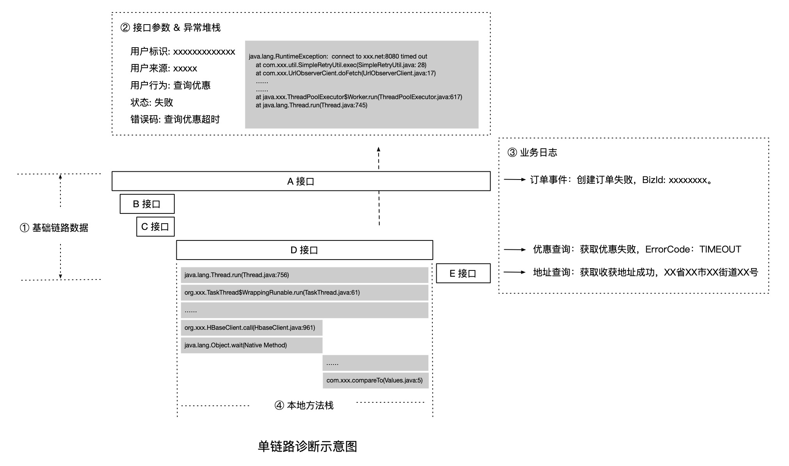
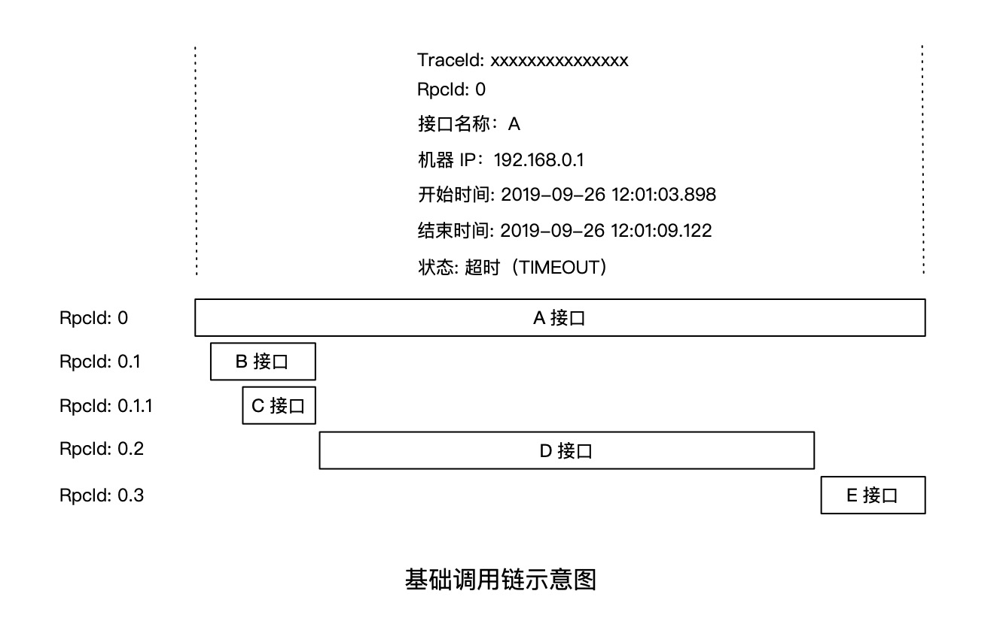
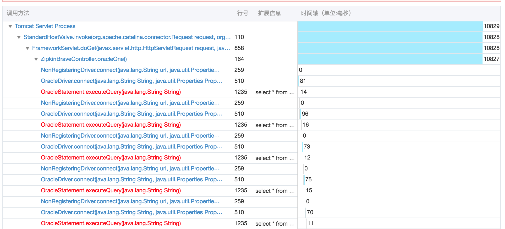
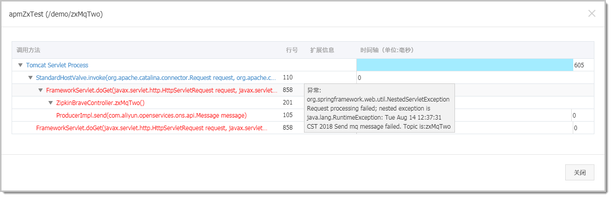
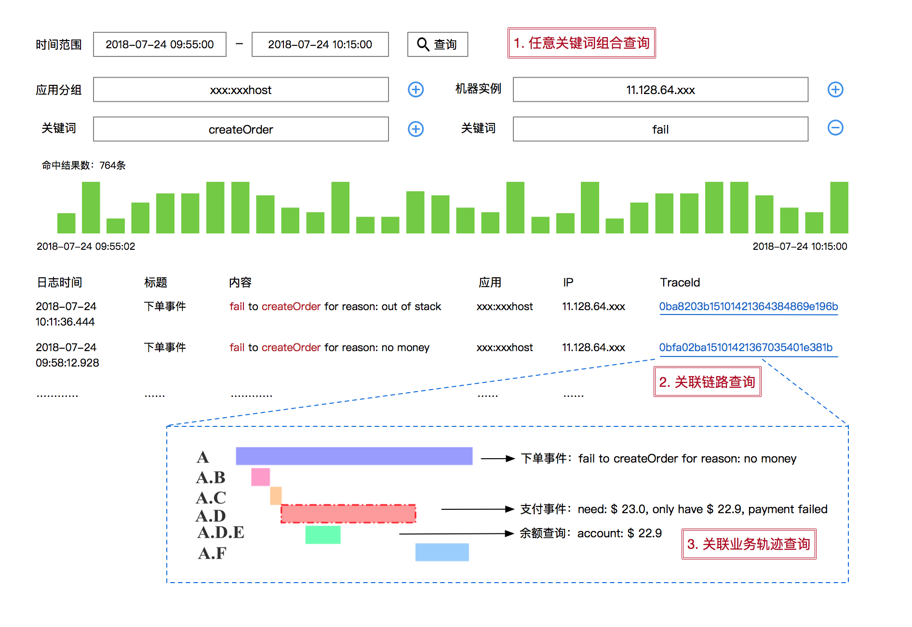
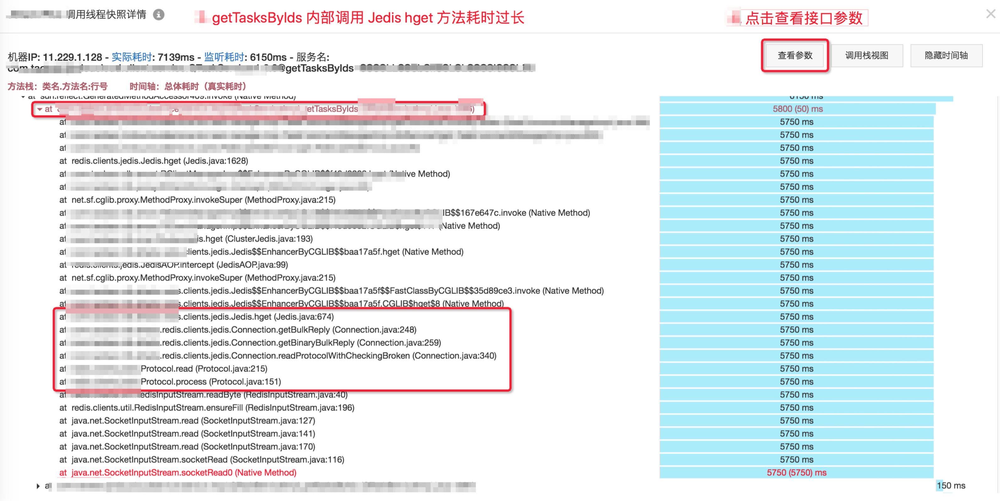

# 链路追踪（Tracing）其实很简单——单链路诊断

> 作者：夏明（涯海）    
> 创作日期：2019-09-30  
> 专栏地址：[【稳定大于一切】](https://github.com/StabilityMan/StabilityGuide)  
> PDF 格式：[链路追踪（Tracing）其实很简单——单链路诊断](https://github.com/StabilityMan/StabilityGuide/blob/master/docs/diagnosis/tracing/pdf/链路追踪（Tracing）其实很简单——单链路诊断.pdf)

前文[《链路追踪——初识》](https://github.com/StabilityMan/StabilityGuide/blob/master/docs/diagnosis/tracing/链路追踪（Tracing）其实很简单——初识.md)介绍了链路追踪的基本含义，即跟踪请求在分布式系统中的流转路径与状态。而单链路诊断，顾名思义，就是基于单次请求关联的调用轨迹数据，定位问题原因，属于链路追踪的核心功能之一。比如一次用户下单请求超时，可以通过查看该次请求经过了哪些节点（如应用或 IP），调用了哪些服务，调用的时间顺序与先后关系等信息，判断导致该次请求下单超时的原因或故障范围。

那么，单链路诊断的具体含义是什么？它该如何使用？能够解决哪些问题？带着这些疑问，我们即将开启接下来的探秘之旅。

## 目录
- [一个行车记录仪的自白](#一个行车记录仪的自白)
- [单链路诊断包含哪些数据？](#单链路诊断包含哪些数据)
	- [核心接口埋点](#核心接口埋点)
	- [自动关联数据](#自动关联数据)
	- [主动关联数据](#主动关联数据)
	- [本地方法栈](#本地方法栈)
- [总结](#总结)
- [推荐产品](#推荐产品)
- [加入我们](#加入我们)

## 一个行车记录仪的自白
我是一辆宝马 X3 的行车记录仪，今年工作很辛苦，我计划给自己放个假，听说成都有很多漂亮妹纸，麻烦坐稳了，老司机就要发车啦，以下是我的行程记录：

* 【2018-10-01 08:00:00】从【北京站】出发，今天雾霾有点大，幸好我戴了口罩。
* 【2018-10-01 14:30:00】经过【石家庄站】，下车吃了个饭，休息了【30分钟】。
* 【2018-10-01 20:42:00】抵达【西安站】，是不是该吃晚饭了？算了，吃泡面吧，过闸等待了【2分钟】。
* 【2018-10-02 07:30:00】终于到了【成都站】，连夜开车有点累，幸好带了充电宝！开开心心的吃了【2天】的麻辣烫。
* 【2018-10-04 08:00:00】假期结束了，还是从【成都站】返程，再见了我的毛血旺。
* 【2018-10-04 17:56:00】经过【西安站】，麻辣烫吃的有点多，拉肚子花了【20分钟】。
* 【2018-10-05 02:13:00】经过【石家庄站】，快到家了，坚持。
* 【2018-10-05 08:00:00】回到【北京站】，好巧，离出发时正好相差【4天】，感觉被安排了。

我是一个行车记录仪，我给自己的假期写了份总结：我从【北京站】出发，依次经过了【石家庄站】、【西安站】和【成都站】，共计 4 个站点，总计花费了【4天】时间，总体行程【顺利】，总结完毕，期待下一个假期，滴滴滴。

单链路诊断类似于查看行车记录仪，判断当前车辆经过了哪些【站点】，行驶了多长【时间】，沿途的【路况】，是否发生了【交通事故】等等。在分布式系统中，我们通过单链路诊断查看单次请求的调用轨迹与关联数据，比如该请求经过了哪些【应用节点】或【IP】？调用了哪些【接口服务】？每一段调用的【耗时】是多久？执行状态是否【成功】？

单链路诊断适用于单次请求的精准问题定位与分析，它记录了最详细的链路关联数据，可以准确的区分每一次调用间的细微差异。单链路诊断属于问题定位环节，而不是问题发现环节。通常我们事前无法获知哪条链路有问题，需要先通过一些已知条件进行过滤，比如慢接口名称，问题发生的时间范围等。

## 单链路诊断包含哪些数据？
单链路诊断的效果取决于关联数据的详细程度。一次调用生命周期内，保存的关联数据种类越丰富、信息度越高，就越容易定位根因，降低故障损失。链路关联数据大致可以分为以下四类：

* **核心接口埋点：** 通过在接口执行前后插桩埋点，记录的基础链路信息，包括 TraceId、RpcId（SpanId）、时间、状态、IP、接口名称等。上述信息可以还原最基础的链路形态。
* **自动关联数据：** 在调用生命周期内，可以自动记录的关联信息，包括 SQL、请求出入参数、异常堆栈等。此类信息不影响链路形态，但却是某些场景下，精准定位问题的必要条件。
* **主动关联数据：** 在调用生命周期内，需要人为主动记录的关联数据，通常是业务数据，比如业务日志、业务标识等。由于业务数据是非常个性化的，无法统一配置，但与链路数据主动关联后，可以大幅提升业务问题诊断效率。
* **本地方法栈：** 由于性能与成本限制，无法对所有方法添加链路埋点。此时，我们可以通过方法采样或在线插桩等手段实现精准的本地慢方法定位。

### 核心接口埋点
如果对应用内所有方法进行插桩，需要牺牲巨额的性能开销与数据成本。因此，链路追踪通常只对比较重要的方法进行插桩，而这些添加了链路追踪埋点的方法，我们称之为——接口。

对接口进行插桩，在执行前、后添加埋点，是为了记录调用经过接口时的链路唯一标识（TraceId），调用层级标识（SpanId 或 RpcId）、时间、状态、IP、接口名称等信息；然后再通过 TraceId 和 RpcId（或 SpanId）将一次请求的所有接口信息关联在一起，并以调用链的形式进行可视化展现。

举个例子，IP 为 `192.168.0.1` 的机器对外提供了一个服务名为 `A`，某次对 A 接口的调用从 `2019-09-26 12:01:03.898` 开始，至 `2019-09-26 12:01:09.122 ` 结束，总体耗时为 `5224 ms`，并且 A 接口内部依次调用了 B、D、E 3个接口，其中 B 接口内部又调用了 C 接口，最终还原的链路形态如下图所示：

通过接口埋点，我们能够记录并还原最基础的调用链形态，而商业化的 Tracing 产品通常会默认提供三方组件的核心接口埋点，比如 HTTP、Dubbo、gRPC、MySQL、MemCache、Kafka 等组件的关键方法。此外，我们也可以根据自身应用的需求，为核心业务方法添加链路埋点，比如某业务方自行实现了一个磁盘缓存，可以对磁盘缓存的查询/修改方法添加埋点，以便在调用链上查看执行耗时与状态等信息。

**提示：** 大部分情况下，用户不知道该为哪些方法添加链路埋点，此时可以先做一次全局的 Method Profiling，找到最慢的方法集合，然后逐一为其添加链路埋点，这样就可以在调用链上随时观察这些方法的执行耗时。最后，通过优化代码逐步提高这些慢方法的执行速度，解决性能瓶颈。

### 自动关联数据
大部分场景下，只依赖接口埋点数据，不足以定位根因。此时，我们还需要记录 DB 执行的 SQL，接口调用的入参与出参信息（比如用户 ID、订单 ID、错误码等）以及调用过程中抛出的异常堆栈，来进一步缩小问题范围，提高排查效率。

### 主动关联数据
接口调用与业务行为并不是完全对等的，比如一次购买行为由于余额不足导致支付失败，这在业务语义上无疑是失败的，但是在系统调用层面却是成功的。

因此，为了更有效地诊断业务问题，我们可以将业务数据与链路数据进行主动关联，比如在业务日志中记录当次调用的 TraceId 与 RpcId，从而实现业务轨迹与调用链路的串联，这就是[业务全息排查](https://help.aliyun.com/document_detail/88115.html)，如下图所示：

### 本地方法栈
响应变慢是最常见的系统问题之一，我们可以通过链路追踪的接口埋点快速定位耗时最长的接口。但是，由于接口粒度太粗，一般无法指导我们具体的优化行为。因此，我们需要记录慢调用的完整本地方法栈，直接定位导致系统变慢的代码行，实施针对性优化。

慢调用本地方法栈的监听要兼顾性能与准确度，在不同的应用场景下，可以采用方法采样或在线插桩等手段，涉及的技术细节与难度较大，将在后续章节中单独介绍。

## 总结
单链路诊断就是排查单次请求的异常问题，诊断效率与链路关联数据的详细程度息息相关。通常，我们可以使用单链路诊断排查请求变慢、接口调用出错、业务逻辑不符合预期等问题，但这些都属于诊断范畴，无法用于问题的主动发现，这一点要尤为注意。

## 推荐产品
* [ARMS —— 阿里云 APM 产品，提供开箱即用的体系化链路追踪能力](https://help.aliyun.com/document_detail/42781.html)
* [Tracing Analysis —— 兼容 OpenTracing 规范，支持 7 种开发语言](https://help.aliyun.com/document_detail/90277.html)
* [Lightstep —— 一款非常好用的链路追踪产品](https://lightstep.com/)

## 加入我们
【稳定大于一切】打造国内稳定性领域知识库，**让无法解决的问题少一点点，让世界的确定性多一点点**。

* [GitHub 地址](https://github.com/StabilityMan/StabilityGuide)
* 钉钉群号：
	* 30000312（2群，推荐）
	* 23179349（1群，已满）
* 如果阅读本文有所收获，欢迎分享给身边的朋友，期待更多同学的加入！

