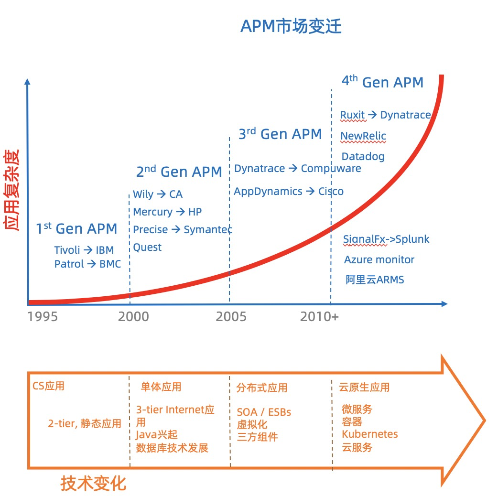

# 2021 Gartner APM魔力象限解读

> 作者：曹剑（西杰）  
> 创作日期：2021-05-27  
> 专栏地址：[【稳定大于一切】](https://github.com/StabilityMan/StabilityGuide)  
> PDF 格式：[2021 Gartner APM魔力象限解读](https://github.com/StabilityMan/StabilityGuide/blob/master/docs/processing/monitor/pdf/2021_Gartner_APM魔力象限解读.pdf)

Gartner 于4月9日发布了其一年一度的针对APM市场的魔力象限报告，阿里云作为国内唯一的云厂商，成功的进入了魔力象限。本文将从APM市场的发展，玩家的变迁和未来的趋势作一些解读。

## 什么是APM？
APM全称 Application Performance Monitoring，即应用性能监测，是属于ITOM（IT Operation Management）中的一个细分领域。

Gartner对其的定义为“在应用的全生命周期观测应用的运行表现以及应用相关的基础架构，用户体验和业务影响的软件”。

主要包含3个部分的能力

- Front-end monitoring：对于用户访问web应用和移动App的体验监控， 这里的体验主要关注于访问性能和可用性，通常可以通过监控真实的用户或者使用模拟用户来获取访问体验。
- Application discovery,tracing and diagnostics(ADAT): 这个是APM的老本行，针对应用自动的绘制出应用拓扑结构，包含微服务间的调用，服务和应用组件（数据，缓存，web服务器）的依赖，以及服务和基础架构（容器，容器平台，虚拟/物理机）的映射，同时能够针对请求进行端到端的代码级追踪。这里的端到端需要包含服务间，服务与应用组件间以及用户端与后台服务之间。
- Analytics：这部分是近年来愈加强调的能力，主要是通过沉淀领域相关的专家知识经验和机器学习算法来进行异常发现和根因分析，达到更快的发现并定位问题的效果。

## APM发展的历史

### 第一代APM
上世纪90年代末，随着计算从大机（mainframe）逐渐转移到桌面电脑，client-server架构的应用开始盛行，大家开始关注网络性能和主机资源。为了更好的监控这种CS的应用，第一代APM软件诞生，典型的代表就是Tivoli和Patrol，随后很快被IBM和BMC这种大机厂商收购，也是为了布局当时的client-server时代的到来。

### 第二代APM
进入到2000年，互联网飞速发展，浏览器成为新的用户界面。应用演进成为基于浏览器的Browser-App-DB的三层架构，同时Java作为企业级软件的第一编程语言开始盛行，编写一次、到处运行（write once，run anywhere）的理念，极大的提升了代码的生产力，然时Java虚拟机也屏蔽了代码运行的细节，使得调优排错变得愈加困难， 所以对于代码级的跟踪诊断和数据库的调优成为新的关注点。

这时Wily横空出世，第一次通过字节码注入（BCI)使得在生产环境下对Java应用进行无侵入的代码级追踪成为可能，BCI也成为了APM技术的基石，可以说Wily是真正的APM的鼻祖，并且这家传奇的公司在日后会以各种方式影响着这个行业。同时另外一家公司Precise通过推出了Oracle数据库的监控调优软件并延展到Java应用监控，从另外一个角度进入了APM市场。这一时期还诞生了Mecurry，Quest等一众公司，但这些无一例外都被CA，Symentic，HP等大厂收购。

### 第三代APM
从2005年开始，随着单体应用越来越庞大，业务耦合度越来越高，分布式应用开始盛行起来。SOA、ESB等技术让应用脱离的单机的束缚，N层应用成为可能，同时虚拟机技术也飞速发展，虚拟的计算资源使得运行环境进一步复杂化。大家开始关注对于N层应用的分布式追踪，同时应用与虚拟资源的映射关系也愈发重要。

2005到2010诞生了3家非常重要的公司，分别是Dynatrace，AppDynamics和NewRelic。 Dynatrace可以说把传统的apm能力做到了极致，其独创的one agent和purepath技术几乎可以在无侵入的情况下做到非常细颗粒度的端到端代码级追踪，而AppDynamics和Newlic这两家分别由前wily软件工程师和CEO创办的企业成功的掀起了第一波针对APM的创业和资本浪潮。Dynatrace和AppDynamics都是针对中大型企业复杂应用的监控调优软件，提供的也主要是私有化部署，最终也被更大的软件公司Compuware和Cisco收购，而Newrelic则另辟蹊径，开创了SaaS化服务的先河，最终于2014年成为第一个上市的APM厂商。

### 第四代APM
时间进入到2010年，云计算逐渐变成主流，随着AWS、Azure、GCP、阿里云崛起，各种云服务极大的加速了应用的迭代，以Docker，Kubernetes为代表的容器相关技术使得应用的运行环境进一步虚拟化，同时微服务化也在分布式的基础上进一步对应用进行拆分。以上的所有技术趋势在加速业务创新的同时，带来了应用复杂度的指数级上升，可观测的理念开始盛行。相比较传统的APM，可观测在回答应用是否有问题的同时，需要关联应用相关的各层的指标、链路、日志数据快速指向影响应用稳定性的根因，甚至能形成应用的自愈能力，提高业务连续性，提升用户体验。

这一时期产生了Ruxit（如今的Dynatrace原型）、Datadog、Azure monitor、阿里云ARMS等新一代的APM产品，New Relic由于其前瞻性的产品力，也继续引领这行业的变革。这一时期的APM产品，或者说可观测服务，典型特点为

- 产品形态为提供SaaS服务，通过敏捷迭代和网络效应来应对应用技术的快速发展
- 除了传统的应用层指标和链路外，覆盖了应用全栈的指标、链路、日志和事件数据管理分析以快速发现定位问题
- 数据来源除了自有的探针外，同时支持开源的Tracing和metrics来源，产品逐渐转为可观测数据分析平台
- 通过AI算法从海量的可观测数据中快速发现问题并智能定位根因，把依靠人力和经验的排查逐渐转变为自动化的结论透出

纵观整个发展历史，可以清晰的看到随着应用架构的变迁和计算环境的演进，APM一直致力于解决在应用愈加复杂的情况下通过各种来源各种类型的机器数据来发现定位问题，目的就是减少MTTR，提升业务连续性。

## Gartner魔力象限分析
今年入选的各位玩家在魔力象限中的整体位置都有所下降，表面原因是Gartner的各项评分要求都更严格，背后反映的是市场需求的发展超过了各个产品的演进，行业虽然演进了20多年，但仍旧处于高速发展期，机会巨大。

通过对比2020年和2021年魔力象限中各个玩家的位置变化（红色的为2021年，蓝色的为2020年），可以看到

### 领导者
从去年的Dynatrace, AppDynamics, New Relic和Brodcom（CA wily）变为Dynatrace, AppDynamics, New Relic和Datadog。 

其中AppDynamics和New Relic出现了较大幅度的下降，AppDynamics是因为17年被Cisco收购后，产品的发展乏力，和Cisco产品的整合进展缓慢，而且SaaS化转型不成功，还是在吃老本，虽然营收不错(预估5.25亿美金），但可预见的会逐步掉队（这也是独立厂商被大厂收购后的常见结局）

New Relic位置的下降比较惊讶，看评论主要还是因为产品转型的步子迈的太大，包括向可观测的数据处理平台的转型，收费模式全面转向按数据存储量收费，看来市场和行业的接受还需要一定时间，但个人还是非常看好。

Dynatrace虽然微微下降，但成了稳稳的一哥，自从2015年CTO亲自带队孵化了全新的SaaS化产品Ruxit后，敢于放弃原有的优势软件全面转向SaaS化产品形态的勇气令人佩服，事实证明决定很正确，也获得了市场的认可（2019年上市，2020营收5.4亿美金）

DataDog，这个应该是行业明星，2010成立，2019年就成功上市，最高的时候市值达到360多亿美金，最早的产品形态是通过plugin采集并展示各种云服务和技术组件的监控指标，由于其接入简单，适用场景广的特点累积了海量用户，随后通过收购日志分析产品logmatic快速的进入了日志和APM领域，最近一年又把触角伸向了用户体验监控和安全，可以说是典型的打穿一点累积海量用户然后不断的扩充使用场景做深用户价值的典范（俗称land-and-expand模式），今年也如愿进入了领导者象限。

### 远见者
这一象限有两个非常值得注意的玩家，Splunk和Elastic， 两者都是做日志起家。不同的是Splunk通过商业软件累积了大量的现金和用户口碑，近年来不断出手收购了signalFX和Omini等APM后期之秀。Elastic在开源领域的成功不用多说，最近也是通过收购和开源等方式布局APM。可以预见在日后可观测领域不断向可观测数据处理平台演进的过程中，两者通过天然的数据处理分析的优势会向领导者象限的传统APM产商发起有力的挑战。

### 挑战者
微软，作为唯二的两家进入象限的云厂商，分析师对其在Azure上统一完整的可观测体验大加赞赏，这个也是云厂商独一无二的优势，如果应用是运行在Azure上，毫无疑问，Azure monitor可以提供最佳可观测体验，原因在与云产商可观测产品的独特优势：

- 最有优势的数据采集：云厂商都够采集应用全链路上相关的各个云服务的数据，而这些数据一般很难对独立厂商开放。
- 最有优势的数据存储成本：云厂商可利用规模效应有效的降低海量的可观测数据存储和计算成本。
- 网络效益形成高效领域知识分发：通过分析云厂商海量用户累积的各种可观测领域排查诊断知识，产品化的分发领域经验（Insights）给其他用户。
- 云厂商可观测与云服务联动闭环问题：通过联动弹性扩缩容，PaaS平台能力和其他高可用能力，形成应用“自愈”能力， 闭环问题。

### 细分市场主导者
阿里云： 首次入选也是国内唯一全球唯二的云厂商，本次评测应用实时监控服务（ARMS）作为阿里云APM的核心产品，联合云监控以及日志服务共同参与。Gartner 评价阿里云 APM：

- 中国影响力最强：阿里云是中国最大的云服务提供商，阿里云用户可以使用云上监控工具来满足其可观测性需求。
- 开源集成：阿里云非常重视将开源标准和产品（例如 Prometheus）集成到其平台中。
- 成本优势：与在阿里云上使用第三方APM产品相比，阿里云一方的APM产品具有更高的成本效益。

可预见未来以云厂商为代表的另一派APM玩家，将和上述两派展开更加激烈的竞争。

## 行业趋势
随着企业进一步拥抱移动化、云原生和云计算，Gartner预计全球的APM市场会保持每年9.8%的高速增长，2024年会达到68亿美金，到2024年，将有30%的企业会通过可观测技术来提升数字化业务的运行性能，相比2020年的10%提升了3倍，行业呈现的趋势包括

### 统一监控（unified monitoring)
用户倾向于使用覆盖全栈的统一监控方案，而不是单点的监控产品。

这必将导致各个玩家不断的扩大产品线和使用场景，力图在一个console内就能完成和应用运维相关的工作，甚至会扩展到网络，安全和业务分析等泛APM领域

### 一体化监控 (holistic monitoring)
监控系统不仅需要能处理自身采集的可观测数据，也需要能消费开源监控系统、其他监控系统和云服务厂商的可观测数据，并能够基于应用关联起来。

这一点云厂商的可观测服务将天然具有优势，即使数据是开放的，云厂商也会更“懂”自己的数据。

### 监控左移 (shift-left monitoring)
越来越多的企业开始在应用的开发和测试阶段引入监控能力，通过和IED以及CICD工具的集成，可以让代码的性能和可用性问题提前暴露，同时也能够快速回溯线上问题是否由代码的变更引起。

虽然初代的APM就有和IDE工具集成的能力，但是监控左移一直是叫好不叫座的状态，而现在随着应用PaaS平台的兴起和DevOps逐渐成熟，基于PaaS平台的这种应用全生命周期的监测能力将越来越卖座。

### 智能监控（Intelligent Monitoring）
监控的价值逐渐的从数据采集到数据洞见（from data collection to data connection），随着统一和一体化监控带来的海量多样的可观测数据， 如何通过智能化的手段挖掘出异常问题和定位根因，将成为平台区别于其他竞争对手的核心竞争力。

### 业务监控（Business Monitoring）
监控不仅左移，同时也在向右移，越来越靠近业务，不管是越来越强调的用户体验侧的监控，还是基于应用映射的业务相关的监控，都在努力的把应用的性能和业务的性能关联起来，让运维不仅仅成为一个成本中心，而且能推动业务的创新。

## 推荐产品
* [阿里云 ARMS —— 2021 年 Gartner APM 魔力象限中国唯一入选云厂商](https://help.aliyun.com/document_detail/42781.html)
* [阿里云 Prometheus —— 提供多种开箱即用的预置监控大盘，全面托管的Prometheus服务](https://help.aliyun.com/document_detail)
* [Tracing Analysis —— 兼容 OpenTracing 规范，支持 7 种开发语言](https://help.aliyun.com/document_detail/90277.html)

## 加入我们
【稳定大于一切】打造国内稳定性领域知识库，**让无法解决的问题少一点点，让世界的确定性多一点点**。

* [GitHub 地址](https://github.com/StabilityMan/StabilityGuide)
* 钉钉交流2群：30000312
* 如果阅读本文有所收获，欢迎分享给身边的朋友，期待更多同学的加入！

