# 如何专业化监控一个Kubernetes集群

> 作者：刘佳旭（佳旭）  
> 创作日期：2021-05-24  
> 专栏地址：[【稳定大于一切】](https://github.com/StabilityMan/StabilityGuide)  
> PDF 格式：[如何专业化监控一个Kubernetes集群](https://github.com/StabilityMan/StabilityGuide/blob/master/docs/processing/monitor/pdf/如何专业化监控一个Kubernetes集群.pdf)


### 引言
Kubernetes 在生产环境应用的普及度越来越广、复杂度越来越高，随之而来的稳定性保障的挑战也越来越大。

如何构建全面深入的可观测性架构和体系，是提升系统稳定性的关键之因素一。ACK将可观测性最佳实践进行沉淀，以阿里云产品功能的能力对用户透出，可观测性工具和服务成为基础设施，赋能并帮助用户使用产品功能，提升用户Kubernetes集群的稳定性保障和使用体验。

本文会介绍Kubernetes可观测性系统的构建，以及基于阿里云云产品实现Kubernetes可观测系统构建的最佳实践。


### Kubernetes 系统的可观测性架构
Kubernetes系统对于可观测性方面的挑战包括：

- K8s系统架构的复杂性。系统包括控制面和数据面，各自包含多个相互通信的组件，控制面和数据间之间通过kube-apiserver进行桥接聚合。
- 动态性。Pod、service等资源动态创建以及分配IP，Pod重建后也会分配新的资源和IP，这就需要基于动态服务发现来获取监控对象。
- 微服务架构。应用按照微服务架构分解成多个组件，每个组件副本数可以根据弹性进行自动或者人工控制。

针对Kubernetes系统可观测性的挑战，尤其在集群规模快速增长的情况下，高效可靠的 Kubernetes 系统可观测性能力，是系统稳定性保障的基石。


那么，如何对建设生产环境下的 Kubernetes 系统可观测性能力呢？

Kubernetes系统的可观测性方案包括指标、日志、链路追踪、K8s Event事件、NPD框架等方式。每种方式可以从不同维度透视Kubernetes系统的状态和数据。在生产环境，我们通常需要综合使用各种方式，有时候还要运用多种方式联动观测，形成完善立体的可观测性体系，提高对各种场景的覆盖度，进而提升Kubernetes系统的整体稳定性。下面会概述生产环境下对K8s系统的可观测性解决方案。


#### 1. 指标（Metrics）
Prometheus是业界指标类数据采集方案的事实标准，是开源的系统监控和报警框架，灵感源自Google的Borgmon监控系统。2012年，SoundCloud的Google前员工创造了Prometheus，并作为社区开源项目进行开发。2015年，该项目正式发布。2016年，Prometheus加入CNCF云原生计算基金会。

Prometheus具有以下特性：

- 多维的数据模型（基于时间序列的Key、Value键值对）
- 灵活的查询和聚合语言PromQL
- 提供本地存储和分布式存储
- 通过基于HTTP的Pull模型采集时间序列数据
- 可利用Pushgateway（Prometheus的可选中间件）实现Push模式
- 可通过动态服务发现或静态配置发现目标机器
- 支持多种图表和数据大盘

Prometheus可以周期性采集组件暴露在HTTP(s)端点的/metrics下面的指标数据，并存储到TSDB，实现基于PromQL的查询和聚合功能。

对于Kubernetes场景下的指标，可以从如下角度分类：

- **容器基础资源指标**。采集源为kubelet内置的cAdvisor，提供容器内存、CPU、网络、文件系统等相关的指标，指标样例包括：容器当前内存使用字节数 `container_memory_usage_bytes`， 容器网络接收字节数`container_network_receive_bytes_total`， 容器网络发送字节数`container_network_transmit_bytes_total` 等等。

- **Kubernetes节点资源指标。** 采集源为`node_exporter`，提供节点系统和硬件相关的指标，指标样例包括：节点总内存`node_memory_MemTotal_bytes`，节点文件系统空间`node_filesystem_size_bytes`，节点网络接口ID `node_network_iface_id`，等等。基于该类指标，可以统计节点的CPU/内存/磁盘使用率等节点级别指标。


- **Kubernetes资源指标。** 采集源为kube-state-metrics，基于Kubernetes API对象生成指标，提供K8s集群资源指标，例如Node、ConfigMap、Deployment、DaemonSet等类型。以Node类型指标为例，包括节点Ready状态指标`kube_node_status_condition`、节点信息`kube_node_info`等等。


- **Kubernetes组件指标**。
	- Kubernetes系统组件指标。例如kube-controller-manager, kube-apiserver, kube-scheduler, kubelet, kube-proxy, coredns等。
	- Kubernetes运维组件指标。可观测类包括`blackbox_operator`, 实现对用户自定义的探活规则定义；`gpu_exporter`，实现对GPU资源的透出能力。
	- Kubernetes业务应用指标。包括具体的业务Pod在/metrics路径透出的指标，以便外部进行查询和聚合。


除了上述指标，K8s提供了通过API方式对外透出指标的监控接口标准，具体包括Resource Metrics，Custom Metrics和External Metrics三类。

| 监控接口标准 | APIService地址 | 接口使用场景描述 |
| --- | --- | --- |
| Resource Metrics | [metrics.k8s.io](http://metrics.k8s.io) | 主要用于Kubernetes内置的消费链路，通常由Metrcis-Server提供。 |
| Custom Metrics | [custom.metrics.k8s.io](http://custom.metrics.k8s.io) | 主要的实现为Prometheus，提供资源监控和自定义监控 |
| External Metrics | [external.metrics.k8s.io](http://external.metrics.k8s.io) | 主要的实现为云厂商的Provider，提供云资源的监控指标 |

**Resource Metrics** 类对应接口metrics.k8s.io，主要的实现就是 metrics-server，它提供资源的监控，比较常见的是节点级别、pod 级别、namespace 级别。这些指标可以通过kubectl top直接访问获取，或者通过K8s controller获取，例如HPA(Horizontal Pod Autoscaler)。系统架构以及访问链路如下：

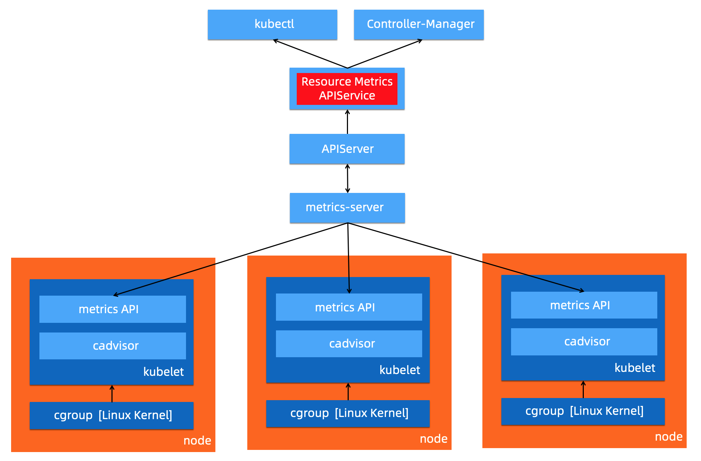


**Custom Metrics**对应的 API 是 custom.metrics.k8s.io，主要的实现是 Prometheus。它提供的是资源监控和自定义监控，资源监控和上面的资源监控其实是有覆盖关系的，而这个自定义监控指的是：比如应用上面想暴露一个类似像在线人数，或者说调用后面的这个数据库的 MySQL 的慢查询。这些其实都是可以在应用层做自己的定义的，然后并通过标准的 Prometheus 的 client，暴露出相应的 metrics，然后再被 Prometheus 进行采集。

而这类的接口一旦采集上来也是可以通过类似像 custom.metrics.k8s.io 这样一个接口的标准来进行数据消费的，也就是说现在如果以这种方式接入的 Prometheus，那你就可以通过 custom.metrics.k8s.io 这个接口来进行 HPA，进行数据消费。系统架构以及访问链路如下：

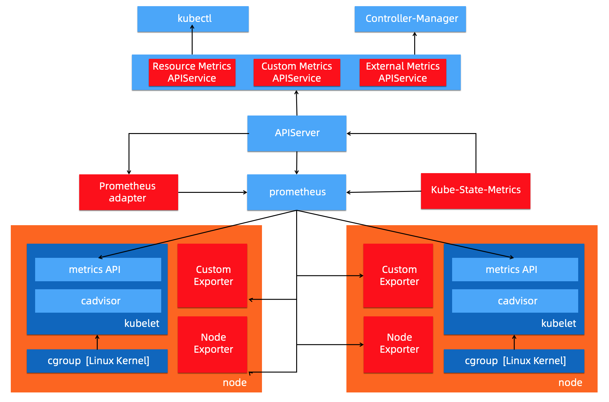


**External Metrics** 。因为我们知道 K8s 现在已经成为了云原生接口的一个实现标准。很多时候在云上打交道的是云服务，比如说在一个应用里面用到了前面的是消息队列，后面的是 RDS 数据库。那有时在进行数据消费的时候，同时需要去消费一些云产品的监控指标，类似像消息队列中消息的数目，或者是接入层 SLB 的 connection 数目，SLB 上层的 200 个请求数目等等，这些监控指标。

那怎么去消费呢？也是在 K8s 里面实现了一个标准，就是 external.metrics.k8s.io。主要的实现厂商就是各个云厂商的 provider，通过这个 provider 可以通过云资源的监控指标。在阿里云上面也实现了阿里巴巴 cloud metrics adapter 用来提供这个标准的 external.metrics.k8s.io 的一个实现。


#### 2. 日志（Logging）
概要来说包括：

- 主机内核的日志。主机内核日志可以协助开发者诊断例如：网络栈异常，驱动异常，文件系统异常，影响节点（内核）稳定的异常。
- Runtime 日志。最常见的运行时是Docker，可以通过Docker的日志排查例如删除Pod Hang等问题。
- K8s组件日志。APIServer日志可以用来审计，Scheduler日志可以诊断调度，etcd日志可以查看存储状态，Ingress日志可以分析接入层流量。
- 应用日志。可以通过应用日志分析查看业务层的状态，诊断异常。

日志的采集方式分为被动采集和主动推送两种，在 K8s 中，被动采集一般分为 Sidecar 和 DaemonSet 两种方式，主动推送有 DockerEngine 推送和业务直写两种方式。

- DockerEngine 本身具有 LogDriver 功能，可通过配置不同的 LogDriver 将容器的 stdout 通过 DockerEngine 写入到远端存储，以此达到日志采集的目的。这种方式的可定制化、灵活性、资源隔离性都很低，一般不建议在生产环境中使用；
- 业务直写是在应用中集成日志采集的 SDK，通过 SDK 直接将日志发送到服务端。这种方式省去了落盘采集的逻辑，也不需要额外部署 Agent，对于系统的资源消耗最低，但由于业务和日志 SDK 强绑定，整体灵活性很低，一般只有日志量极大的场景中使用；
- DaemonSet 方式在每个 node 节点上只运行一个日志 agent，采集这个节点上所有的日志。DaemonSet 相对资源占用要小很多，但扩展性、租户隔离性受限，比较适用于功能单一或业务不是很多的集群；
- Sidecar 方式为每个 POD 单独部署日志 agent，这个 agent 只负责一个业务应用的日志采集。Sidecar 相对资源占用较多，但灵活性以及多租户隔离性较强，建议大型的 K8s 集群或作为 PaaS 平台为多个业务方服务的集群使用该方式。


挂载宿主机采集、标准输入输出采集、Sidecar采集。

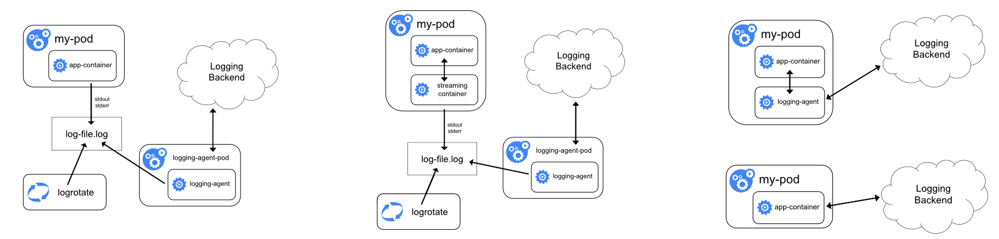

总结下来：

- DockerEngine 直写一般不推荐；
- 业务直写推荐在日志量极大的场景中使用；
- DaemonSet 一般在中小型集群中使用；
- Sidecar 推荐在超大型的集群中使用。


#### 3. 事件（Event）
事件监控是适用于Kubernetes场景的一种监控方式。事件包含了发生的时间、组件、等级（Normal、Warning）、类型、详细信息，通过事件我们能够知道应用的部署、调度、运行、停止等整个生命周期，也能通过事件去了解系统中正在发生的一些异常。

K8s 中的一个设计理念，就是基于状态机的一个状态转换。从正常的状态转换成另一个正常的状态的时候，会发生一个 Normal 的事件，而从一个正常状态转换成一个异常状态的时候，会发生一个 Warning 的事件。通常情况下，Warning 的事件是我们比较关心的。事件监控就是把 Normal 的事件或者是 Warning 事件汇聚到数据中心，然后通过数据中心的分析以及报警，把相应的一些异常通过像钉钉、短信、邮件等方式进行暴露，实现与其他监控的补充与完善。

Kubernetes中的事件是存储在etcd中，默认情况下只保存1个小时，无法实现较长周期范围的分析。将事件进行长期存储以及定制化开发后，可以实现更加丰富多样的分析与告警：

- 对系统中的异常事件做实时告警，例如Failed、Evicted、FailedMount、FailedScheduling等。
- 通常问题排查可能要去查找历史数据，因此需要去查询更长时间范围的事件（几天甚至几个月）。
- 事件支持归类统计，例如能够计算事件发生的趋势以及与上一时间段（昨天/上周/发布前）对比，以便基于统计指标进行判断和决策。
- 支持不同的人员按照各种维度去做过滤、筛选。
- 支持自定义的订阅这些事件去做自定义的监控，以便和公司内部的部署运维平台集成。


#### 4. NPD（Node Problem Detector）框架
Kubernetes集群及其运行容器的稳定性，强依赖于节点的稳定性。Kubernetes中的相关组件只关注容器管理相关的问题，对于硬件、操作系统、容器运行时、依赖系统（网络、存储等）并不会提供更多的检测能力。NPD（Node Problem Detector）针对节点的稳定性提供了诊断检查框架，在默认检查策略的基础上，可以灵活扩展检查策略，可以将节点的异常转换为Node的事件，推送到APIServer中，由同一的APIServer进行事件管理。

NPD支持多种异常检查，例如：

- 基础服务问题：NTP服务未启动
- 硬件问题：CPU、内存、磁盘、网卡损坏
- Kernel问题：Kernel hang，文件系统损坏
- 容器运行时问题：Docker hang，Docker无法启动
- 资源问题：OOM等

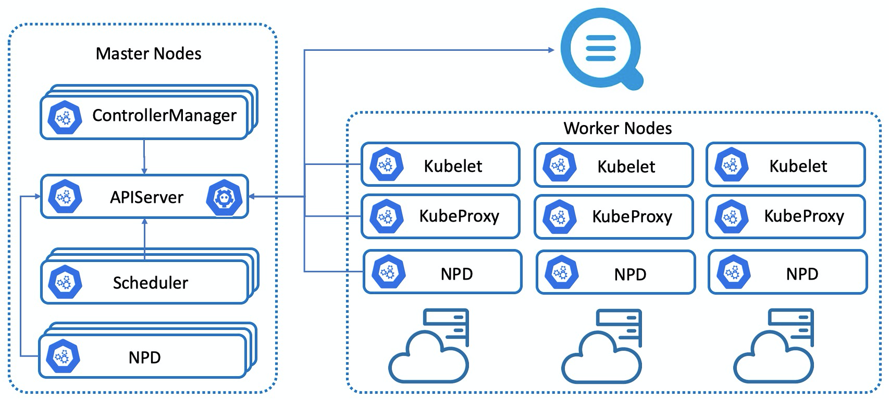
​
综上，本章节总结了常见的Kubernetes可观测性方案。在生产环境，我们通常需要综合使用各种方案，形成立体多维度、相互补充的可观测性体系；可观测性方案部署后，需要基于上述方案的输出结果快速诊断异常和错误，有效降低误报率，并有能力保存、回查以及分析历史数据；进一步延伸，数据可以提供给机器学习以及AI框架，实现弹性预测、异常诊断分析、智能运维AIOps等高级应用场景。

这需要可观测性最佳实践作为基础，包括如何设计、插件化部署、配置、升级上述各种可观测性方案架构，如何基于输出结果快速准确诊断分析跟因等等。阿里云容器服务ACK以及相关云产品（监控服务ARMS、日志服务SLS等），将云厂商的最佳实践通过产品化能力实现、赋能用户，提供了完善全面的解决方案，可以让用户快速部署、配置、升级、掌握阿里云的可观测性方案，显著提升了企业上云和云原生化的效率和稳定性、降低技术门槛和综合成本。
​

下面将以ACK最新的产品形态ACK Pro为例，结合相关云产品，介绍ACK的可观测性解决方案和最佳实践。
​

### ACK可观测性能力

#### 指标（Metrics）可观测性方案

对于指标类可观测性，ACK可以支持**开源Prometheus监控**和**阿里云Prometheus监控（阿里云Prometheus监控**是ARMS产品子产品）两种可观测性方案。

**开源Prometheus监控**，以helm包形式提供、适配阿里云环境、集成了钉钉告警、存储等功能；部署入口在控制台的应用目录中ack-prometheus-operator，用户配置后可以在ACK控制台一键部署。用户只需要在阿里云ACK控制台配置helm包参数，就可以定制化部署。


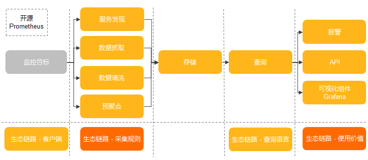


**阿里云Prometheus监控，** 是ARMS产品子产品。应用实时监控服务 (Application Real-Time Monitoring Service, 简称ARMS) 是一款应用性能管理产品，包含前端监控，应用监控和Prometheus监控三大子产品。

在2021 年的 Gartner的APM魔力象限评测中，阿里云应用实时监控服务（ARMS）作为阿里云 APM 的核心产品，联合云监控以及日志服务共同参与。Gartner 评价阿里云 APM：

- 中国影响力最强：阿里云是中国最大的云服务提供商，阿里云用户可以使用云上监控工具来满足其可观测性需求。
- 开源集成：阿里云非常重视将开源标准和产品（例如 Prometheus）集成到其平台中。
- 成本优势：与在阿里云上使用第三方 APM 产品相比，阿里云 APM 产品具有更高的成本效益。
​
下图概要对比了开源Prometheus和阿里云Prometheus的模块划分和数据链路。

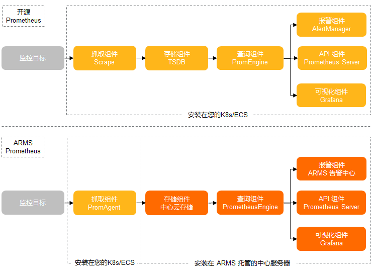


ACK支持CoreDNS、集群节点、集群概况等K8s可观测性能力；除此之外，ACK Pro还支持托管的管控组件Kube API Server、Kube Scheduler和Etcd的可观测性能力，并持续迭代。用户可以通过在阿里云Prometheus中丰富的监控大盘，结合告警能力，快速发现K8s集群的系统问题以及潜在风险，及时采取相应措施以保障集群稳定性。监控大盘集成了ACK最佳实践的经验，可以帮助用户从多维度分析分析、定位问题。下面介绍如何基于最佳实践设计可观测性大盘，并列举使用监控大盘定位问题的具体案例，帮助理解如何使用可观测性能力。

首先来看ACK Pro的可观测性能力。监控大盘入口如下：


Apiserver是K8s核心组件之一，是K8s组件进行交互的枢纽，ACK Pro Apiserver的监控大盘设计考虑到用户可以选择需要监控的Apiserver Pod来分析单一指标、聚合指标以及请求来源等，同时可以下钻到某一种或者多种API资源联动观测Apiserver的指标，这样的优势是既可以全局观测全部Apiserver Pod的全局视图，又可以下钻观测到具体Apiserver Pod以及具体API资源的监控，监控全部和局部观测能力，对于定位问题非常有效。所以根据ACK的最佳实践，实现上包含了如下5个模块：

- 提供Apiserver Pod、API资源（Pods，Nodes，ConfigMaps等）、分位数（0.99，0.9，0.5）、统计时间间隔的筛选框，用户通过控制筛选框，可以联动控制监控大盘实现联动
- 凸显关键指标以便识别系统关键状态
- 展示Apiserver RT、QPS等单项指标的监控大盘，实现单一维度指标的观测
- 展示Apiserver RT、QPS等聚合指标的监控大盘，实现多维度指标的观测
- 展示对Apiserver访问的客户端来源分析，实现访问源的分析

下面概要介绍模块的实现。
##### 关键指标
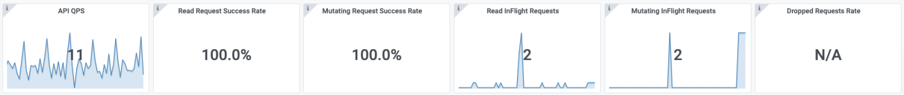

显示了核心的指标，包括API Server总QPS、读请求成功率、写请求成功率、Read Inflight Request、Mutating Inflight Request以及单位时间丢弃请求数量Dropped Requests Rate。

这些指标可以概要展示系统状态是否正常，例如如果Dropped Requests Rate不为NA，说明API Server因为处理请求的能力不能满足请求出现丢弃请求，需要立即定位处理。


##### Cluster-Level Summary
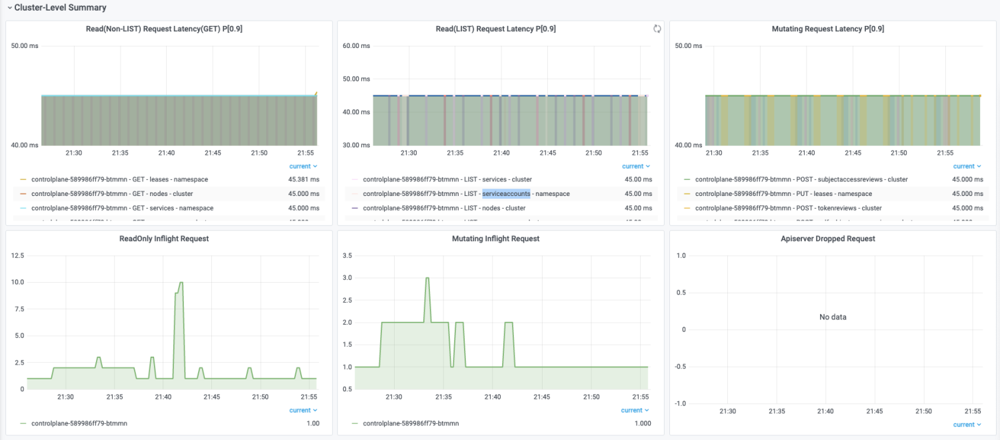

包括读非LIST读请求RT、LIST读请求RT、写请求RT、读请求Inflight Request、修改请求Inflight Request以及单位时间丢弃请求数量，该部分大盘的实现结合了ACK最佳实践经验。

对于响应时间的可观测性，可以直观的观察到不同时间点以及区间内，针对不同资源、不同操作、不同范围的响应时间。可以选择不同的分位数，来去除。有两个比较重要的考察点：

1. 曲线是否连续
1. RT时间

先来解释曲线的连续性。通过曲线的连续性，可以很直观的看出请求是持续的请求，还是单一的请求。


下图表示在采样周期内，apiserver收到PUT leases的请求，每个采样期内P90 RT是45ms。因为图中曲线是连续，说明该请求在全部采样周期都存在，所以是持续的请求。

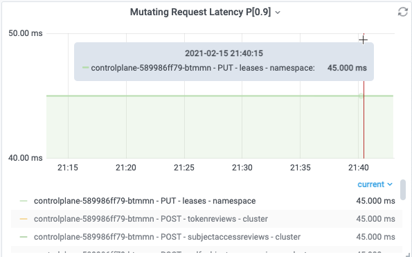

下图表示在采样周期内，apiserver收到LIST daemonsets的请求，有样值的采样周期内P90 RT是45ms。
因为图中只有一次，说明该请求只是在一次采样周期存在。该场景来自于用户执行kubectl get ds --all-namespaces产生的请求记录。

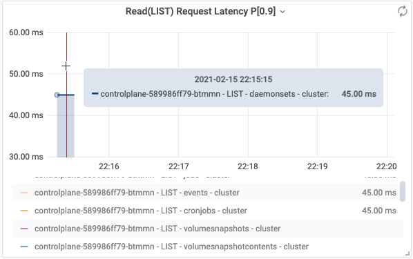

再来解释曲线体现的RT。用户执行命令创建1MB的configmap，请求连接到公网SLB
kubectl create configmap cm1MB --from-file=cm1MB=./configmap.file

apiserver记录的日志中，该次请求POST configmaps RT为9.740961791s，该值可以落入`apiserver_request_duration_seconds_bucket`的(8, 9]区间，所以会在`apiserver_request_duration_seconds_bucket`的le=9对应的bucket中增加一个样点，可观测性展示中按照90分位数，计算得到9.9s并图形化展示。这就是日志中记录的请求真实RT与可观测性展示中的展示RT的关联关系。

所以监控大盘既可以与日志可观测功能联合使用，又可以直观概要的以全局视图展示日志中的信息，最佳实践建议结合监控大盘和日志可观测性做综合分析。

```
I0215 23:32:19.226433       1 trace.go:116] Trace[1528486772]: "Create" url:/api/v1/namespaces/default/configmaps,user-agent:kubectl/v1.18.8 (linux/amd64) kubernetes/d2f5a0f,client:39.101.68.188,request_id:a1724f0b-39f1-40da-b36c-e447933ef37e (started: 2021-02-15 23:32:09.485986411 +0800 CST m=+114176.845042584) (total time: 9.740403082s):
Trace[1528486772]: [9.647465583s] [9.647465583s] About to convert to expected version
Trace[1528486772]: [9.660554709s] [13.089126ms] Conversion done
Trace[1528486772]: [9.660561026s] [6.317µs] About to store object in database
Trace[1528486772]: [9.687076754s] [26.515728ms] Object stored in database
Trace[1528486772]: [9.740403082s] [53.326328ms] END
I0215 23:32:19.226568       1 httplog.go:102] requestID=a1724f0b-39f1-40da-b36c-e447933ef37e verb=POST URI=/api/v1/namespaces/default/configmaps latency=9.740961791s resp=201 UserAgent=kubectl/v1.18.8 (linux/amd64) kubernetes/d2f5a0f srcIP="10.x.x.10:59256" ContentType=application/json:
```

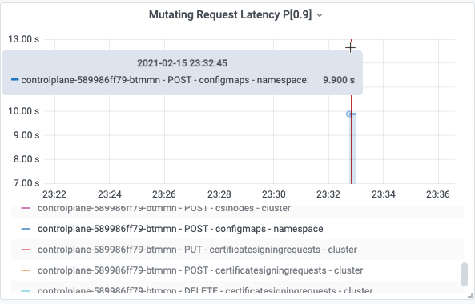


下面解释一下RT与请求的具体内容以及集群规模有直接的关联。

在上述创建configmap的例子中，同样是创建1MB的configmap，公网链路受网路带宽和时延影响，达到了9s；内网链路只需要145ms。所以RT与请求操作的资源对象、字节尺寸、网络等有关联关系，网络越慢，字节尺寸越大，RT越大。

对于大规模K8s集群，全量LIST（例如pods，nodes等资源）的数据量有时候会很大，导致传输数据量增加，也会导致RT增加。

所以对于RT指标，没有绝对的健康阈值，一定需要结合具体的请求操作、集群规模、网络带宽来综合评定，如果不影响业务就可以接收。

对于小规模K8s集群，平均RT 45ms到100ms是可以接受的；对于节点规模上100的集群，建议平均RT 100ms到200ms是可以接受的。

但是如果RT持续达到秒级，甚至RT达到60s导致请求超时，多数情况下出现了异常，需要进一步定位处理是否符合预期。


这两个指标通过apiserver /metrics对外透出，可以执行如下命令查看inflight requests，是衡量apiserver处理并发请求能力的指标。如果请求并发请求过多达到apiserver参数max-requests-inflight（默认是1000）和max-mutating-requests-inflight指定的阈值（默认是300），就会触发apiserver限流。通常这是异常情况，需要快速定位并处理。


##### QPS & Latency
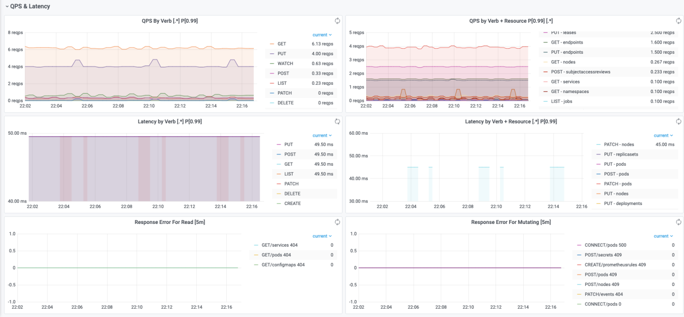

该部分可以直观显示请求QPS以及RT按照Verb、API资源进行分类的情况，以便进行聚合分析。
还可以展示读、写请求的错误码分类，可以直观发现不同时间点下请求返回的错误码类型。

##### Client Summary
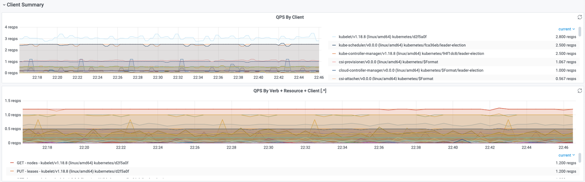
该部分可以直观显示请求的客户端以及操作和资源。**QPS By Client**可以按客户端维度，统计不同客户端的QPS值。**QPS By Verb + Resource + Client**可以按客户端、Verb、Resource维度，统计单位时间（1s）内的请求分布情况。


下面我们来看一个通过监控大盘定位问题的真实案例以及止血恢复的过程。


某用户集群Apiserver无法访问，并有重启告警。异常发生时，用户集群用户侧节点数量级为千级别。用户侧的一个daemonset形态的组件开启了一个功能，该功能会ListWatch集群内的nodes和pods资源。
从可观测性角度，观察到readOnly和mutating类型的inflight requests分别达到1000、300，同时Apiserver有丢弃请求发生。


客户集群规模很大的时候发，用户侧的daemonset组件对Apiserver产生较大请求压力，导致Apiserver响应延时变大、影响稳定性，进而kcm，ccm，scheduler重启。

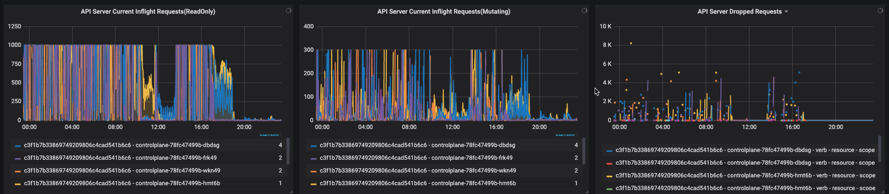


恢复的关键措施包括：调整用户侧daemonset的行为，不做全量LIST后，流量逐渐下降，未联通的client重新建立连接。随后，集群进入良性循环并恢复正常。


通过可观测功能发现严重问题后，需要立即处置止损。下面分析一下应急处理的方法。

1. 查看RT（读和写操作）和inflight-requests，如果较高，查看客户端请求来源。
1. 如果DropRequest，说明已经触发Apiserver限流，情况严重。查看客户端来源，确定请求多的客户端确认是否异常。

对于大规模集群，一种常见异常是SLB带宽打满，导致大量用户侧worker节点与apiserver无法正常update status，进而NodeNotReady。处理办法包括升配SLB，暂时删除大量LIST请求的Pod等。


异常以及处理办法包括：

1. 将发起大量请求的Pod缩容成0；如果是kubectl发起大量请求，需要停止kubectl；
1. 如果worker侧Pod持续因为NotReady驱逐，增加worker节点。
1. 如果托管侧组件Apiserver发生OOM，扩容托管的apiserver副本数或者规格，保证apiserver的稳定性；
1. 如果Apiserver的SLB带宽被打满了，需要升配SLB规格


基于ARMS Prometheus，除了Apiserver大盘，ACK Pro还提供了Etcd和Kube Scheduler的监控大盘；ACK和ACK Pro还提供了CoreDNS、K8s集群、K8s节点、Ingress等大盘，这里不再一一介绍，用户可以查看ARMS的大盘。这些大盘结合了ACK和ARMS的在生产环境的最佳实践，可以帮助用户以最短路径观测系统、发现问题根源、提高运维效率。
​

#### 日志（Logging）可观测性方案
SLS阿里云日志服务是阿里云标准的日志方案，对接各种类型的日志存储。

对于托管侧组件的日志，ACK支持托管集群控制平面组件（kube-apiserver/kube-controller-manager/kube-scheduler）日志透出，将日志从ACK控制层采集到到用户SLS日志服务的Log Project中。

对于用户侧日志，用户可以使用阿里云的logtail、log-pilot技术方案将需要的容器、系统、节点日志收集到SLS的logstore，随后就可以在SLS中方便的查看日志。


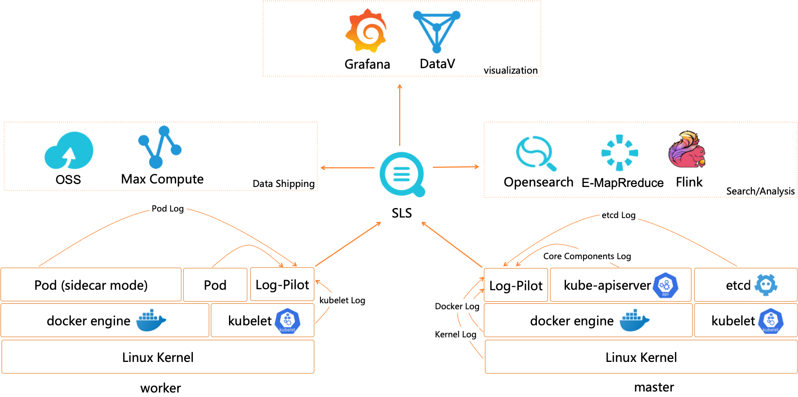


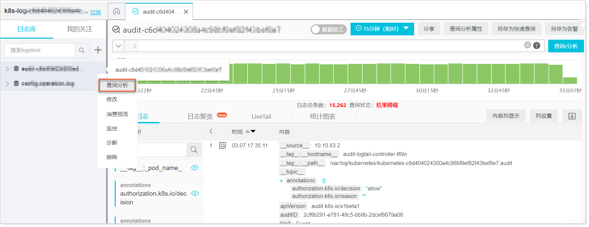


#### 事件（Event）可观测性方案 + NPD可观测性方案

Kubernetes的架构设计基于状态机，不同的状态之间进行转换则会生成相应的事件，正常的状态之间转换会生成Normal等级的事件，正常状态与异常状态之间的转换会生成Warning等级的事件。

ACK提供开箱即用的容器场景事件监控方案，通过ACK维护的NPD（node-problem-detector）以及包含在NPD中的kube-eventer提供容器事件监控能力。

- NPD（node-problem-detector）是Kubernetes节点诊断的工具，可以将节点的异常，例如Docker Engine Hang、Linux Kernel Hang、网络出网异常、文件描述符异常转换为Node的事件，结合kube-eventer可以实现节点事件告警的闭环。
- kube-eventer是ACK维护的开源Kubernetes事件离线工具，可以将集群的事件离线到钉钉、SLS、EventBridge等系统，并提供不同等级的过滤条件，实现事件的实时采集、定向告警、异步归档。


NPD根据配置与第三方插件检测节点的问题或故障，生成相应的集群事件。而Kubernetes集群自身也会因为集群状态的切换产生各种事件。例如Pod驱逐，镜像拉取失败等异常情况。日志服务SLS（Log Service）的Kubernetes事件中心实时汇聚Kubernetes中的所有事件并提供存储、查询、分析、可视化、告警等能力。

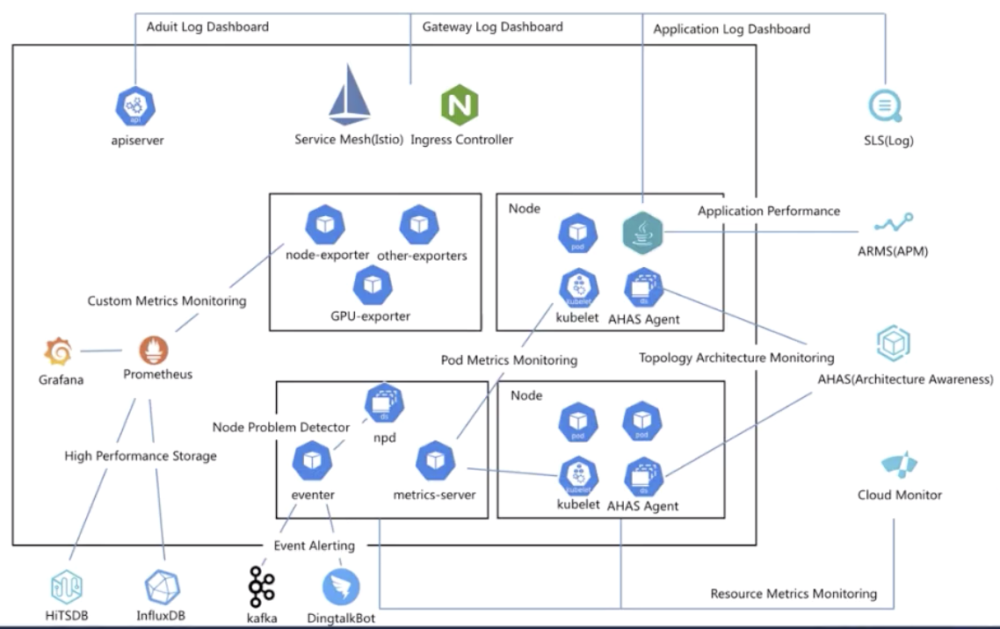


### ACK可观测性展望
ACK以及相关云产品对Kubernetes集群已经实现了全面的观测能力，包括指标、日志、链路追踪、事件等。后面发展的方向包括：

- 挖掘更多应用场景，将应用场景与可观测性关联，帮助用户更好的使用K8s。例如监控一段时间内Pod中容器的内存/CPU等资源水位，利用历史数据分析用户的Kubernets容器资源requests/limits是否合理，如果不合理给出推荐的容器资源requests/limits；监控集群Apiserver RT过大的请求，自动分析异常请求的原因以及处理建议；
- 联动多种可观测性技术方案，例如K8s事件和指标监控，提供更加丰富和更多维度的可观测性能力。


我们相信ACK可观测性未来的发展方向会越来越广阔，给客户带来越来越出色的技术价值和社会价值！

## 推荐产品
* [阿里云容器服务 ACK —— 提供高性能可伸缩的容器应用管理能力，2020年Gartner公共云容器中国唯一入选](https://www.aliyun.com/product/kubernetes)
* [阿里云 ARMS —— 2021 年 Gartner APM 魔力象限中国唯一入选云厂商](https://help.aliyun.com/document_detail/42781.html)
* [阿里云 Prometheus —— 提供多种开箱即用的预置监控大盘，全面托管的Prometheus服务](https://help.aliyun.com/document_detail)


## 加入我们
【稳定大于一切】打造国内稳定性领域知识库，**让无法解决的问题少一点点，让世界的确定性多一点点**。

* [GitHub 地址](https://github.com/StabilityMan/StabilityGuide)
* 钉钉交流2群：30000312
* 如果阅读本文有所收获，欢迎分享给身边的朋友，期待更多同学的加入！

