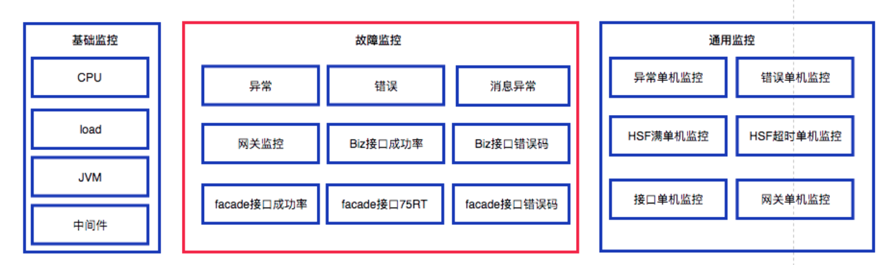
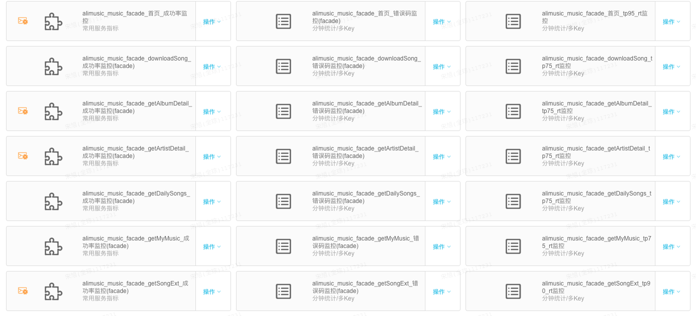
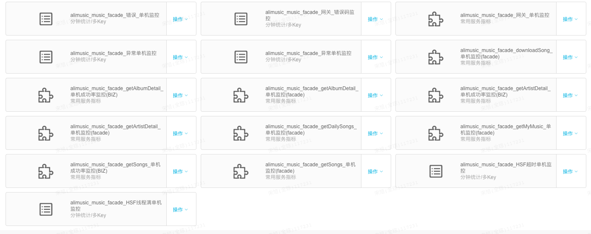
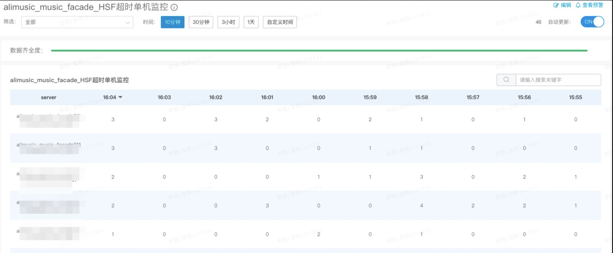
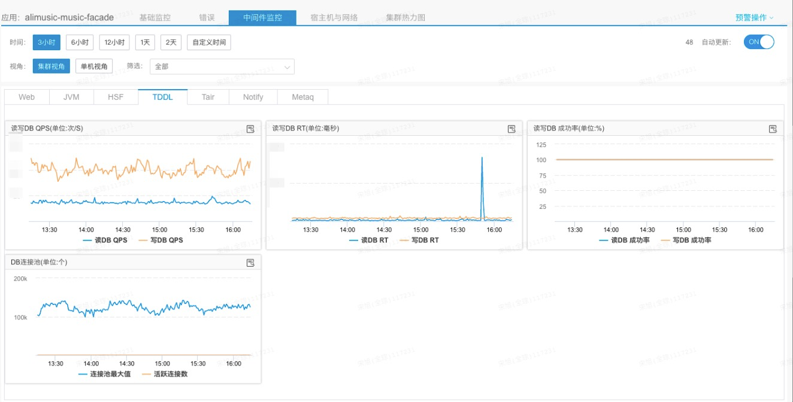
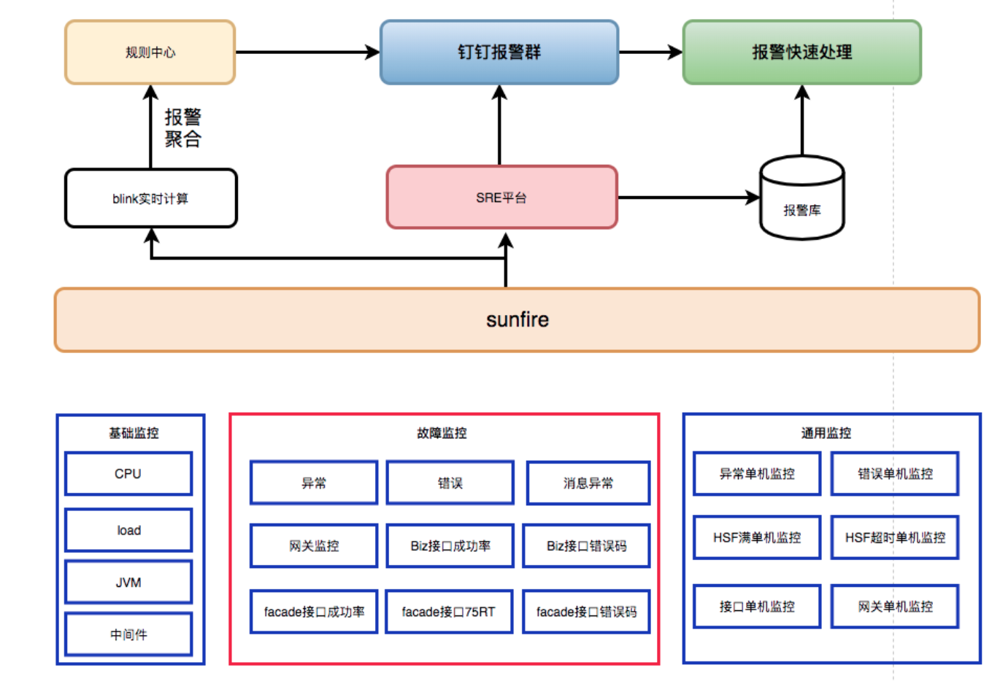
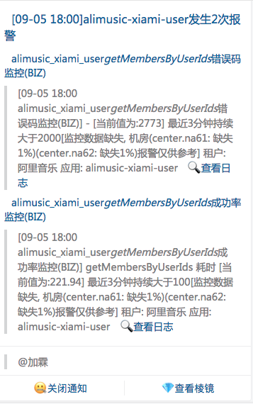
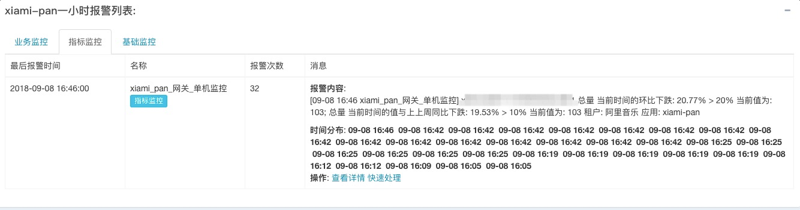
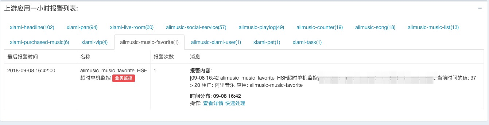
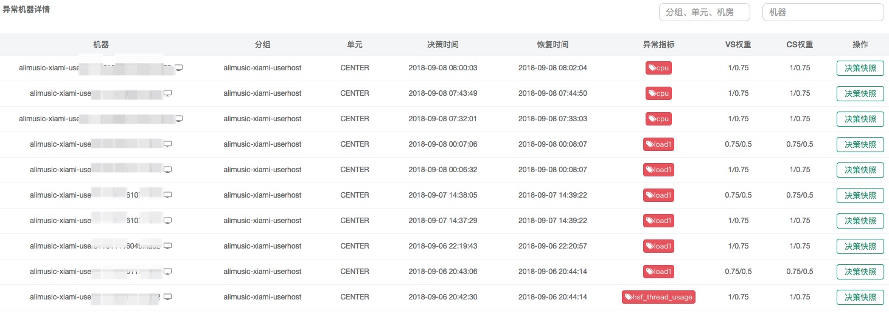

# 虾米SRE实践: 监控体系升级之路

> 作者：宋旭（全琮）  
> 创作日期：2019-08-20  
> 专栏地址：[【稳定大于一切】](https://github.com/StabilityMan/StabilityGuide)  
> PDF 格式：[虾米SRE实践_监控体系升级之路](https://github.com/StabilityMan/StabilityGuide/blob/master/docs/processing/monitor/pdf/虾米SRE实践_监控体系升级之路.pdf)

监控一直是服务端掌握应用运行状态的重要手段，经过近几年的发展，阿里虾米服务端目前已经有一百多个 Java 应用，承担核心业务的应用也有将近五十个，对于应用的监控配置也是因人而异。有的应用负责人比较有“追求”，配置的监控比较细，有的应用在经历了多人开发阶段以后，监控就逐渐疏于管理，有些应用的监控项最后修改时间只停留到 2 年以前，早已不适应业务的发展。

与大部分团队一样，虾米也有一个报警处理群，将内部的监控报警平台（如 Sunfire 等）的信息通过机器人投递到群中，由于监控项配置不合理、监控粒度较大，每天报警群都被几十条甚至上百条报警通知狂轰乱炸，长此以往大家对报警已经麻木，大部分报警也不会去处理。

基于这样的现状，虾米 SRE 团队将工作重点放在了对监控的治理上面，经过 2 个月的研发，构建了虾米全新的监控体系。

## 目录
- [报警原因分析](#报警原因分析)
- [监控优化](#监控优化)
- [报警路径优化](#报警路径优化)
- [借助流量调度](#借助流量调度)
- [推荐工具&产品](#推荐工具产品)
- [加入我们](#加入我们)

## 报警原因分析

过去的监控配置可谓五花八门，由应用负责同学配置的一些监控大多局限在应用整体 RT、QPS 的监控和部分业务日志的监控，报警发生时，大部分情况只知道这个应用有了问题，但很难快速定位是哪里出了问题，出了什么问题。一个新接手的同学可能需要经过查看配置项、登录机器、扫描日志甚至去查离线日志等步骤，经过十几分钟才能定位到问题，有的时候甚至需要排查个大半天时间。

经过一段时间的研究和摸索，我们发现一个应用如果在稳定运行了一段时间以后突然发生报警，那么原因通常都是以下几类：

- 程序 Bug：如代码问题导致空指针、频繁 FullGC 等。
- 上游依赖出问题：上游某个接口出了问题导致本应用出现接口超时、调用失败等。
- 单机故障：某个容器受宿主机应用导致 Load、CPU 突然升高，最终导致超时、线程池满等情况发生。
- 中间件故障：常见的如 Cache、DB抖 动导致一段时间内 RT 增长、超时增多。不过这里需要注意的是，单机 Load 高同样会引发单机读写 Cache、DB 出现问题。

## 监控优化

分析了报警原因，下一步就是优化监控。监控的报警可以告诉你出了问题，而好的监控是可以告诉你哪里出了问题。我们以前的监控通常只完成了第一阶段，而不能很好的告诉我们哪里出了问题，要通过一大堆辅助手段去定位。在分析了报警原因以后，我们就要想办法通过监控的手段来精准定位问题。

目前虾米的监控分为故障监控、基础监控和通用监控三类，如下图所示：

### （1）故障监控

所谓故障监控，就是这些监控发生报警意味着有故障产生了。我们认为一切外在因素如果对应用产生影响，那么必然反应在接口的 RT 和成功率上，要么引起接口 RT 升高，要么导致接口失败数增加，成功率下跌，如果没有这种影响，那么这个外在影响可以被忽略掉。因此我们把接口监控作为故障监控的一大块来重点配置，如果每个应用都配置了核心接口的故障监控，在排查问题时，就很容易定位是否由于上游应用的某个接口导致了我的应用出了问题。

因此我们使用成功率、RT 和错误码三个指标来进行一个接口的故障监控。特别指出的是，对于客户端接口的 RT 监控上，我们没有使用平均 RT，而是使用 Top 75% RT。因为想用它来反应用户侧的感受，比如 RT的 75% 分位线报警阈值设置为 1000ms,那么当这一监控项发生报警时，意味着有 25% 的用户请求接口已经超过 1000ms。通常这一报警阈值设置成用户不能忍受的一个 RT，比如 500ms 或 1000ms。

在故障监控里，我们还设置了应用维度的异常、错误和消息异常三种类型的监控，他们对服务器上的Exception和Error进行监控。这一类监控主要用于快速发现程序bug。例如当一次发布进行时，如果这三种类型的错误增加，那么应该可以考虑进行回滚了。

### （2）通用监控

大多数情况下，应用出现的问题都是由于单机故障引起的时候，如果某台机器的接口黄金指标突然变化、错误或异常数量突然增多，而其他机器没有什么变化，那就说明是单机引起的。因此我们对应用的故障监控都配置了对应的单机监控，在此处我们还额外引入了 HSF（Dubbo） 线程池满和 HSF（Dubbo） 超时两个类型的单机监控，是因为当单机 Load 高、CPU 有问题时，最为常见的表现就是HSF线程池突然打满，HSF（Dubbo） 超时数量增多，这两个监控同样可以来辅助定位单机问题。通过这一类监控，我们可以方便地接口报警是否由某台机器引起。

 

### （3）基础监控

前面两种类型的监控已经基本可以定位到故障是否由于程序 Bug、上游应用或单机故障引起的，还有一类就是对中间件的监控，这里我们利用了 Sunfire 的基础监控对应用的 CPU、Load、JVM、HSF（Dubbo）、MetaQ 等中间件的各项指标进行监控。如果因为中间件故障，此处将会有明显的报警。

 

## 报警路径优化

经过对监控的梳理和优化，目前每个应用差不过有 30-50 个报警项，如果所有报警项用以前的方式投递的报警群，那么将是一个灾难，完全没有办法去看，更没有办法快速定位问题。同时，一个应用负责人通常只关心自己的应用报警，让他去看其他应用的报警也是没用的。因此我们构建了一个 SRE 平台来优化报警链路，优化后的报警链路如下：

 

我们利用流计算设定报警窗口，进行报警聚合，通过报警分级来进行决定哪些报警应该被投递出来，在报警群精准 AT 相关的同学，查看报警群时，可以直接定位到 AT 我的消息，快速提取有用的信息。同时在 SRE 平台支持对应用和上游应用一小时内的报警进行分类和聚合展示，哪里出了问题一目了然。
我们通过自己的机器人，在钉钉群里只发送符合规则的报警信息，极大减少了报警数量，提高了报警的可读性，目前日均产生约 5000 条各种类型的报警信息，经过决策和规则筛选投递出的报警信息约为 50-100 条，而这些报警是我们认为必须要立即处理的报警。

 
 
 

## 借助流量调度

在前面提到很多故障是由于单机引起的，过去我们排查出来单机故障经常做的就是把服务停了或者单机置换，这样效率极低，实际上我们需要做的是在机器有问题的时候，能够把它的流量快速切走，再它恢复的时候再把流量切回来，如果这一切能够自动化地进行就更好了。

我们借助阿里巴巴的流量调度平台（即阿里云 [AHAS](https://help.aliyun.com/document_detail/90320.html)）可以完美地解决以下的问题：

- 发布预热问题，避免发布带来的 RT、Load 升高问题 进而引发 HSF 超时等问题
- 局部机器流量过高、受宿主机影响、慢调用过多、HSF线程满带来的服务不可用、RT过高等问题

  

目前，我们约有 40 个应用已经接入流量调度平台，每周调度机器流量 1000 余次，借助流量调度平台我们可以不再关心单机故障引发的应用报警。

## 推荐工具&产品
* [阿里云应用高可用服务 AHAS](https://help.aliyun.com/document_detail/90320.html)

## 加入我们
【稳定大于一切】打造国内稳定性领域知识库，**让无法解决的问题少一点点，让世界的确定性多一点点**。

* [GitHub 地址](https://github.com/StabilityMan/StabilityGuide)
* 钉钉群号：
	* 30000312（2群，推荐）
	* 23179349（1群，已满）
* 如果阅读本文有所收获，欢迎分享给身边的朋友，期待更多同学的加入！