# 饿了么监控系统 EMonitor 与 CAT 的对比

> 作者：李刚（乒乓狂魔）    
> 创作日期：2019-10-31  
> 专栏地址：[【稳定大于一切】](https://github.com/StabilityMan/StabilityGuide)
> PDF 格式：[饿了么监控系统 EMonitor 与 CAT 的对比](https://github.com/StabilityMan/StabilityGuide/blob/master/docs/processing/monitor/pdf/饿了么监控系统EMonitor与CAT的对比.pdf)

## 背景介绍
**饿了么监控系统 EMonitor**：是一款服务于饿了么所有技术部门的一站式监控系统，覆盖了系统监控、容器监控、网络监控、中间件监控、业务监控、接入层监控以及前端监控的数据存储与查询。每日处理总数据量近PB，每日写入指标数据量百T，每日指标查询量几千万，配置图表个数上万，看板个数上千。

**CAT**：是基于Java 开发的实时应用监控平台，为美团点评提供了全面的实时监控告警服务。

本文通过对比分析下两者所做的事情为契机讨论监控系统或许该有的面貌，以及浅谈下监控系统发展的各个阶段

## CAT做的事情（开源版）
首先要强调的是这里我们只能拿到 [GitHub上 开源版 CAT](https://github.com/dianping/cat) 的最新版 3.0.0，所以是基于此版本进行对比。

接下来说说 CAT 做了哪些事情？

### 1 抽象出监控模型
抽象出 Transaction、Event、Heartbeat、Metric 4种监控模型。

- Transaction：用来记录一段代码的执行时间和次数
- Event：用来记录一件事发生的次数
- Heartbeat：表示程序内定期产生的统计信息, 如CPU利用率
- Metric：用于记录业务指标，可以记录次数和总和

针对 Transaction 和 Event 都固定了 2 个维度：type 和 name，并且针对 type 和 name 进行分钟级聚合成报表并展示曲线。

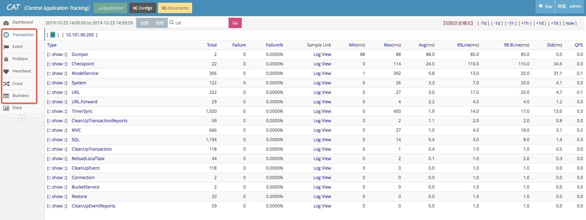

### 2 采样链路
针对上述 Transaction、Event 的 type 和 name 分别有对应的分钟级的采样链路。

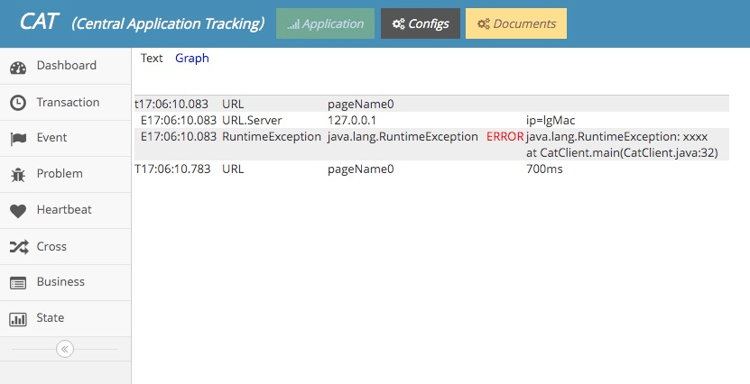

### 3 自定义的 Metric 打点
目前支持 Counter 和 Timer 类型的打点，支持 tag，单机内单个 Metric 的 tag 组合数限制 1000。并且有简单的监控看板，如下图所示：

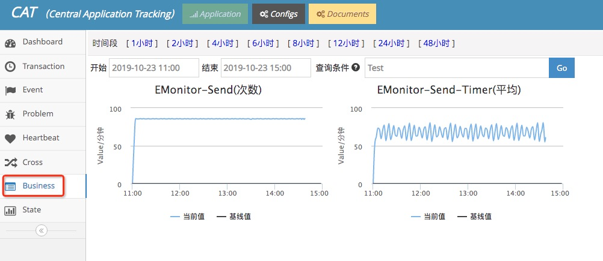

### 4 与其他组件集成
比如和 Mybatis 集成，在客户端开启相关的 SQL 执行统计，并将该统计划分到 Transaction 统计看板中的 type=SQL 的一栏下：

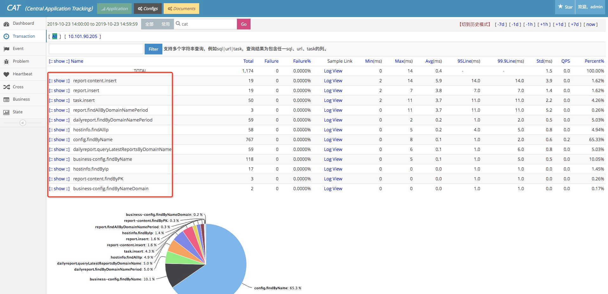

### 5 告警
可以针对上述的 Transaction、Event 等做一些简单的阈值告警。

## 饿了么 EMonitor 和 CAT 的对比
饿了么 EMonitor 借鉴了 CAT 的相关思想，同时又进行了改进。

### 1 引入 Transaction、Event 的概念
针对 Transaction 和 Event 都固定了 2 个维度：type 和 name，不同地方在于聚合用户发过来的数据。

CAT的架构图如下所示：

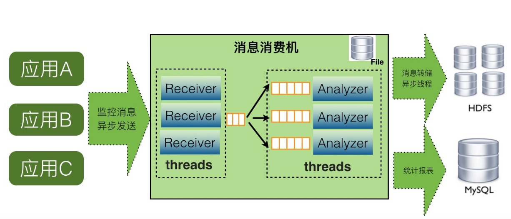

CAT的消费机需要做如下2件事情：

- 对 Transaction、Event 等消息模型按照 type 和 name 进行当前小时的聚合，历史小时的聚合数据写入到 MySql 中。
- 将链路数据写入到本地文件或者远程 HDFS 上。

EMonitor的架构图如下所示：

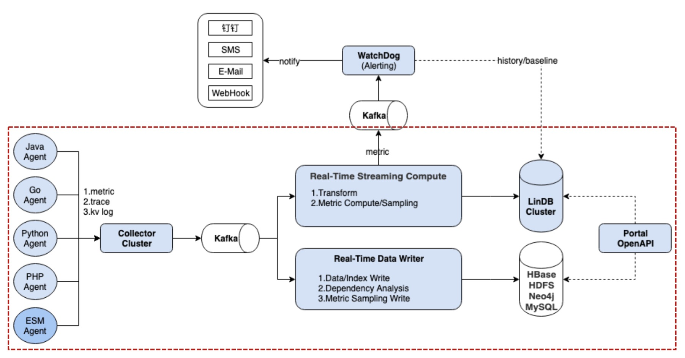

EMonitor 分 2 路对数据进行隔离处理：

- Real-Time Streaming Compute：对用户发过来的链路中的 Transaction、Event 等监控模型转变成指标数据并进行 10s 的预聚合，同时也对用户发过来的 Metric 数据进行 10s 预聚合。最后将 10s 预聚合的数据写入到 [LinDB时序数据库](https://github.com/lindb/lindb)（已开源，有兴趣的可以关注 star 下）中，以及 Kafka 中，让告警模块 watchdog 去消费 kafka 做实时告警。
- Real-Time Data Writer：对用户发过来的链路数据构建链路索引、向 HDFS 和 HBase 写入索引和链路数据，同时会构建应用之间的依赖关系，将依赖关系写入到 Neo4j 中。

所以 EMonitor 和 CAT 的一个很大不同点就在于对指标的处理上，EMonitor 交给专业的时序数据库来做，而 CAT 自己做聚合就显得功能非常受限，如下所示：

- CAT 只能整小时的查看 type 和 name 数据，不能跨小时，即不能查看任意 2 个时间之间的报表数据，EMonitor 没有此限制。
- CAT 没法查看所有 type 汇总后的响应时间和 QPS，EMonitor 可以灵活的自由组合 type 和 name 进行聚合。
- CAT 的 type 和 name 报表是分钟级的，EMonitor 是 10s 级别的。
- CAT 的 type 和 name 没能和历史报表曲线直接对比，EMonitor 可以对比历史报表曲线，更容易发现问题。
- CAT 的 type 和 name 列表首页展示了一堆数字，无法立即获取一些直观信息，比如给出了响应时间 TP99 100ms这个到底是好还是坏，EMonitor 有当前曲线和历史曲线，相对来说可以直接判断到底 ok 不 ok。
- CAT 的 TP99、TP999 基于单机内某个小时内的报表是准确的，除此之外多机或者多个小时的聚合 TP99、TP999 是用加权平均来计算的，准确性有待提高。

但是CAT也有自己的优势：

- CAT含有 TP999、TP9999 线(但是准确性还有些问题)，EMonitor 只能细到 TP99。
- CAT 的 type 和 name 可以按照机器维度进行过滤，EMonitor 没有做到这么细粒度。

### 2 采样链路
目前 CAT 和 EMonitor 都可以通过 type 和 name 来过滤采样链路，不同点在于

- CAT 的采样链路是分钟级别的，EMonitor 是 10s 级别的。
- 针对某一个 type 和 name，CAT 目前无法轻松找想要的链路，EMonitor 可以轻松的找到某个时刻或者说某段时间内响应时间想要的链路（目前已经申请专利）。

EMonitor 的链路如下所示：

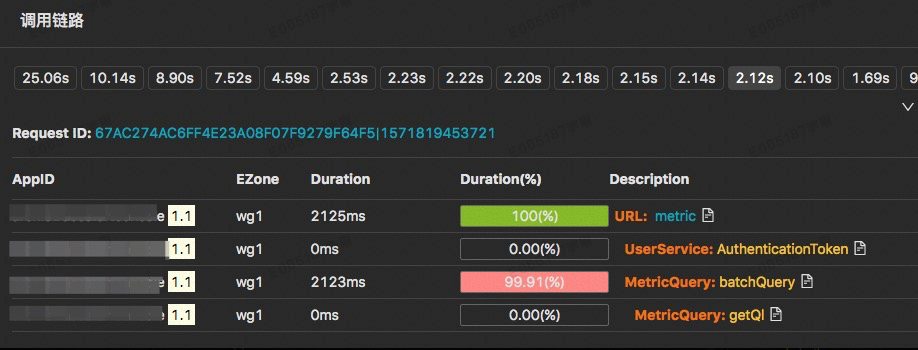

- 这张图是某个 10s 时刻、某个 type 和 name 过滤条件下的采样链路。
- 第一行是这 10s 内的采样链路，按照响应时间进行了排序。
- 可以随意点击某个响应时间来查看对应的链路详情。

### 3 自定义的 Metric 打点
EMonitor 支持 Counter、Timer、Histogram、Payload、Gauge 等等多种形式的打点方式，并且支持 tag。

- Counter：计数累加类型。
- Timer：可以记录一段代码的耗时，包含执行次数、耗时最大值、最小值、平均值。
- Histogram：包含 Timer 的所有东西，同时支持计算 TP99 线，以及其他任意 TP 线(从 0 到 100)。
- Payload：可以记录一个数据包的大小，包含数据包个数、包的最大值、最小值、平均值。
- Gauge：测量值，一般用于衡量队列大小、连接数、CPU、内存等等。

也就是任意 Metric 打点都可以流经 EMonitor 进行处理了并输送到 LinDB 时序数据库中。至此，EMonitor 就可以将任何监控指标统一在一起了，比如机器监控都可以通过 EMonitor 来保存了，这为一站式监控系统奠定了基础。

#### 自定义 Metric 看板
CAT 只有一个简易的 Metric 看板。而 EMonitor 针对 Metric 开发了一套可以媲美 Grafana 的指标看板，相比 Grafana 的优势如下：

- 有一套类似 SQL 的非常简单的配置指标的方式。
- 跟公司人员组织架构集成，更加优雅的权限控制，不同的部门可以建属于自己的看板。
- 指标和看板的收藏，当源指标或看板改动后，无需收藏人员再改动。
- alpha、beta、prod 不同环境之间的一键同步指标和看板，无需配置多次。
- PC 端和移动端的同步查看指标和看板。

类 SQL 的配置查询指标方式如下所示：

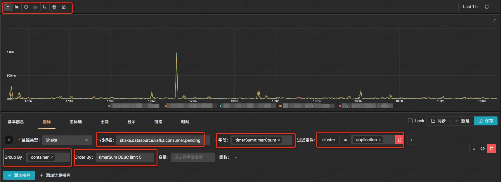

- 可以配置图表的展现形式。
- 可以配置要查询的字段以及字段之间的加减乘除等丰富的表达式。
- 可以配置多个任意tag的过滤条件。
- 可以配置 group by 以及 order by。

看板整体如下所示：

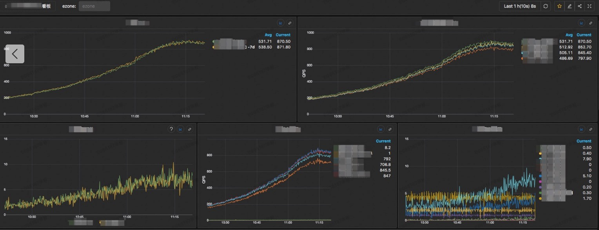

移动端显示如下：

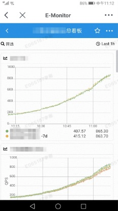

### 4 与其他组件集成
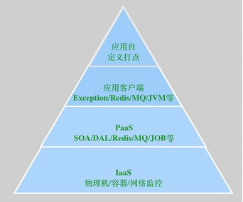

目前 EMonitor 已经打通了 IaaS 层、PaaS 层、应用层的所有链路和指标的监控，再也不用在多个监控系统中切换来切换去了，如下所示

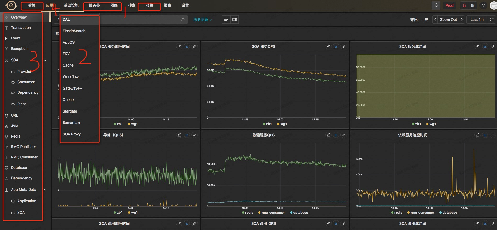

- 1 IaaS层物理机、机房网络交换机等的监控指标。
- 2 PaaS层中间件服务端的监控指标。
- 3 应用层SOA、Exception、JVM、MQ等客户端的相关指标。
- 4 应用层自定义的监控指标。

以打通饿了么分库分表中间件 DAL 为例：

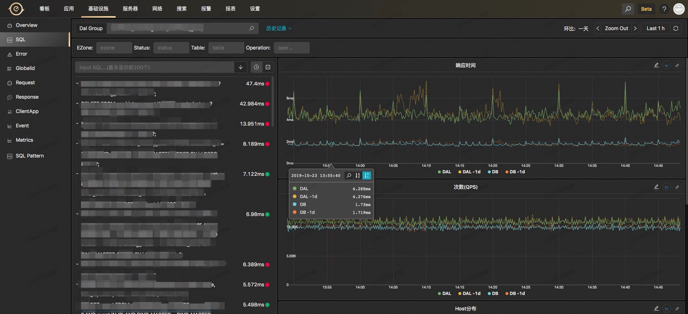

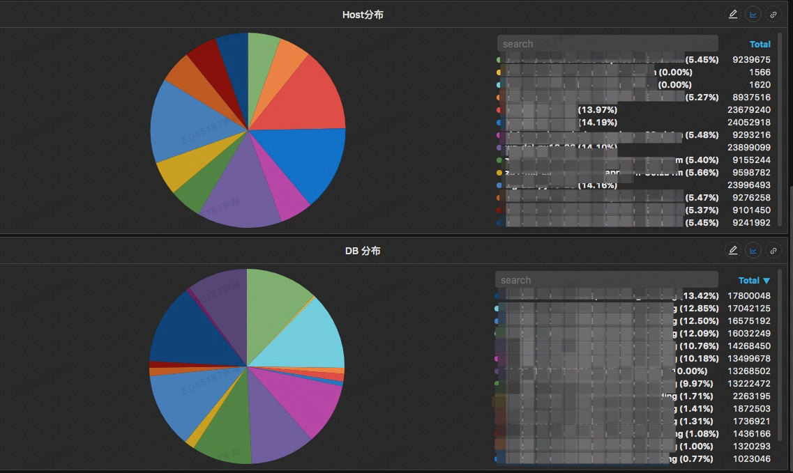

- 可以根据机房、执行状态、表、操作类型（比如 Insert、Update、Select 等）进行过滤查看。
- 左边列表给出每条 SQL 的执行的平均耗时。
- 右边 2 个图表给出该条 SQL 在 DAL 中间件层面、DB 层面的耗时以及调用 QPS。
- 可以给出该 SQL 打在后端 DAL 中间、DB 上的分布情况，可以用于排查是否存在一些热点的情况。
- 还有一些 SQL 查询结果的数据包大小的曲线、SQL 被 DAL 限流的情况等等。
- 可以查看任何时间点上该SQL的调用链路信息。

再以打通饿了么 SOA 服务为例：

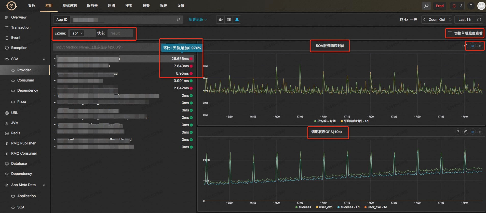
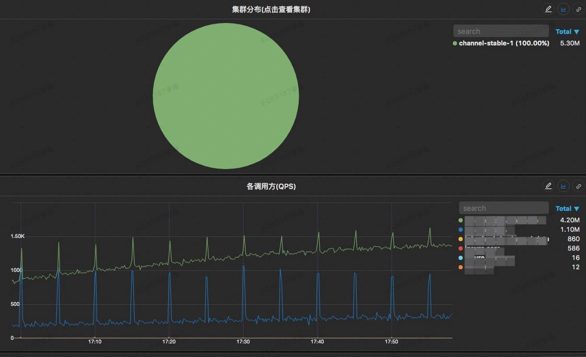

- 可以根据机房和状态信息进行过滤。
- 左边一栏列出该应用提供的 SOA 服务接口，同时给出平均响应时间以及和昨天的对比情况。
- 右边的 2 个图表分别给出了对应服务接口的服务响应时间和 QPS 以及和昨天的对比情况，同时可以切换平均响应时间到 TP99 或者其他 TP 值，同时配有可以快速对相关曲线添加告警的跳转链接。
- 可以切换到单机维度来查看每台机器该SOA接口的响应时间和 QPS，用来定位某台机器的问题。
- 可以给出该 SOA 接口调用在不同集群的分布占比。
- 可以给出该 SOA 接口的所有调用方以及他们的 QPS。
- 可以查看任何时间点上该SOA接口的调用链路信息。

### 5 告警
可以针对所有的监控指标配置如下告警方式：

- 阈值：简单的阈值告警，适用于 CPU、内存等。
- 同环比：与过去同期比较的告警。
- 趋势：适合于相对平滑连续的无需阈值的智能告警。
- 其他告警形式。

## 浅谈监控系统的发展趋势
### 1 日志监控阶段

本阶段实现方式：程序打日志，使用 ELK 来存储和查询程序的运行日志，ELK 也能简单显示指标曲线。

排障过程：一旦有问题，则去 ELK 中搜索可能的异常日志来进行分析排障。

### 2 链路监控阶段
上一个阶段存在的问题：ELK 只是基于一行一行日志进行聚合或者搜索分析，日志之间没有上下文关联。很难知道一次请求耗时较长究竟耗时在哪个阶段。

本阶段实现方式：CAT 横空出世，通过建模抽象出 Transaction、Metric 等监控模型，将链路分析和简单的报表带入了大家的视野。

告警方式：针对报表可以进行阈值监控。

排障过程：一旦有告警，可以通过点击报表来详细定位到是哪个type或name有一定问题，顺便找到对应的链路，查看详细的信息。

### 3 指标监控阶段
上一阶段存在的问题：CAT 对自定义指标支持的比较弱，也无法实现或者展现更加多样的查询聚合需求。

本阶段的实现方式：支持丰富的 Metric 指标，将链路上的一些报表数据也可以划分到指标中，交给专业的时序数据库来做指标的存储和查询，对接或者自研丰富的指标看板如 Grafana。

告警方式：针对指标进行更加丰富的告警策略。

排障过程：一旦有告警，可能需要到各个系统上查看指标看板，粗略定位根因，再结合链路总和分析。

### 4 平台打通整合阶段
上一阶段存在的问题：系统监控、中间件和业务监控、部分业务监控、链路监控与指标监控都各搞一套数据收集、预处理、存储、查询、展现、告警流程，各个系统处理数据格式、使用方式不统一。

本阶段的实现方式：打通从系统层面、容器层面、中间件层面、业务层面等等的可能的链路和指标监控，统一数据的处理流程，同时整合发布、变更、告警与监控曲线结合，成为一站式监控平台。

告警方式：可以统一的针对各个层面的监控数据做统一化的告警。

排障过程：只需要在一个监控系统中就可以查看到所有的监控曲线和链路信息。

目前我们 EMonitor 已完成这个阶段，将公司之前存在已久的3套独立的监控系统统一整合成现如今的一套监控系统。

### 5 深度分析阶段
上一阶段存在的问题：

- 用户虽然可以在一个系统中看到所有各个层面的监控数据了，但是每次排障时仍然要花很多的时间去查看各个层面是否有问题，一旦漏看一项可能就错过了问题所在的根因。
- 没有整个业务的全局监控视角，都停留在各自应用的角度。

总之：之前的阶段都是去做一个监控平台，用户查询什么指标就展示相应的数据，监控平台并不去关心用户所存储数据的内容。现在呢就需要转变思路，监控平台需要主动去帮用户分析里面所存储的数据内容。

本阶段的实现方式：所要做的就是把帮用户分析的过程抽象出来，为用户构建应用大盘和业务大盘，以及为大盘做相关的根因分析。

- 应用大盘：就是为当前应用构建上下游应用依赖的监控、当前应用所关联的机器监控、redis、MQ、database等等监控，可以时刻为应用做体检，来主动暴露出问题，而不是等用户去一个个查指标而后发现问题。
- 业务大盘：就是根据业务来梳理或者利用链路来自动生产大盘，该大盘可以快速告诉用户是哪些业务环节出的问题。

根因分析：一个大盘有很多的环节，每个环节绑定有很多的指标，每次某个告警出来有可能需要详细的分析下每个环节的指标，比如消费kafka的延迟上升，有各种各样的原因都可能导致，每次告警排查都需要将分析流程再全部人为分析排查下，非常累，所以需要将定位根因的过程通过建模抽象下，来进行统一解决。

趋势报表分析：主动帮用户发现一些逐渐恶化的问题点，比如用户发布之后，接口耗时增加，很可能用户没有发现，虽然当前没有问题，但是很有可能在明天的高峰期就会暴露问题，这些都是已经实实在在发生的事故。

要想做主动分析，还深度依赖指标下钻分析，即某个指标调用量下降了，能主动分析出是哪些tag维度组合导致的下降，这是上述很多智能分析的基础，这一块也不简单。

告警方式：可以统一的针对各个层面的监控数据做统一化的告警。

排障过程：NOC根据业务指标或者业务大盘快速得知是哪些业务或者应用出先了问题，应用的owner通过应用大盘的体检得知相关的变动信息，比如是redis波动、database波动、上下游应用的某个方法波动等等，来达到快速定位问题目的，或者通过对大盘执行根因分析来定位到根因。

## 再谈Logging、Tracing、Metrics
常见一张 3 者关系的图

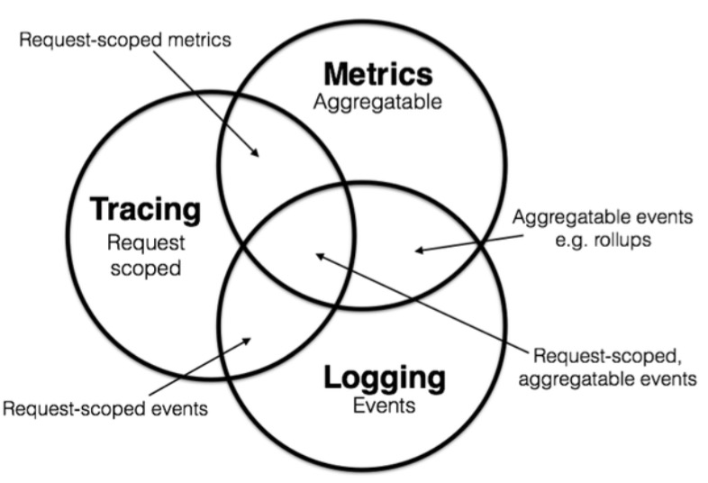

三者的确都不可或缺，相辅相成，但是我想说以下几点：

- 三者在监控排障中的所占比例却大不一样：Metrics 占据大头，Tracing 次之，Logging 最后。
- Tracing 含有重要的应用之间的依赖信息，Metrics 有更多的可深度分析和挖掘的空间，所以未来必然是在 Metrics 上大做文章，再结合 Tracing 中的应用依赖来做更深度全局分析，即 Metrics 和 Tracing 两者结合发挥出更多的可能性。

## 参考链接
* CAT：[https://github.com/dianping/cat](https://github.com/dianping/cat)
* 深度剖析开源分布式监控 CAT：[https://tech.meituan.com/2018/11/01/cat-in-depth-java-application-monitoring.html](https://tech.meituan.com/2018/11/01/cat-in-depth-java-application-monitoring.html)

## 加入我们
【稳定大于一切】打造国内稳定性领域知识库，**让无法解决的问题少一点点，让世界的确定性多一点点**。

* [GitHub 地址](https://github.com/StabilityMan/StabilityGuide)
* 钉钉群号：
	* 30000312（2群，推荐）
	* 23179349（1群，已满）
* 如果阅读本文有所收获，欢迎分享给身边的朋友，期待更多同学的加入！
